## RECON 

Lets start with our nmap Scan full port scan  on the target ip 

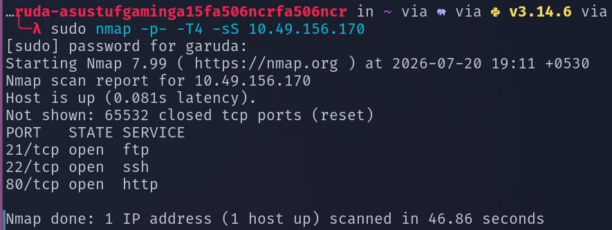

Found three open ports , lets perform service version dection scan and default scan on them 

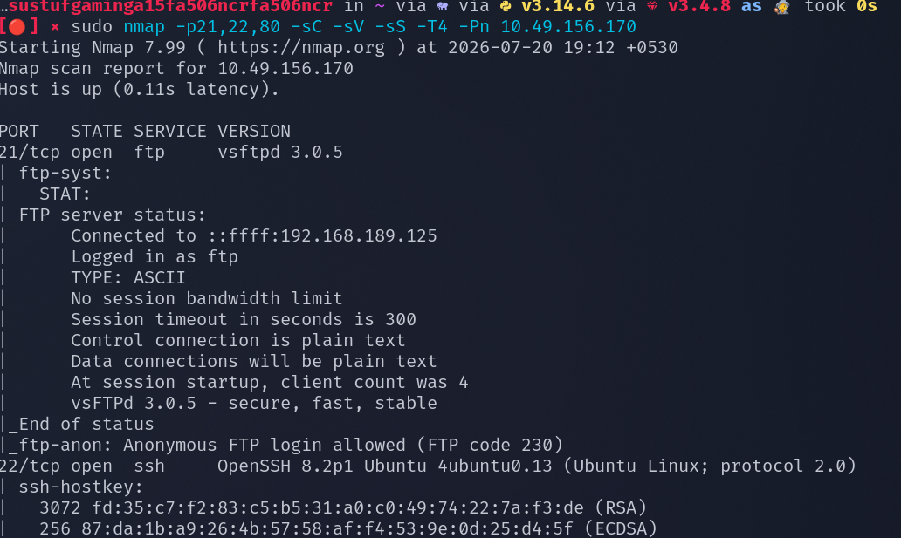

Found that ftp anonnymous login is allowed , lets login with anonymous as username and password 

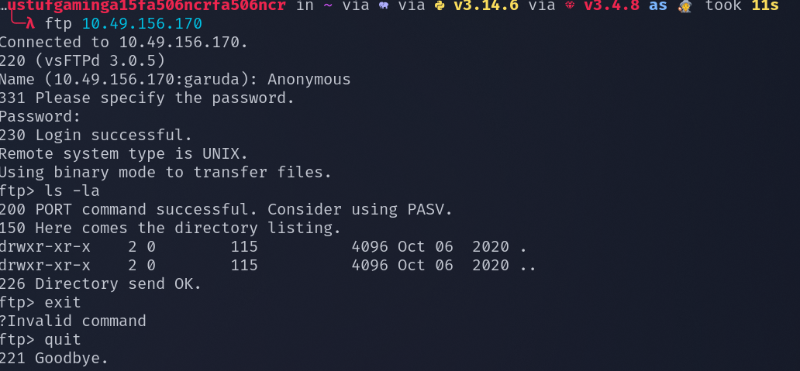

here didnt find any juicy information 

in http site there is a apache default service is running , lets use gobuster to enemurate the web directories 

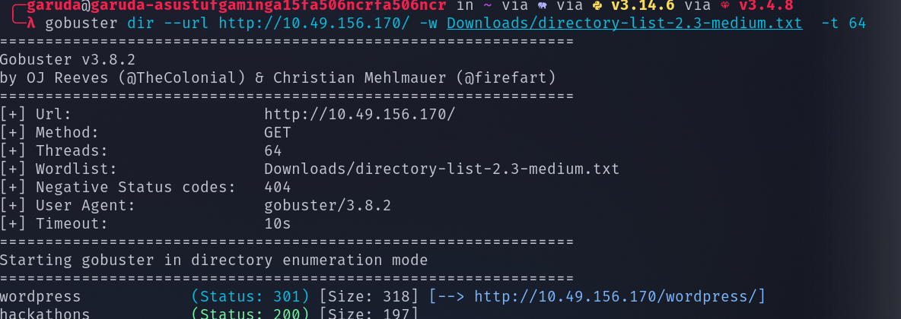

found a directory wordpress , lets access it 

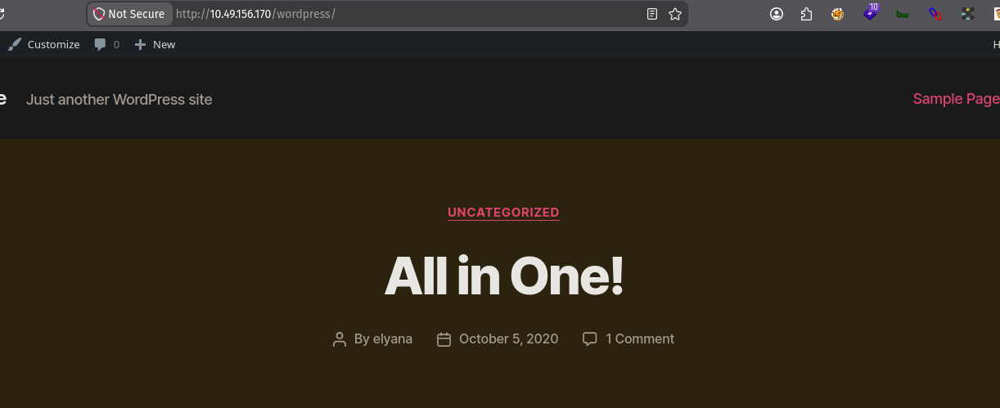

seems like wordpress has been running , lets use wp-scan to enemurate information like username , plugins , wp version etc..

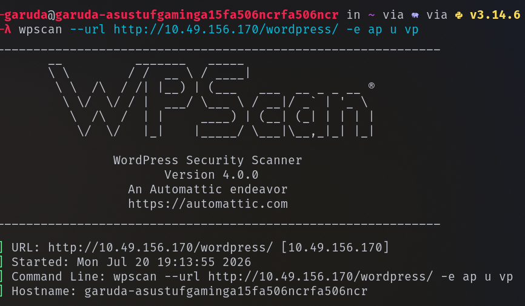

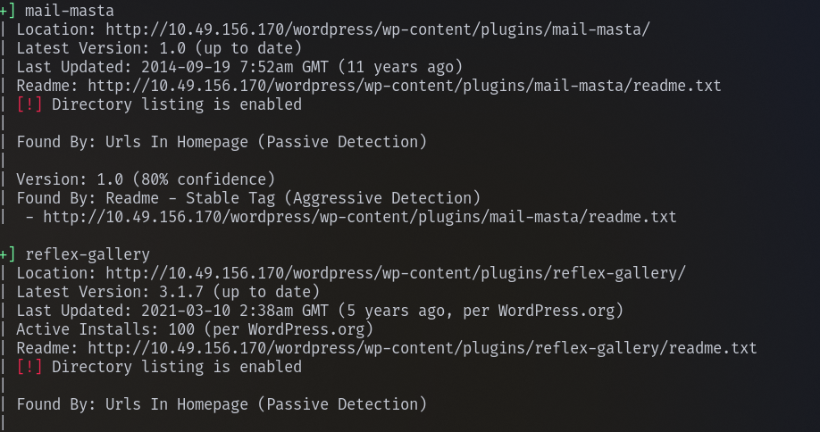

found a few wp plugins mail-masta and reflex-gallery 

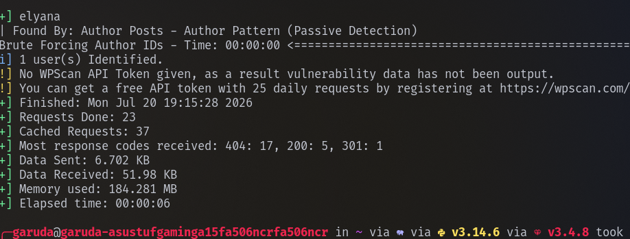

also found a username elyana

## EXPLOITATION 

we found some plugins , lets see if the plugins are vulnerable to any exploits 

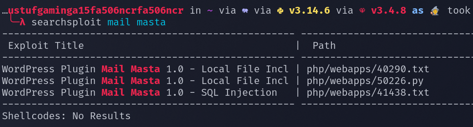

seems like mail-masta is vulnerable to local file intrusion , lets view that exploit 

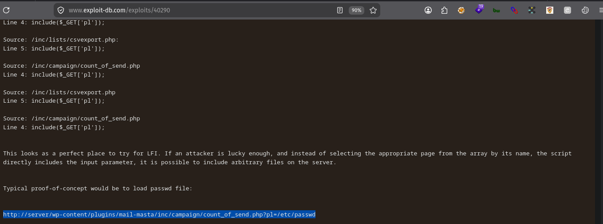

found the extract path where we can perform lfi , lets try to access the wp-config.php file since it contains information like usernames and passwords

while normally accessing wp-config.php file like ../../../../../wp-config.php it is getting executed and returning us a blank page 

therefore in order to read it , lets apply a php filter and convert it to base64 

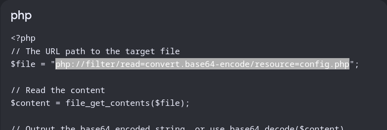

now lets we can able to see the contents of the file in base64 encoded format , lets decode it 

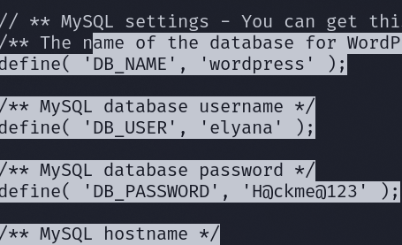 

We found the elyana password , there is a wp-login form , lets use our credentials to login 

# GAINING REVERSE SHELL

found a 404 php template , lets replace the code with php reverse shell code from github 

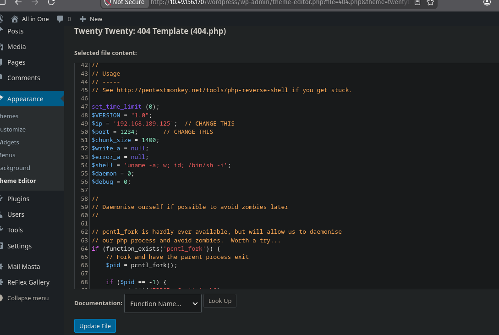

update the file and access the url to gain a reverse shell 

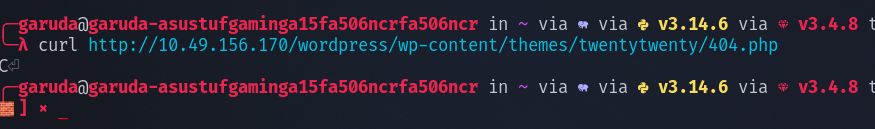

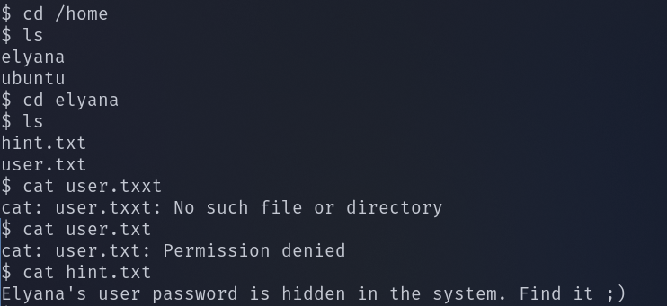

we cant able to read the user.txt file and found a hint that elyana password is somewhere in the system 

lets use find command to search for elyana owned files 

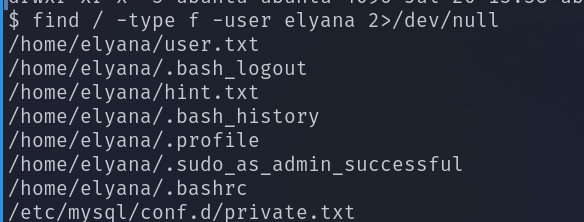

found a private.txt file , lets view it 

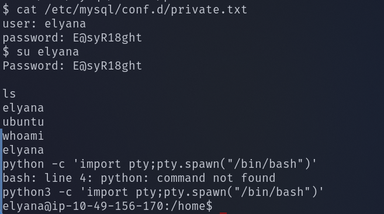 

since we got elyana password and ssh port is open , lets login through ssh 

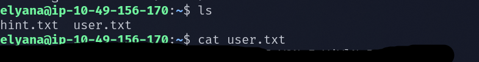

## PRIVILEGE ESCLATION 

--> sudo -l --> shows which command user elyna can run with sudo or root privilege 

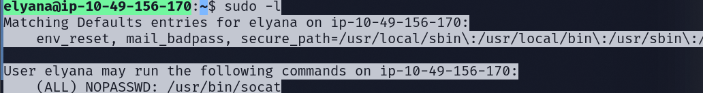

found that elyana can run socat command with sudo 

utilized gtfo bins to spawn a shell with root privilege

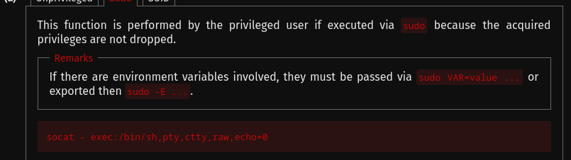 

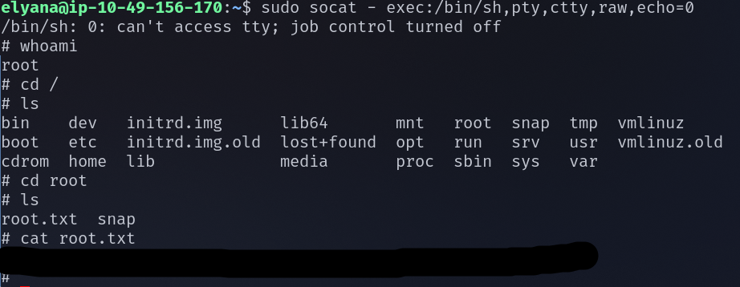

Successfully found the user.txt flag and root.txt flag 

