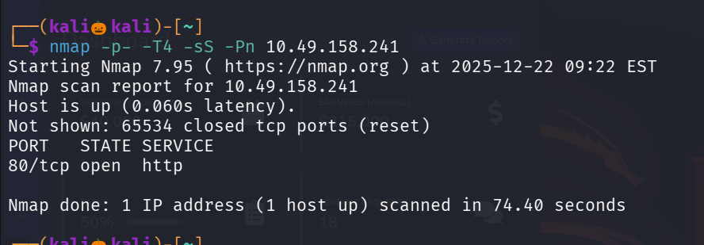
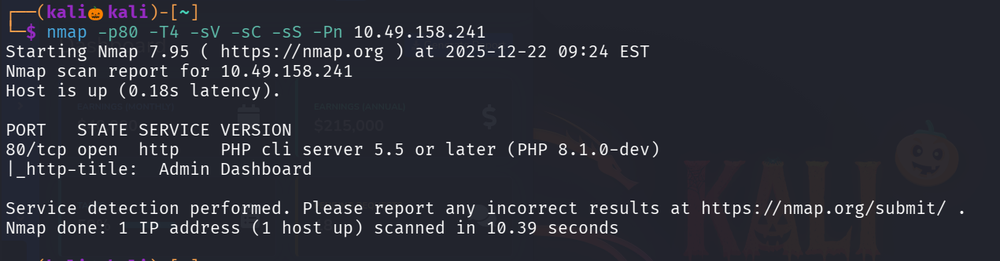
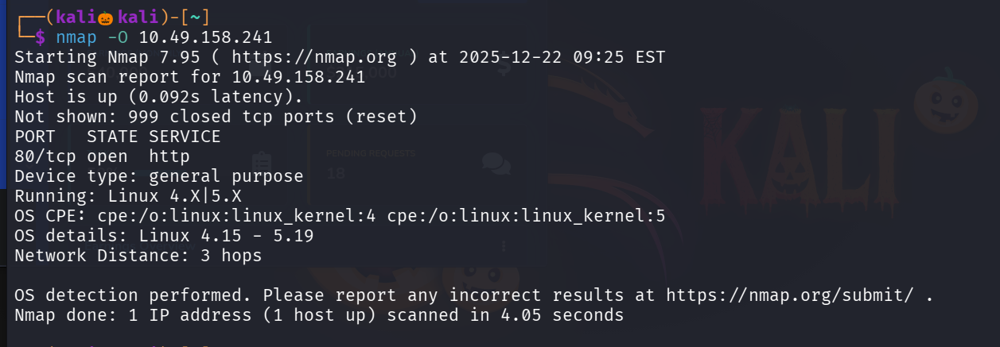
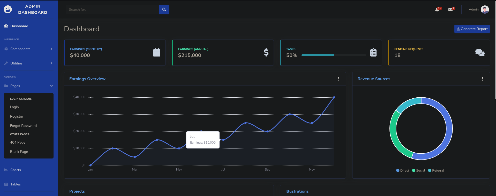
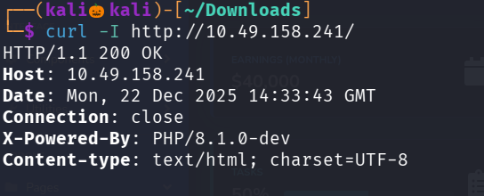
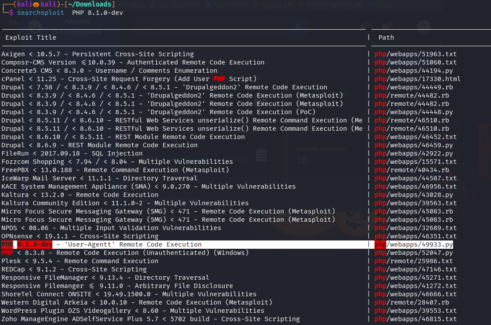
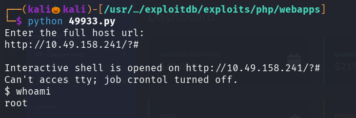
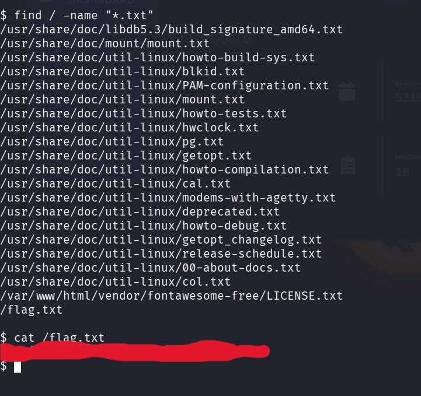

## Lets Start With an Nmap Scan 

We found only http port open 

Lets perform service Detection scan and default Script Scan on port 80

Lets also perform Os detection Scan 

I cant find any juicy information so lets visit the website 

No function has been working , i also tried gobuster scan and ispected the page but no juicy information is found 

Then i used wapallyer exxtension to see the technologies they are using 

Here the php version seems vulnerable , i also used curl command to check the php version 

Here i got the exact service and version of php 

Lets use searchsploit to search for exploit for this specific version of php

I found a payload for this specifc version

Lets try to exploit 

We successfully got the interactive shell 

To find the flag lets use find command

We successfully found the flag

--------------------------------------------------THE FLAG-------------------------------------------------------------

