## Lets Start with an namp scan 

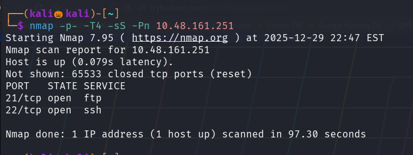

We found that there are two ports are open , lets perform service version detection scan and script default scan on them 

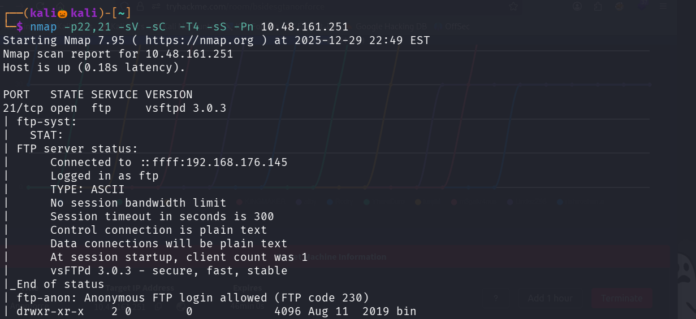
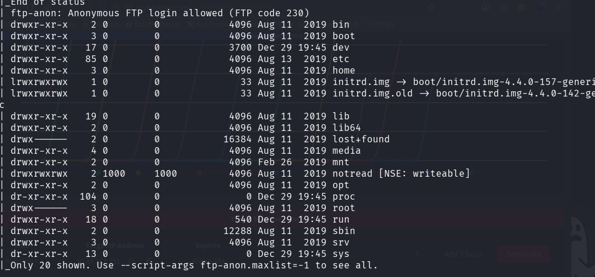
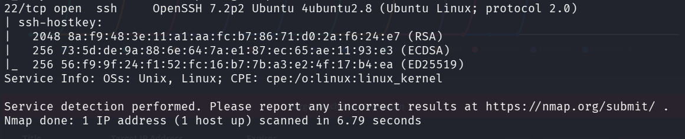

In the namp scan result we can see that Ftp anonymous is allowed , lets login into ftp with username and password as Anonymous 

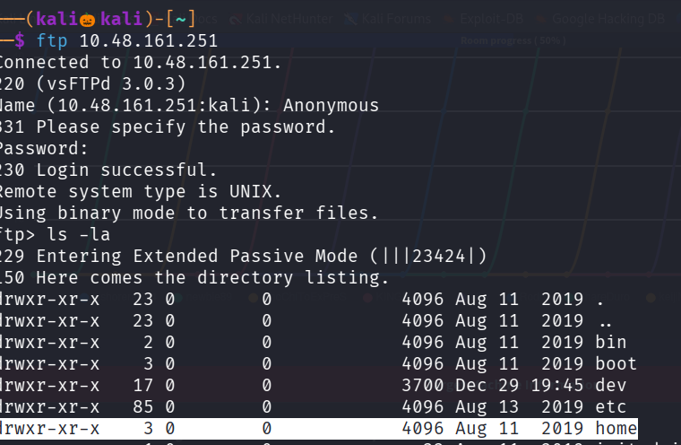

we can see the home folder , lets navigate inside it 

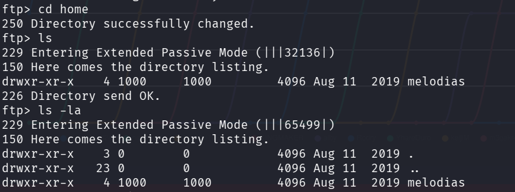

We can see an user melodias , lets navigate into the user and see his files

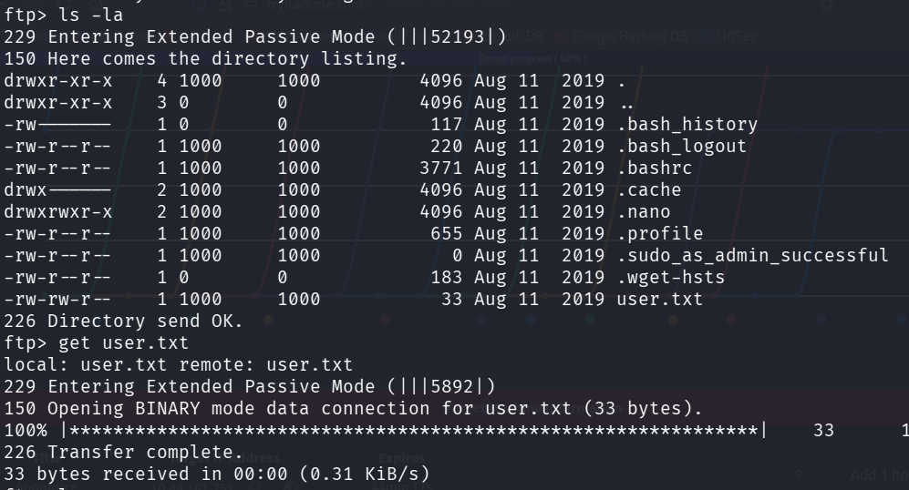

We found the user.txt file , use get that to our system 

command : get user.txt

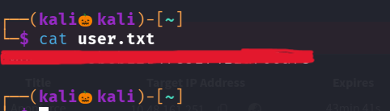

We successfully found the user flag 

Lets search for root flag , in ftp we cant able to go or get the root directory as our permission is denied 

In / folder i found an intresting folder notread

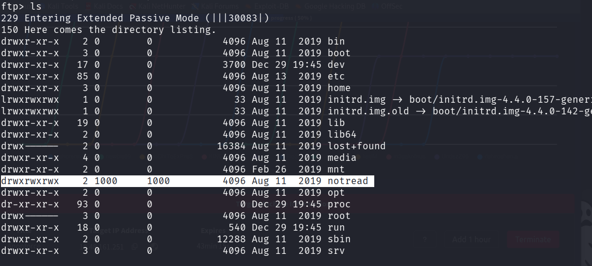

Lets naviagate inside that folder and see the files 

we got an pgp and an asc file ,lets get that two files into our system

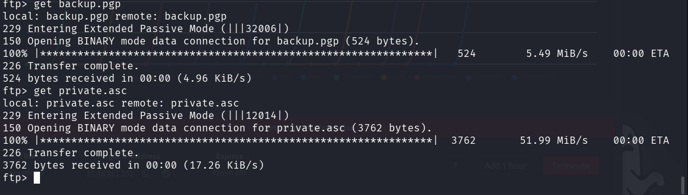

psg files usually encryted and requires an key like passphase to decrypt the content inside it 

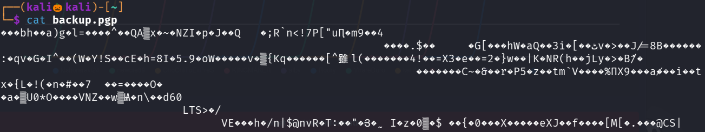

Letss view the asc file 

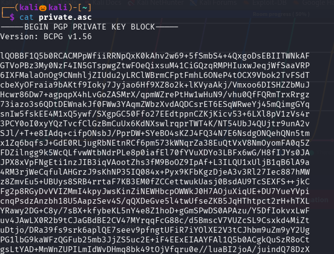

we got an pgp key , password protected 

Lets decode the key using john , so first we have to convert the key into an hash format that john can understand and crack it 

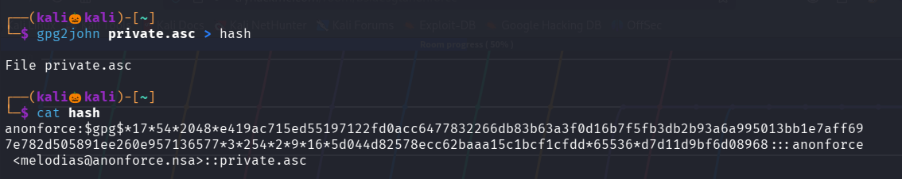

Lets use john to crack it 

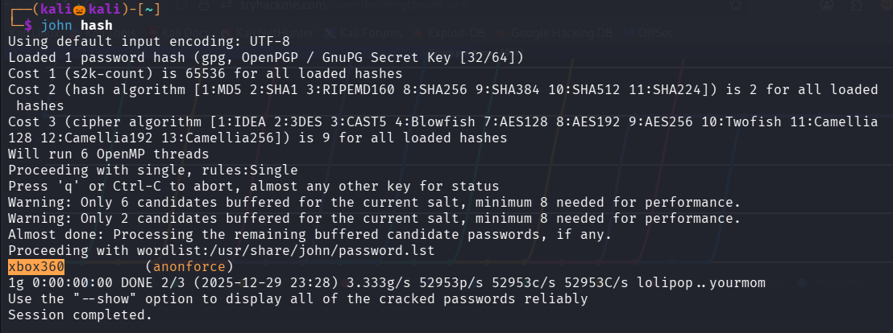

we successfully found the passphase of the pgp file 

Lets see the contents of the pgp file 

we are using a tool gpg in order to see the contents inside the pgp file with an passphase

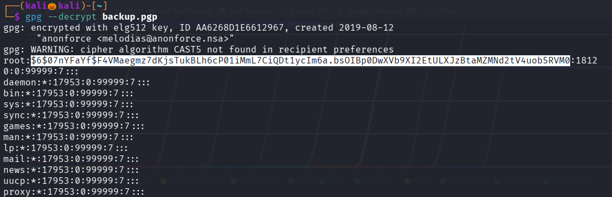

it asks for the passphase in an pop up format after entering the command 

now we found the hash value for root user , lets decrypt the hash to find the roots password

lets use hashes.com to crack this hash

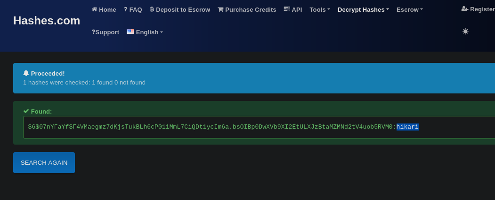

We successufly found the root password

Lets login into ssh with the root password

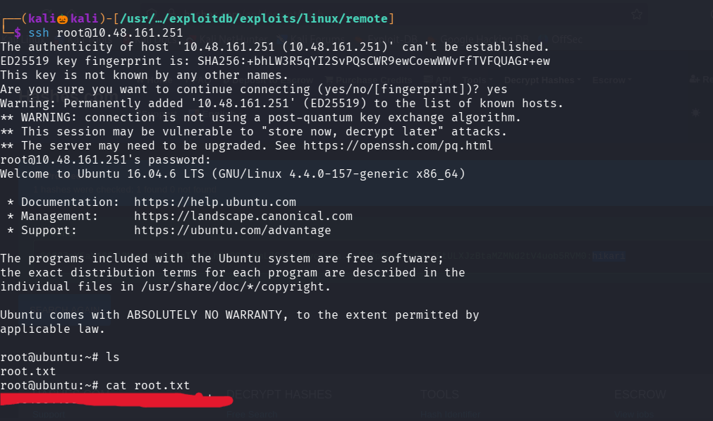

We successfully found the root flag 

--------------------------------------------------------THE END-----------------------------------------------------------------------

