# Lets start with an Nmap scan 

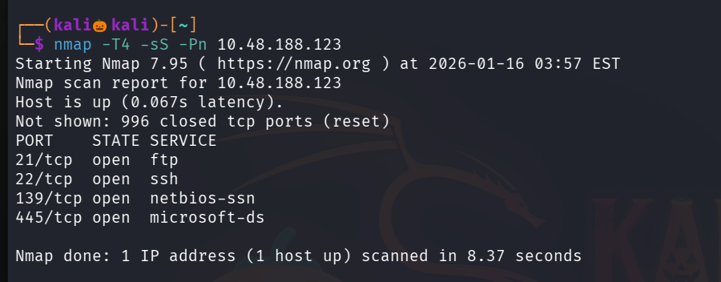

we found four open ports , Lets perform default script scan and service version detection scan on them

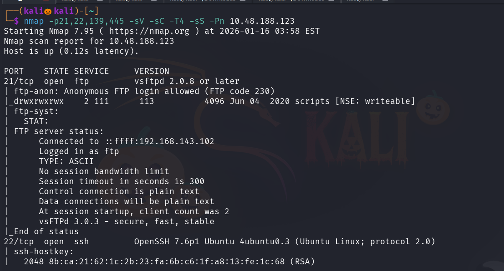

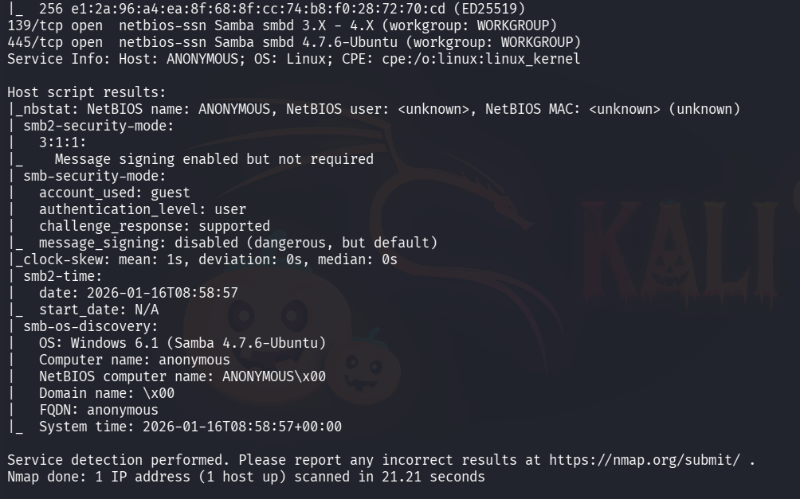

Since smb port is open on port 445 , lets use enum4linux tool to enemurate smb shares , usernames etc ..

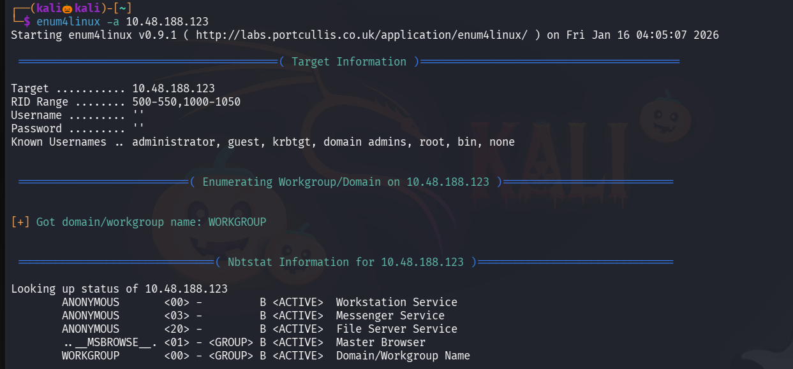

We found one share named pics 

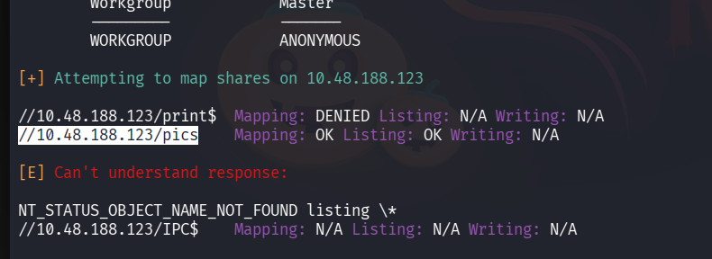

lets interact with it using the tool smbclient 

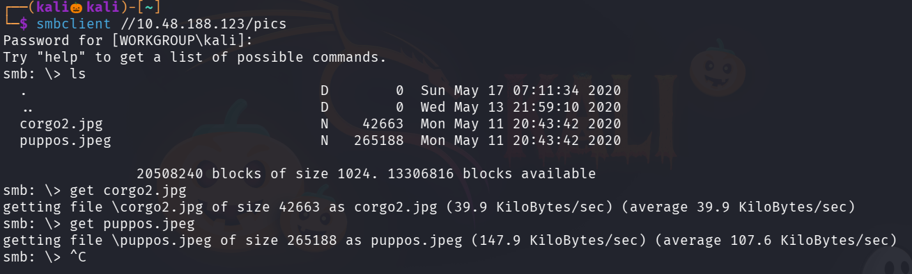

we found two pictures , but no juicy information is found in that . 

in nmap scan we found that ftp anonymous scan is allowed , lets login in ftp with username and password as Anonymous

we found that there are three files in the scripts folder 

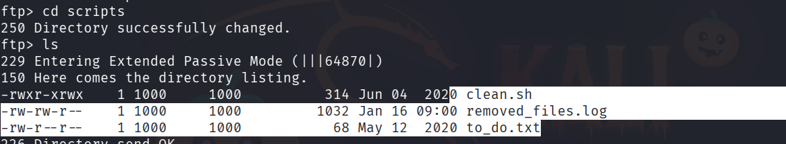

Lets get that files to our kali machine 

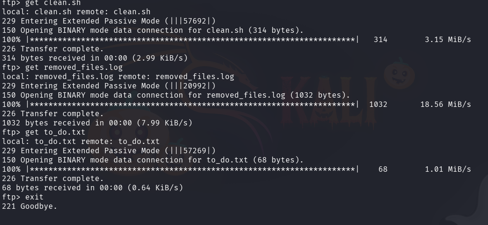

lets view that files

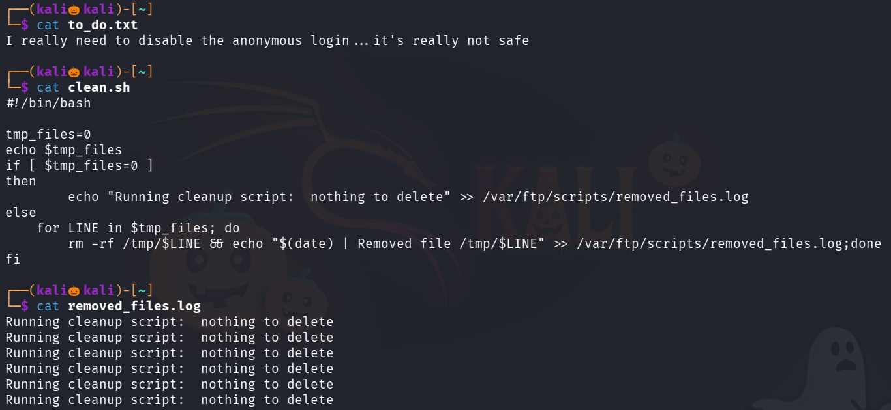

seems like clean.sh is being executed in the ftp continusily , so lets modify the contents of clean.sh and upload a bash reverse shell in it 

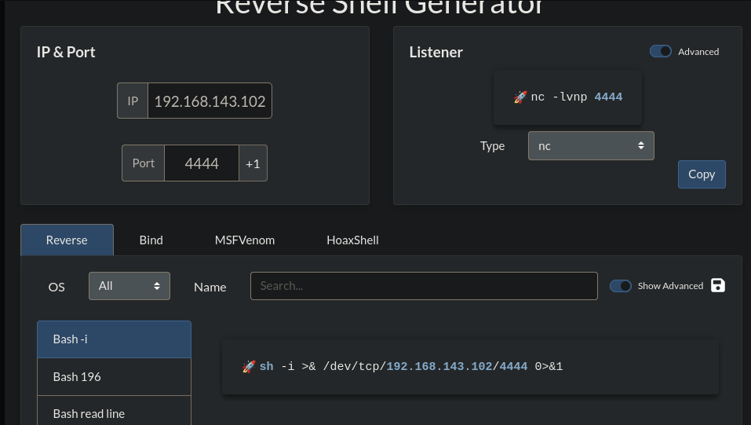

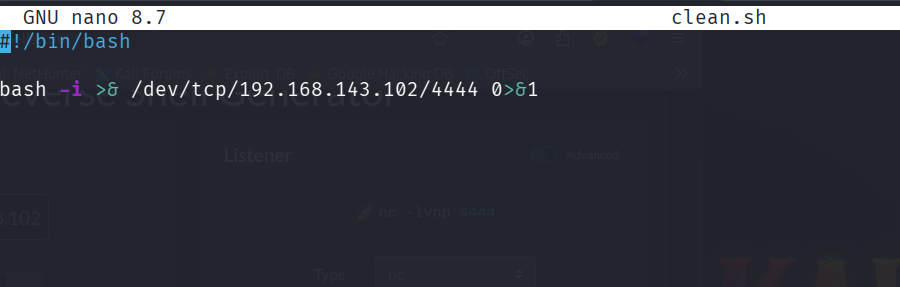

now in ftp scripts directory lets upload our modified clean.sh , by using the command : put clean.sh

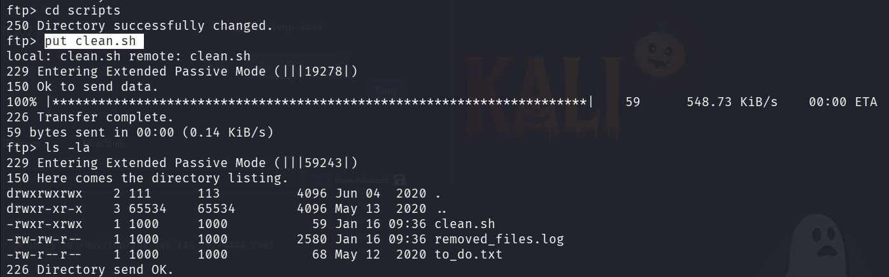

set up a nc lisener

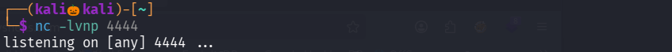

after some seconds , we successfully got the reverse shell

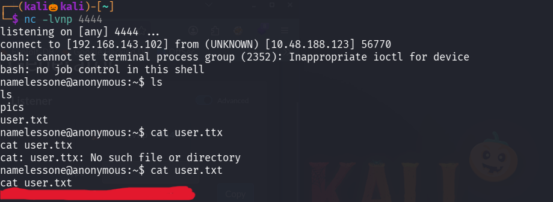

we successfully found the user flag 

Lets escalate our privilage to get the root flag

since we dont the password of the current user , we cant use sudo -l command

so lets search for suid files 

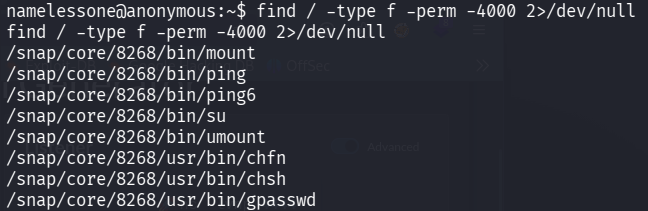

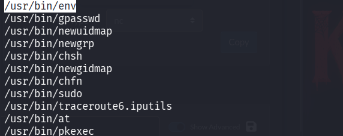

found that we can able to execute env command with suid permission 

lets use gtfo bins for the escalation 

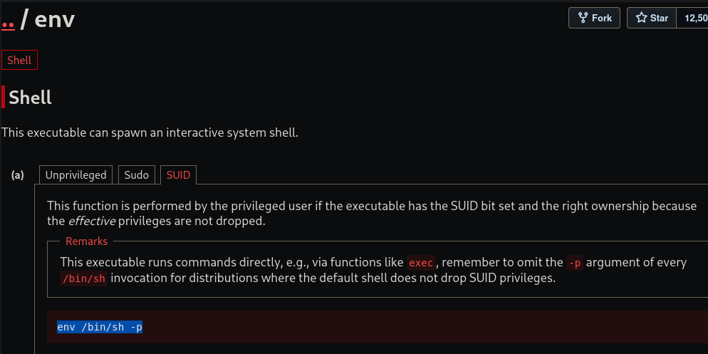

lets upgrade our shell to pty

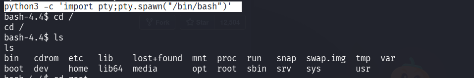

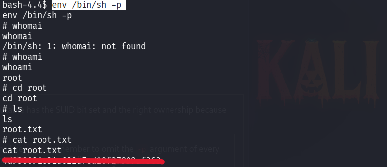

We successfully found the root flag  

---------------------------------------------------------THE END------------------------------------------------------------------------------

