## Lets start With an Nmap Scan 

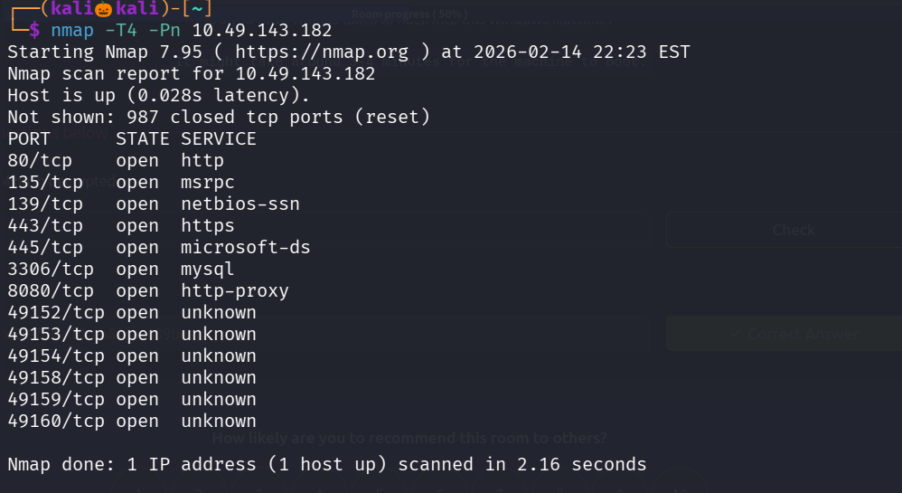

We found lot of open ports , lets perform service verison detection scan and default script scan on them 

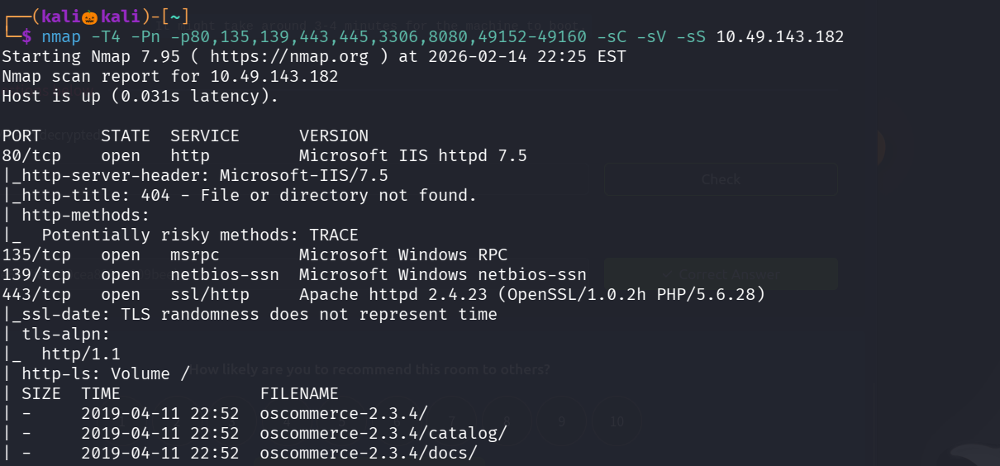
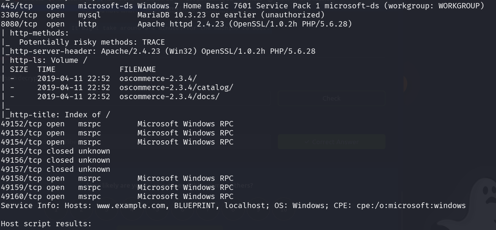

Lets visit the site running on site port 80 

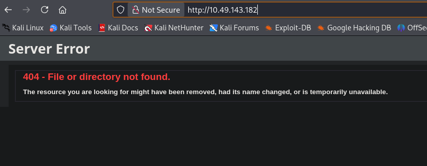 

Lets use gobuster to enemurate the web directories 

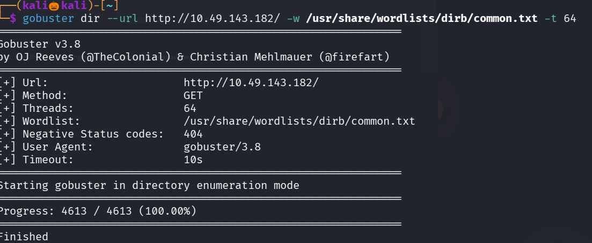

No directories has found , since smb port is open lets perform user enemuration using an nmap script smb-users-enum

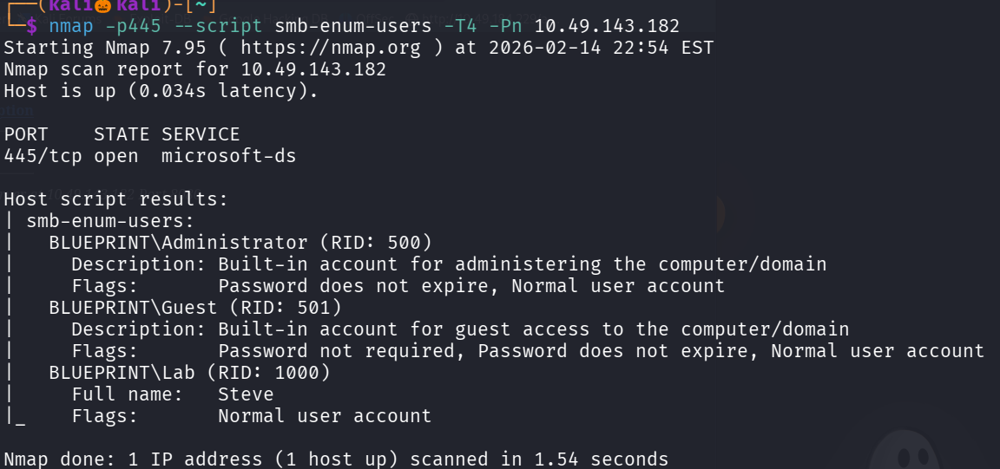

Found three users named Administrator , Guest , Lab 

lets visit the site running on port 8080 and 443 

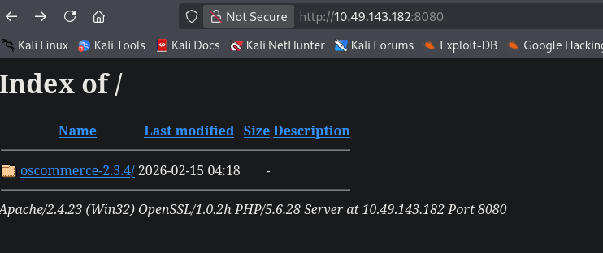 

seems like port 443 and 8080 contains same site 

the oscommerce-2.3.4 is a cms used for creating online stores , lets use searchsploit to search for any available exploits 

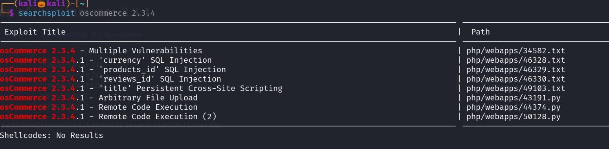

found one exploit , lets copy and try it 

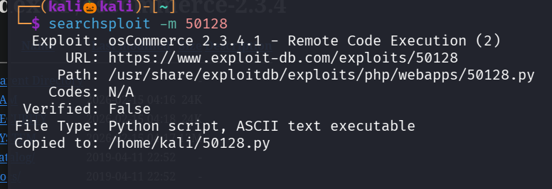

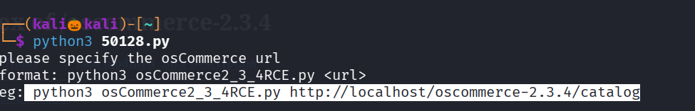

lets copy paste the url

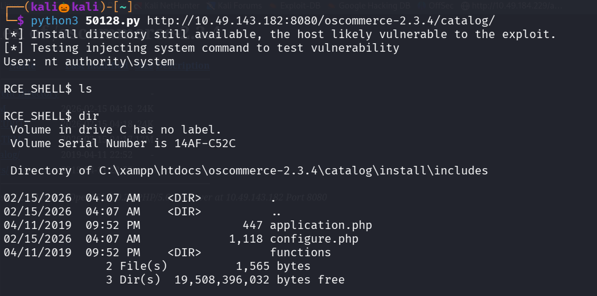

now we can perform remote code execution , lets visit the Users folder 

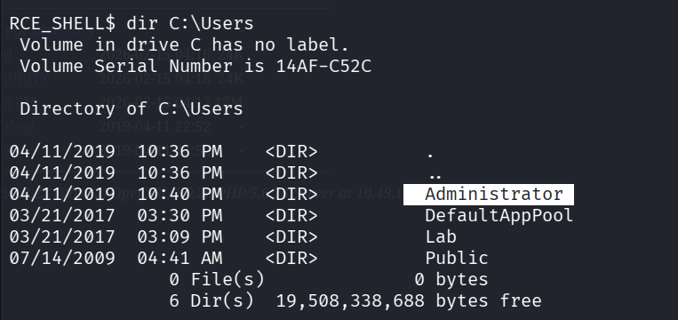

Now lets visit the Administrator folder 

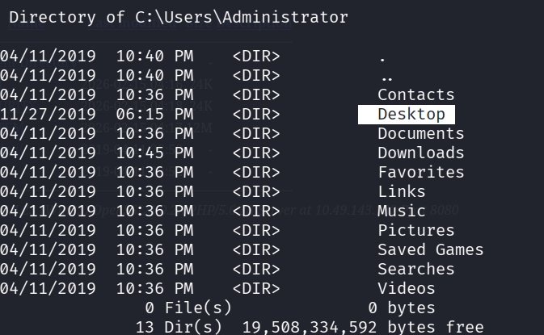

Lets visit the Desktop folder 

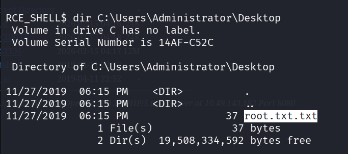

Successfully found the root.txt file , lets visit it 

To find the ntlm hash of lab user , there are three files named as sam , system and security 

where sam stores the users password in an hash format , we cant read the sam file directly which has been encrypted by the key which is system 

with system we have to decrypt the contents of the sam 

security file consits of wifi passwords, or any hidden extra passwords 

lets copy the three files to the oscommerce-2.3.4 folder where we can access it through url since directory listing is enabled 

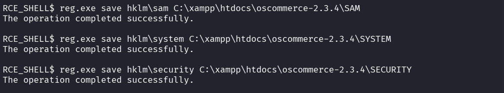

reg.exe is a tool that can read registry,edit registry,copy registry

HKLM is the main system folder where inside it we can see sam ,system and security 

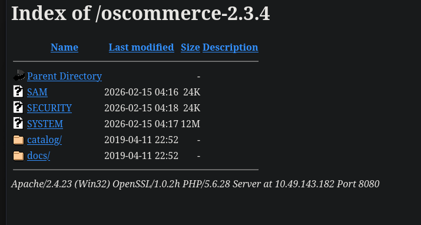

lets download the three files to our kali machine 

samdump2 tool is used to dump the hashes present in the sam file , it uses system file to decrypt the sam with a key and then it dump the hashes 

we successfully found the hash value of lab user , lets use hashes.com to decrypt it 

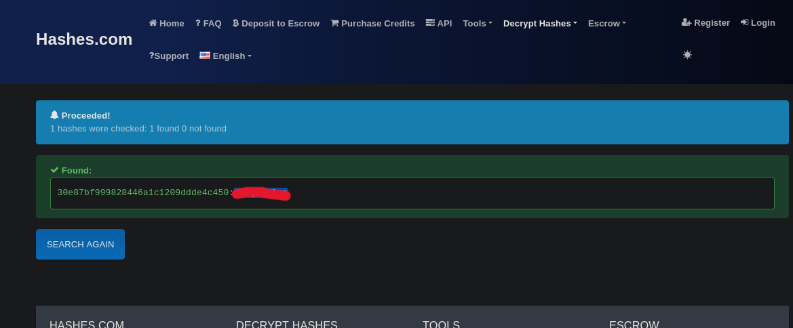

--------------------------------------------------THE END-------------------------------------------------------

