## Lets Start With an Namp Scan 

There are three open ports, Lets perform service detection scan and default script scan on these three open ports 

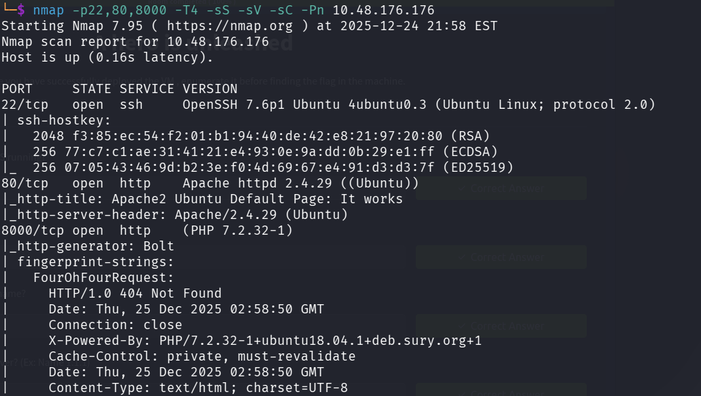

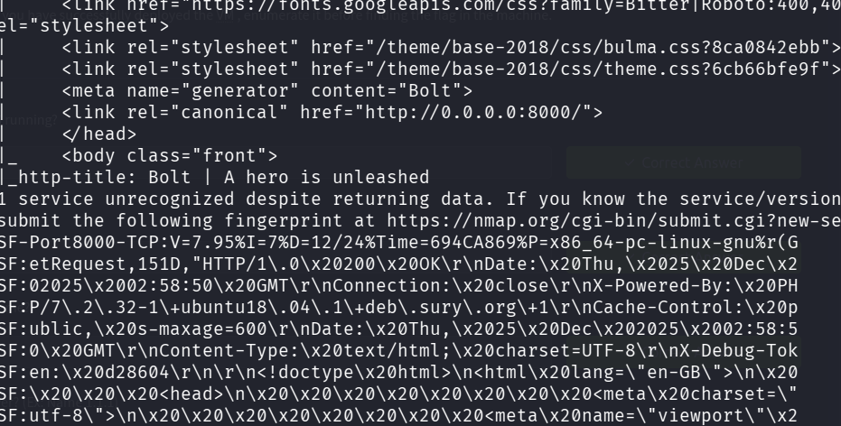

From our nmap scan the cms named bolt is running on port 8000

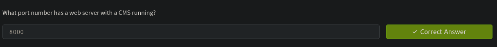

Lets visit the site 

While seeing the site we found the username and password

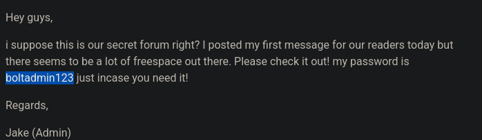

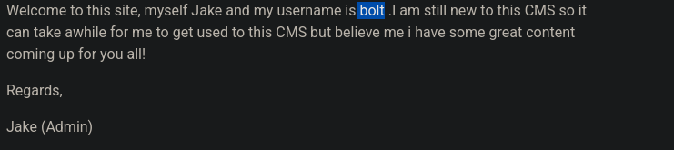

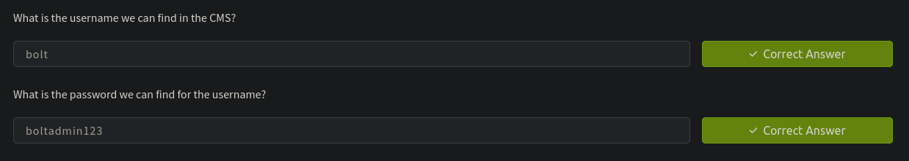

I further used gobuster to enerumate for any login pages but i wouldnt able to find any directoires

So i searched for default login page path  for bolt cms

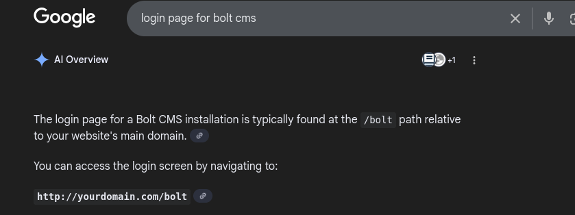

We found that default login page for bolt is at /bolt/login

Lets use gobuster to cross-check

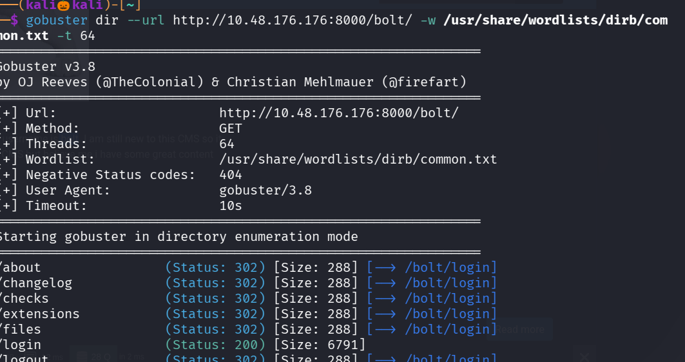

We successfully found the login page , lets login into that with the username and password we found

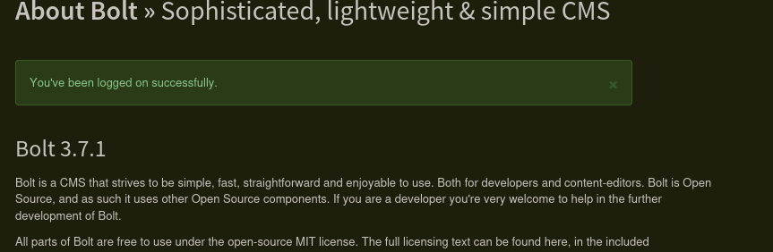

We found the bolt version

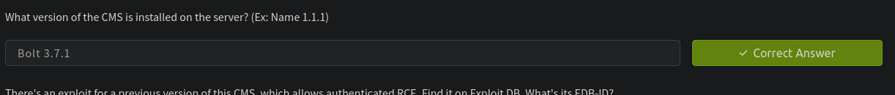

Lets use Exploit db to check for check for any exploits is there, for version 3.7.1 no exploit is found , but for 3.7.0 we found one exlpoit 

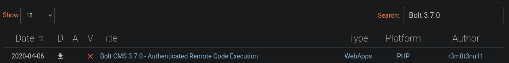

Lets see its exployee id 

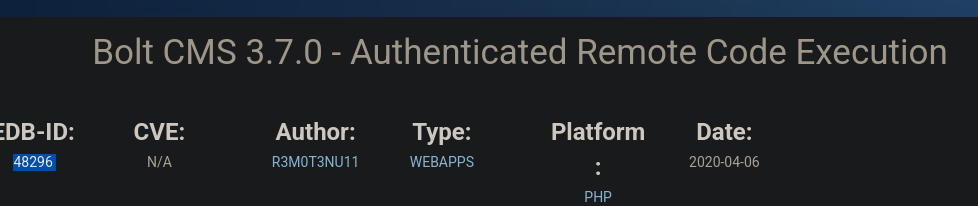

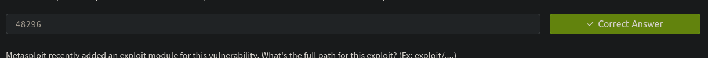

Lets search for the exploit in msfconsole

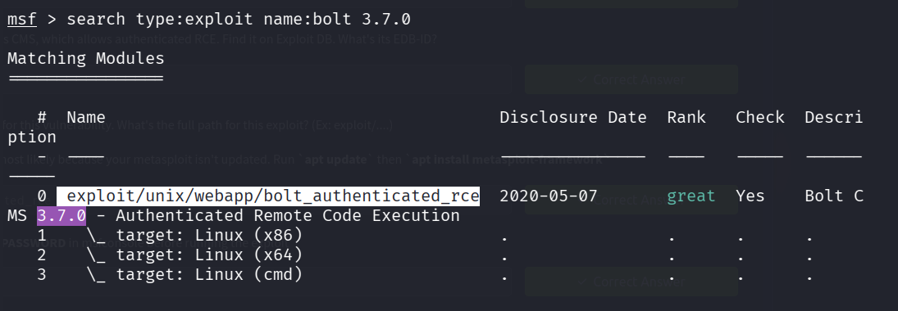

Lets use that exploit 

Set LHOST , RHOSTS , USERNAME , PASSWORD 

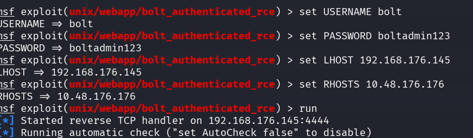

we got a reverse shell

use command : /bin/bash -i to spawn a tty shell

The flag is not in the root direcotory and we have no idea where the flag is located so lets use 
find commad

commnd : find / -name "flag.txt"

The flag is in home directory

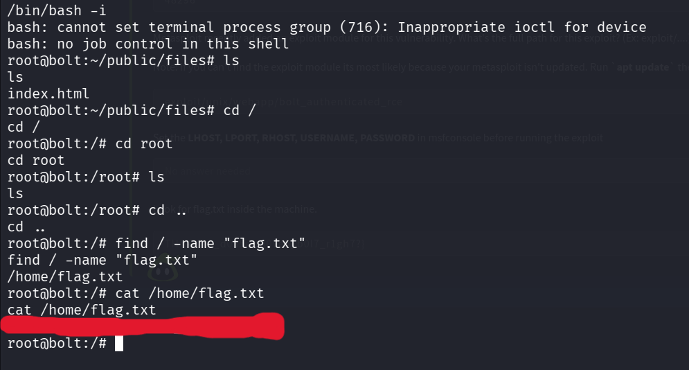

We successfully found the flag 

-----------------------------------------------------THE END------------------------------------------------

