## Lets with the nmap scan 

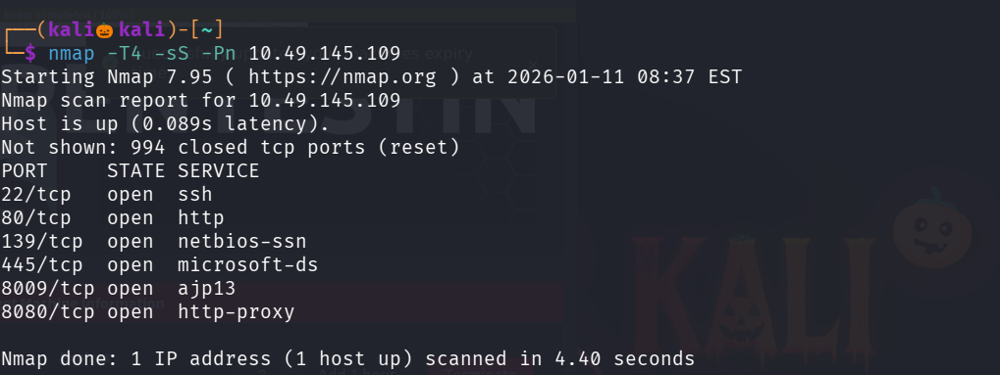

We found six open ports lets perform service version detection scan and default script scan on them

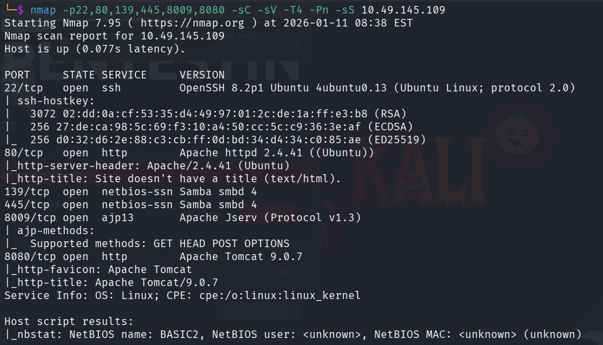

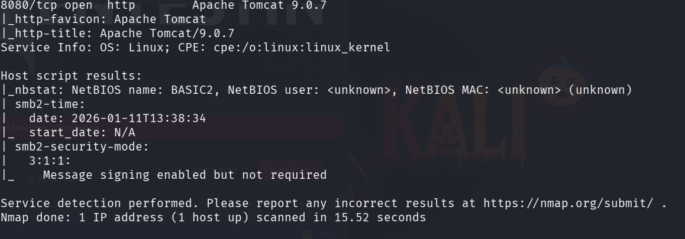

Lets vistis the site running on port 80 

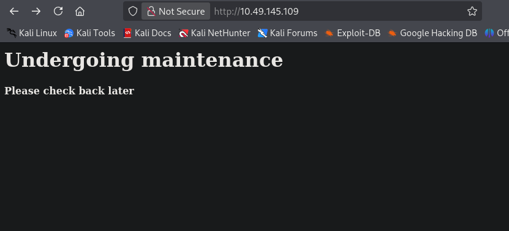

Lets use gobuster to enemurate the web directories

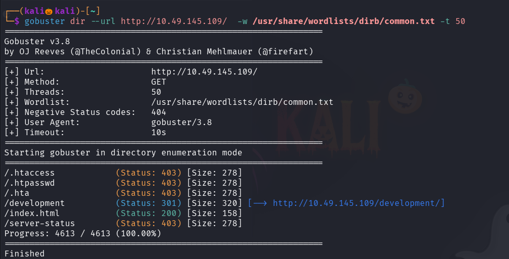

we found a path /development , lets visit it 

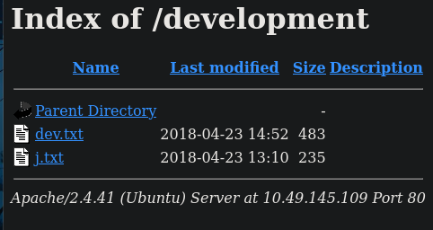

there are two txt files lets read it 

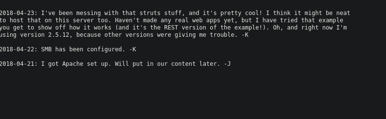

seems like two users have been communication and smb seems to be configured

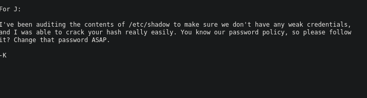

seems like j password is easily crackable 

since smb is open lets use the tool to enemurate users,shares etc ..

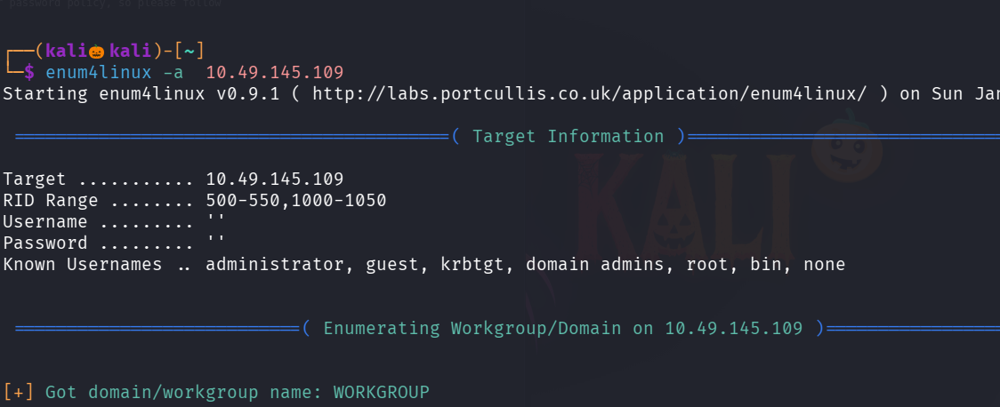

-a enemurate all 

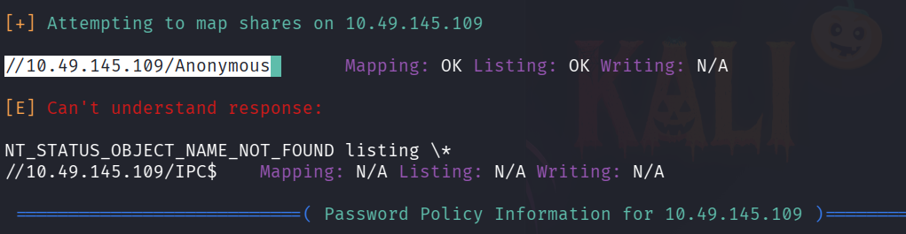

we found a share named Anonymous , lets view it using smbclient 

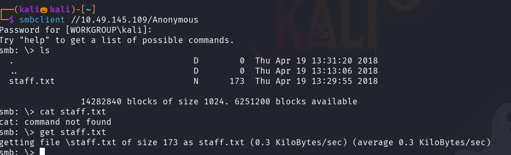

There is a file named staff.txt lets get that file to our system and view it 

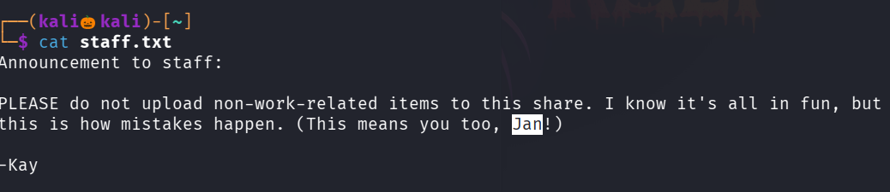

we found the username name jan and kay , since we know that jay password is crackable , so use hydra over ssh to crack jay password

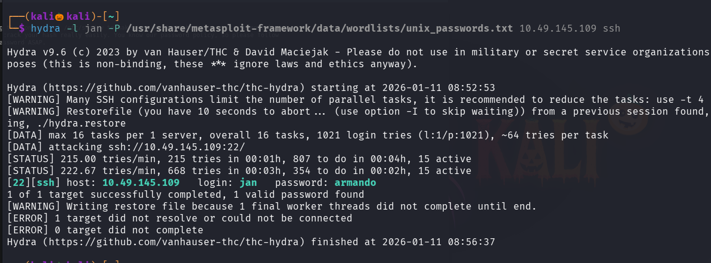

We successfully found the jay password , lets login into ssh 

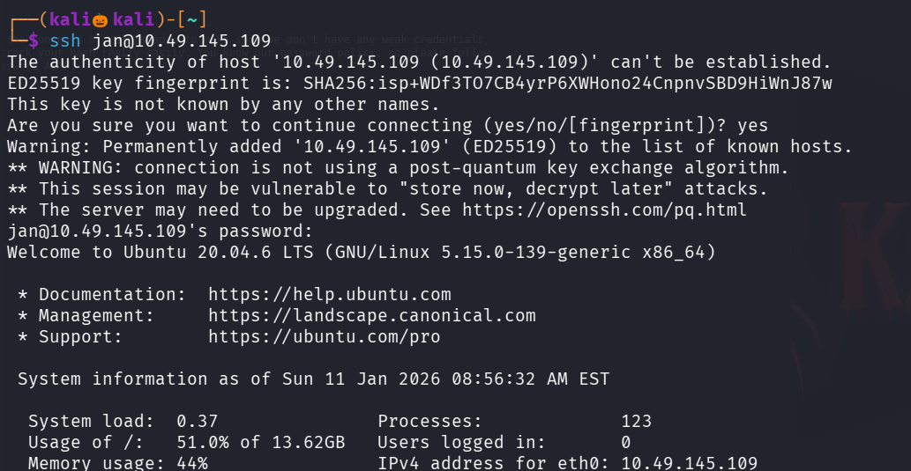

in kay user directory there is a file named pass.bak ,but we cannot able to read the file since our permission is denied 

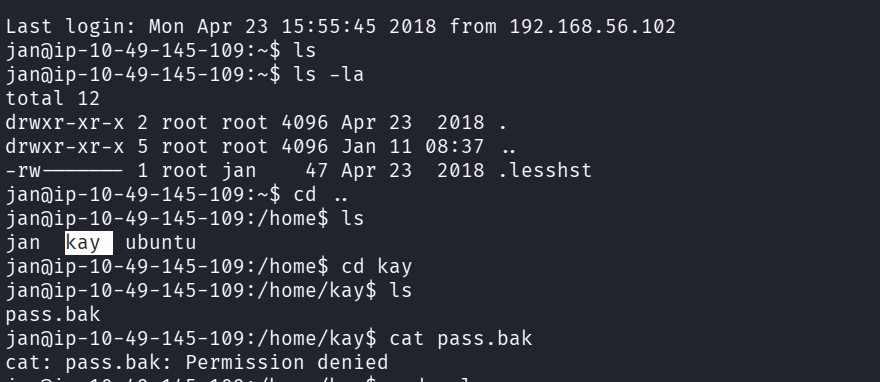

tried sudo -l but user jay cannot run sudo on this machine 

so lets search for the files owned by user kay

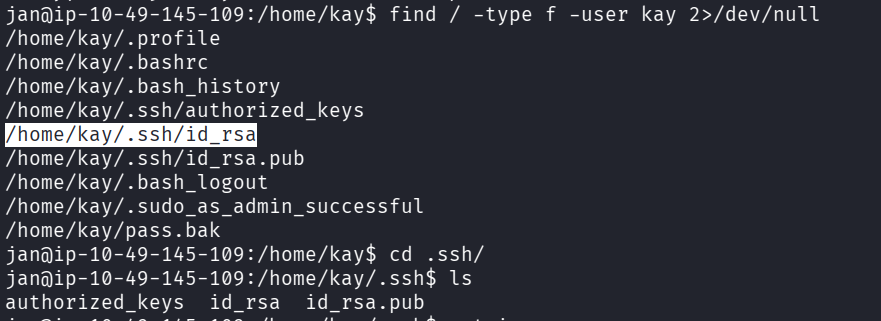

lets see we can able to read kay ssh id_rsa key 

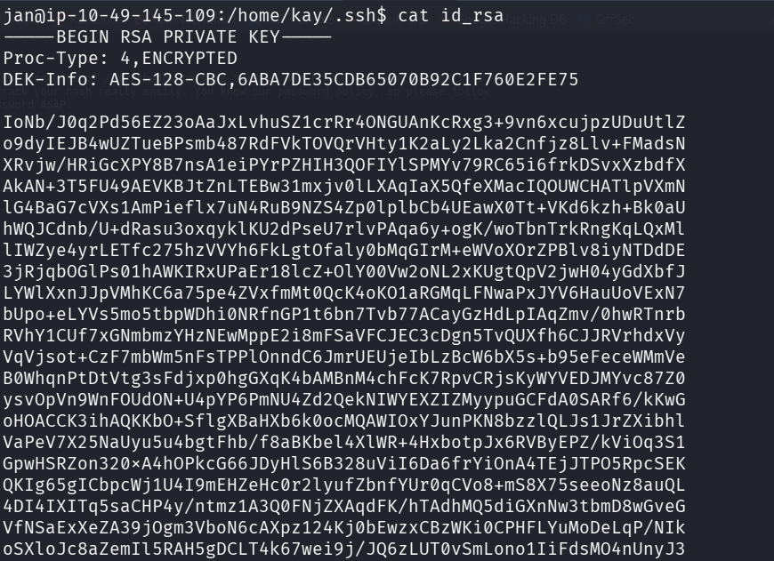

Lets copy the ssh rsa key to our system and login into user kay over ssh with id_rsa key

run command: chmod 600 <file_name>

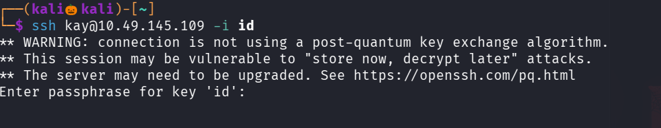

seems like the key is passphrase protected , lets try to crack it using john 

first we need to convert the key into the hash format that john can understand 

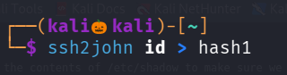

now lets crack the passpharase

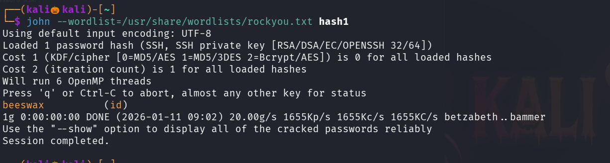

we successfully got the passphase

now lets login into ssh as user kay with the id_rsa key and passphase

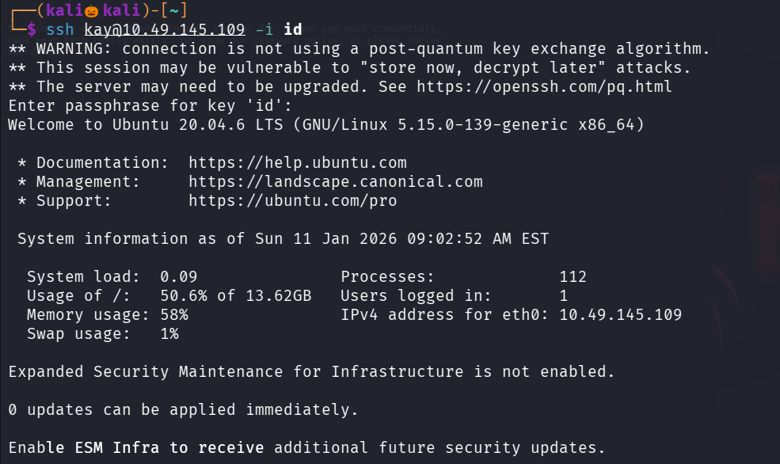

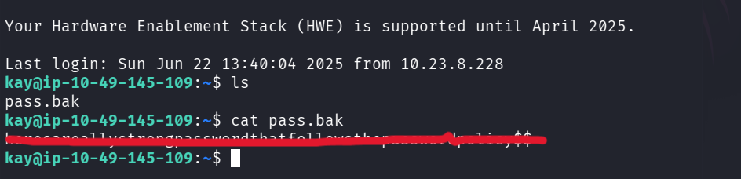

We successfully find the password 

-----------------------------------------------------------THE END-----------------------------------------------------------------------------

