## Lets ping the target to see it is alive 

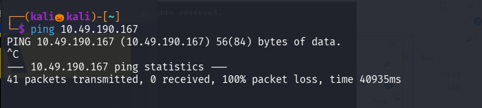

The pings packets have not been recived , lets perform a nmap scan with diabling ping probes

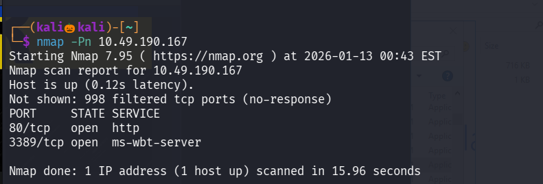

We found two open ports , since it is a windows target , windows usually blocks the icmp packets , so ping does not work against it 

Now lets perform service verison detection scan and default script scan on the two open ports

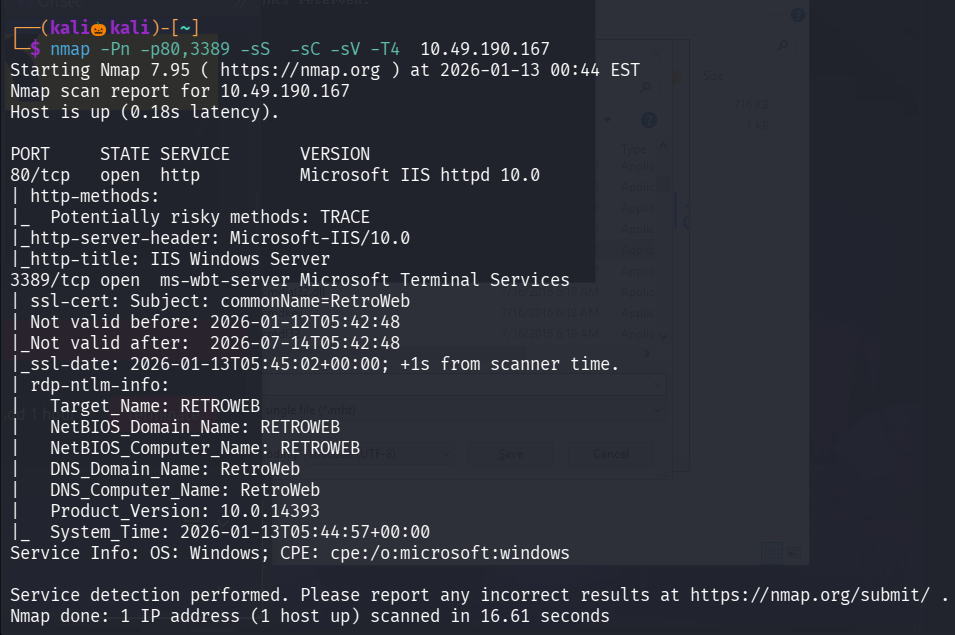

We found a http site running on port 80 , lets visit it

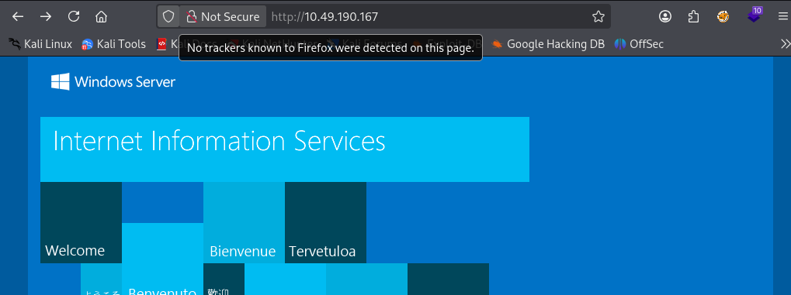

Lets use gobuster to enemurate the hidden web directories

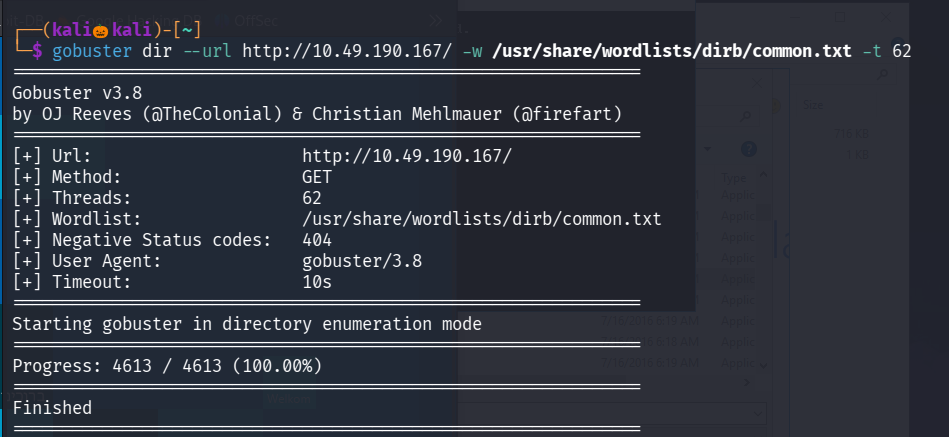

Lets try with different wordlists 

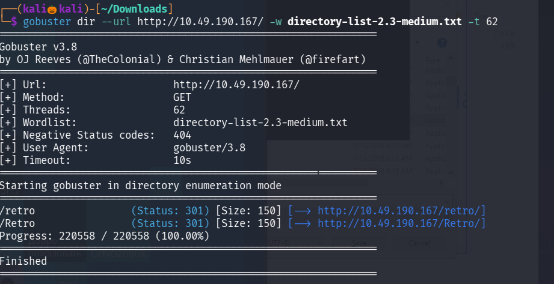

We found a directory named Retro , lets naviagete to it 

We found a username wade , while reading a post wade mentioned that he mistyping the name of the avatar whenever he login , so the password should be the name of the avatar 

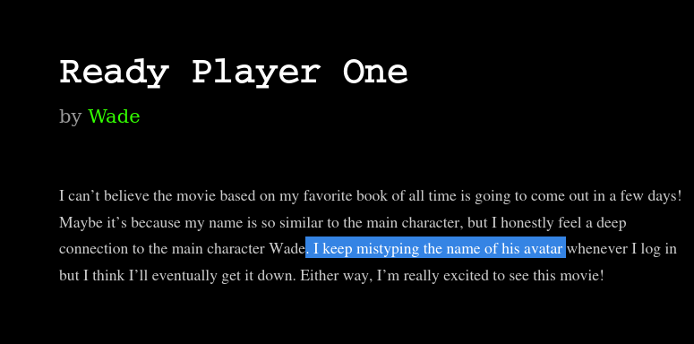

click on the Ready player one url

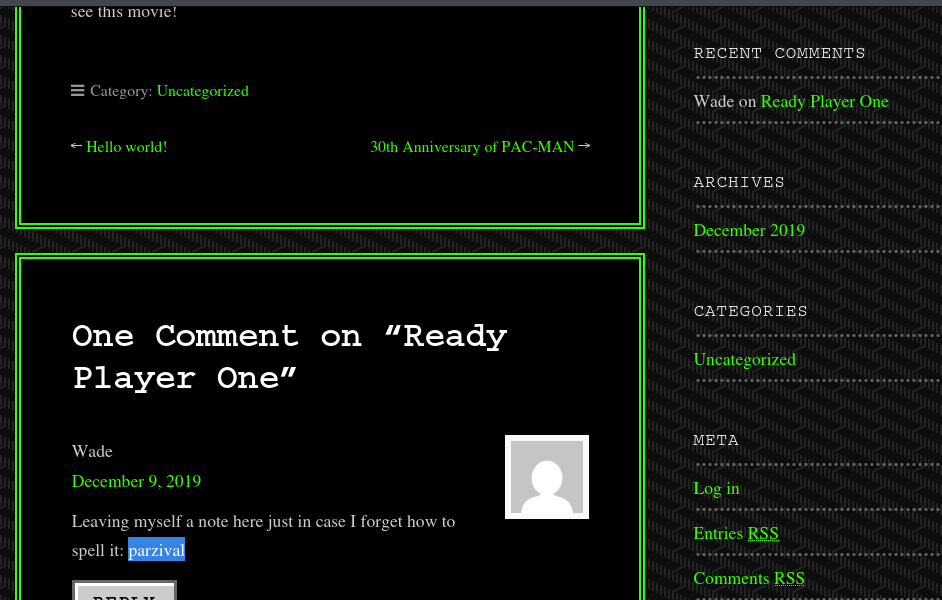

so found the wade password 

since rdp is open , lets try login into rdp with username wade and his password 

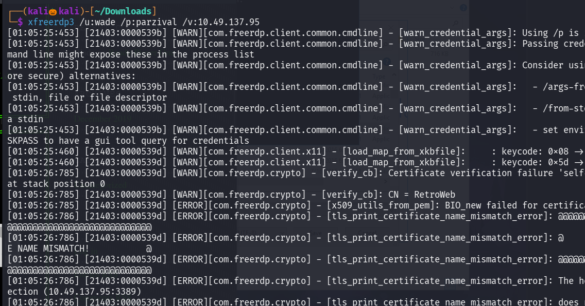

We successfully found the user.txt file 

Lets eslcate our privilage to find the root flag 

There is a executable named hhupd 

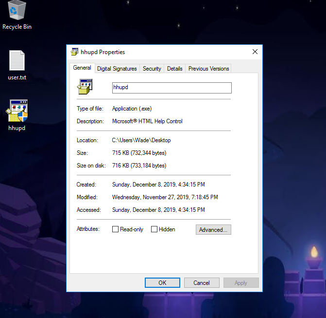

While researching about it , found its cve number 

Lets follow the steps to esclate our privilage to nt authority 

Right click on hhupd and click on run as administrator 

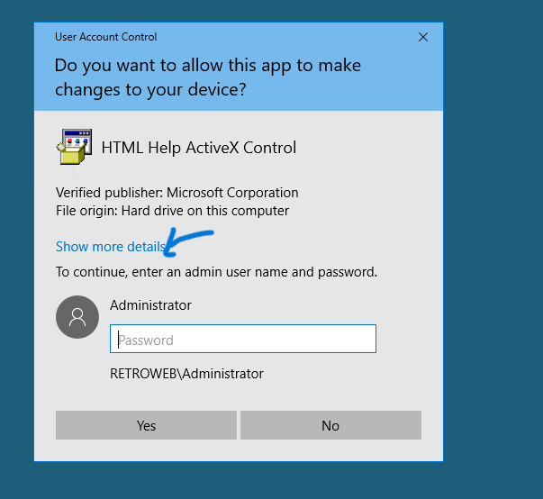

click on show more details 

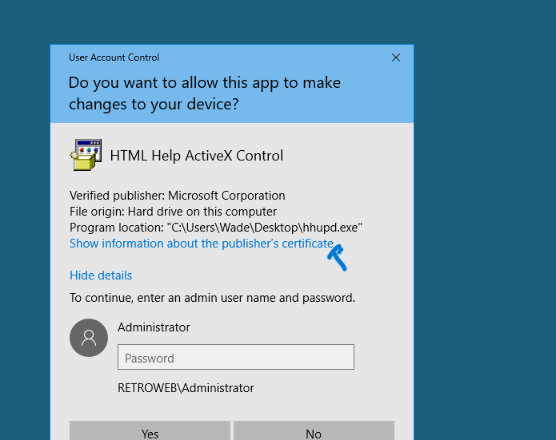

click on show information

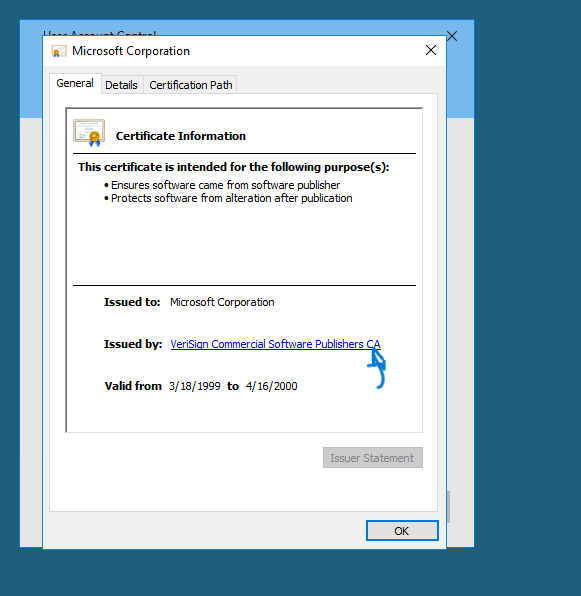

click on the link and click on okay 

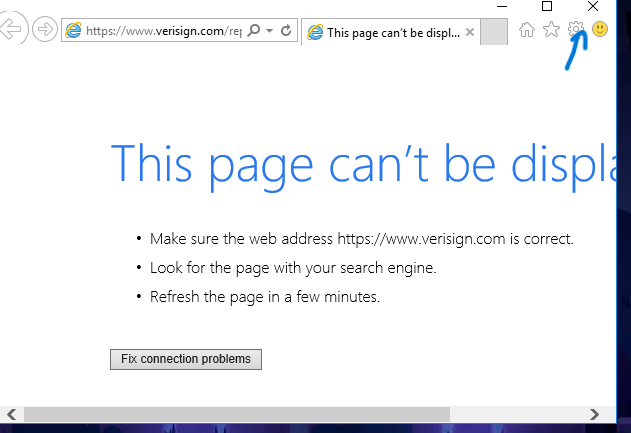 

in this click on the settings 

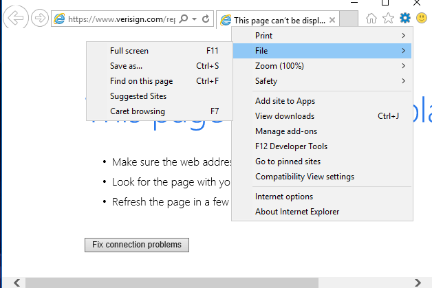

click and file and click on save us 

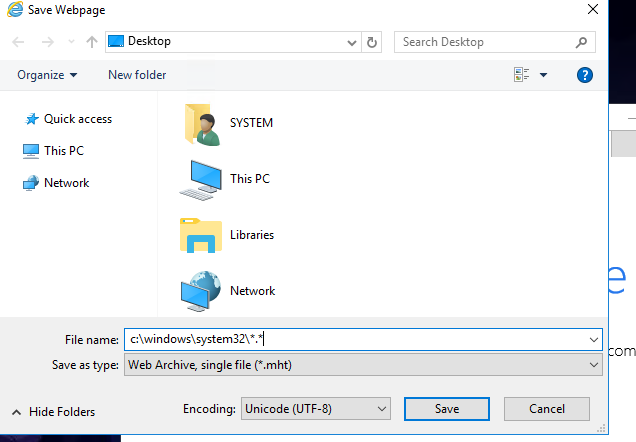

enter the file name as c:\windows\system32\*.* and click on save 

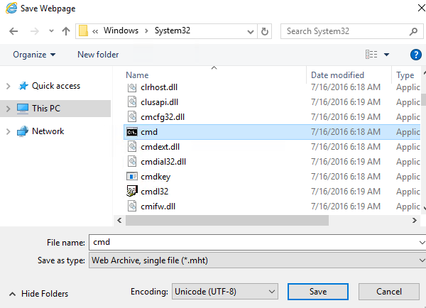

scrool down until cmd and right click on it and click on run as administrator

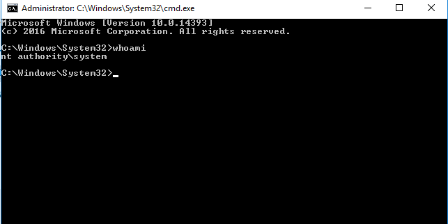

We successfully escalted our privilage to nt authority 

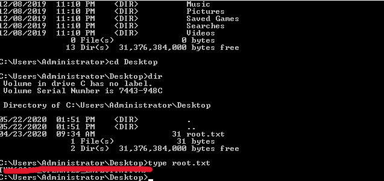

in Users/Adminstrator/Desktop folder found the root flag 

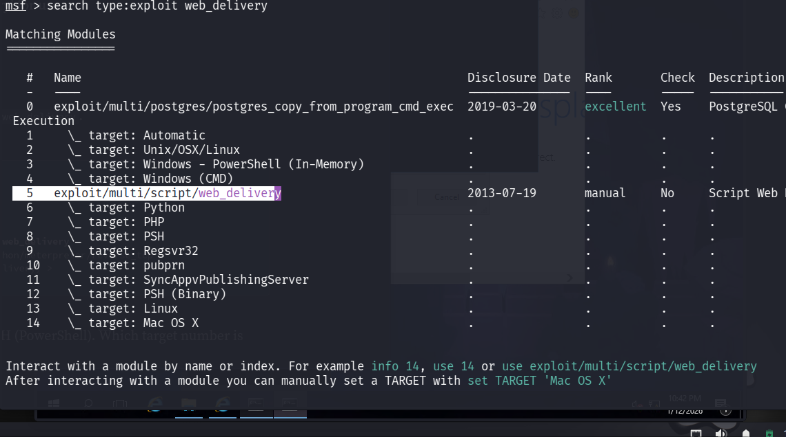

Lets use a metasploit module to gain a meterpreter shell and maintain persistance

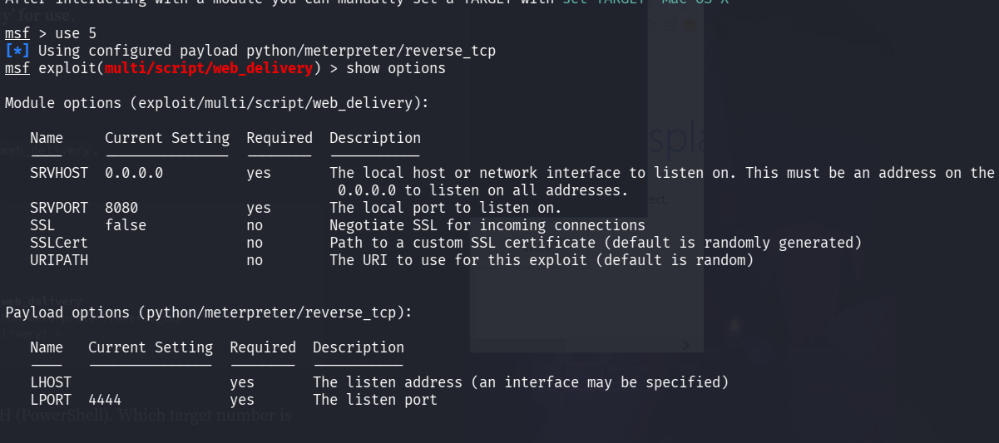

set LHOST , payload , target

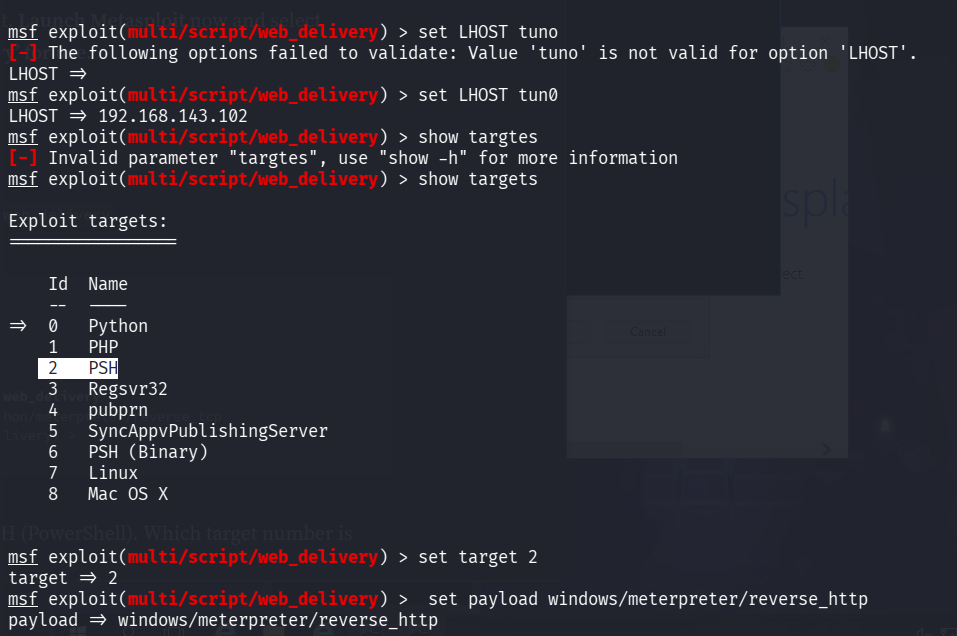

command : run -j to start 

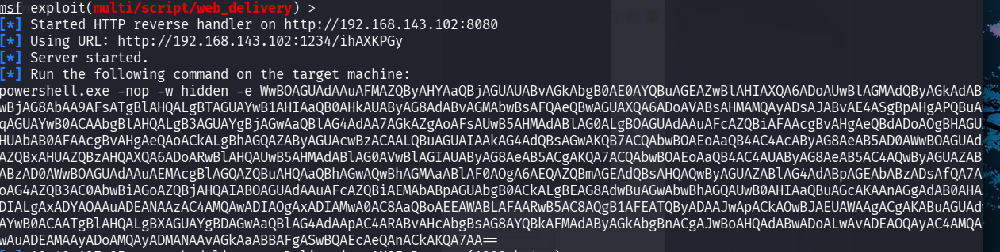

copy paste the payload in the cmd on windows and we will get a meterpreter shell

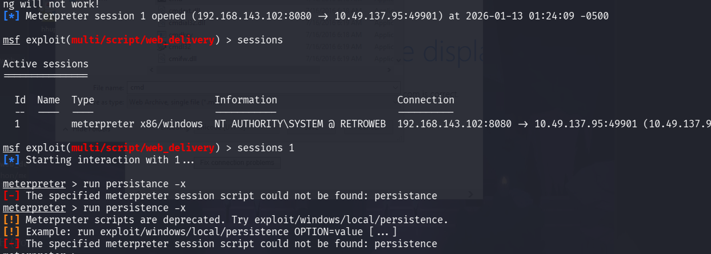

meterpreter command to maintain persistence is : run persistance -X 

----------------------------------------------THE END-------------------------------------------------------------------------------------------------------------

