## Lets start with an Nmap scan 

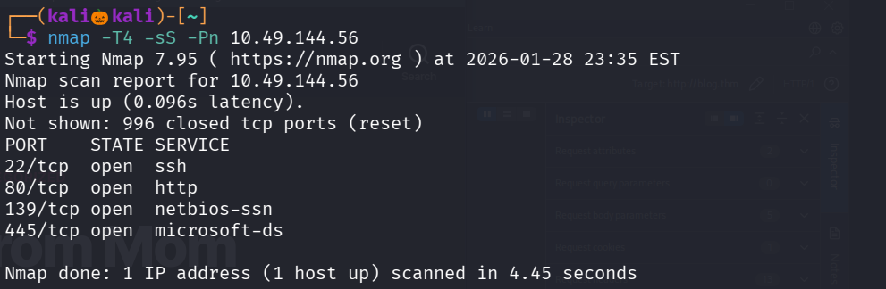

We found four open ports , lets perform service version detection scan and default script scan on them 

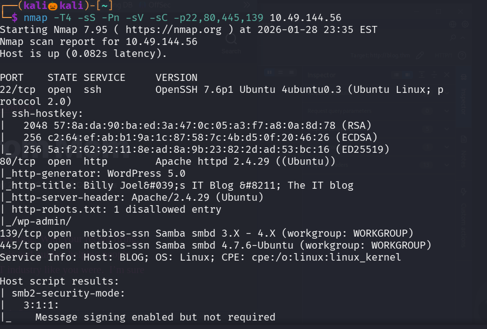
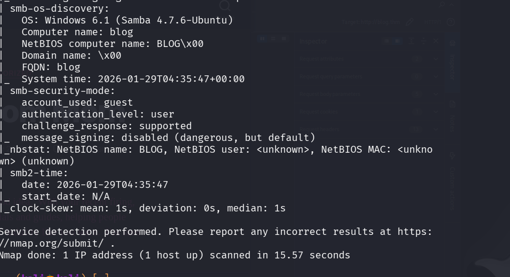

lets add blog.thm to our /etc/hosts 

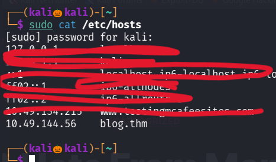

lets use gonuster to enemurate some web directories 

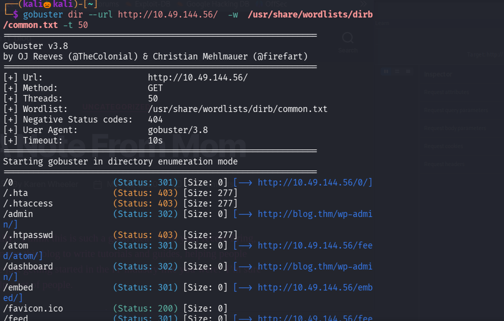

in /admin we found a login page 

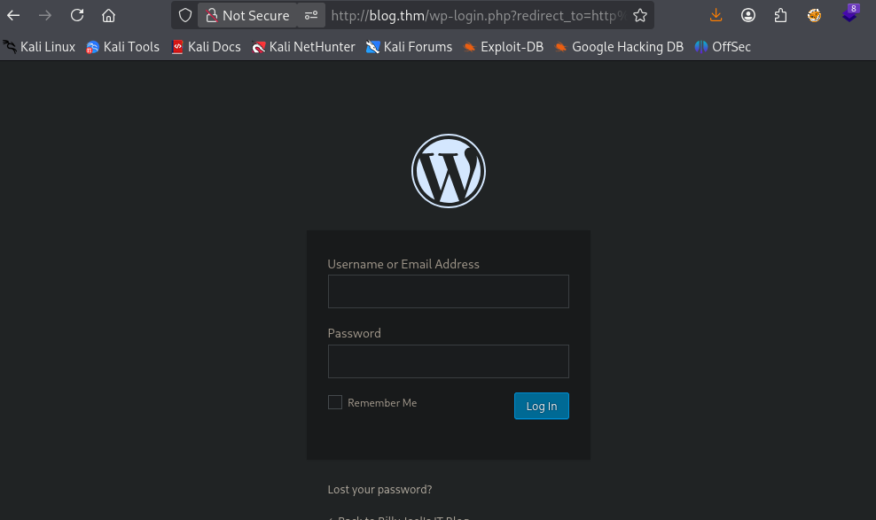

since this site is made up of wordpress , lets run a wpscan on it 

lets try to enemurate users 

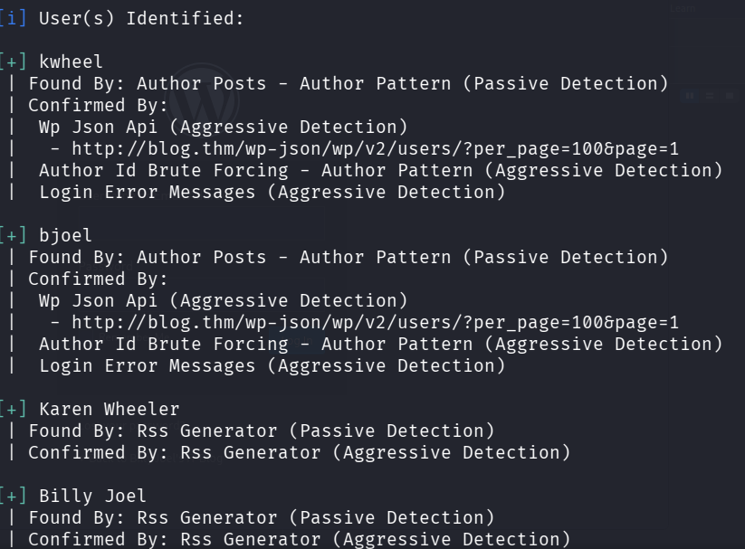

we found four users , lets try finding their password

add kwheel and bjoel to user.txt and lets use rockyou.txt file for password 

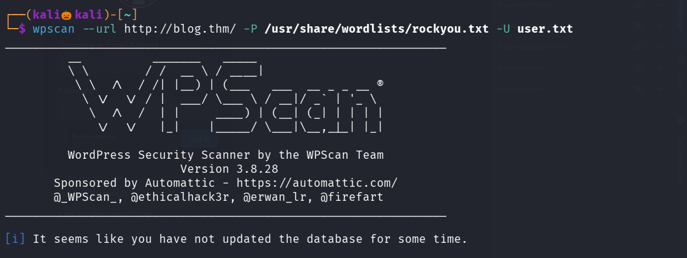

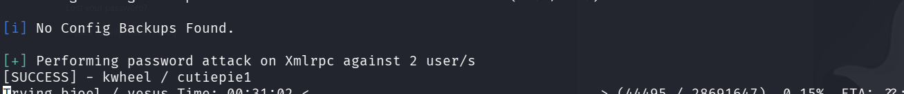

We successfully found the password , lets login into the site 

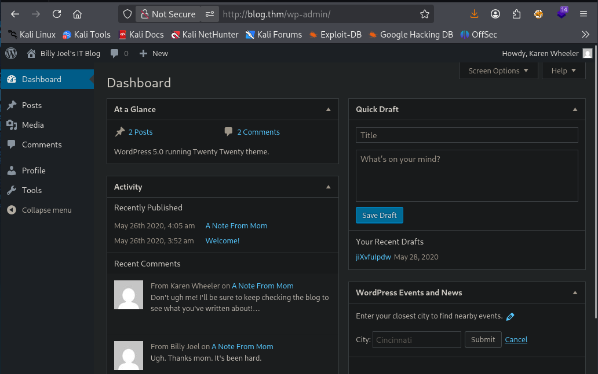

i tired for looking any file uploading feature but it is not found , since smb port is open , i tried enum4linux to enemurate any information , but no juicy information is found 

and in my nmap scan and in site noticed the wordpress version 

lets see this version has an exploit module 

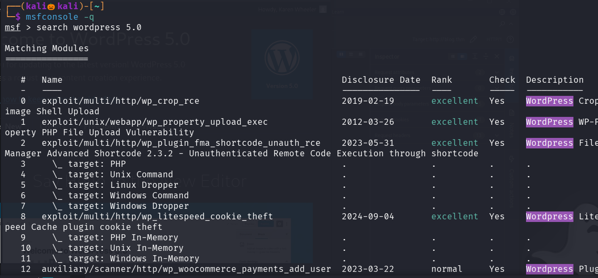

we found one exploit moudle , lets try it 

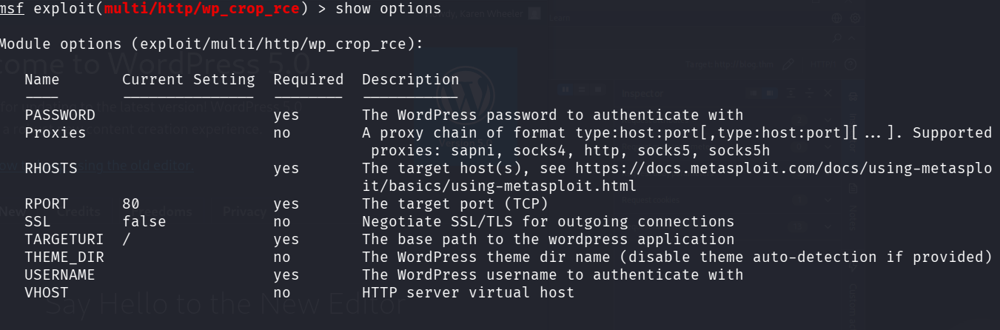

set the options we found 

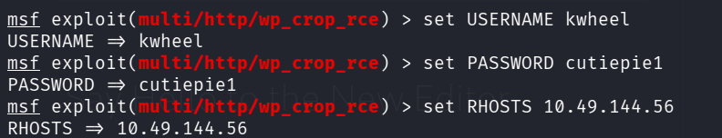

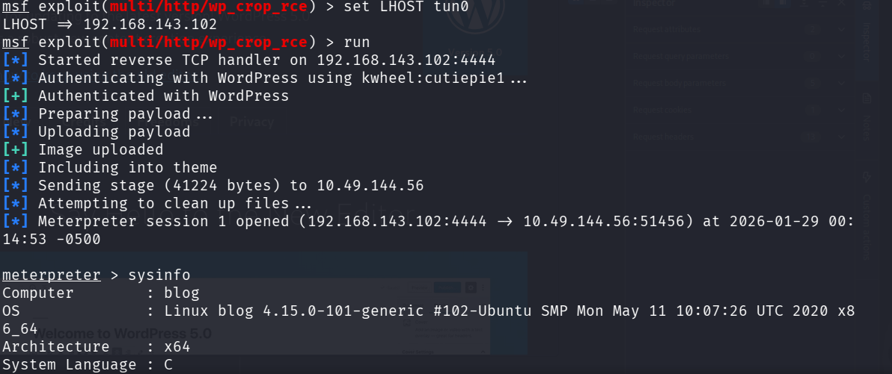

we successfully got the meterpreter session and while searching for user flag in home directory there is a file named user.txt but it did not consists of user flag 

checked sudo -l , crontab but no juicy information is found , so lets try 

finding for files with suid permission 

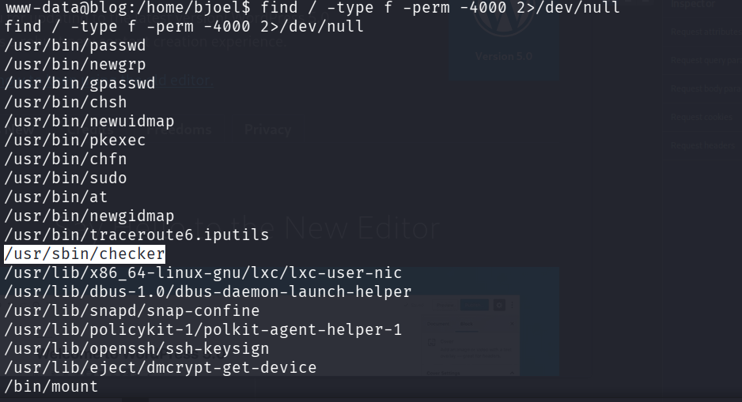

found a suspicious file /checker 

since it is a binary executable file cat command is not helpful 

so lets try ltrace command which watches what the program does while running

It shows:

Which library functions the program calls

What arguments are passed

What values are returned

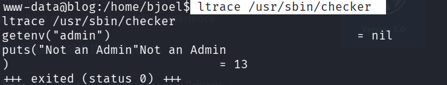

The program checks environment variable admin

so type command = export admin=anything

and run the program 

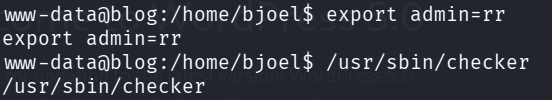

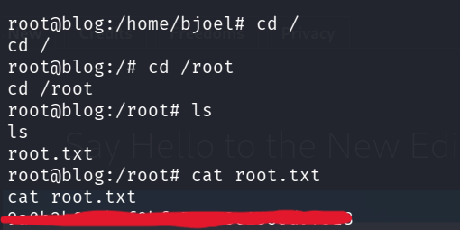

We successfully escalted our privilage to root and found the root flag 

now with root privilage lets search for the user flag 

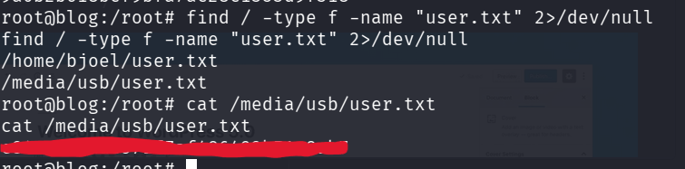

We successfully found the user flag  

---------------------------------------------THE END---------------------------------------------------------------------

