## Lets start with An Nmap Scan 

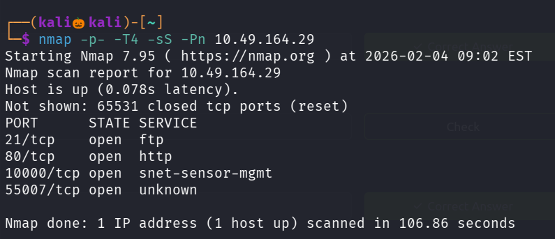

We found four open ports , lets perform service version detection and default script scan on it 

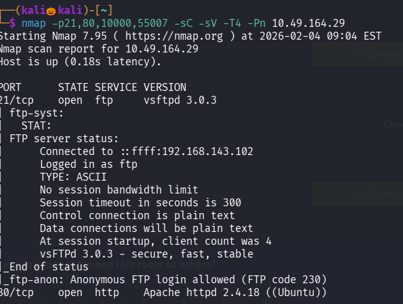

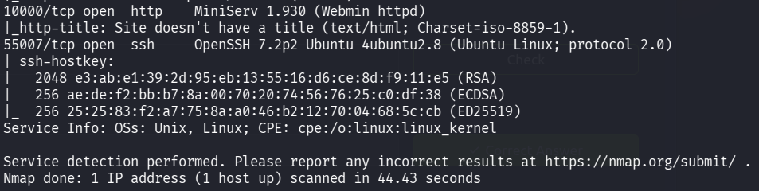

lets see the site running on port 80

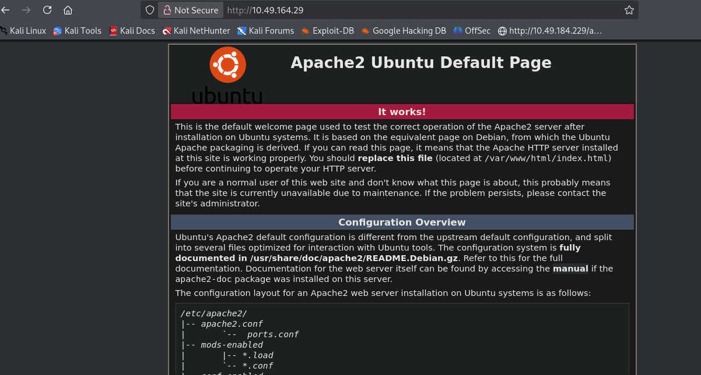

lets use gobuter to enemurate some web directories

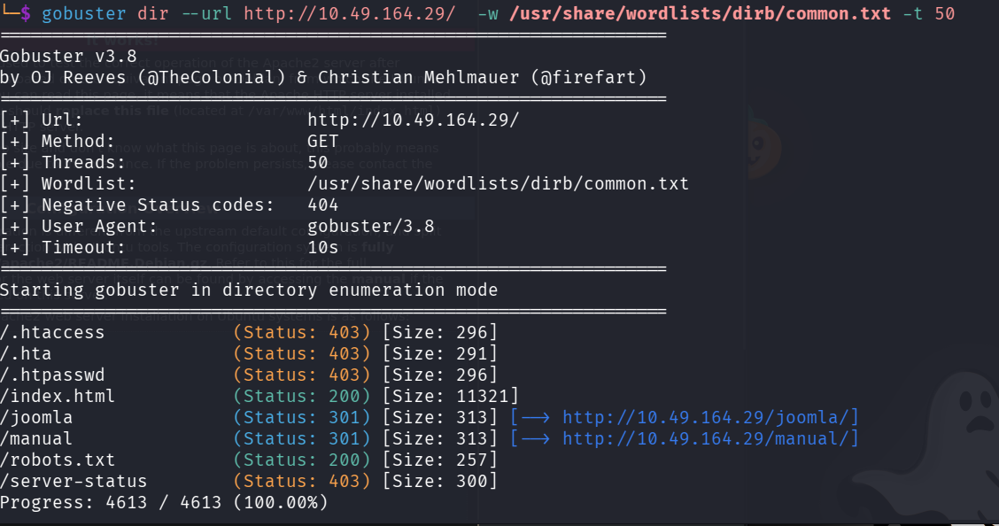

found a intresting directory named /joomla

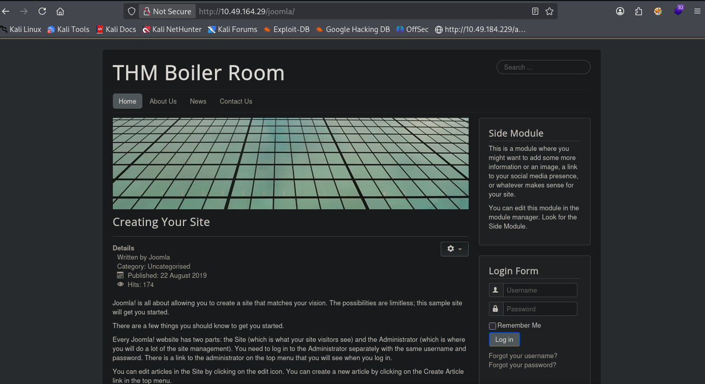

lets use gobuster to enemurate some directories under /joomla

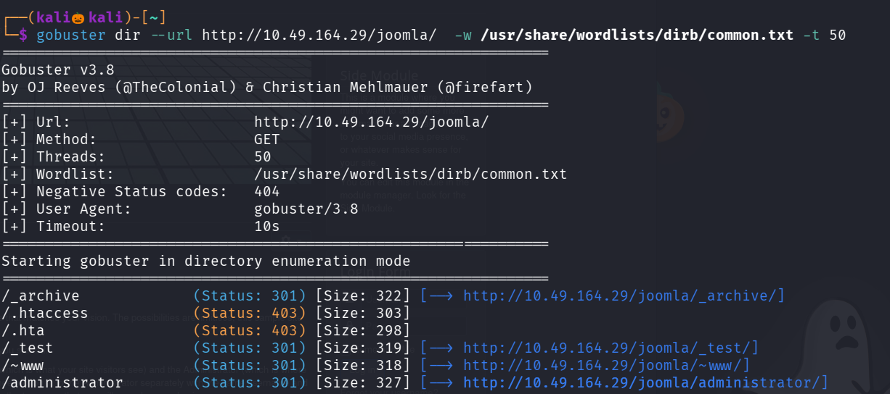
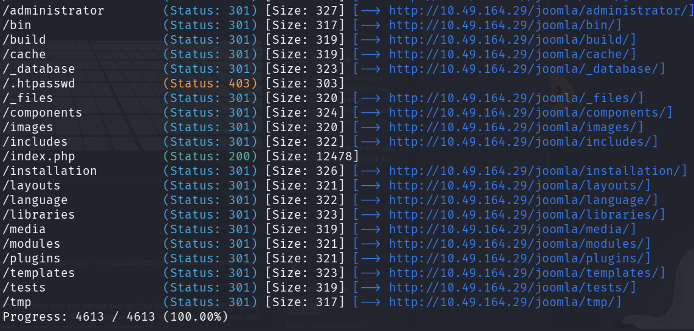

under /_test seems to be intresting 

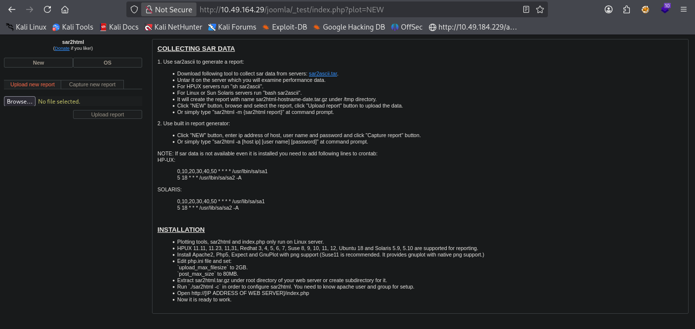

Seems like the version is vulnerable and found an exploit 

lets copy that 

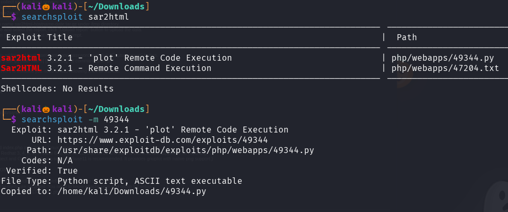

lets run that python exploit 

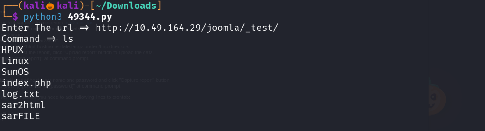

We successfully got the command shell 

lets see the contents of the log.txt

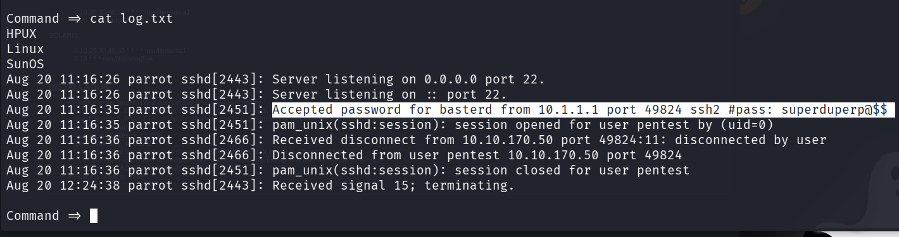

in log.txt we found the username and password 

we know that ssh port is open at 55007 , lets try to login into ssh with those credentials 

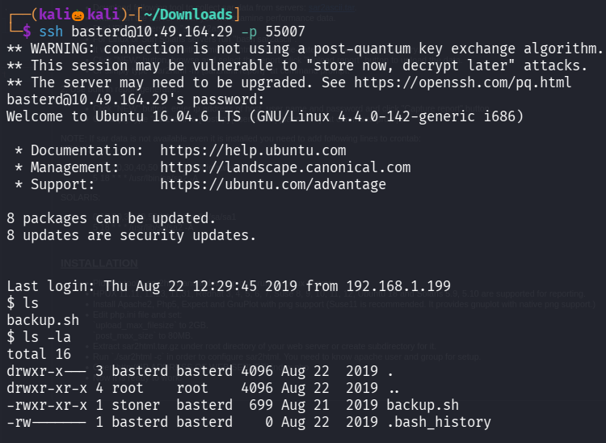

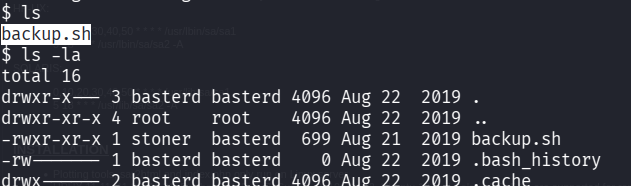

found a file name backup.sh , lets visit the contents of it 

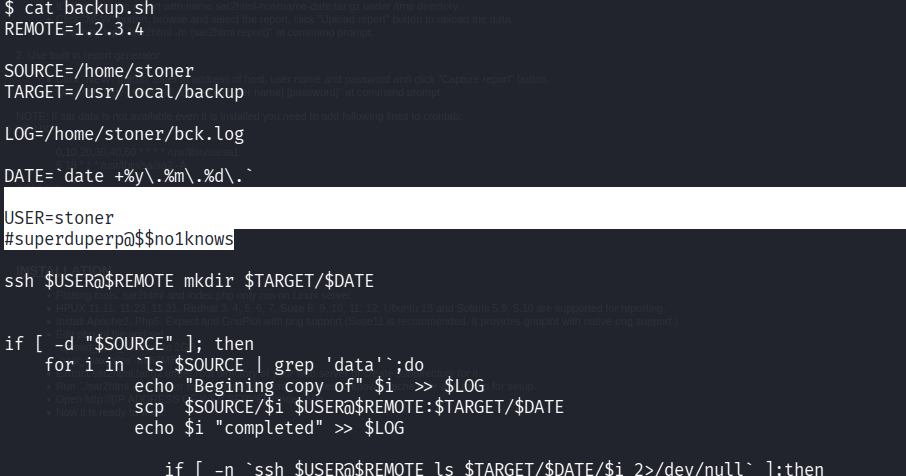

We found the another username and password , lets upgrade to user stoner 

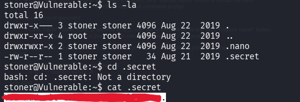

We successfully found the user.txt

Now lets escalte our privilage to find the root flag 

lets use sudo -l 

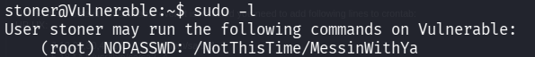

No juicy information is found 

now lets search for suid files 

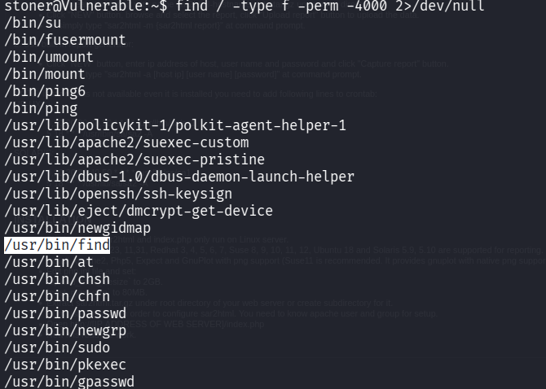

we can exploit this suid permission for find command , lets use gtfo bins 

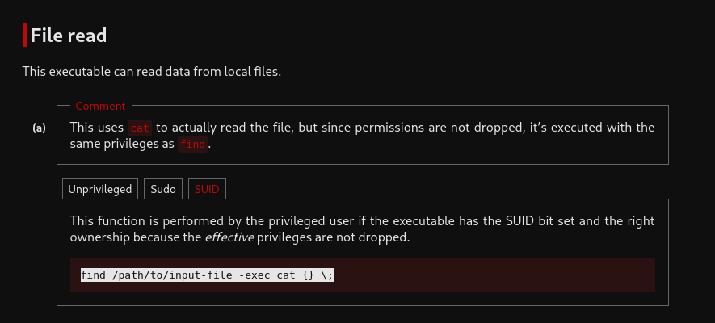

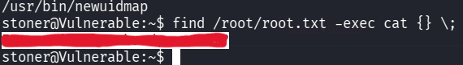

We successfully found the root flag 

---------------------------------------------------THE END-----------------------------------------------

