## Lets Start With an Namp Scan

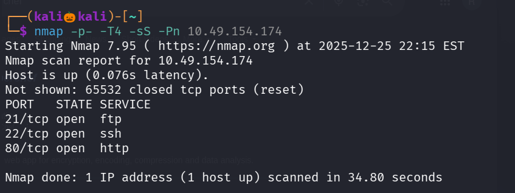

There are three open ports , Lets perform service version Detection and Default Script Scan on These Three open ports

Meanwhile Lets use gobuster to enemurate we directories on site running on port 80

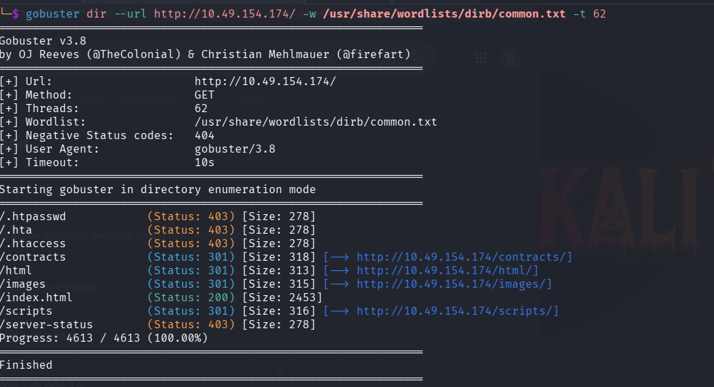

I gone all urls but no juicy information is found , Lets see our namp scan result 

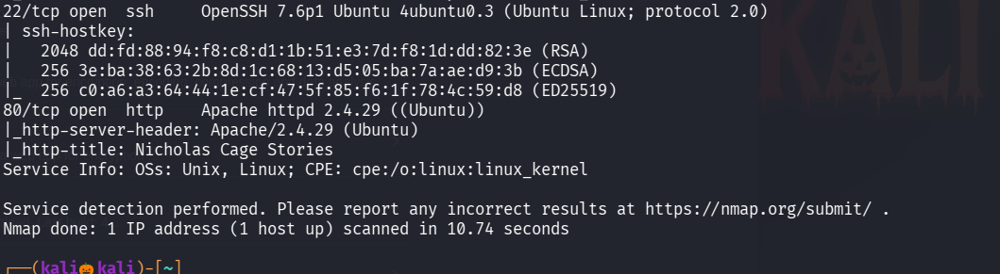

We found that ftp anonymous login is allowed , Lets login into ftp

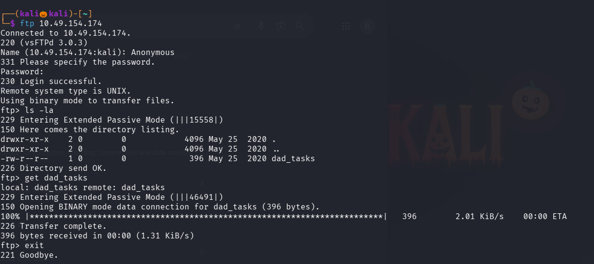

We found a file named dad_tasks lets get that file to our system and see the contents of it

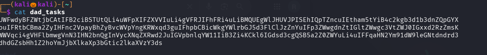

Looks like it is base64 encoded lets decode it using cyber chef

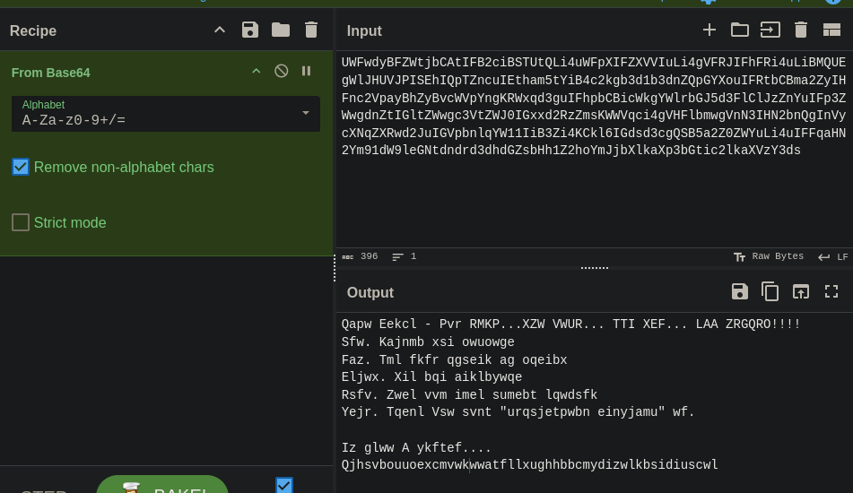

The output text looks like it is also encruypted with cipher text

I tried with rot13 and its series but the result are wrong , Then it has be Vigenere cipher but Vigenere needs a key , but here we dont know any key  , so we want to brute force the key

There is a website https://www.guballa.de/vigenere-solver for brute forcing Vignere cipher

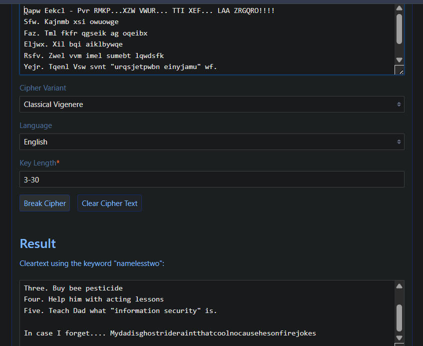

We found the key is : namelesstwo

We also found the password 

While looking the website also found the username 

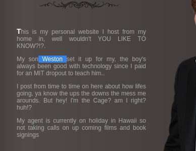

Lets use our credentials to login into ssh

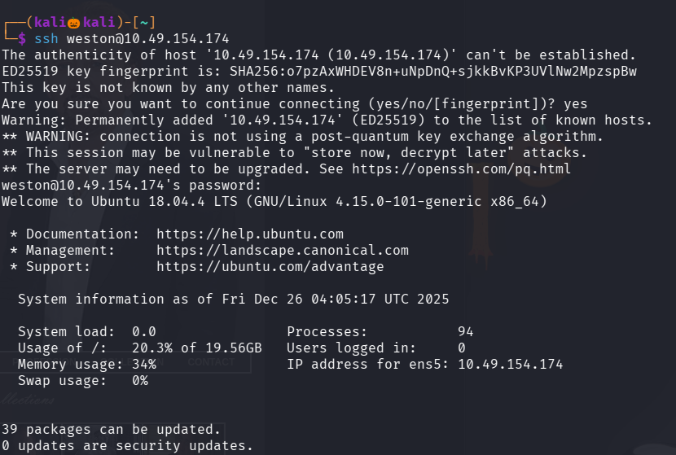

We cant find any files reveling user flag

We found also found an another user named cage 

We also dont have any permission to run any files as root 

but suddenly one pop up appered , seems like something has been executing in the background by cage

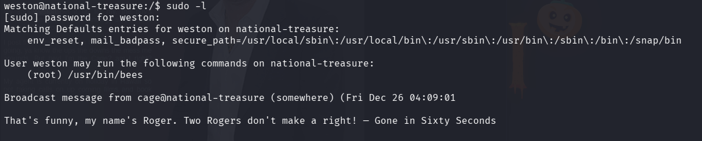

Lets look for a specific files owned by user cage 

There is a python file called spread_the_quotes.py and .quotes

Lets view that python file

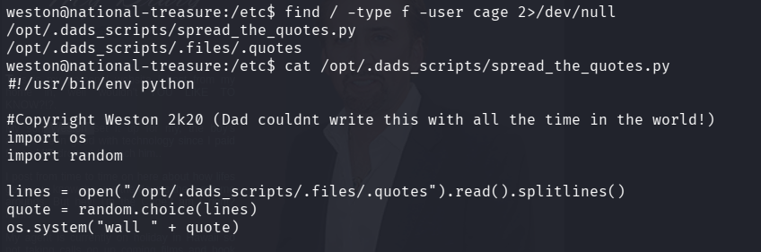

The python file is opening the .quotes and spliting the lines in it and printing it on screen that why we saw that pop up meassage

These are the contens of .quotes file

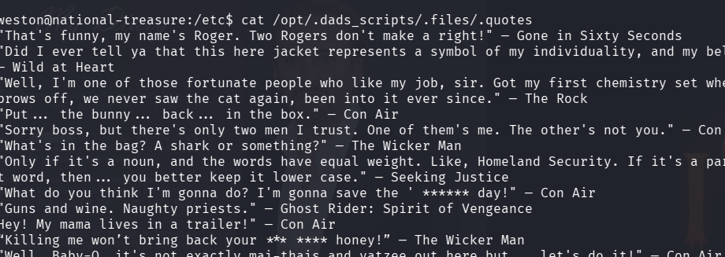

Lets create a nc reverse shell and write it into .quotes file , so when cage executes the python file we get a reverse shell as a cage user 

Set up a nc listener

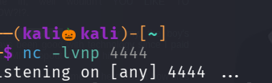

I used reverse shell generator to create an nc reverse shell

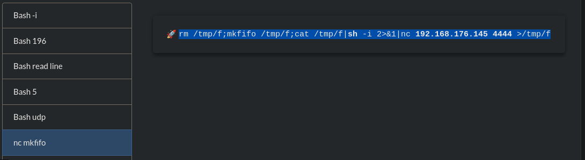

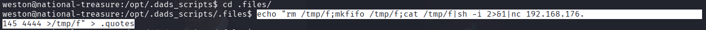

wait until cage executes the file , when he excutes that python file we get an reverse shell

We succesuflly got an reverse_shell

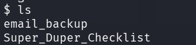

If the list the contens of Super_Duper_Checklist we will get the user flag

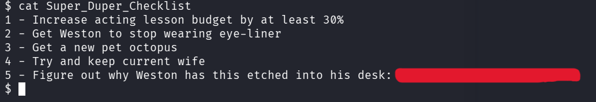

Lets navigate to email_backup directory , there are three emails , in first two no juicy information is found

but in third we got an encryted cipher text , has to be the root password

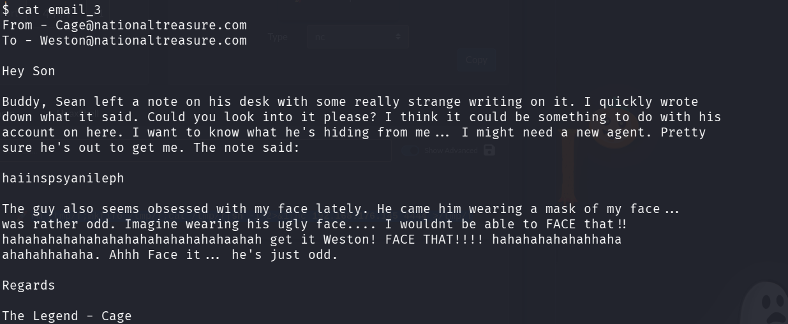

This cipher also looks vigenere , i tried to brute force the key but no valid text is found

I read the email one second , in that FACE is repeated so many times  , in that you can also see FACE THAT  , lets try the key as FACE

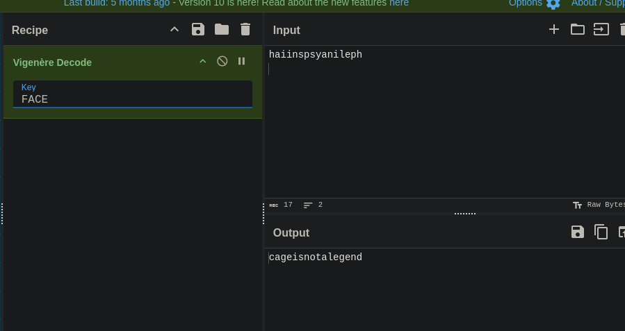

We got a clear text this has to be the root password 

Lets become a root user 

Command : su root

and enter the decryted text we found

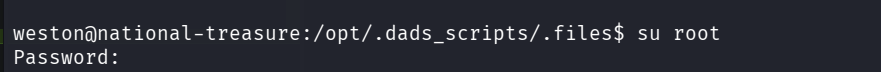

We successfully login as a root user

Lets navigate to root directory

We see a folder called email_backup , lets naviagte into it 

We see two emails, in that second one consits of root flag

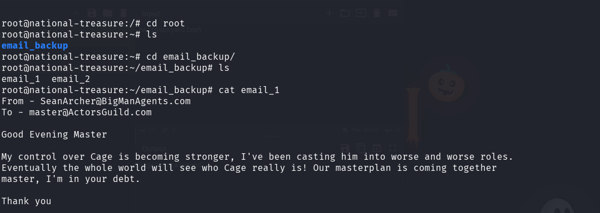

