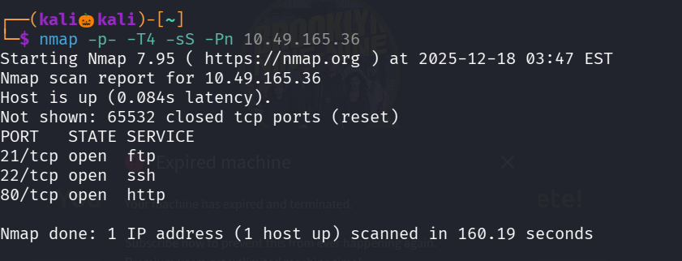
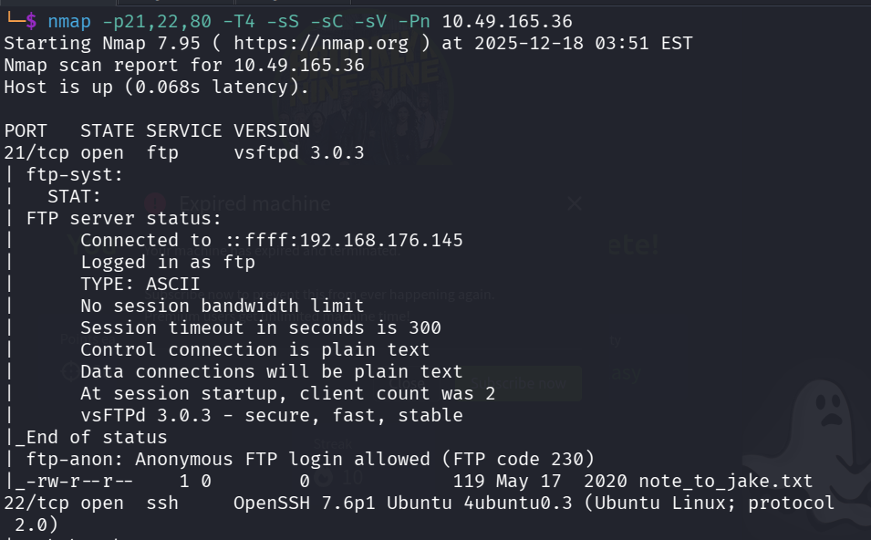
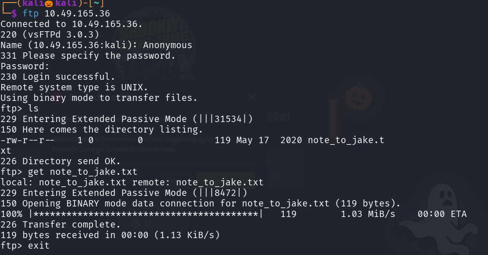
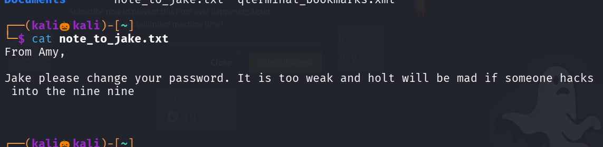
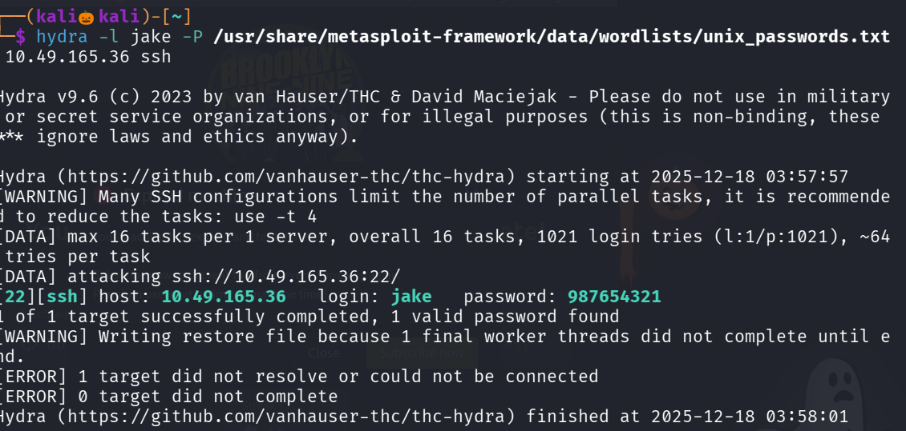
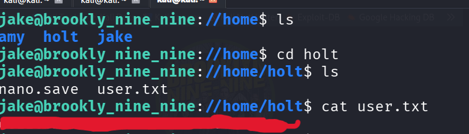
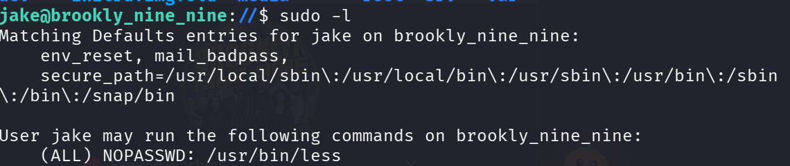
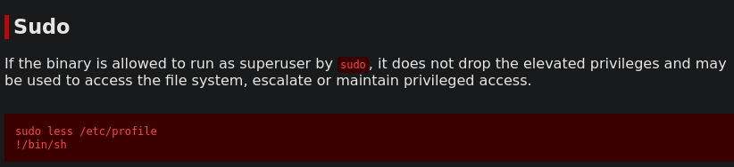
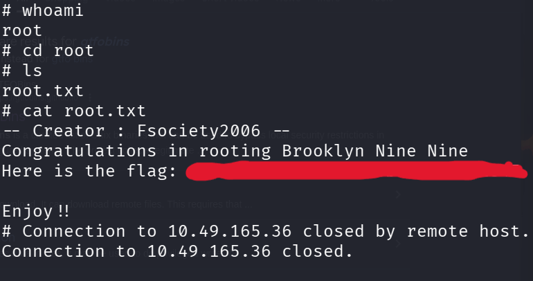

## STEP 1 : Nmap Scan 

 Lets Start with an nmap scan 

From the namp scan we can identify there are three open ports , Now lets perform default script scan and service detection scan 

from the picture we can identity ftp is allowing Anonymous login so lets login using ftp 
command : ftp <target_ip>

if we list the files using ls command we can see one file lets get that file to our kali machine using 
command : get <file_name>

Lets see whats is inside the file 

we can notice a person named jake has a weak password and in three open ports ssh is open 
so lets try ssh brute force using the tool hydra  

Successfully We found the Password , Lets Login in ssh using the username and passowrd we found 

after login lets naviagte to /home/holts folder and there we can see users.txt 

 

Successfully we found our first flag , in order to find our second flag we need to esclate our privilages 

for escalting privilage type : sudo -l to see what the user jake can execute without the root permission

we found that user jake can execute /usr/bun/less without the root permission 

so lets try to esclate our privilage 

go for gtfo bins and search for less 

copy paste the payload and we successfully esclated our privilages as a root user

now navigate to root directory and type ls command to see available files now cat out the root.txt file

We Successfully found our second flag 

------------------------------------------THE END------------------------------------------------------ 
