## Lets Start with an Nmap scan

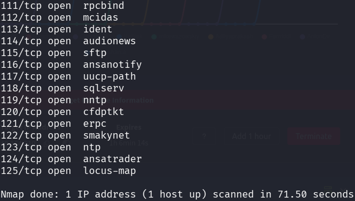

Lets perform service version detection and default script scan

In meanwhile lets visit site running on port 80 http

Its a login page but dont know the credentials

I used gobuster to enemurate for web directories but no directories found

Lets see the namp scan output

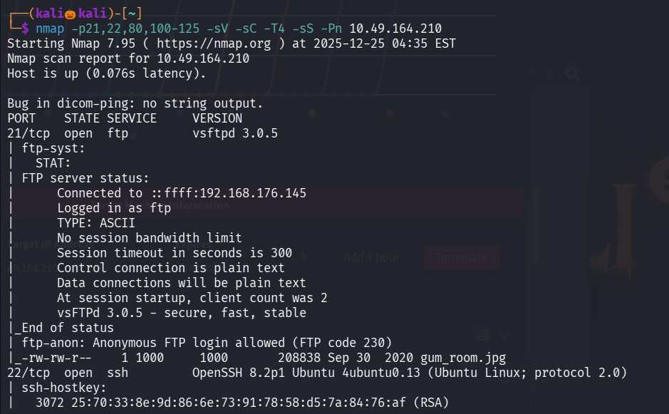
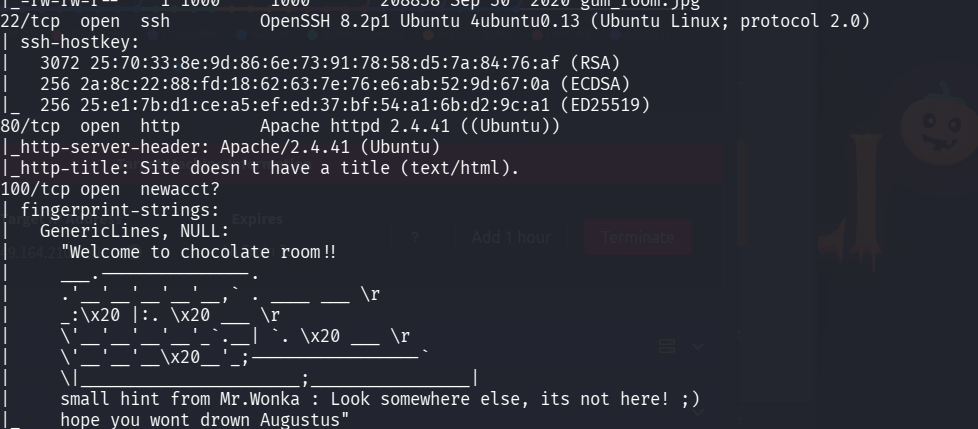
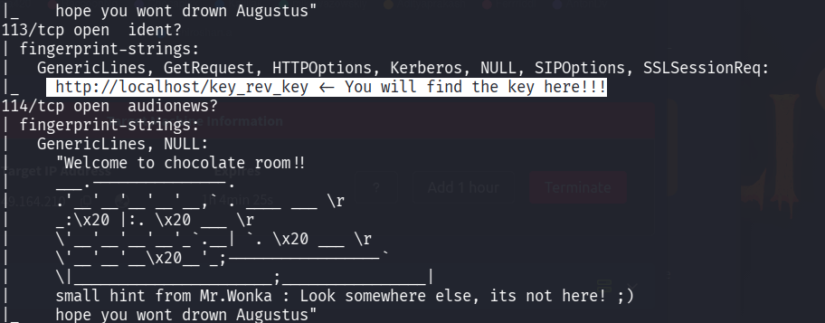

We found that ftp anonymous login is allowed , and also we found the key located at /key_rev_key

Now lets login into ftp

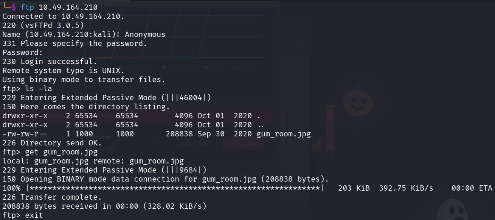

We found a jpg file called gum_room.jpg 

Lets use stegseek tool to check for there is any hidden details inside the image

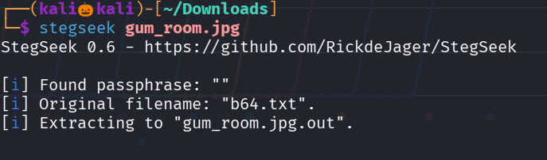

We found a secret message stored in gum_room.jpg

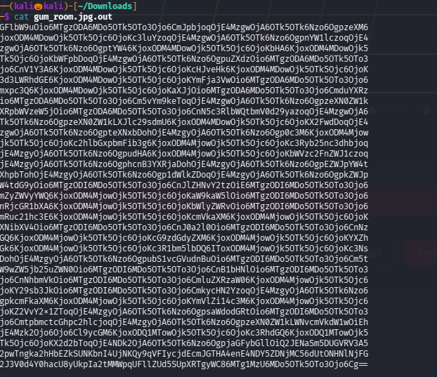

looks like a base64 encoded text lets decrypt it

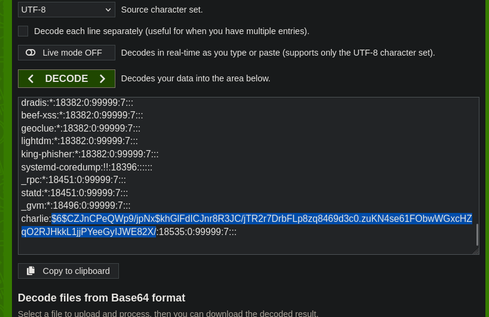

we found a username charlie and password is in hash format , lets use hashes.com to crack it 

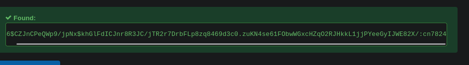

we cracked the hash value

Now we have username and password lets login into the password

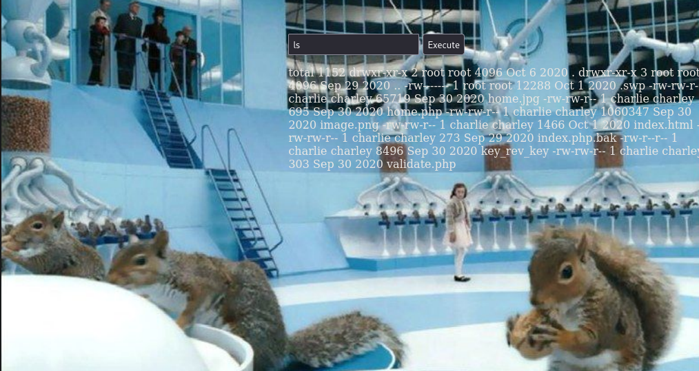

It seems like we can execute commands , lets set a nc listener and execute a nc reverse shell

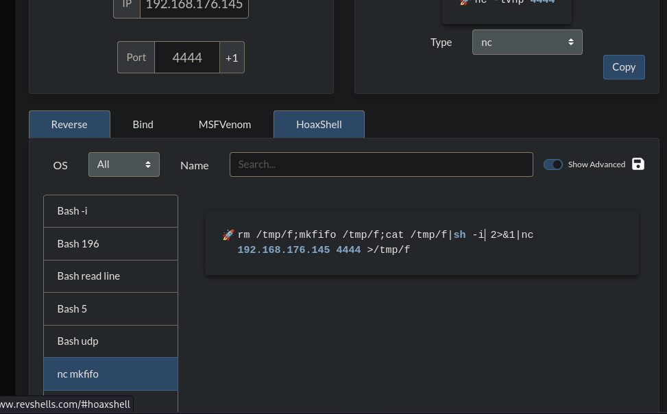

We successfully got a reverse_shell

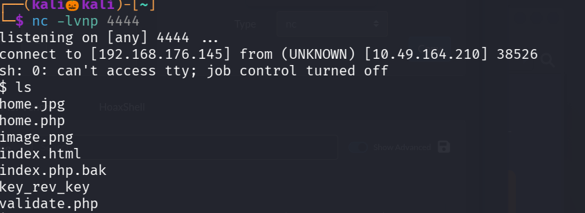

Lets upgate the shell and move to user directory

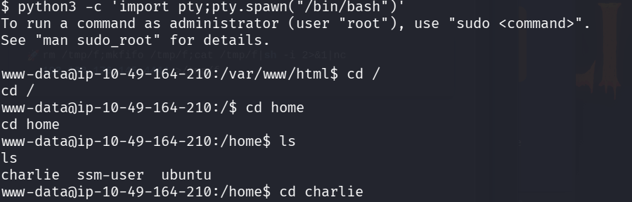

we found the user.txt but we cant able to read it

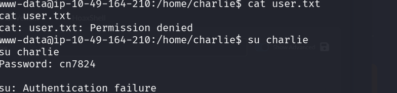

There is a file called teleport , lets see the contents inside it

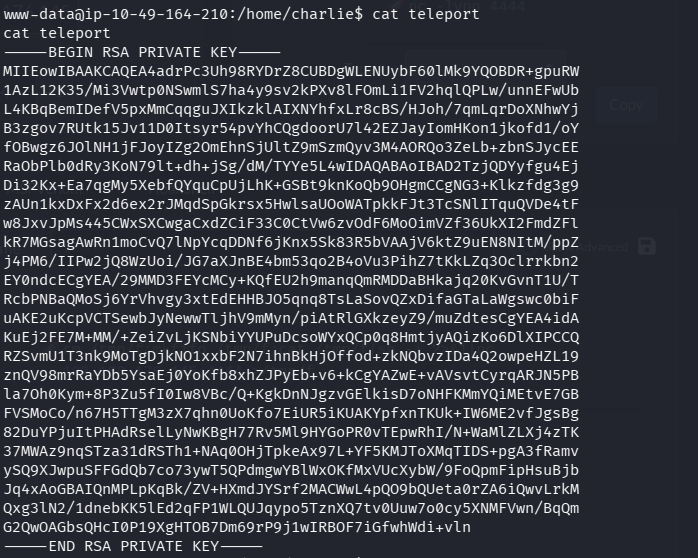

We got a rsa key , we can use it to login into ssh , create a file , copy he key inside it make it executable
and login into ssh as user charlie

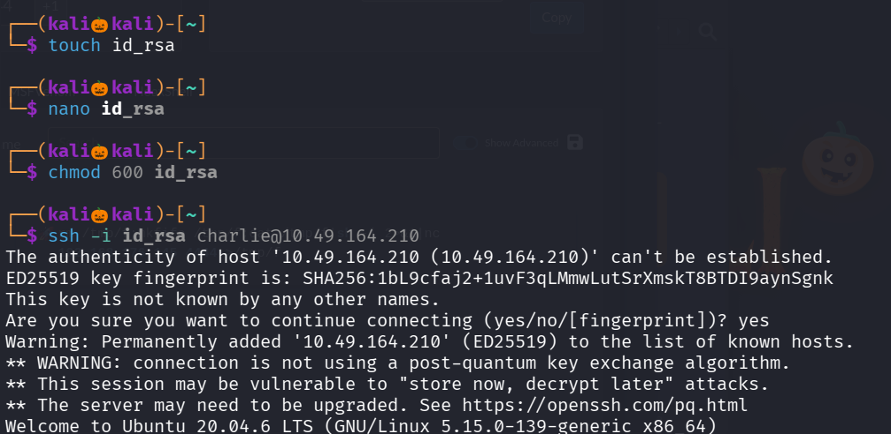

We successfully login into ssh now lets  view the user.txt flag

