## Lets Start with an nmap scan

We found that there are two open ports , lets perform service version detection and default script scan on them 

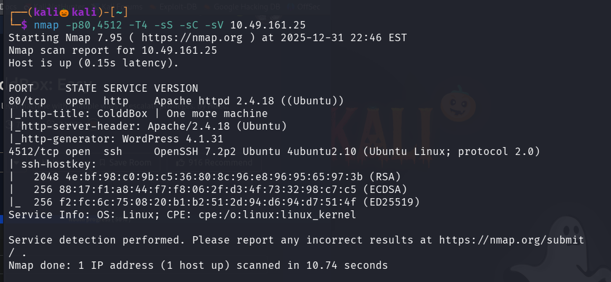

lets vistis the site running on port 80

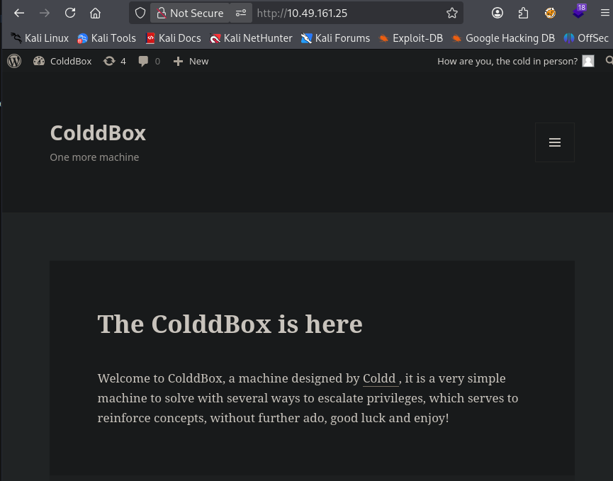

Lets use gobuster to enemurate the web directories 

We found some directories lets view /hidden 

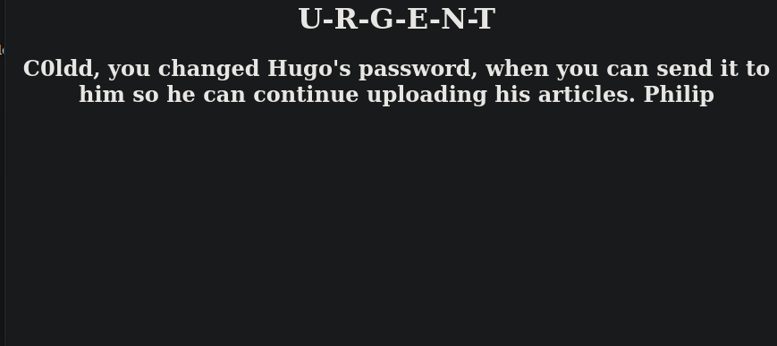

we found a username c0ldd , and in /wp-admin path we have found a login page 

we know that the site is made up of wordpress , use wappalyer extension to check that 

Lets use wpscan to crack the password of c0ldd

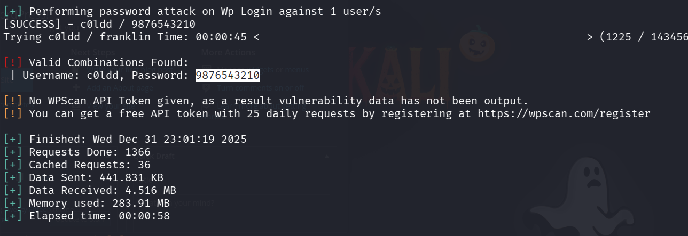

We successfully found the username and password , lets login into the site 

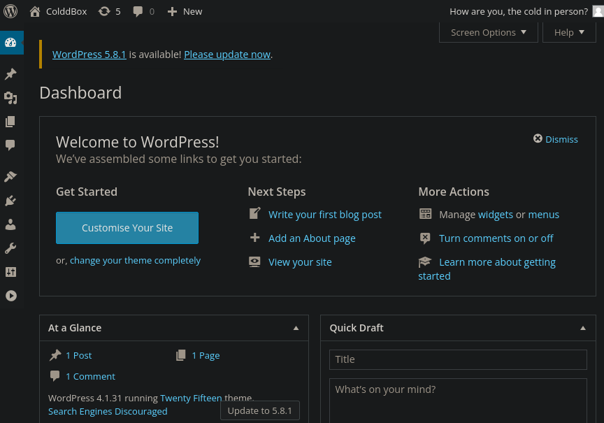

while visting all urls and functionality of the site , i found that in apperence tab and in editor there is a file 404.php , lets vistis it 

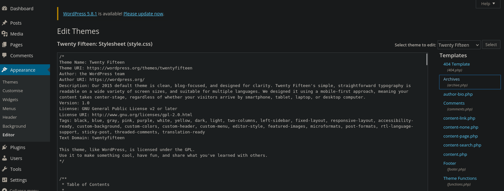

lets replace the php code with our php reverse shell code , i got it from github

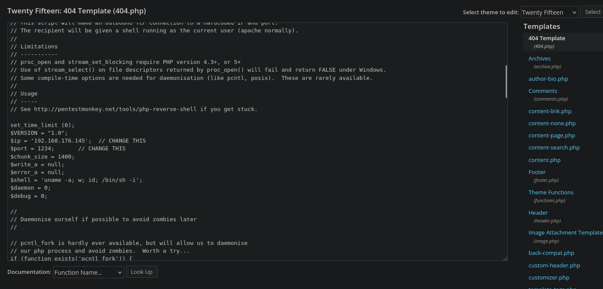

set up a nc listener 

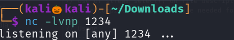

click on update and the url http://machine_ip/?p=440.php

we successfully got the reverse shell

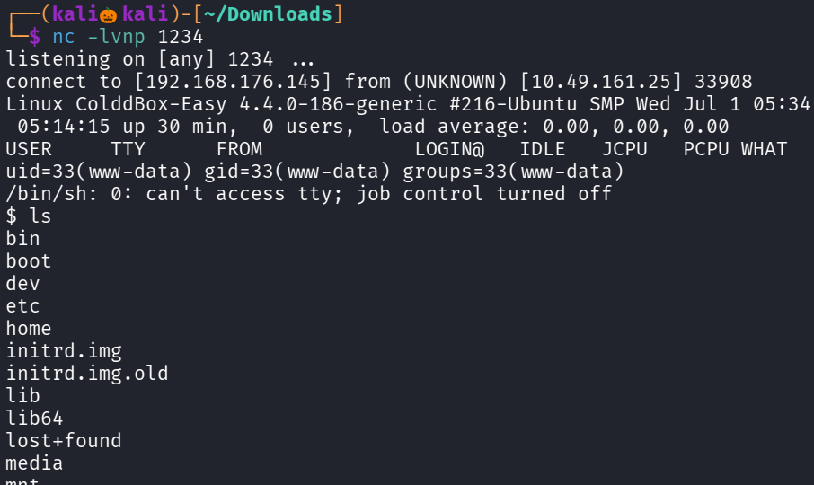

but we cant able to read the user.txt file , since our permission is denied

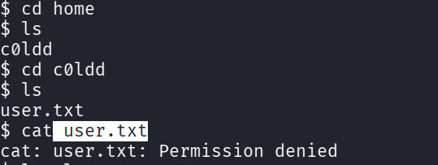

i visted /etc/crontab and checked for suid permission but no juicy information is found 

since this site is made up of wordpress , always check for default wp-config.php file which contains database information

and usually located in /var/www/html

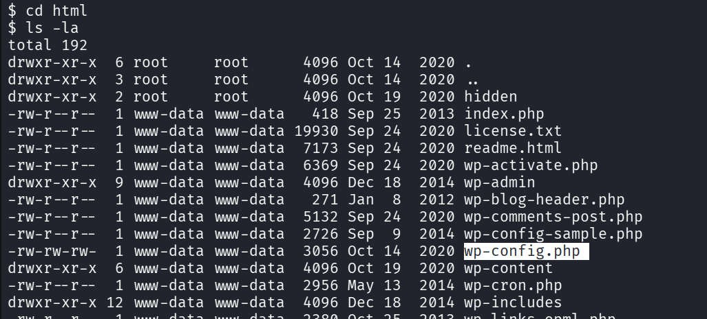

lets view the file 

We successfully got the password for user c0ldd , lets esclate to c0ldd user and read the user flag 

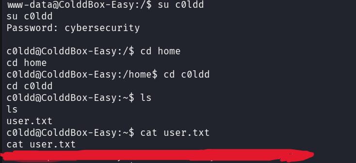

We successfully found our user flag 

lets see what commands c0lld user can run with root privilages , for that type command : sudo -l

There is a payload available for ftp in gtfo bins to spawn a bash shell with root privilages lets try that

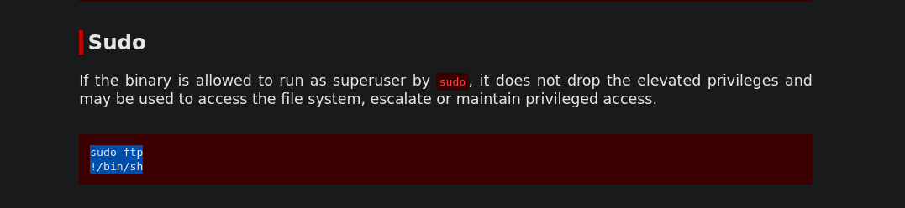

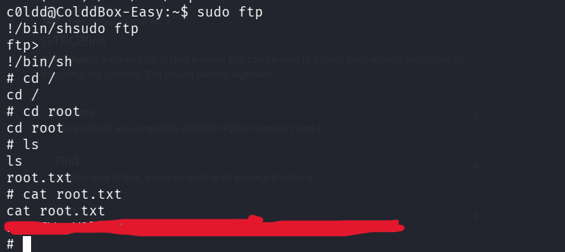

We successfully found the root flag 

--------------------------------------------------------------------------------------THE END----------------------------------------------------------------------------------

