## Lets Start With an Nmap Scan 

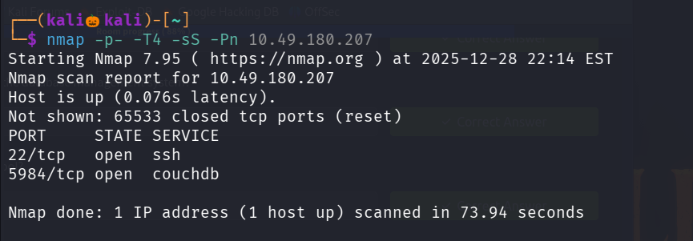

There are two ports are open , lets perform service version detection and default script scan on them

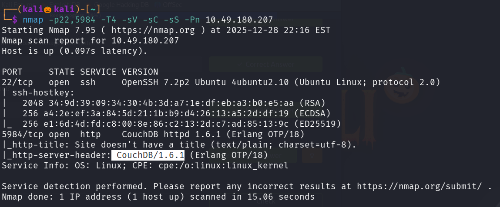

seems like port 5984 runs couchdb version 1.6.1 as well as http

Lets use gobuster to enemurate the web directories

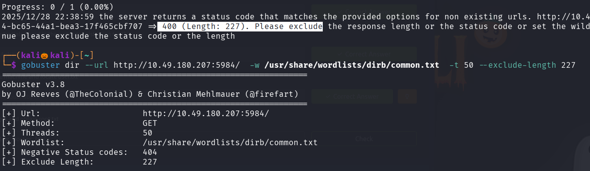

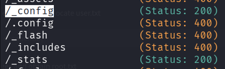

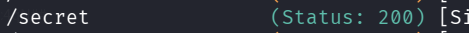

Lets vistis the path /_config

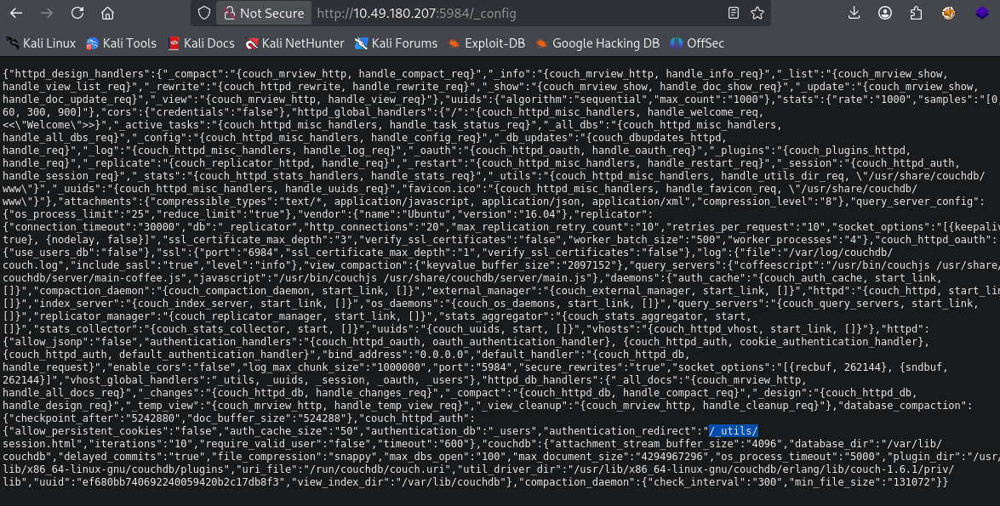

In this we can see the another path /_utils

Lets visit it 

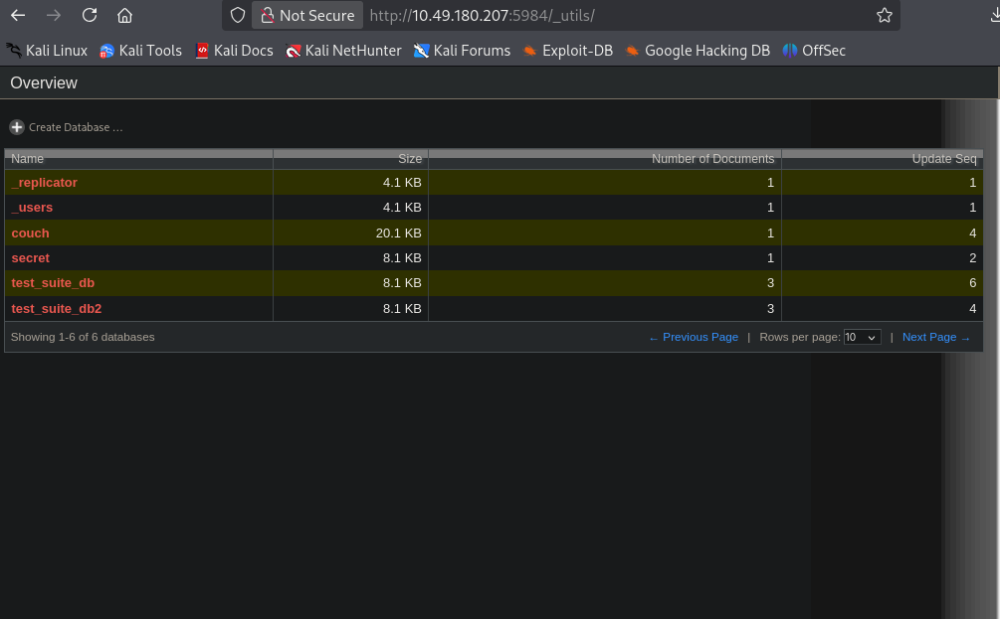

i inspected and tried to php reverse shell to obtain a reverse shell , but it did'nt work

so i clicked on every link and exploered

In secret i got a username and password 

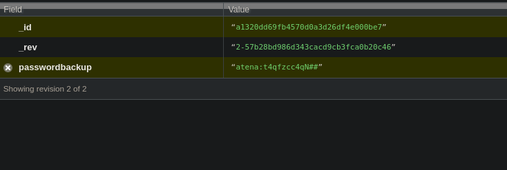

We found also ssh is open in our nmap scan 

Lets login into ssh with this credentials 

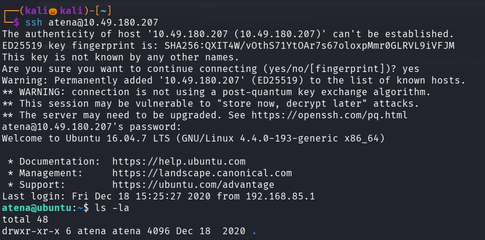

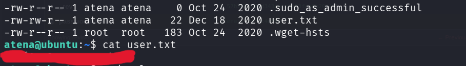

We successfully found the user flag 

We need to esclate our privilage in order to view the root flag , i tried sudo -l , visted crontab and also found files with suid permission , also ran linpeash.sh but no jucicy information is found

Then in /home/directory there is a hidden file named .bash_history  , lets visit it 

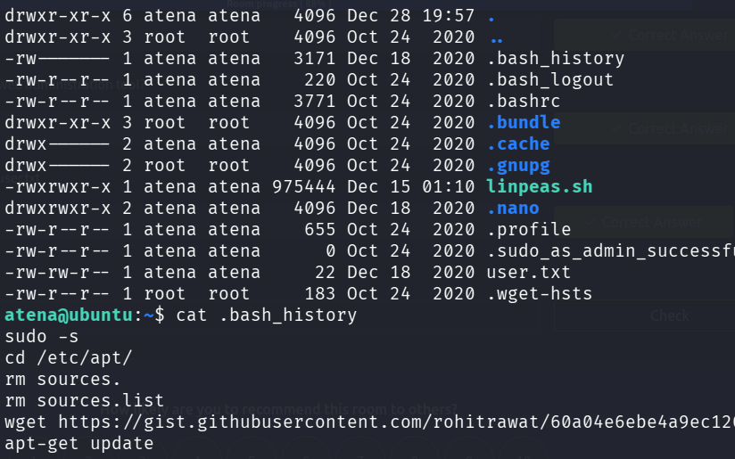

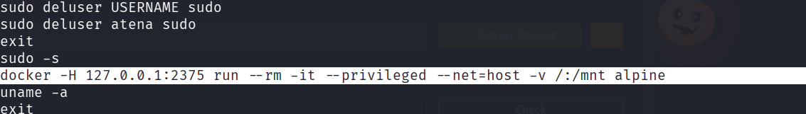

We found a docker command : docker -H 127.0.0.1:2375 run --rm -it --privileged --net=host -v /:/mnt alpine

Where -H --> connect to the host 

run--> run the docker container

-rm--> clean up everything once finished

-it--> spawns a interactive terminal

--privileged--> gives the container root privilages

--net=host--> shares the connection with the host system

-v /:/mnt --> copy the root file system into the /mnt directory

alpine --> tiny linux os

In this command there is no authentication provided , so anyone can login into docker container

docker is listening on port 2375

Lets search for docker privilage esclation , when searching for a docker privilage escaltion i found a commad

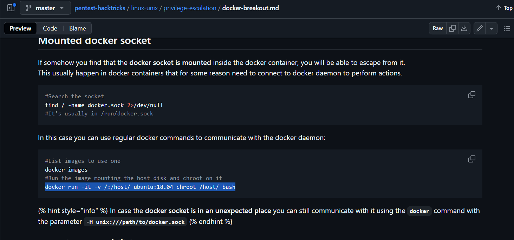

command : docker run -it -v /:/host/ ubuntu:18.04 chroot /host/ bash

in place of ubuntu we have to write alpine

command : docker run -it -v /:/host/ alpine chroot /host/ bash

This command connects to an exposed Docker daemon, runs a container, mounts the host filesystem, and uses chroot to gain root access on the host.

Lets run this command 

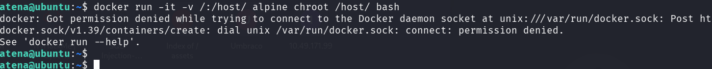

We cant run this command as our permission is denied in this system as atena user 

we know the docker does not has any authentication and is listening on port 2375 

So if we create a tunnel from our system to docker listening in port 2375  , we can able to excute commands in docker since we made a connection between our system to docker 

We can create a tunnel by ssh which is known as ssh tunneling 

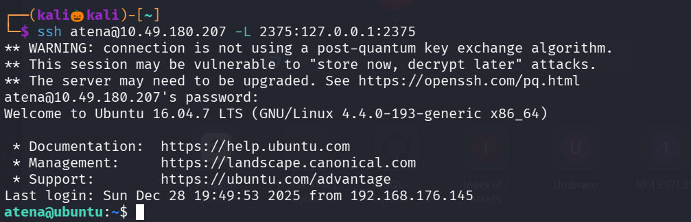

Now our system can directly communicate and excute commands in the docker 

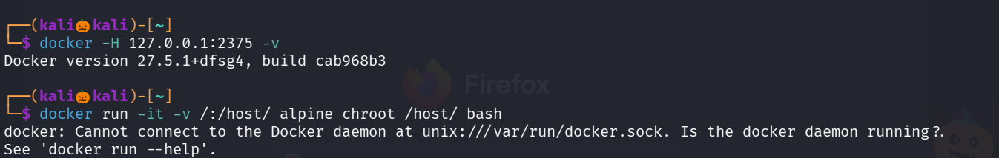

We can now excute the commands in the target system docker by specifying the host

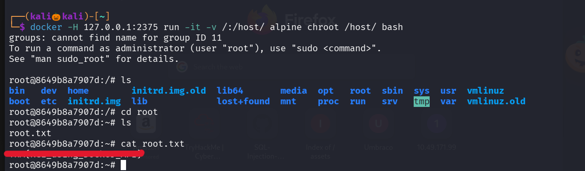

We successfully found the root flag

------------------------------------------------------THE END----------------------------------------------------------------------

