## Lets start with an nmap scan

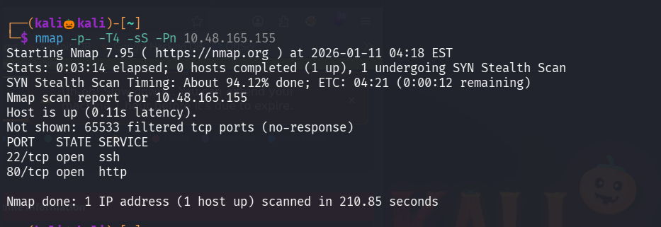

We found two open ports , lets perform service version detection and default script scan on them

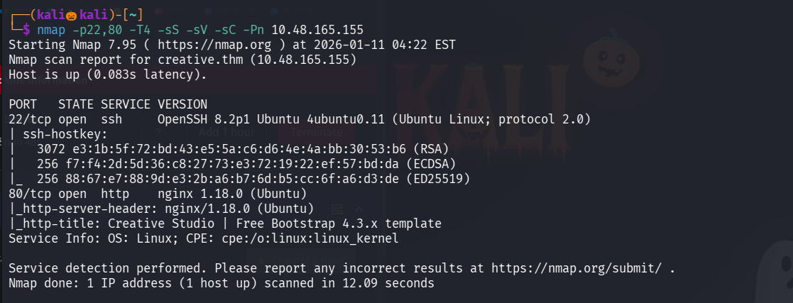

add the creative.thm in the /etc/hosts to access the site running on port 80 

lets use gobuster to enerumate the web directories

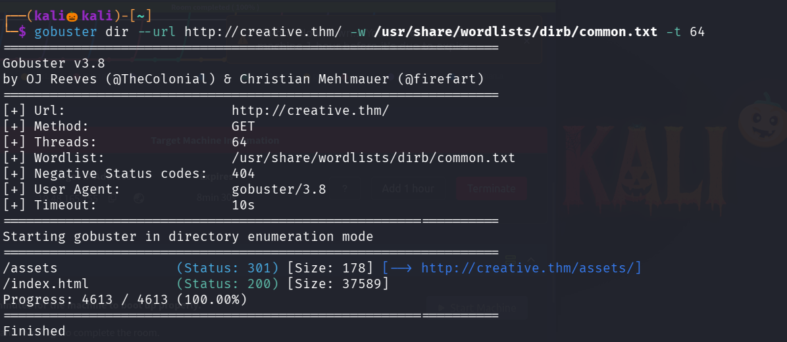

I inspected the page and also the url found by gobuster but no juciy information is found 

Lets enemurate for subdomains using wfuzz , since gobuster results are not accurate 

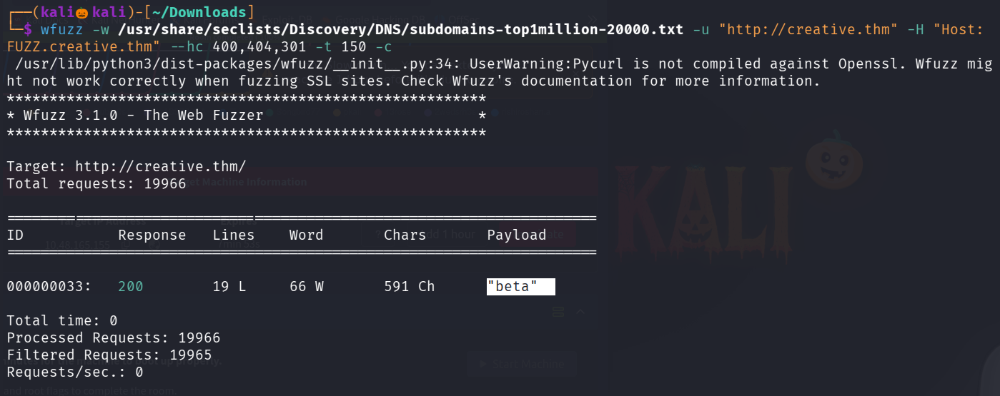

we found a sub domain beta , lets add that to /etc/hosts 

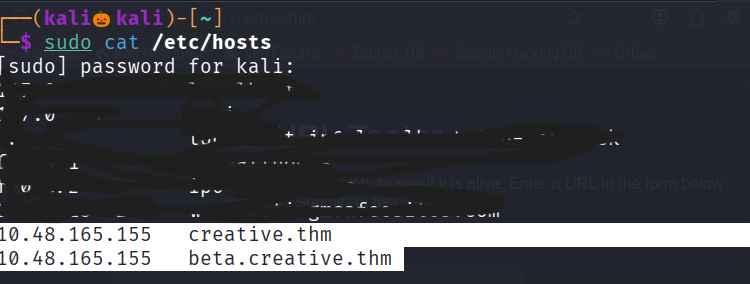

now lets vistis the site 

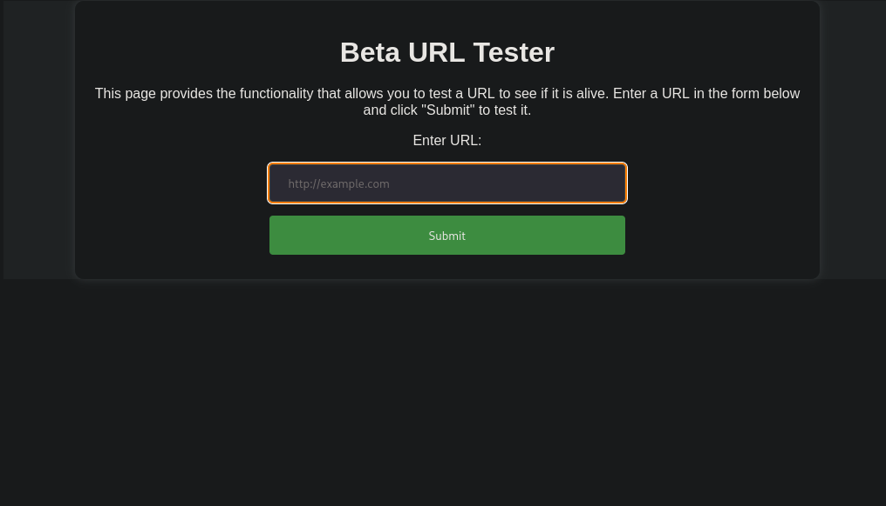

seems like it is used to test a url to see it is alive , lets try with local host 

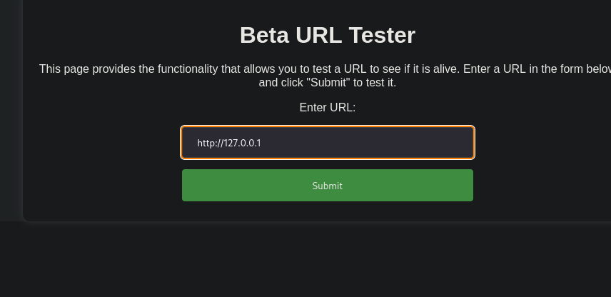

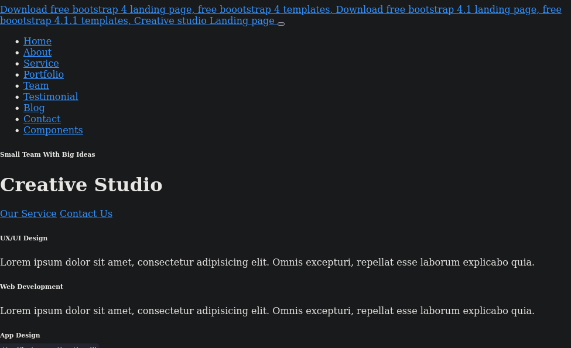

seems like we can perform ssrf , lets analyse the request with burp

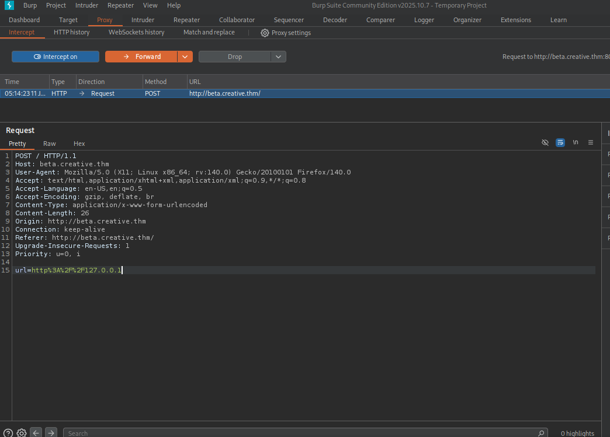

lets use wfuzz to see which port is active on localhost

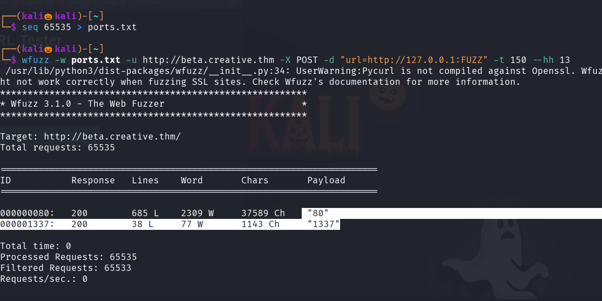

seems like port 1337 is open lets check it 

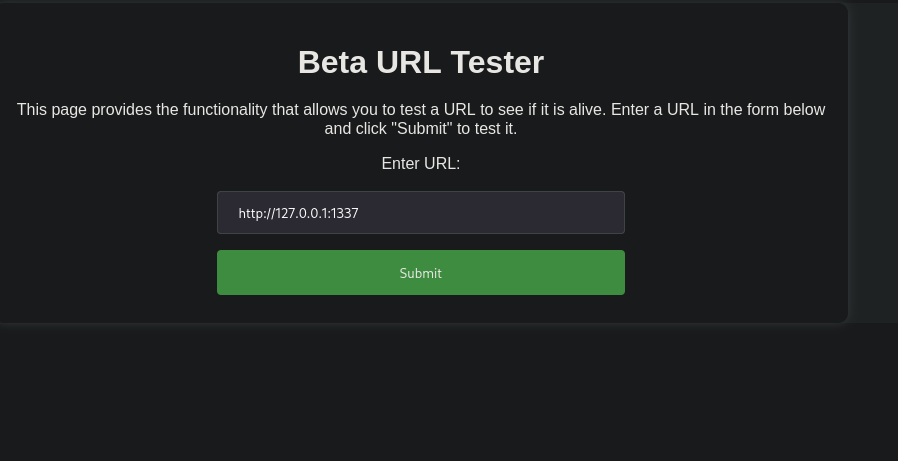

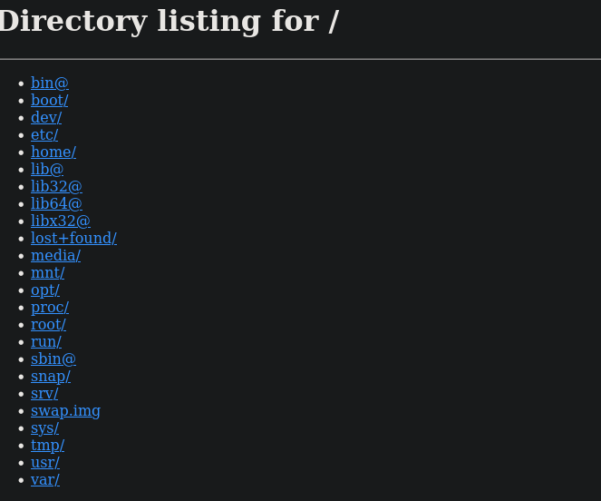

lets naviagte to home directory 

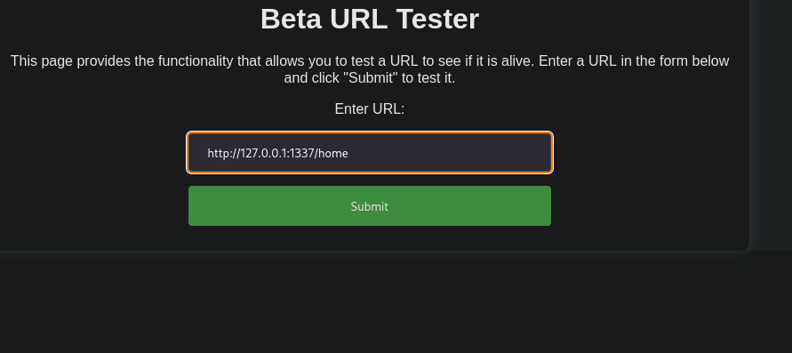

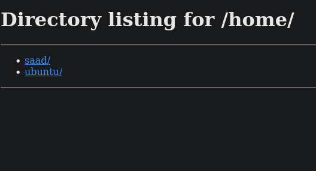

We found a username saad , lets navigate into it 

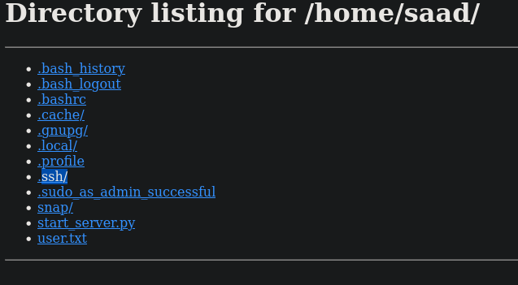

we found a directory .ssh , lets naviagate into it 

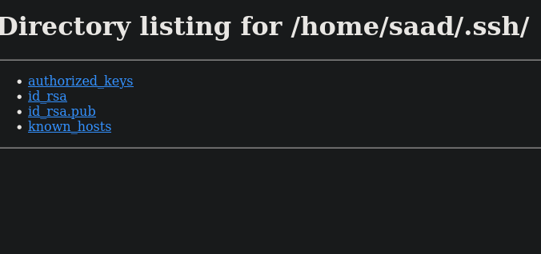

we got the id_rsa key for user saad to login into ssh 

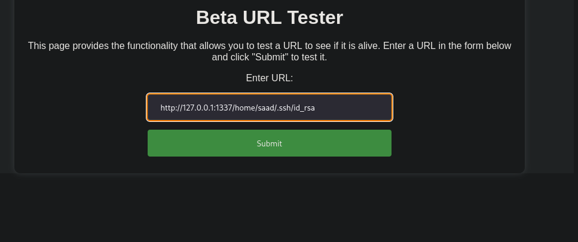

right click and click on view page source to see the key in structured format

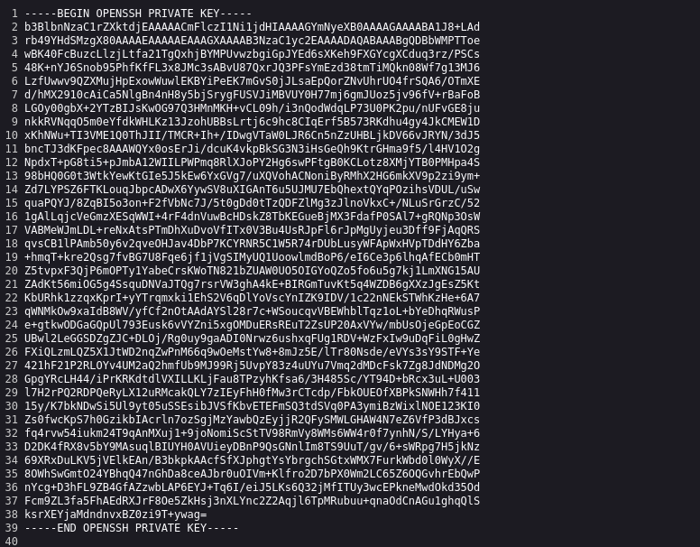

seems like the key is passphase protected , lets crack it 

convert the key into a hash format that john can understand 

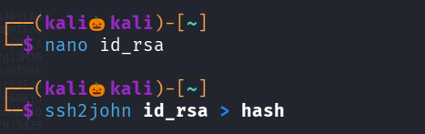

lets crack it using john 

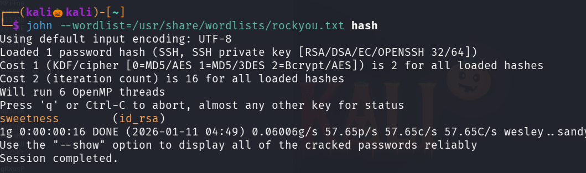

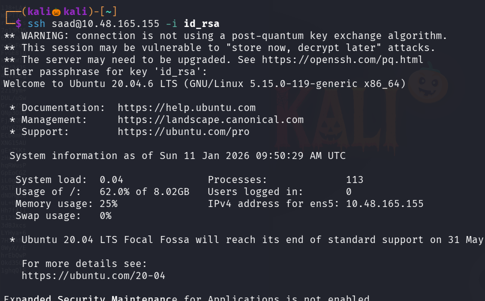

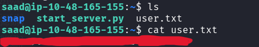

we successfully got the user flag 

as we dont know the password we cant able to run sudo -l 

while running command ls -la , noticed a file named .bash_history lets view it 

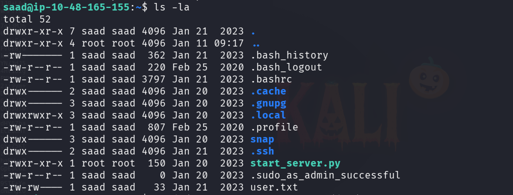

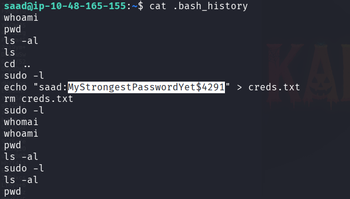

We got the saad password , now lets run sudo -l to see the what command user saad can run with root privilages 

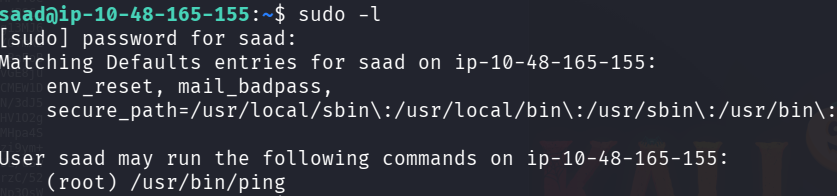

lets perform a LD_PRELOAD privilage esclation 

LD_PRELOAD is an environment variable in Linux

It tells the program:

Before you use your normal system libraries, load my library first.

lets write a c program in a file named exploit.c

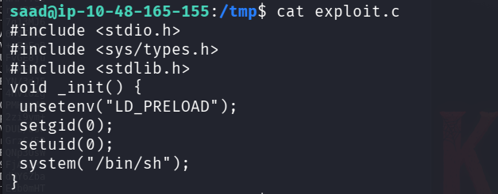

_init() --> runs automatically when a shared library is loaded

Removes LD_PRELOAD after loading

setgid(0)--> Changes group ID → root (0)

setuid(0)-->Changes user ID → root (0)

system("/bin/sh"); --> Spawns a  shell

lets complie the file 

-fPIC --> Position Independent Code required for shared libs

-nostartfiles --> No default startup code so _init() runs cleanly

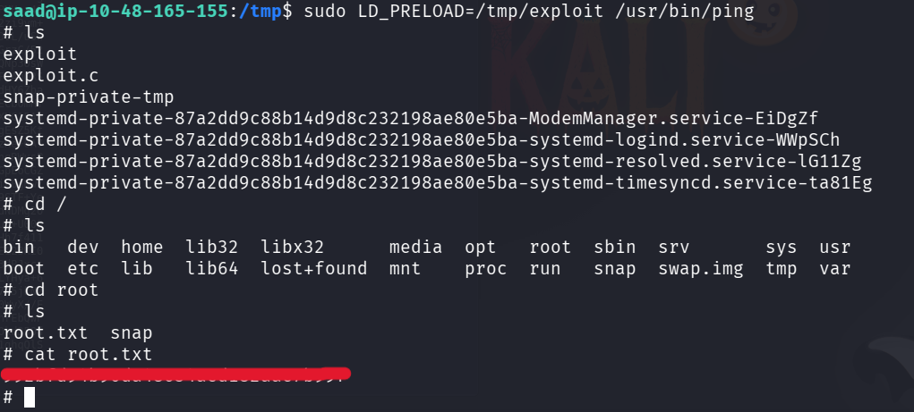

LD_PRELOAD=/tmp/exploit tells Linux: Load this library before anything else

and we successfully got the root flag

-----------------------------------------------------------------------THE END-------------------------------------------------------------------------

