# RECON 

Lets start with the Nmap full port scan on our target ip

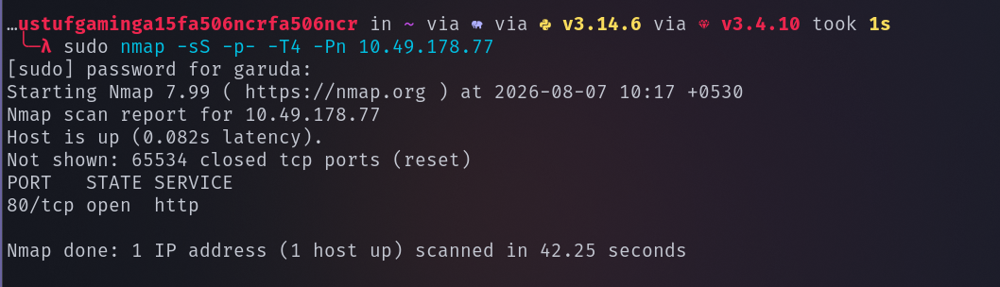

We found that only port 80 is open on our target machine , lets perform service version detection and default scan on it 

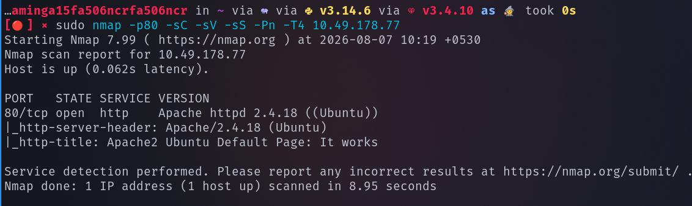

seems like apache has been hosted on port 80 , lets visit the site 

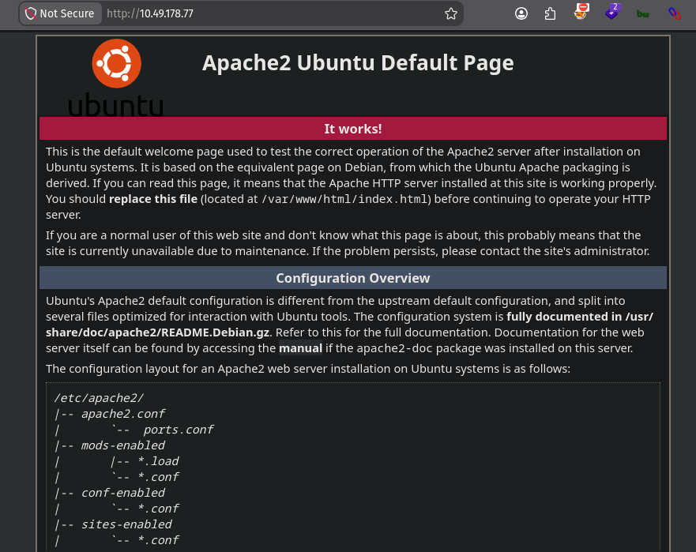

Lets enemurate web directories using gobuster 

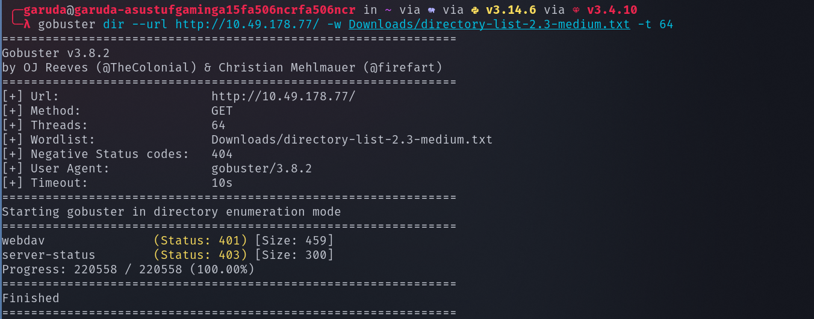 

we found a path /webdav 

while accessing /webdav in the apache site it asked for username and password 

so lets search for default username and password for webdav 

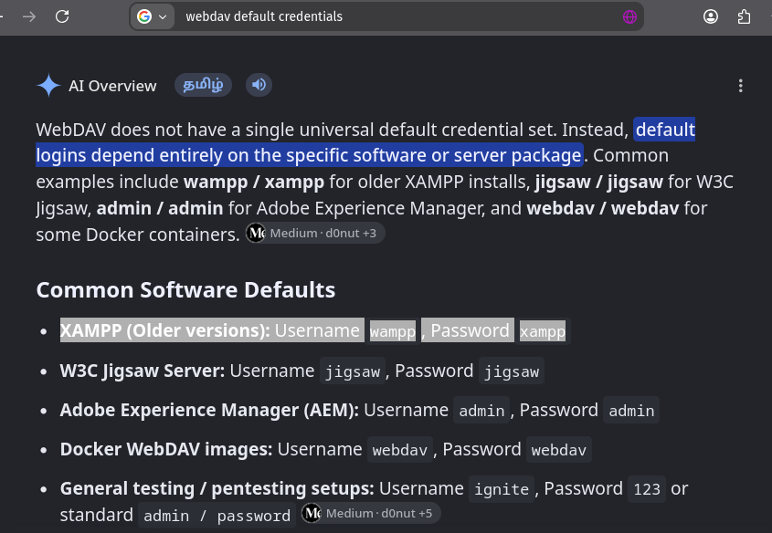

the default credentials wampp/xampp has worked 

## EXPLOITATION 

Lets use davtest tool to check which file extension we can upload and execute in the webdav 

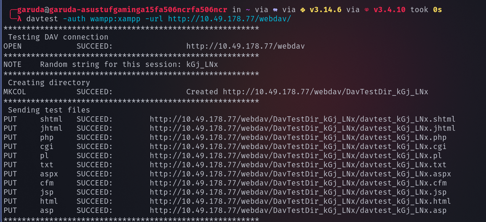

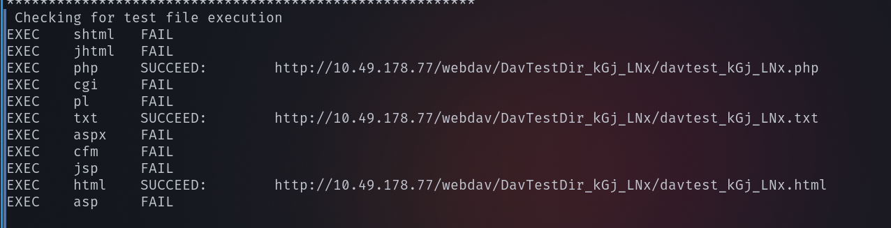

seems like we can successfully upload and execute the php files 

therefore lets upload the php-reverse-shell.php from pentest monkey , change the ip and port 

lets use cadaver to upload our php-reverse-shell.php in webdav 

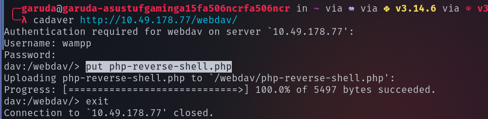

use nc to listen on the port we specified and access the php file we uploaded

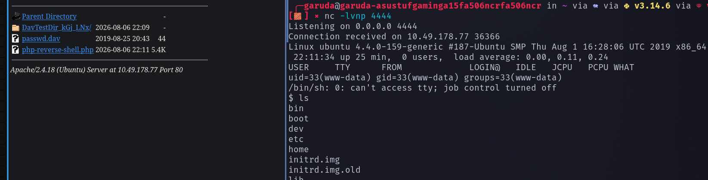

our php code got executed and we successfully got the reverse shell

in the home directory we found a user named merlin and inside the merlin directory found the user.txt file 

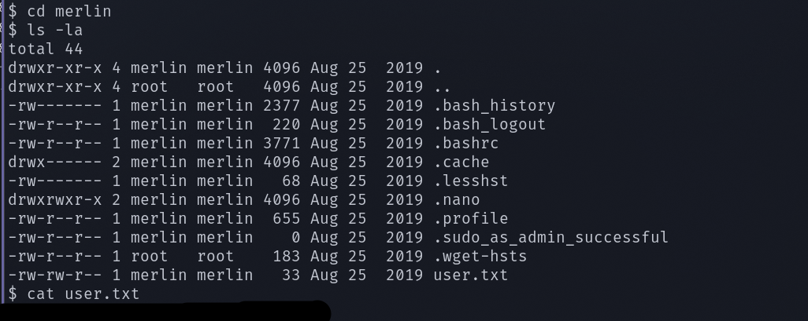

## PRIVILEGE ESCALATION

sudo -l --> command shows that what the current user can execute with root privileges 

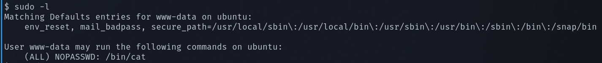

we can execute cat command with root privileges 

so lets view the root.txt file under root directory with cat command 

Successfully found the user flag and the root flag 

--------------------------------------------------THE END---------------------------------------

