## Lets start with a nmap scan 
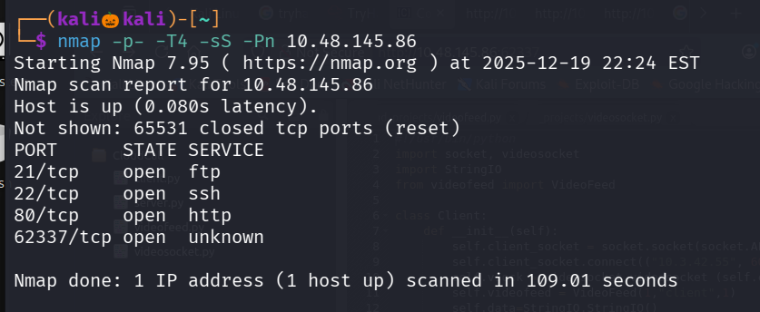

We found there are four open ports lets perform service detection scan and default script scan on these specific ports

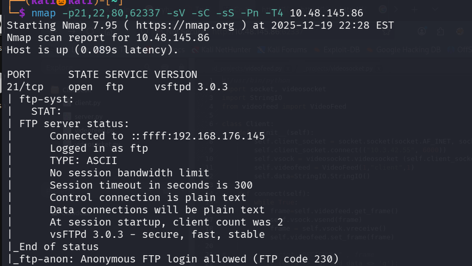
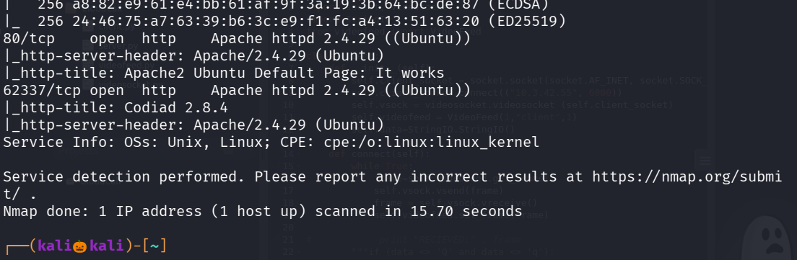

Lets use gobuster to enemurate the directories

we found no directories , there is a apache service http running on port  62337 lets check that 

it contains a login page and we dont have any credentials so lets try to enerumate directories using gobuster

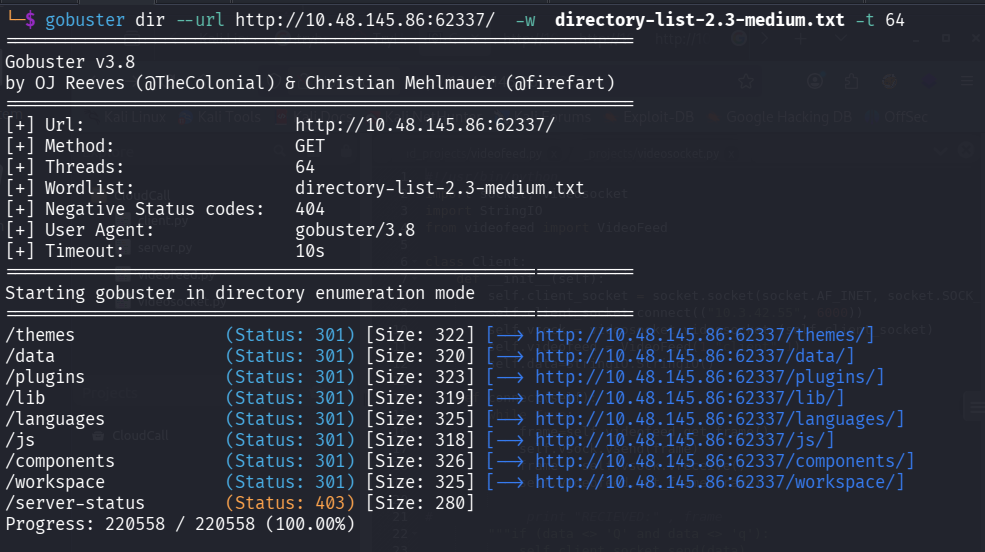

i gone through every urls that gobuster found but i didnt found any useful information , in namp scan i saw anonymous ftp login is allowed , lets try that

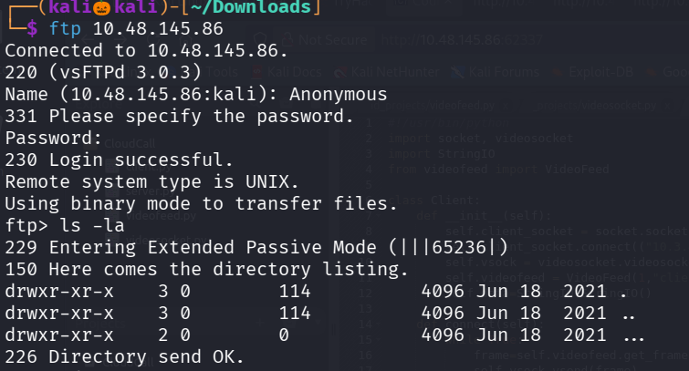

we succesfully loged in and we found a hidden file 

lets copy that to our system

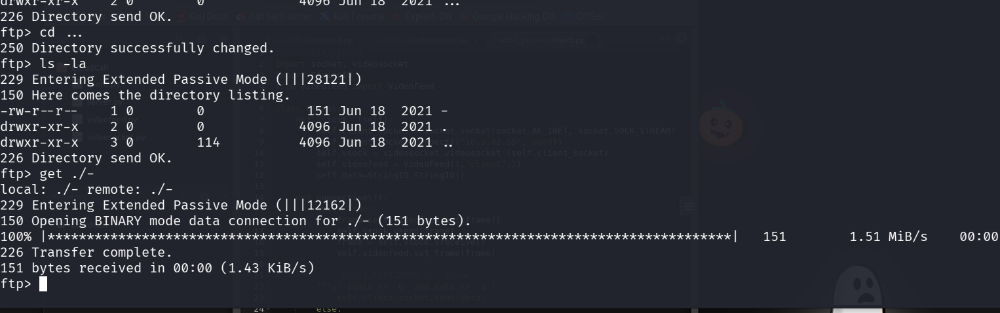

Lets see whats inside the file

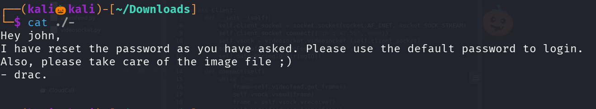

we found the username  : john 
lets use hydra to crack the password 

we successfully found the password : password

now lets login into the website with the found credentials

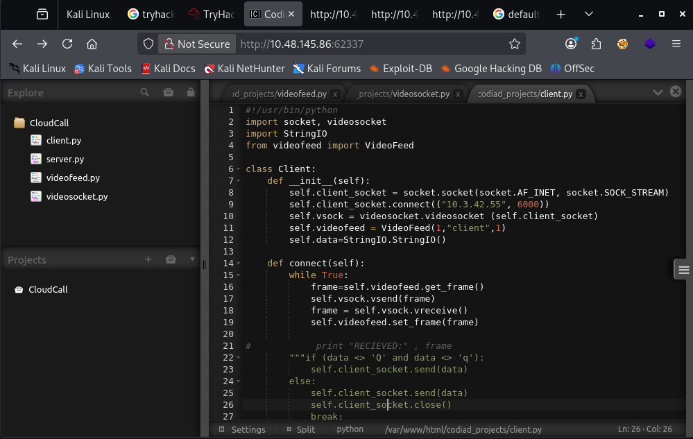

in nmap scan we found a ide framework codiad 2.8.4 

lets search for the exploit in searchsploit 

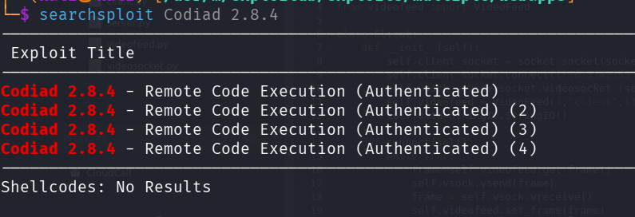

we found a exploit lets naviagte to that directory and type : python 49705.py -h to see the syntax

lets use the exploit also set up a netcat listener as shown in the python script 

we successfully got a reverse_shell 

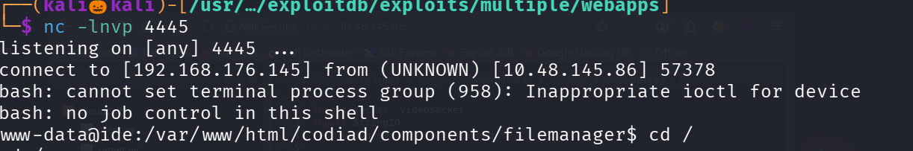

lets naviagte to home directory where there is a user drac 

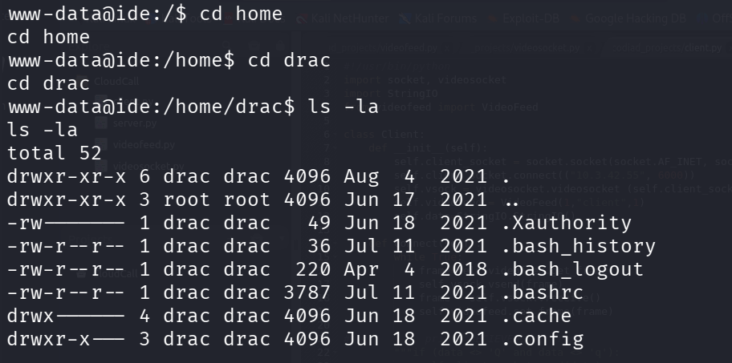

we cant file user.txt as an drac user without knowing his password 

try ls -la --> to list the hidden files

and in .bash_history.txt we found his password

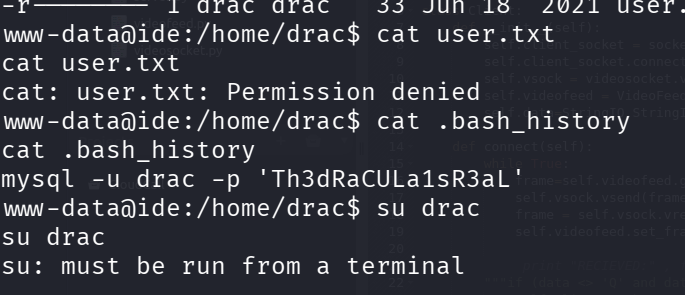

lets switch to tty terminal to upadte to drac user 

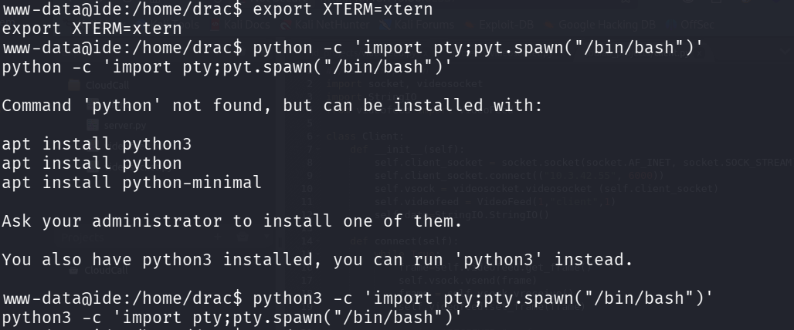

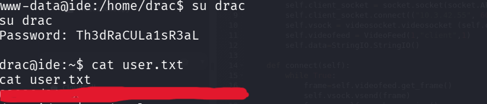

we succesfully found the user.txt

we know the username and password for drac lets try login with ssh 

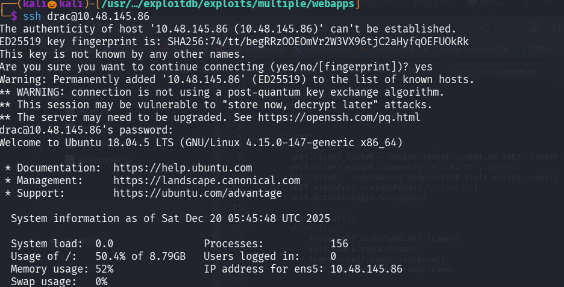

type : sudo -l 

to see what user drac can execute with root permission 

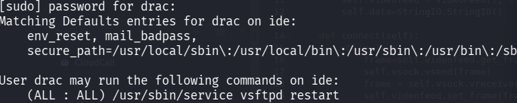

we found vstfpd restart service 
so if we insert a reverse shell in the vstfpd.service file and execute we gain a reverse shell with root privilage

use command : locate vstfpd.ervice to see the file location 

i used reverse shell generator to generator a reverse_shell

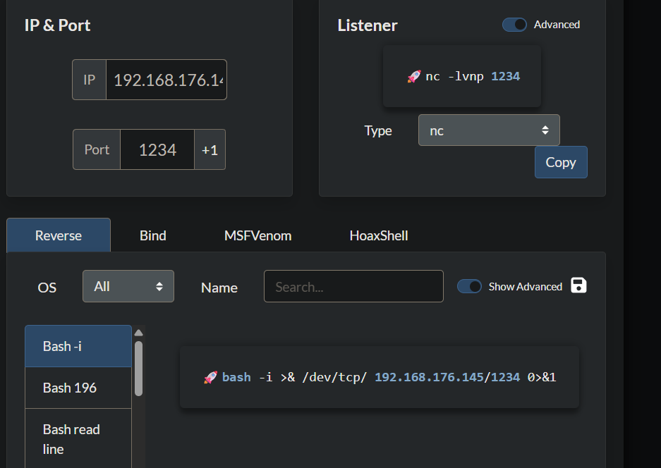  

change sh to bash since we are working on a bash shell

use nano vstfpd.service to edit the file 

in EXEC_START = /bin/bash -c <payload> 

save and exit

set up a netcat listener and execute the vsftpd restart service

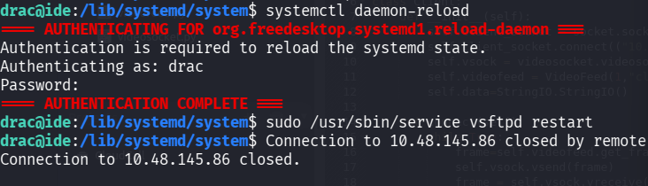

we got an connection in out netcat listener

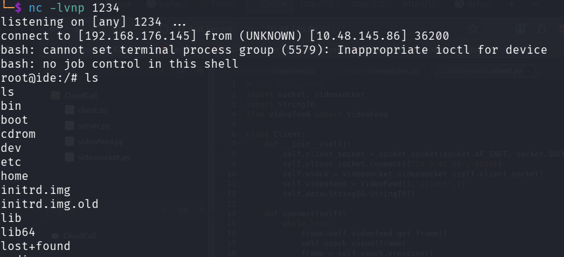

navigate to root directory and cat the root flag

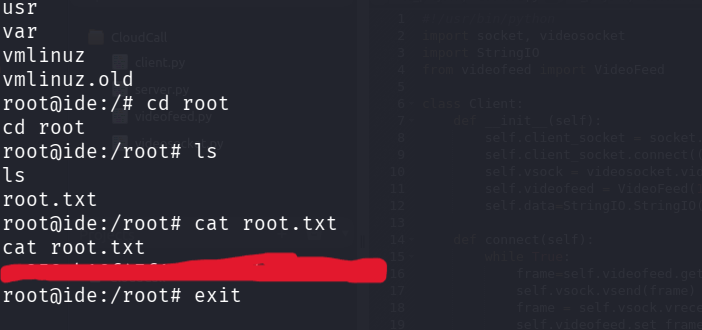

we succesfully found the root flag

-----------------------------------------------THE END--------------------------------------------------------------

