# RECON 

Lets perform Nmap full port scan to find the open ports in the target ip 

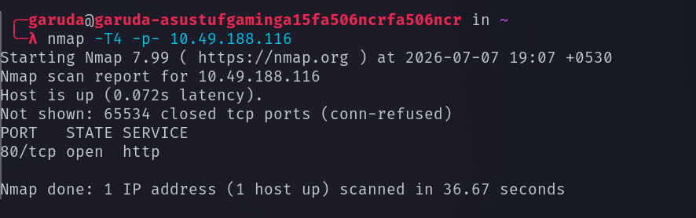

There is only one availabe service running http , lets perform service detection scan and default script scan on it 

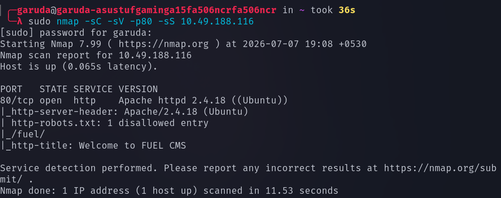 

From our Scan we found that the site is built with fuel cms 

lets access the site 

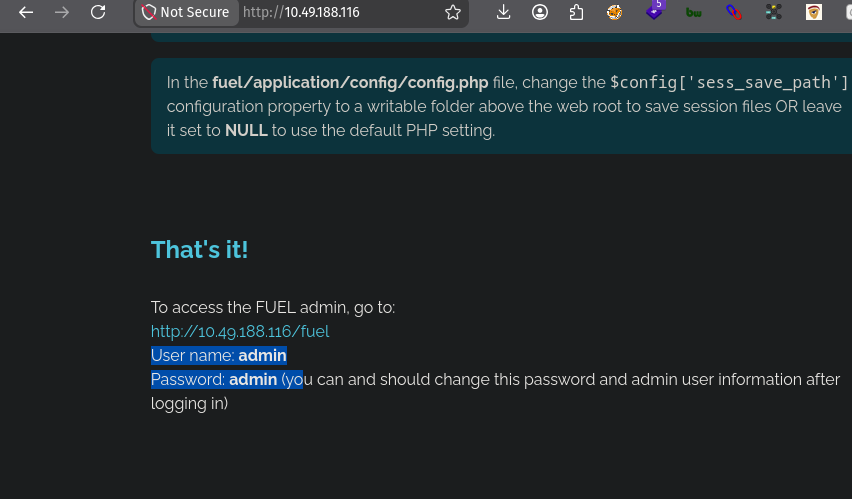

They have mentioned the username and password in order to login to their dashboard 

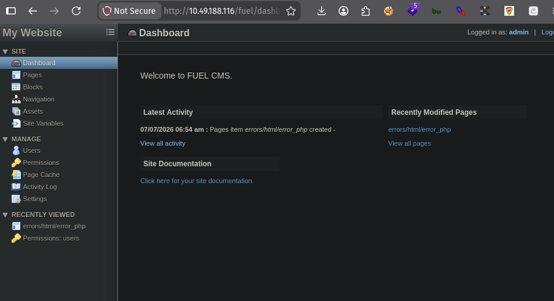

Since this site is built with fuel cms , lets search for fuel cms avialable  exploits 

# EXPLOITATION 

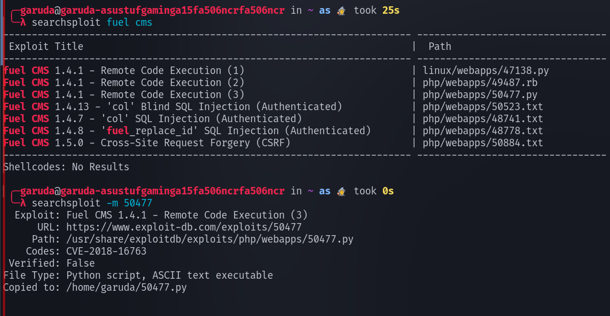

lets try this python exploit to perform a remote code execution 

command : python3 50477.py -u <url> 

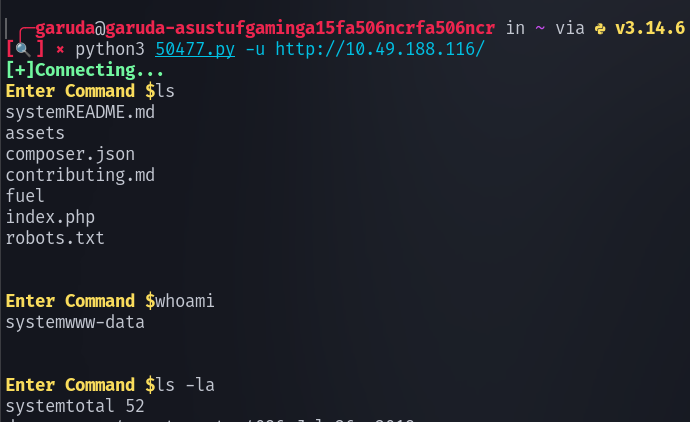

now we can successfully perform remote code execution , in order to obtain a reverse shell , generate a nc (net cat) reverse shell payload from reverse shell generator 

Make a nc listening in our terminal to capture the connection 

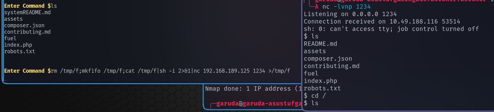

we successfully got the reverse shell , lets visits the /home/www-data in order to get the user flag 

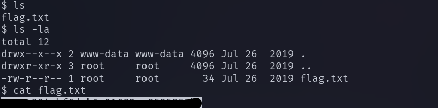 

# PRIVILAGE ESCLATION 

Lets visits the database file , searching for fuel cms defualt path for database file 

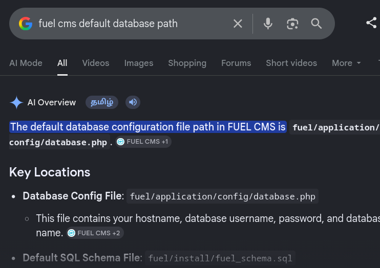

lets visits the database.php file 

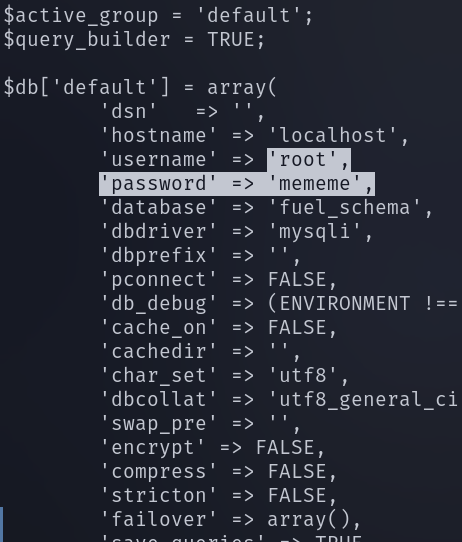

we got the root user password , lets switch to root user and visits the root flag in /root directory 

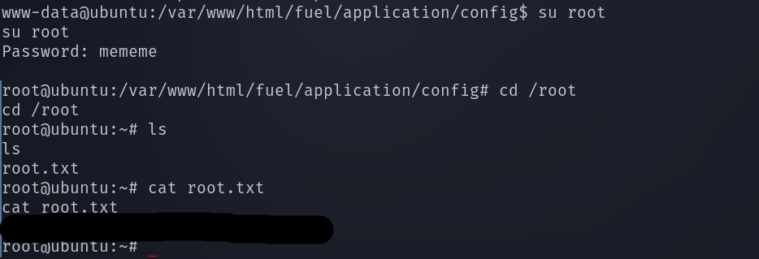 

--------------------------------------THE END---------------------------------------------

