## Lets start With an Namp Scan 

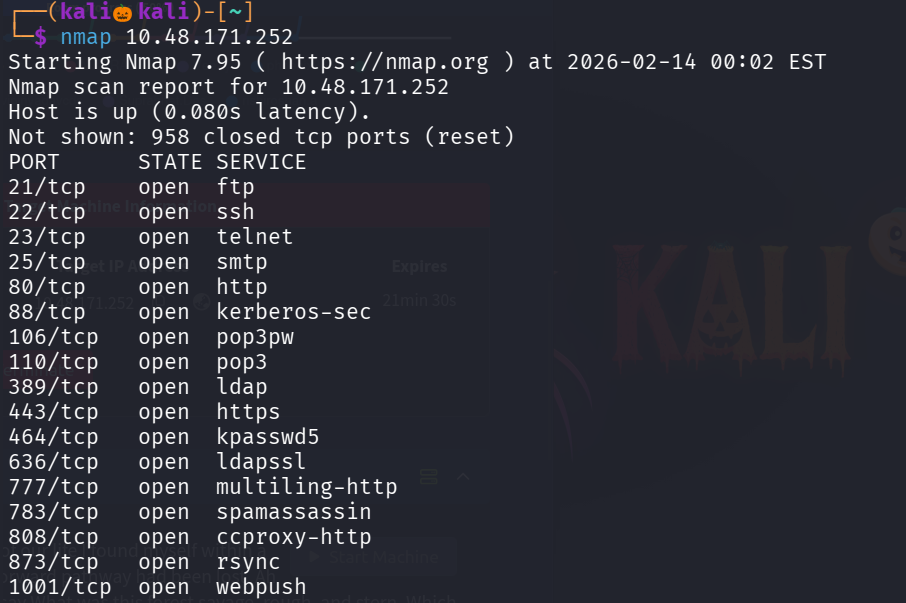
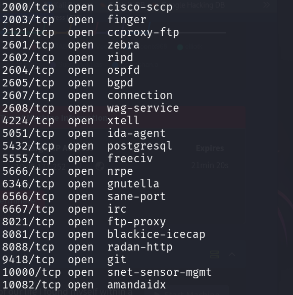

seems lime lot of ports are open , lets perform default nmap script scan and service detection scan 

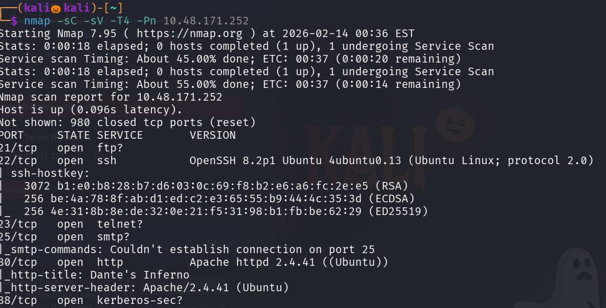
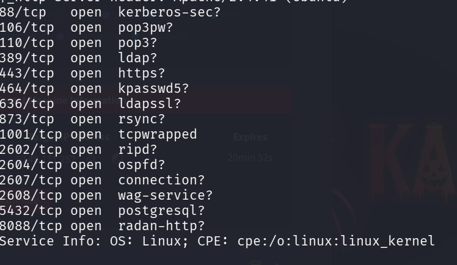

seems like only port 80 (http) and 22 (ssh) are functional 

lets use gobuster to enemurate the web directoires on the site running on port 80

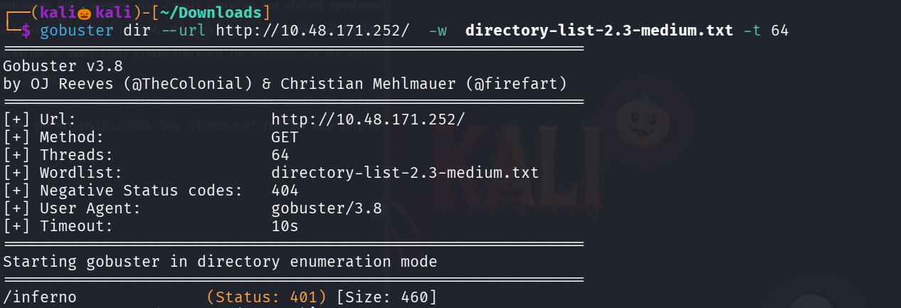

if we access the path /inferno it is asking for the login credentials to further proceed

i inspected the page and visited the souce code for any information disclosure but no juciy information is found 

tried defualt passwords but thats not worked well 

lets try deafult username as admin and use rockyou.txt as wordlist in hydra 

we successfully loged into the site 

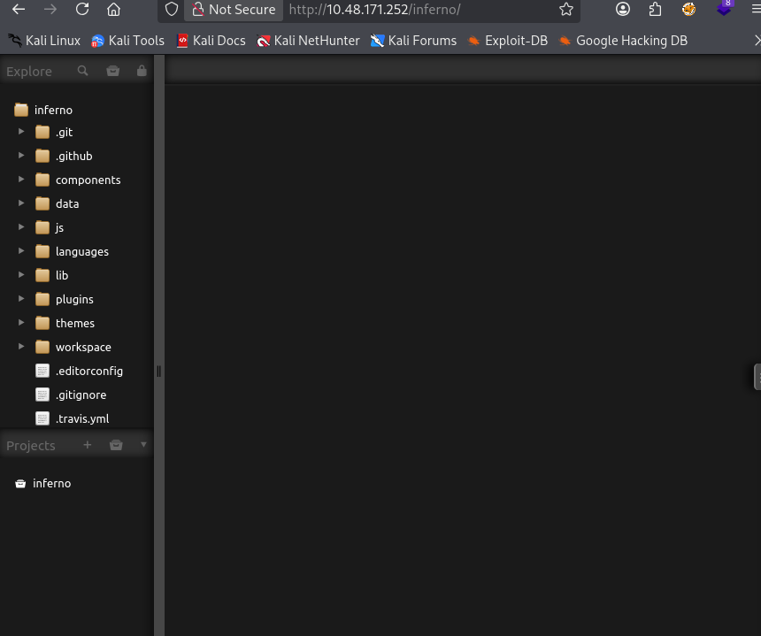

there are many php files i tried pasteing the php reverse shell code , but we cant able to save or modify the php file 

There is a file called README.md , lets see the contents of it 

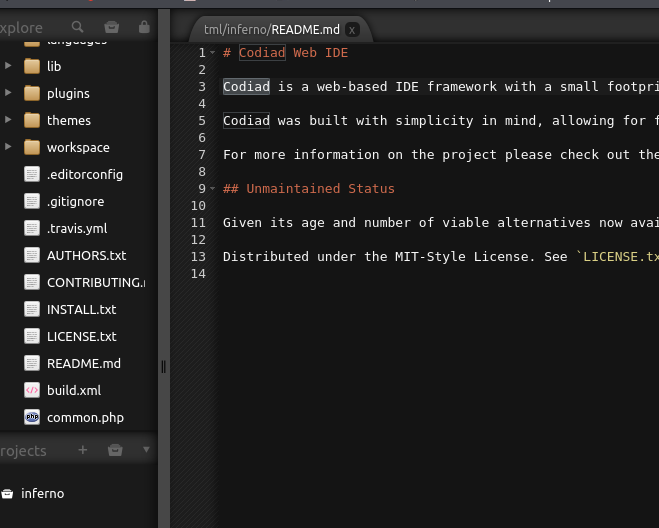

found that the site has been developed with Codiad 

lets search for the exploits available for Codiad 

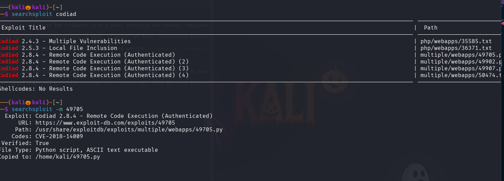

found one exploit , lets copy it and lets see the usage of it 

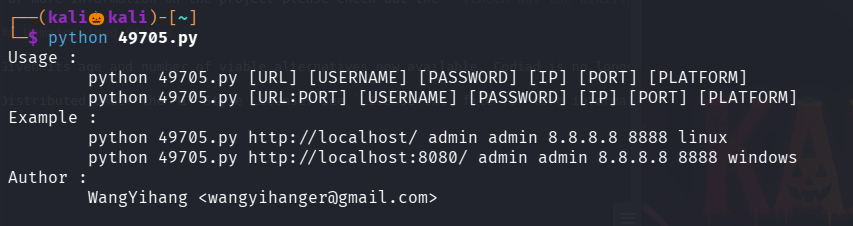

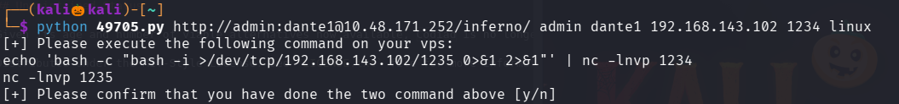

lets run the two commands in separate shell and further proceed with y 

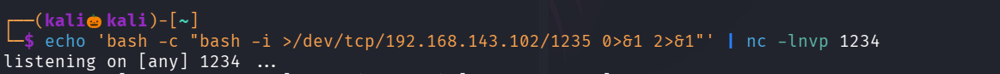

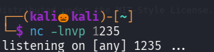

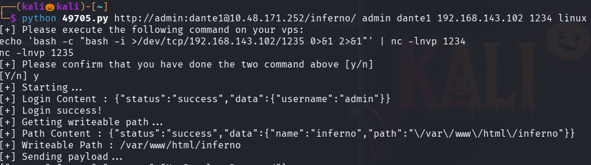

We successfully got the Reverse shell 

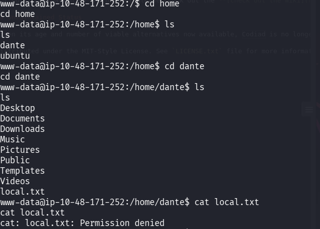

seems like we cant able to read the local.txt file 

while visiting others Directory , in Downloads Directory found a Intresting File 

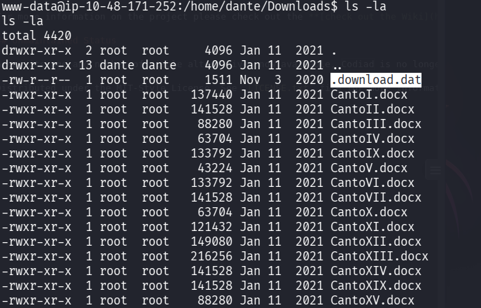

lets see the contents of it 

seems like the value are in the hexa decimal format , lets use cyber chef to dcode it 

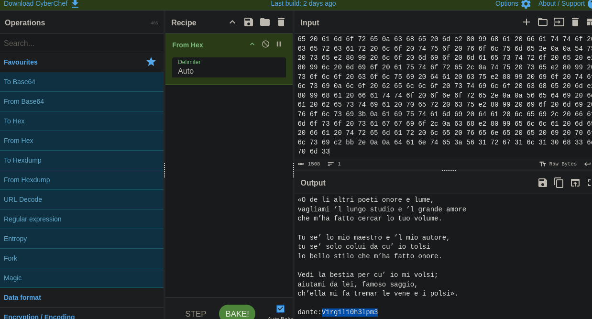

at last it seems like the it is shown the username and password , lets try that credentials over ssh 

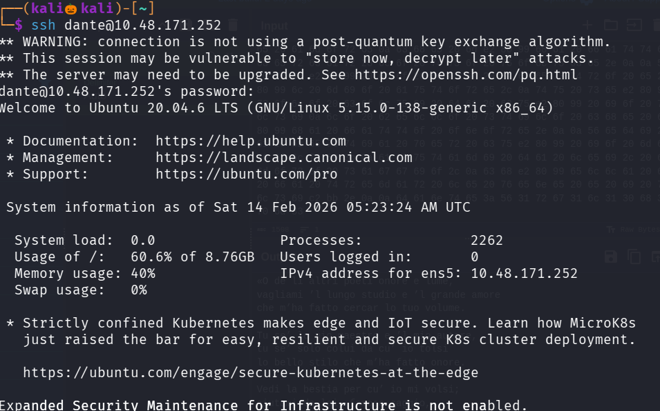

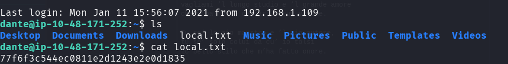

We successfully got our first flag , lets esclate our privilage to find the second our 

use command : sudo -l 

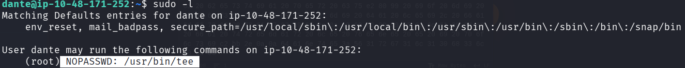

found that user can run tee command without any root permission

lets use gtfo bins 

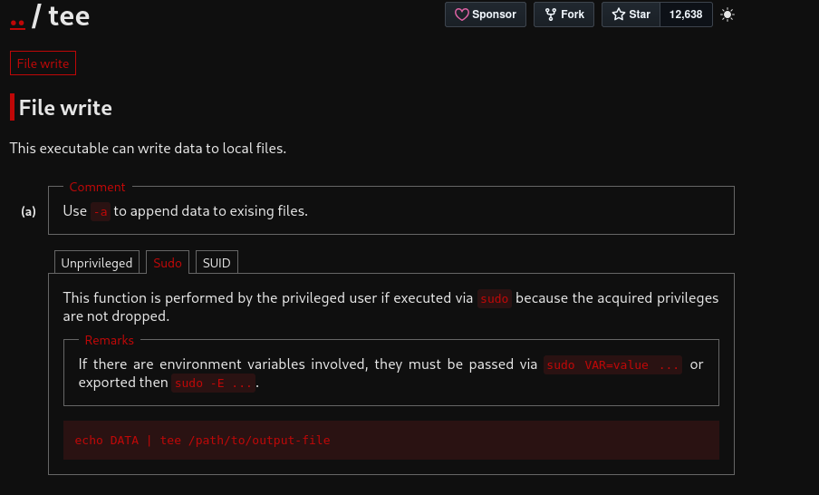

seems like we can modify any files with this , lets modify the sudoers file and give dante all permission 

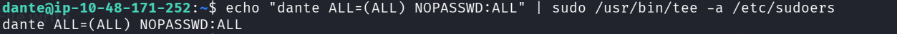

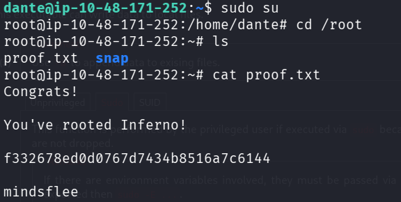

We successfully found our second flag 

------------------------------------------THE END--------------------------------------------------------

