## Lets Start With an Nmap Scan

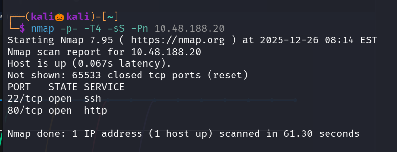

We found only two open ports , lets perform service version detection and default script scan

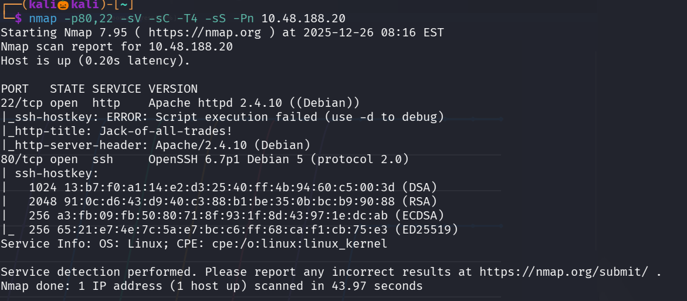

Here ssh runs on port 80 and http runs on port 22

in order to visits the webiste runnig on port 22 , update the firefox file network.security.ports.banned.override  to 22 in about:config

Lets visit the website

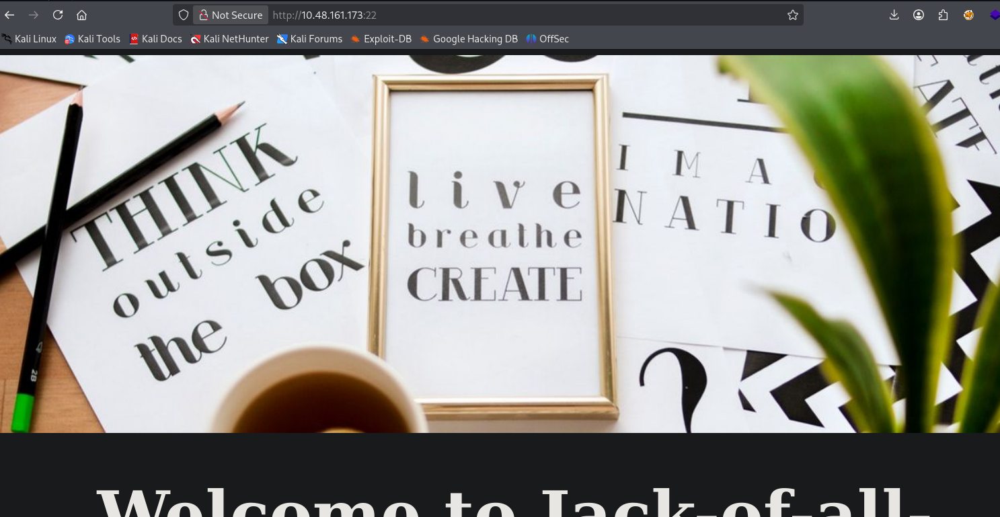

While inspecting the page we got an base 64 encoded strings and also a url /recovery.php

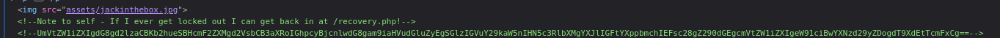

Lets decrypt it

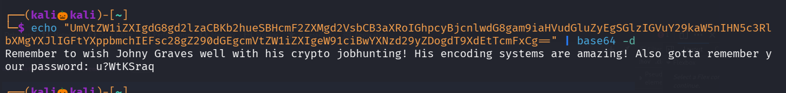

we found the password 

Lets use gobuster to find hidden web directoires

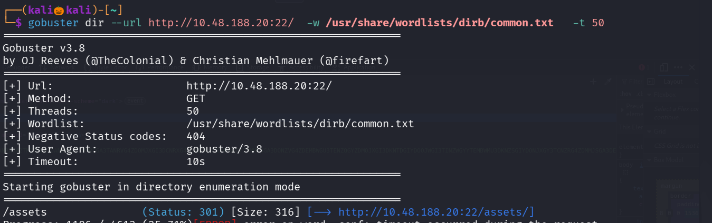

We found only /assests which contains only the images on the site 

Lets go to recovery.php , it contains a login page while inspecting it , we can see a encoded string , 

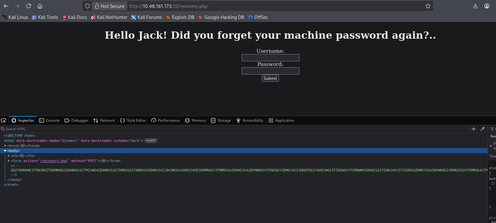

Lets decode it using cyberchef 

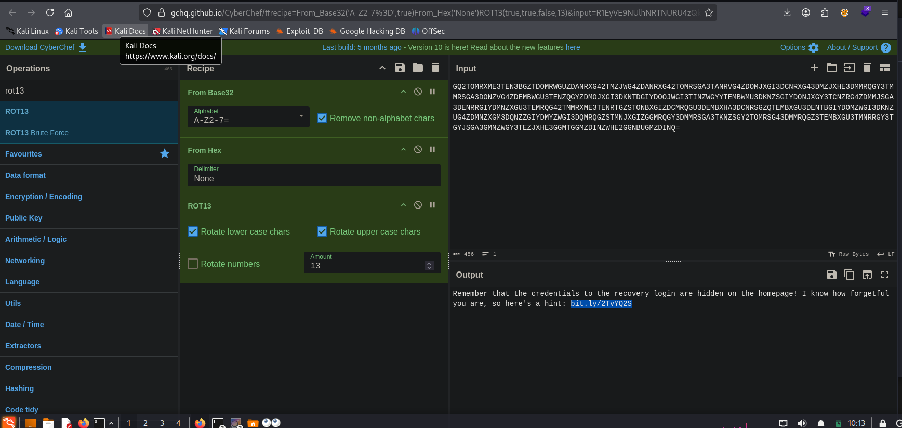

When i click on magic icon in cyber chef it automatically decode the string with base32 and hex and i got an unreadable string so i tried rot13 and we got an hint , lets see that url

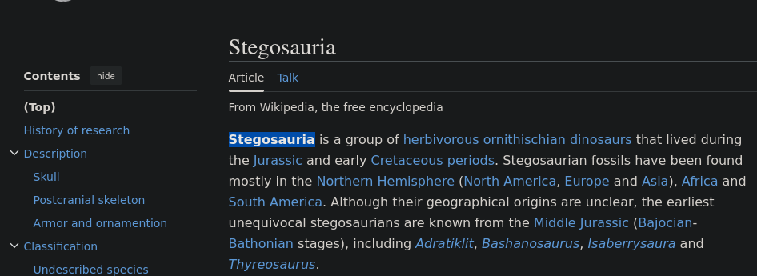

This reminds me the dino image in the webiste 

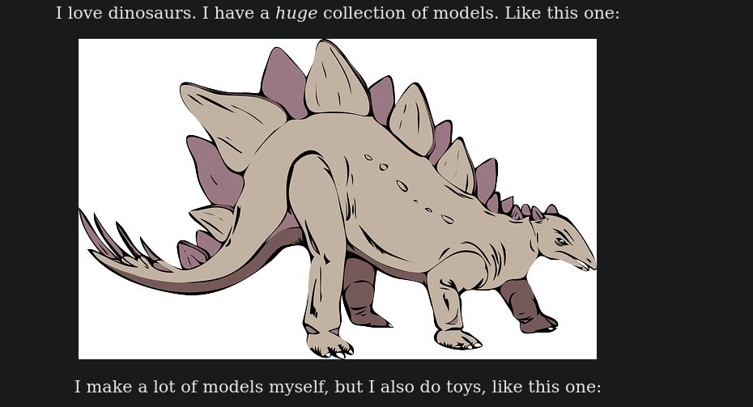

Lets go to assests folder and download the file 

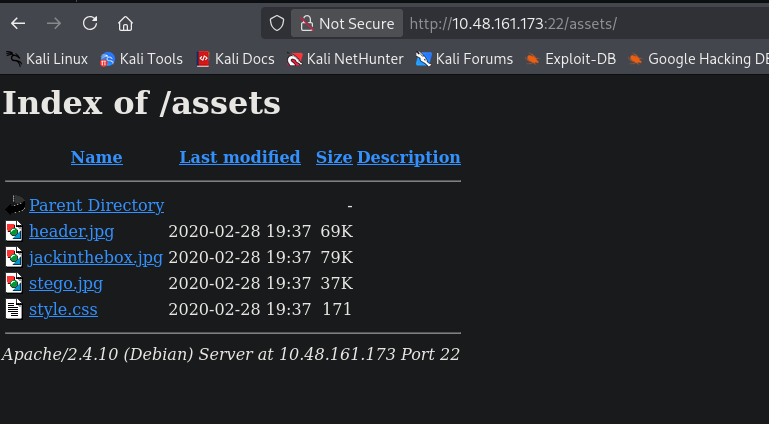

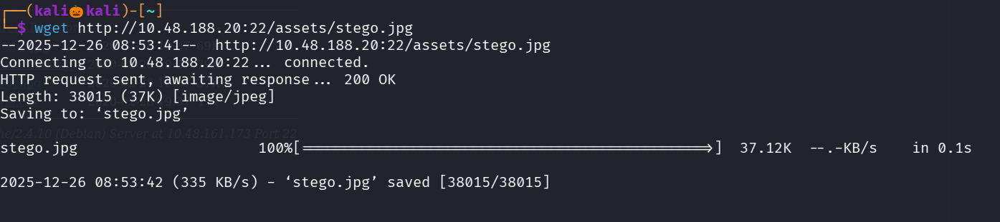

i used stegseek to find a valid passphase , but it cant able to find 

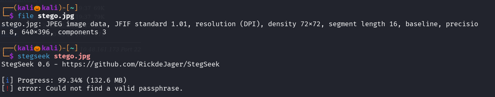

Then i remebered we got a password lets use that 

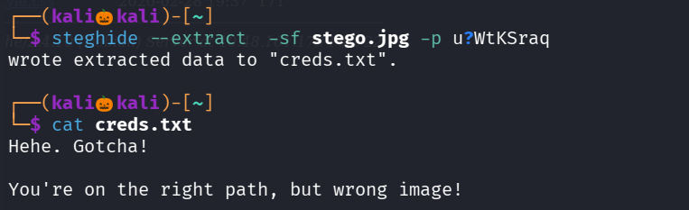

We are in the wrong image lets try another two image , i tried jackinthebox but it is also a wrong image , so lets try header.jpg

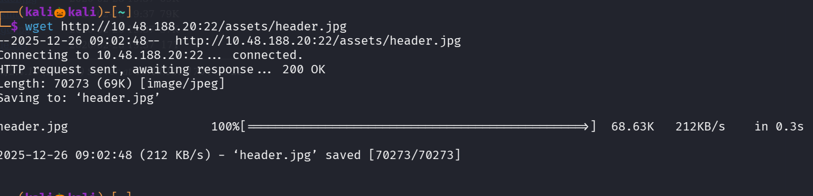

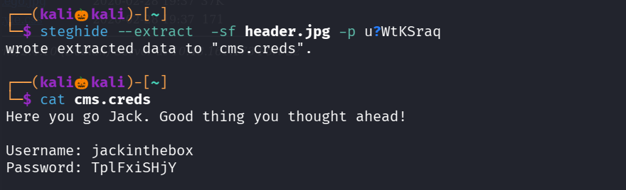

We found the username and password , lets login 

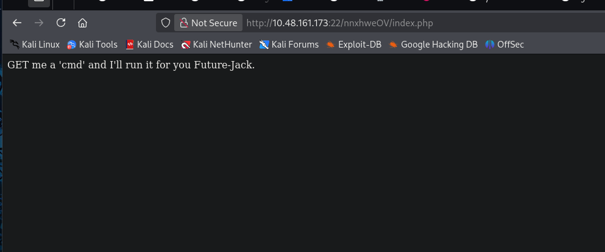

Seems like with ?cmd=  we can execute commands

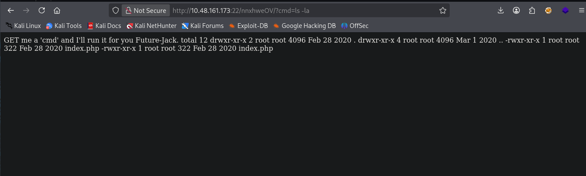

Lets create  a nc reverse shell i used reverse shell generator ,so set up a nc listener

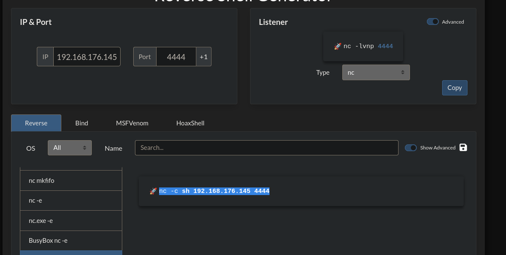

execute the command

We got the reverse shell

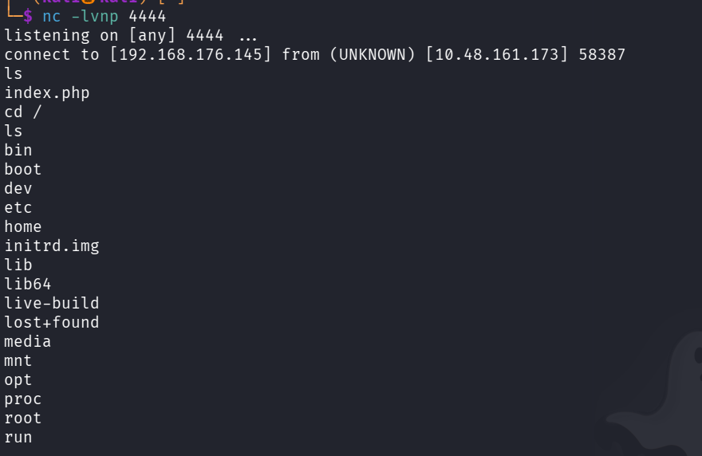

i naviagte to home folder where i see a file jack_password_list

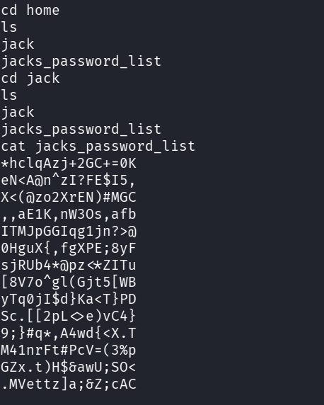

Lets copy the passwords in the file and try to brute force over ssh running on port 80 with hydra

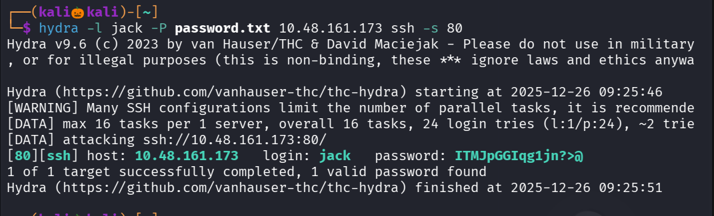

we successfully found the password , lets login into ssh

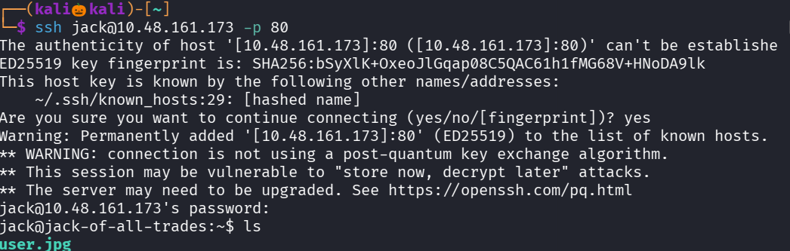

i saw a file called user.jpg , lets copy it to our system

run a python server

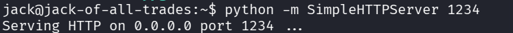

using wget lets get the file user.jgp

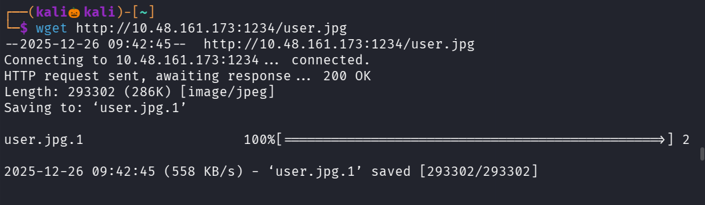

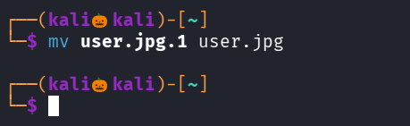

Lets view the image

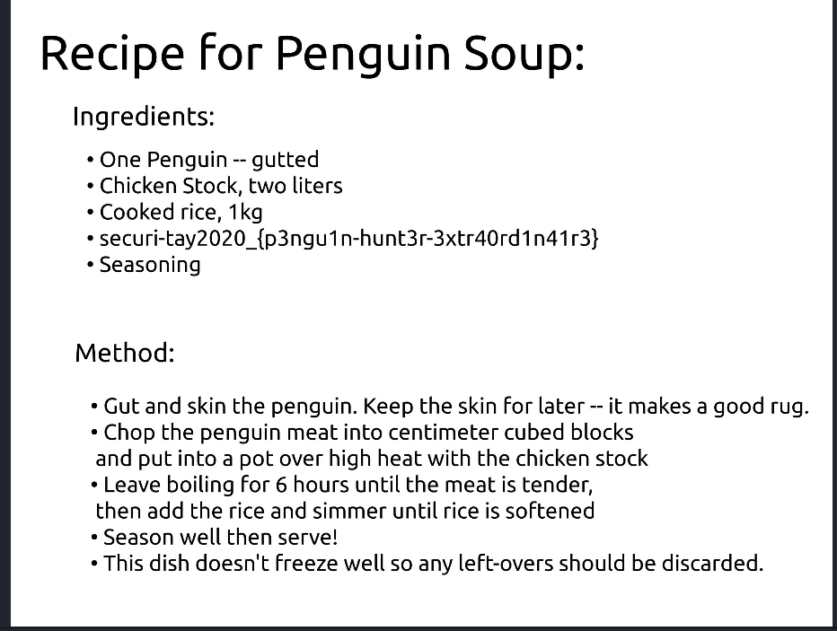

We successfully got the user flag

Lets esclate our privilage to get the root flag

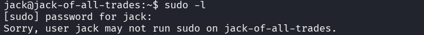

seems user jack cannot run sudo on this machine 

i tried visting crontab but no juicy information is found 

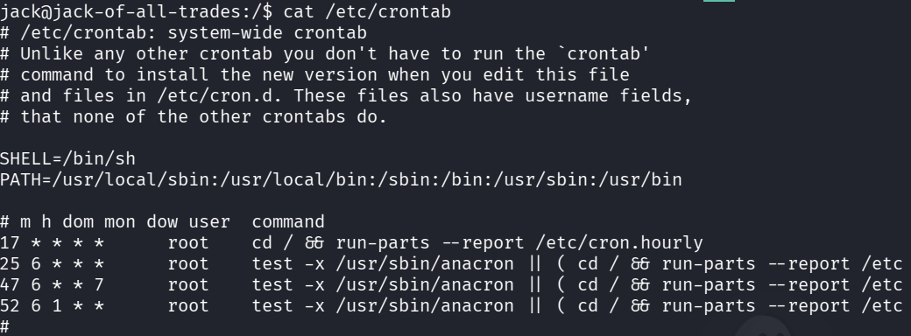

Lets check for files with suid permission 

suid --> if the file has suid permission normal user can execute it with root privilage

4000 --> represents file with suid permission

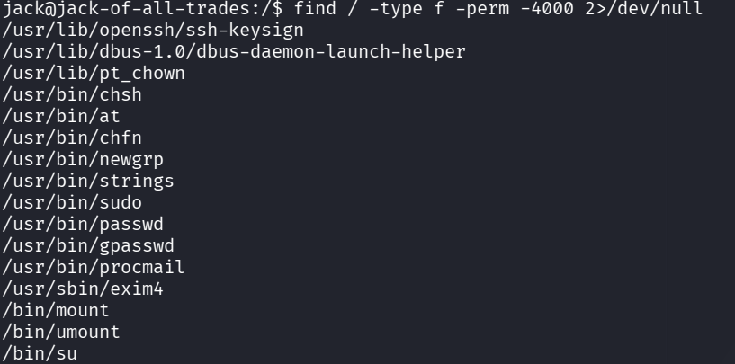

We found that strings command has suid permission , lets use to read the root.txt file in the root directory

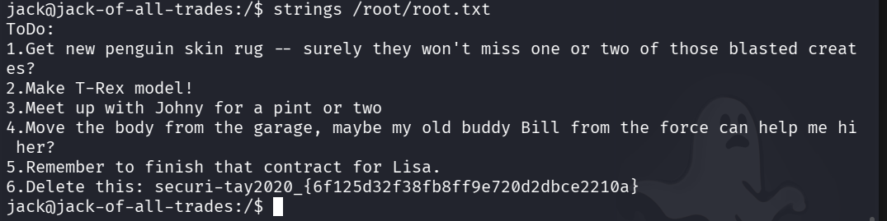

We successfully found the root flag

---------------------------------------------------------THE END------------------------------------------------------

