STEP 1 : Lets start with an nmap scan on the targer_ip

in this we see there are two open ports http and ssh 

now lets use gobuster to enerumerate web directories 

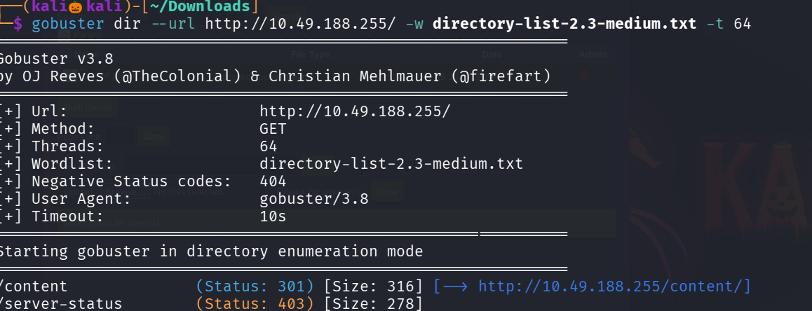

we discover a directory named content , lets find the directories that are in contents 

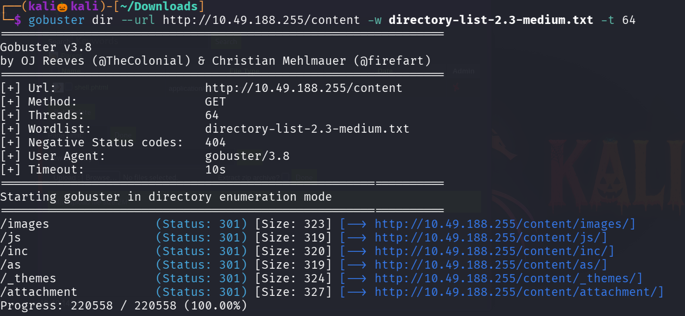

we found many directory as going through all directorys i found a file called mysql_backup 
lets download and view that file 

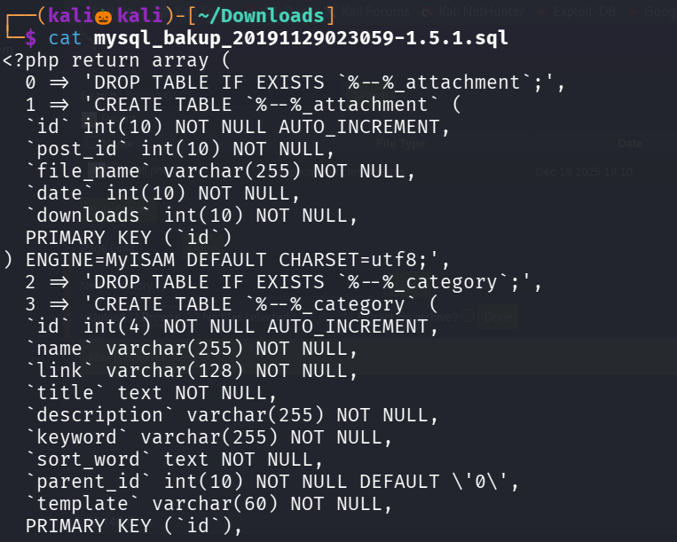

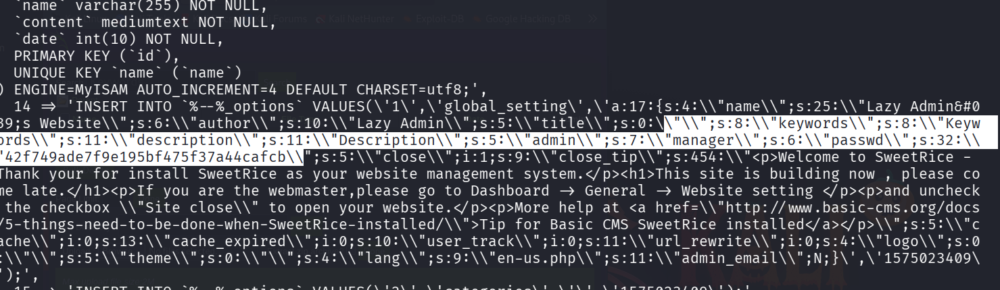

we found as username as manager and the passowrd is in hashed format lets crack it using crackstation

we found the passowrd of the hash as going through the directories we found in gobuster in /as path there is a login page lets try login with our found credentials 

.png)

as we succesfully loged in , i found a section where we can upload files so lets download a php reverse shell from github pentest monkey 

change the value of the ip to our machine and chnage the file format to .phtml to avoid detection 

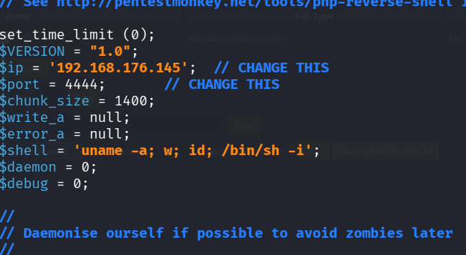

start the netcat listener  command : nc -lvnp 4444  
now lets upload the file 

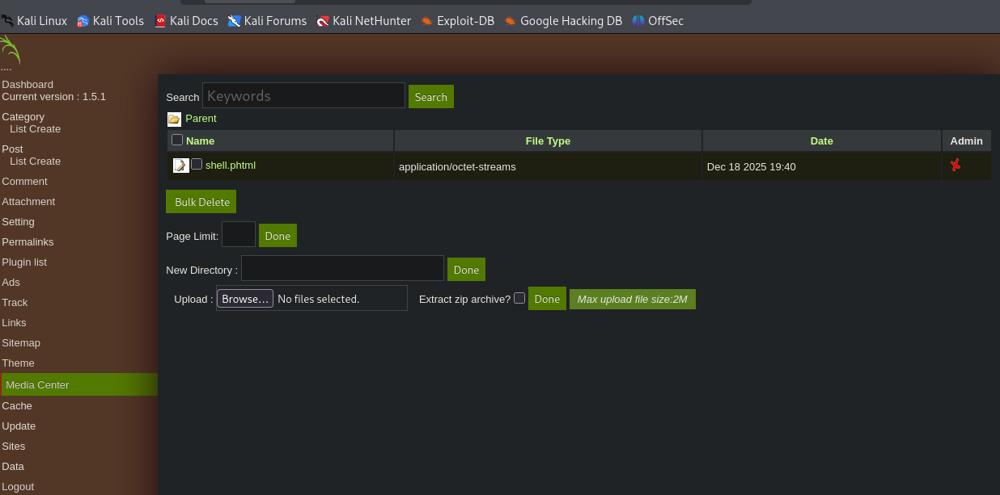

click on the file to get the reverse shell

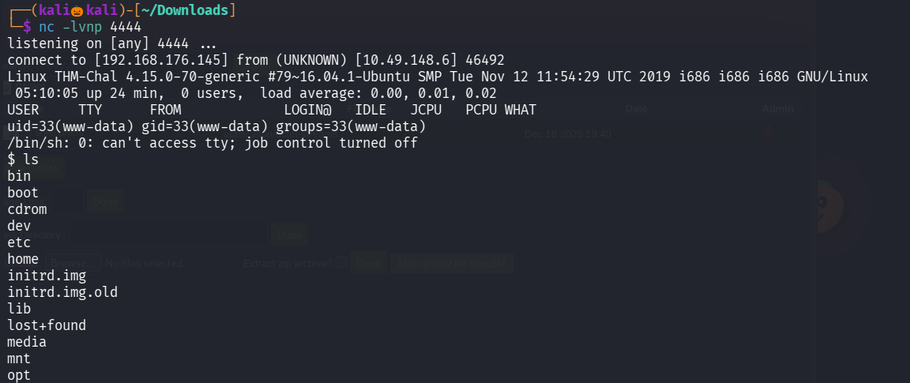

type : python -c 'import pty; pty.spawn("/bin/bash");   or /bin/bash -i to spawn a bash shell 

lets navgate to /home/itguy folder and read the user.txt to get the first flag

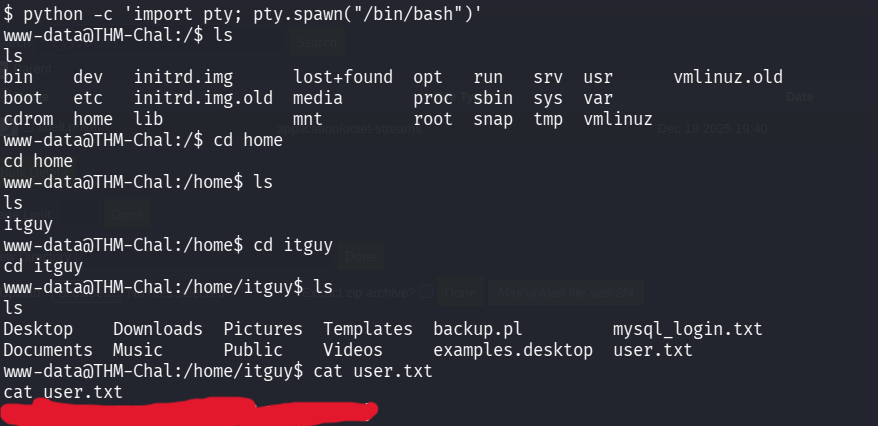

lets esclate our privilage

type command : sudo -l to  see what the current user can execute without the root permission 

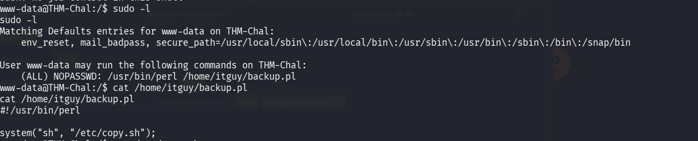

we can that the current user can execute backup.pl file lets cat that file and we found that it is execute another file named copy.sh 

lets cat copy.sh file 
in that we can see that it is executuing a nc command lets change the ip value to our machine and start the nc listener in new terminal  on port 5554

execute the file 

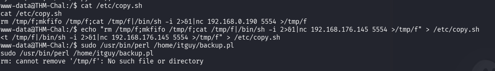

we succesfully got the shell with root privilage 

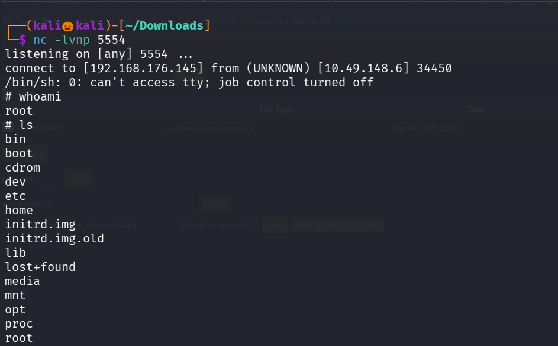

navigate to root directory and cat the root.txt to get the second flag

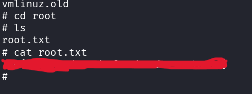

We succesfully found our second flag

---------------------------------------------------THE END-----------------------------------------------------

 
