## Lets start with a nmap scan 

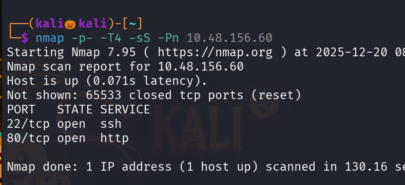

we found only two ports are open ssh and http lets perform service detection scan and default script scan 

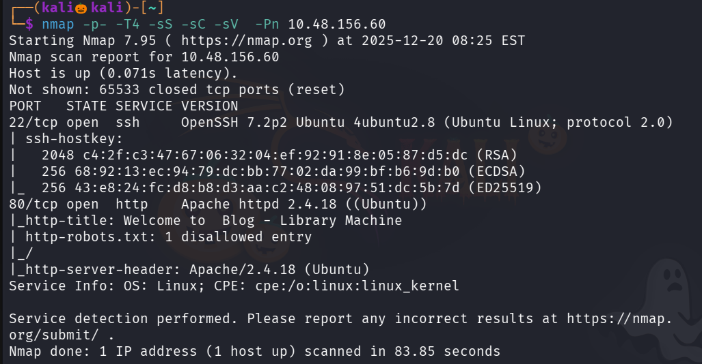

There is a site hosted on port 80

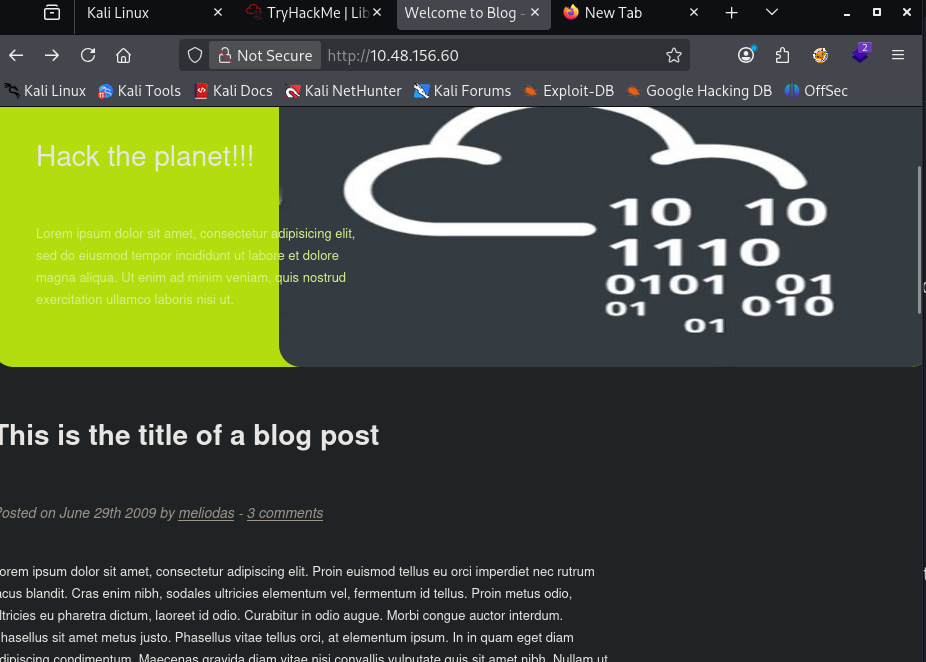

Lets vists robots.txt in that there a hint rockyou  might have been refering to the wordlists rockyou.txt

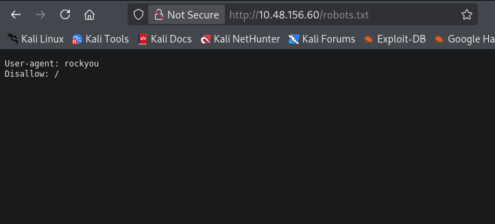

lets use gobuster to find for directories and found one /images

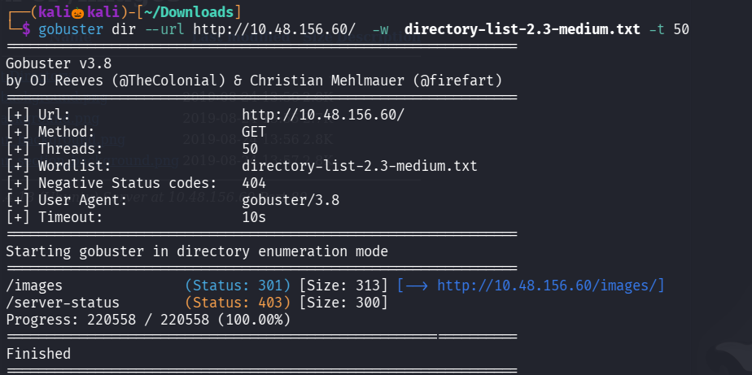

i downloaded images in the images folder and checked using stegseek and exiftool but no juicy information found 

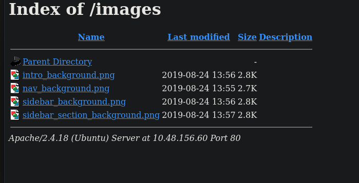

Then i looked up into the main site their i found a username meliodas

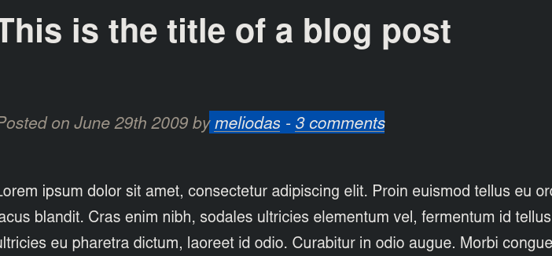

we already have a hint rockyou.txt lets try ssh brute force using hydra with username meliodas and password wordlists rockyou.txt

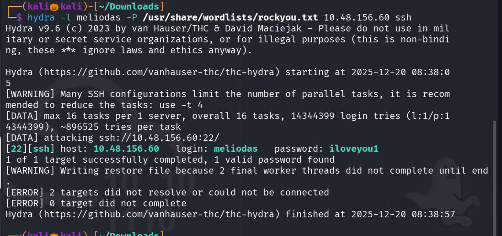

we succesffuly found the password lets login with ssh and cat the user.txt for the first flag

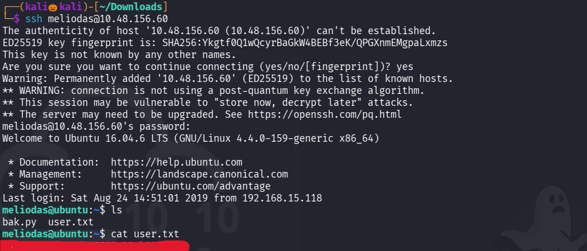

we want to esclate our privilage in order to get the second flag

so execute command : sudo -l  

to see what the current user can execute with root permission

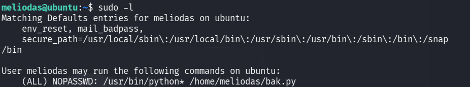

we found a file bak.py which user can execute with sudo

so lets remove bak.py 

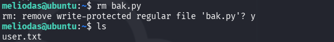

Now lets a new file bak.py 

and give the command inside the file : 'import pty;pty.spawn("/bin/bash")'

using nano or echo to spawn a pty shell with root privilage

lets run the file with python command and we got the root privilage , navigate to root directory and cat the root.txt to view the flag

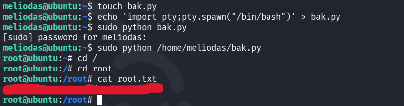

we succesfully found the second flag

-----------------------------------THE END--------------------------------------

