## Lets start with an nmap scan 

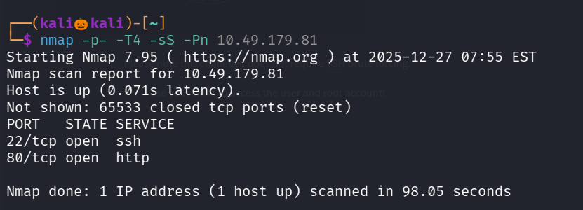

We found that there are two open ports , Lets perform service version detection scan and default script scan on them

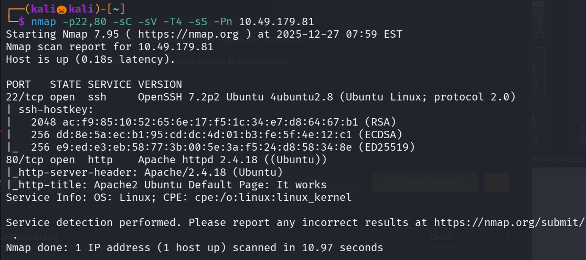

Lets visit the website running on port 80

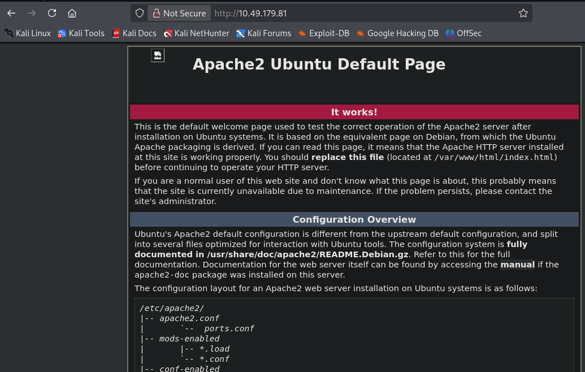

Lets use gobuster to find the web directories

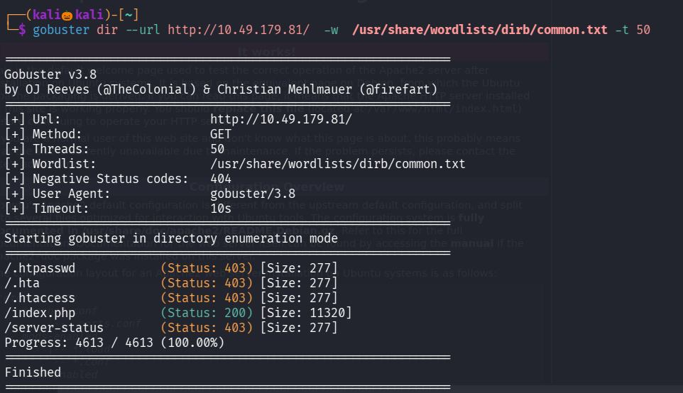

We found no directories , lets view the source code of the page for any information disclosure

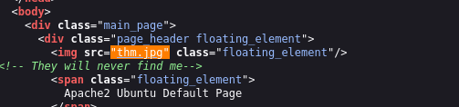

We found a jpg file lets try to open it 

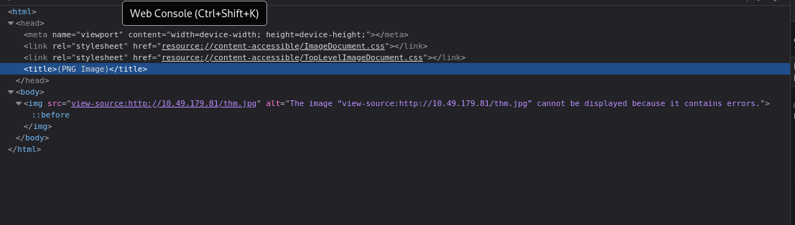

In head if we see , it is mentioned as png image , and also we have a hint thm.jpg contains some error

Lets use curl to get the image to our system

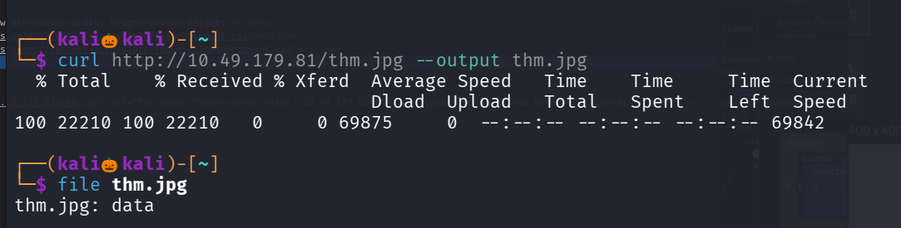

when i use file command , it is showing data instead of JPEG 
so i imported the image in hex editor and the magic headers are in png format , lets change it to jpg and download the image

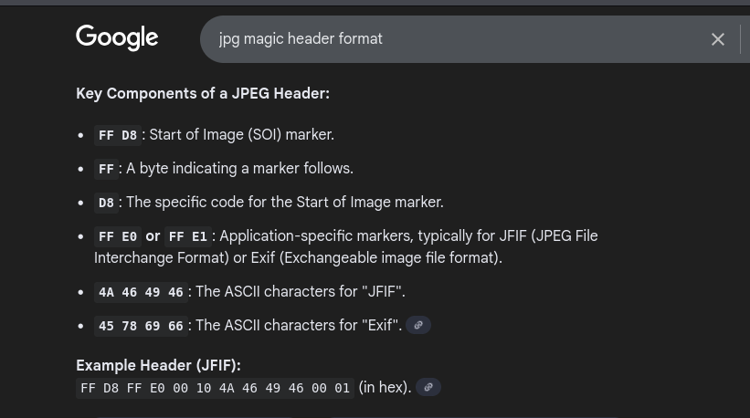

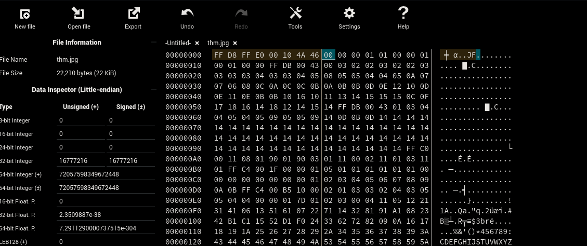

When i visited the image i found a hidden directory

Lets naviagte to that hidden url

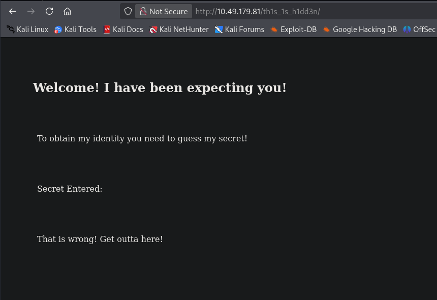

We have to find the secret to further continue , lets inspect the page

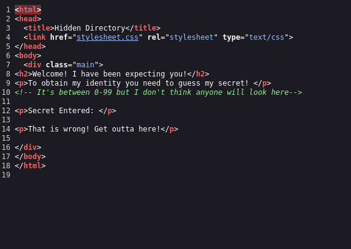

We found that the secret code is in between 0 to 99

i embedded ?secret=1 in the url and noticed it is reflected in the page 

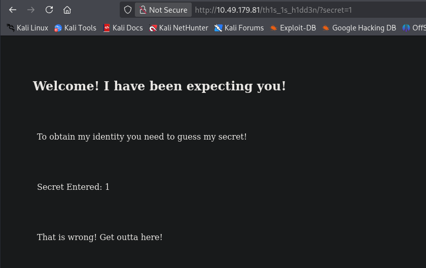

Lets capture the requets in burp and forward it to intruder , lets try 0 to 100 and notice the content length , if we see a change that must be the secret code

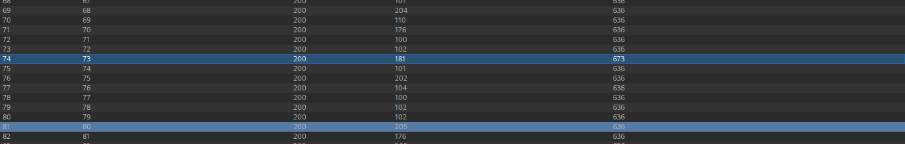

There is a change in content length in code 73 , go to response and click on render 

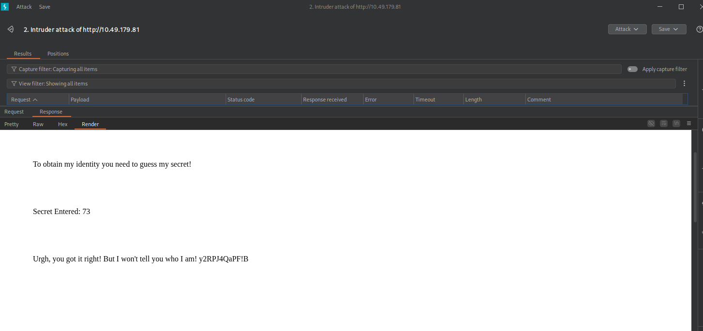

i thought this would be the ssh password and tried to brute force the username with hydra , but it didnt work

Then remebered about the jpg file lets use this as a passphase and try to retrive any information

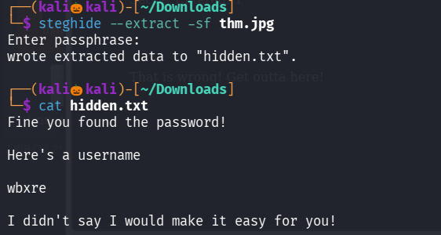

We found the username , but we dont know the password 

i tried to use gobuster to find a web directories with .png, .jgp, .png , .txt extension but none of them worked 

Then in tryhackme page found this image 

Lets download this image and see if this contains any information

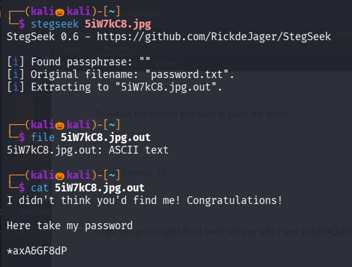

we succesfully found the password

Lets try to login with ssh 

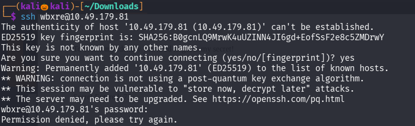

It didnt login , i think the username has to be encoded with some ciphers , lets first try rot13

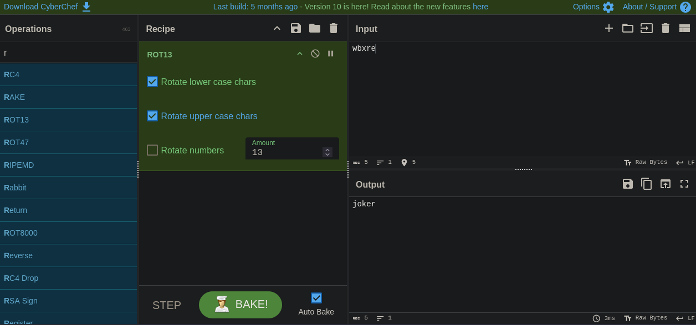

We found the username , it has been encoded with rot13 

Now lets login with ssh

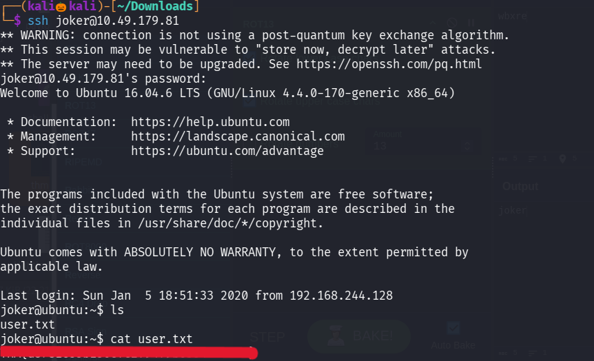

We successfully found the user flag

Lets esclate our privilage to see the root flag

tried command : sudo -l 

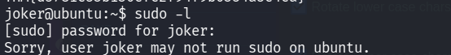

but the current user cant run sudo on this machine 

I also visited crontab but no juicy information is found 

So lets look for files with suid permission

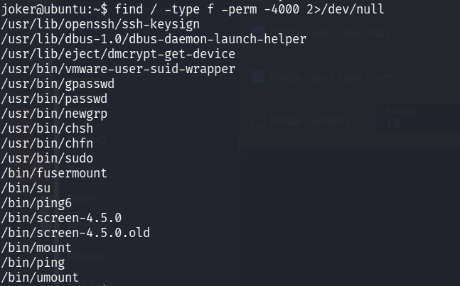

where screen-4.5.0 looks suspicious , lets look the exploits 

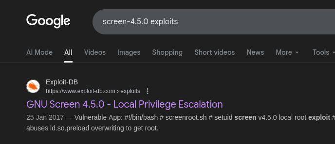

We found a exploit , create a file , paste the exploit and run it 

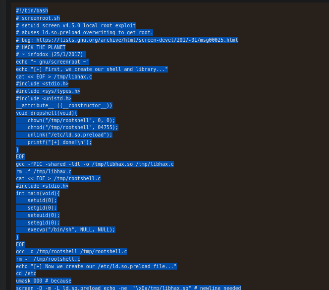

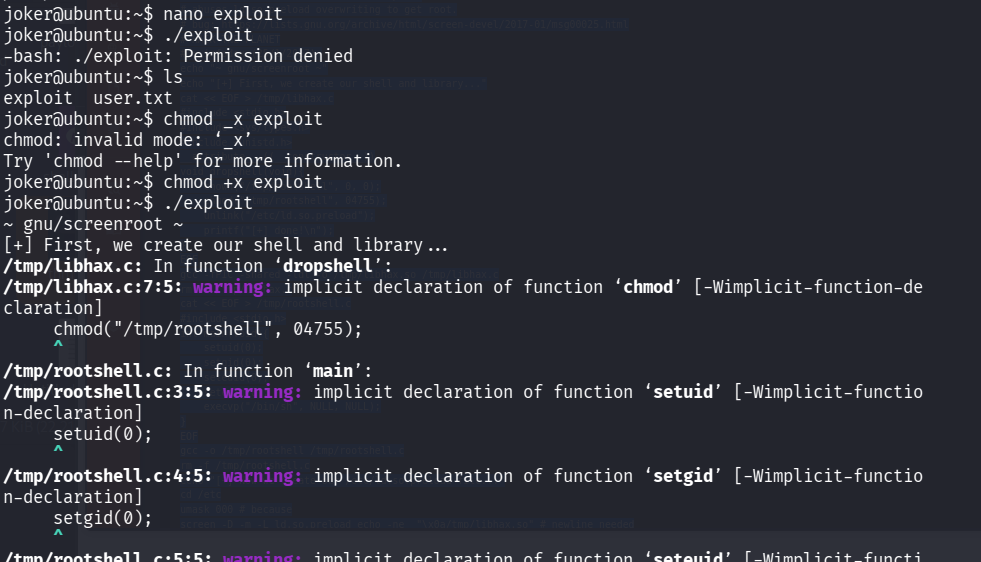

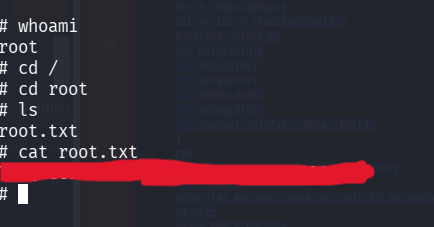

We successfully found the root flag 

-------------------------------------------------------THE END----------------------------------------------------------------------------------------

