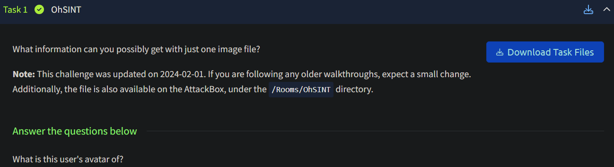
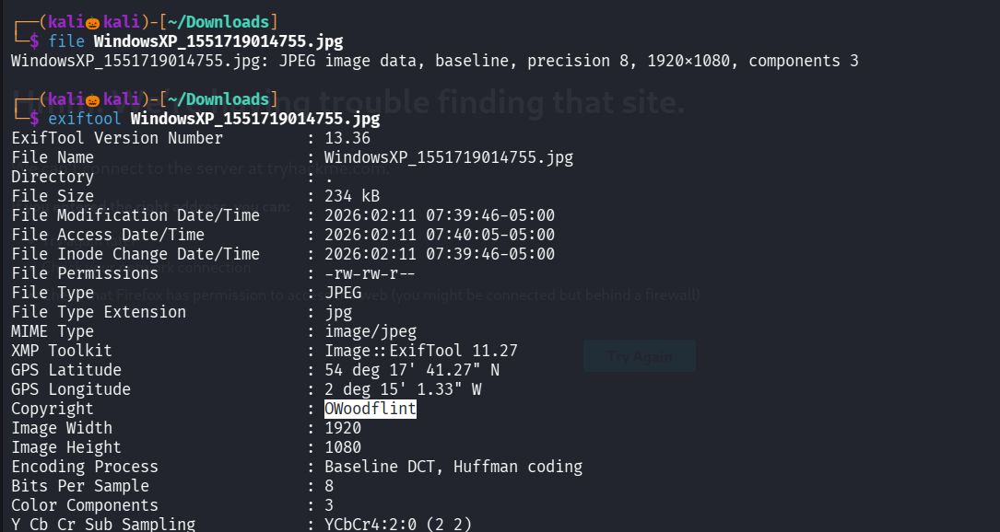
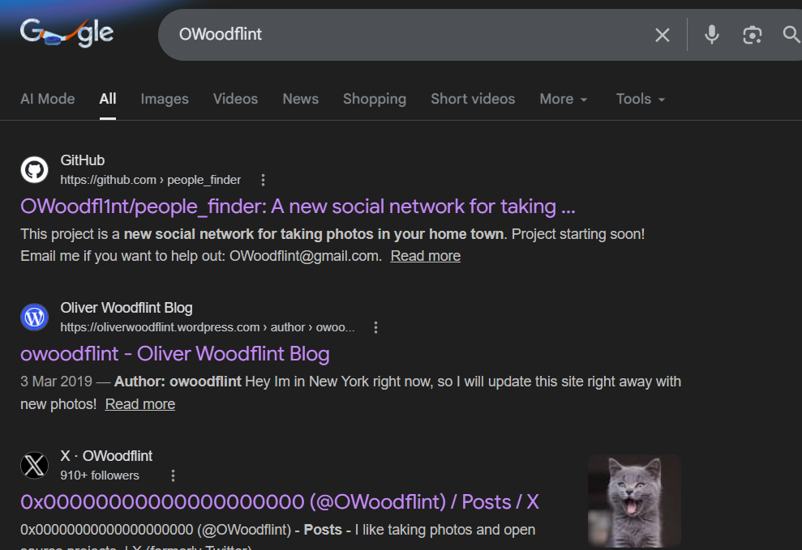
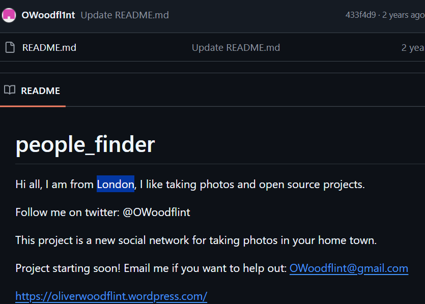
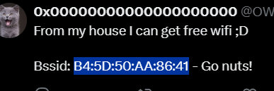
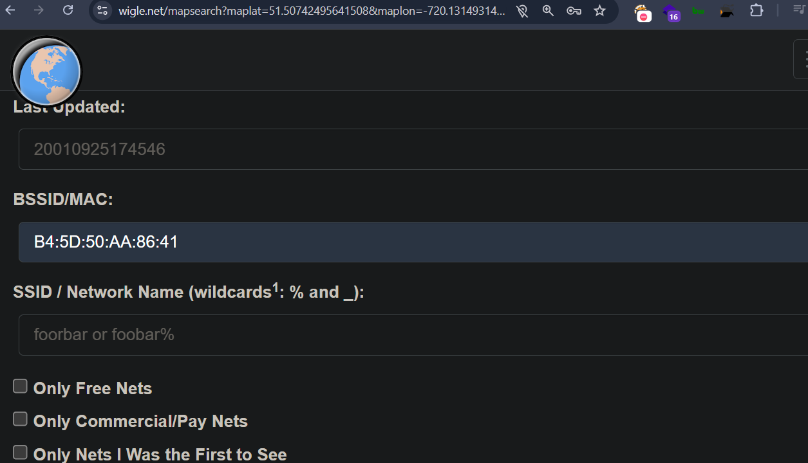
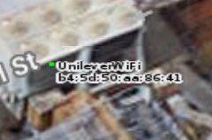
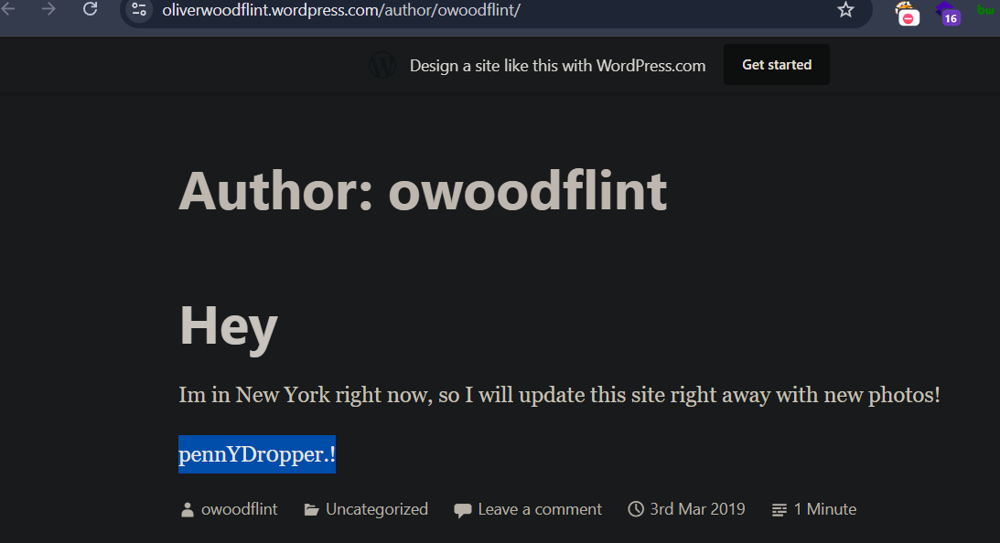

## SOLUTION 

lets download the task file 

using exiftool command to see the metadata of the file 

We found the username as OWoodfilnt 

lets search in google for username OWoodfilnt 

There comes first three links , lets open all three in separte tab 

in the twitter account the user has a profile picture of a cat 

in github we have found that he is from London and also we got his email address

In twitter we got a Bssid , lets use wigle site to find the ssid 

in basic search in bssid field enter the bssid we found and click on query 

in map zoom the purple cirlce mark in london until it shows the name 

we have successfully found the ssid 

now lets visit his website 

We have found that now he is in New York also his password

