## Lets start with an Nmap scan

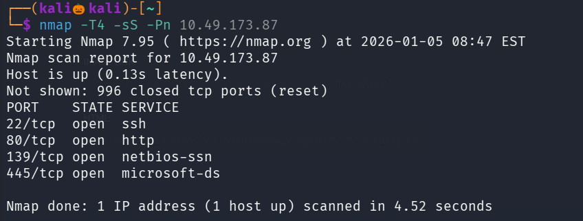

We found four open ports lets perform default script scan and service version detection scan on them

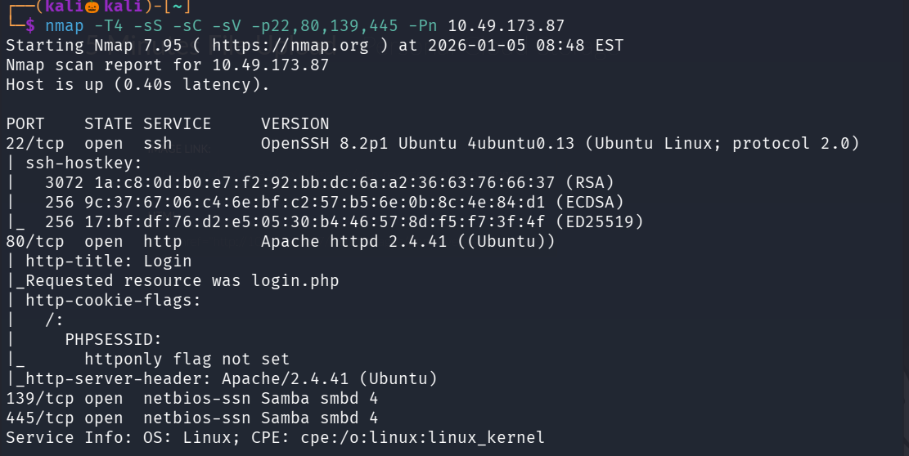
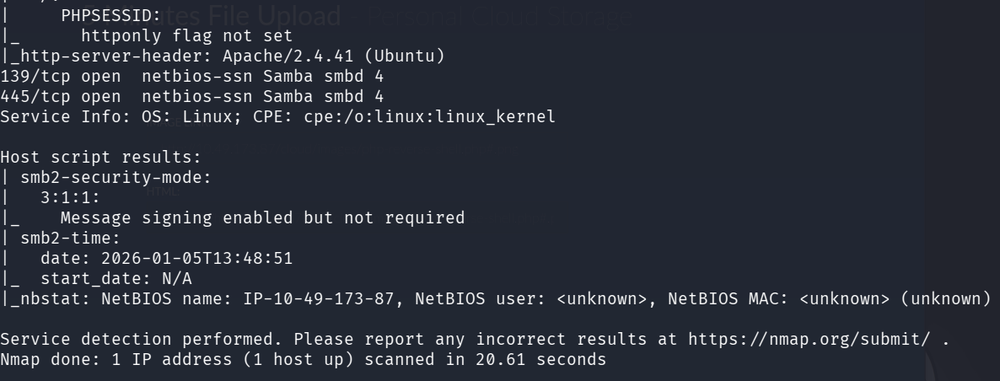

Lets visit the site running on port 80

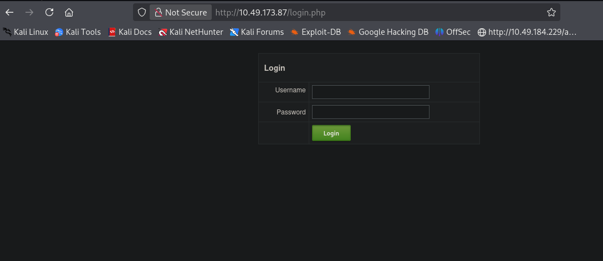

It is showing us a login page , but dont know any credentials 

Lets use gobuster to enemurate the web directories 

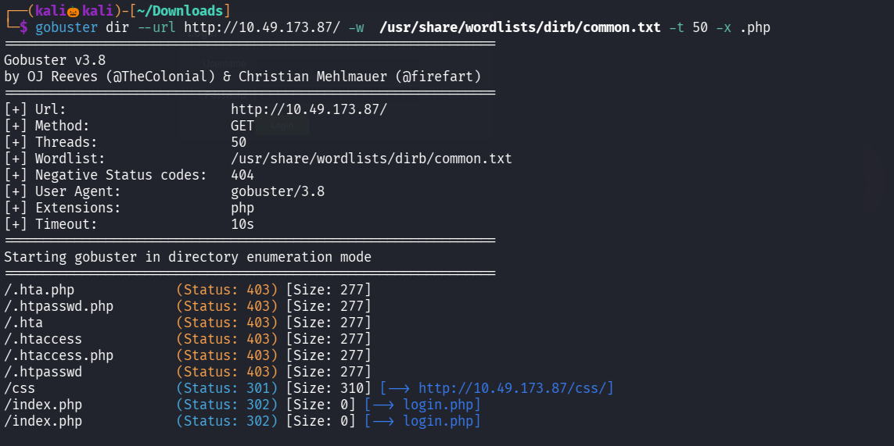

Lets visit /cloud path 

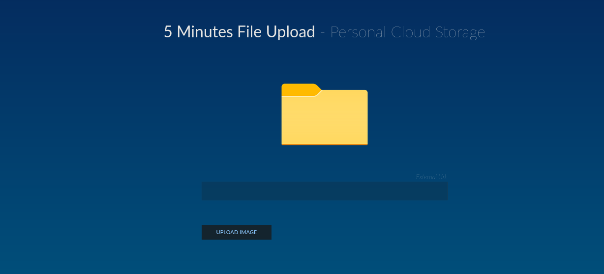

seems like we can upload images , lets try uploading a php reverse shell , we cant able to upload file with .php extension , so lets try to bypass it 

after trying many extensions this one worked : .php#.png

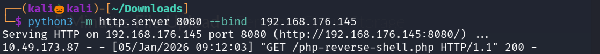

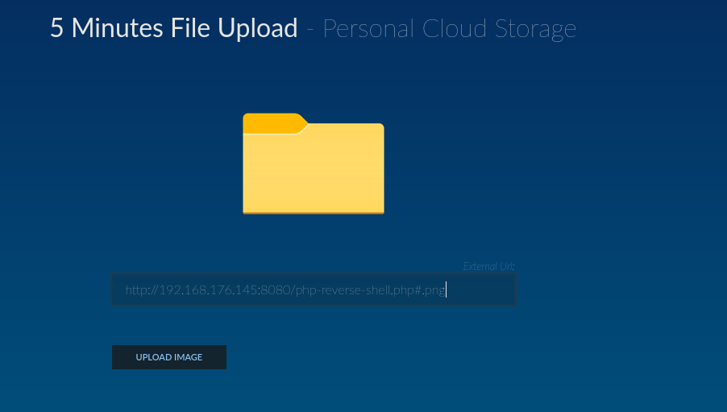

set up a nc listener and click on upload and we got a reverse shell

In home directory found a user named sysadmin but we cant able to read the local.txt file as our permission is denied 

While searching for files owned by sysadmin

command : find / -type f -user sysadmin 2>/dev/null 

found a file dataset.kdbx in opt directory 

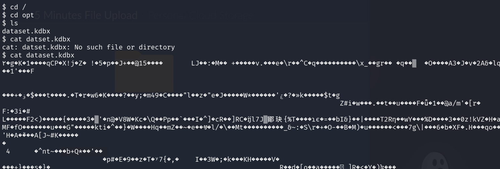

while researching about the file , found that it is a highly encrypted password database and needs a KeePass to decrypt it 

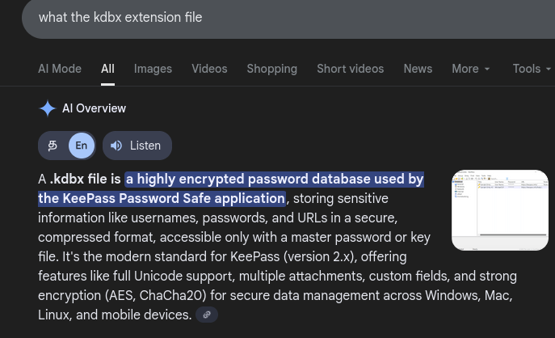
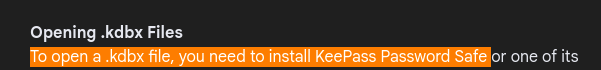

Lets start a python server and get the file using wget 

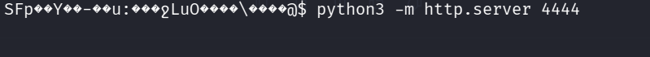

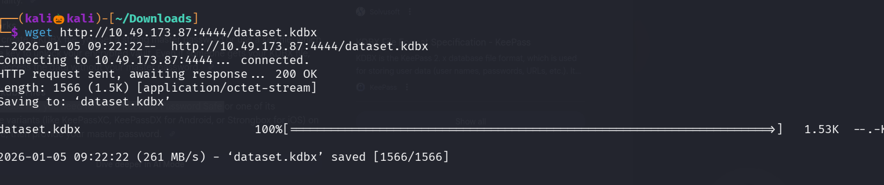

Lets crack the keepass using john , lets convert the file into an haah format that john can crack

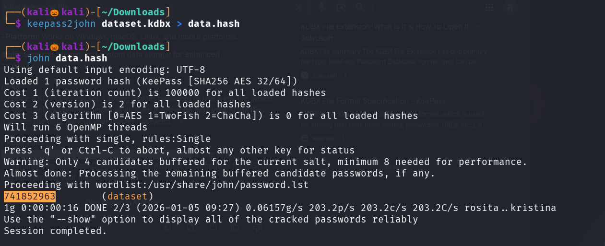

we successfully found the keepass

Since i cant able to install keepassxc tool i am using an alternative tool kpcli for it to open or read dataset.kdbx

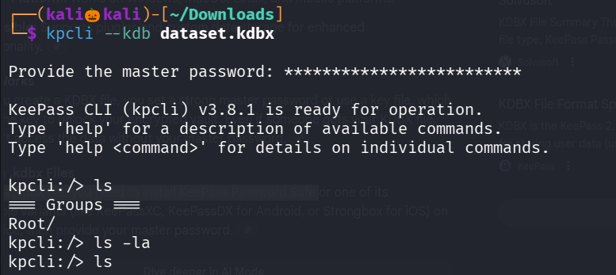

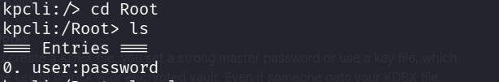

Lets see the entries 0 

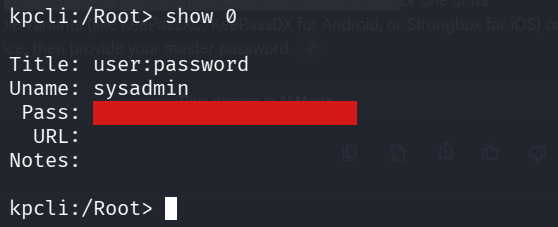

We can able to copy the password , even it is coted with red box

Since we found the username and password , lets login into ssh 

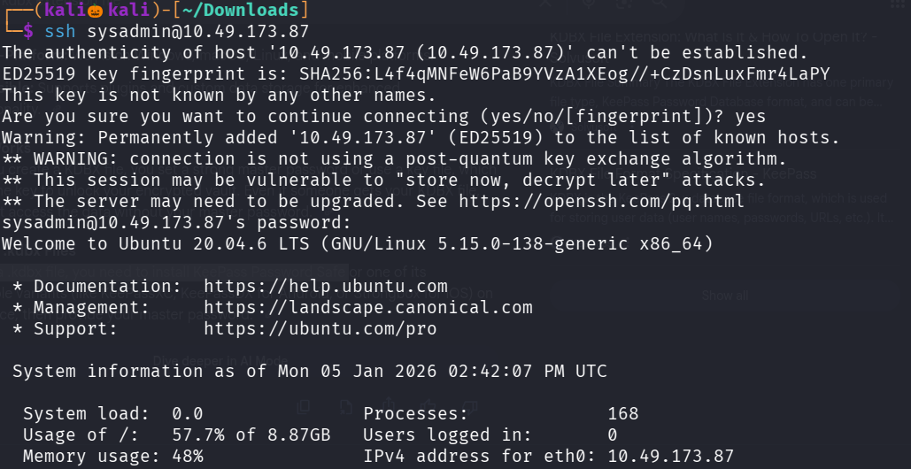

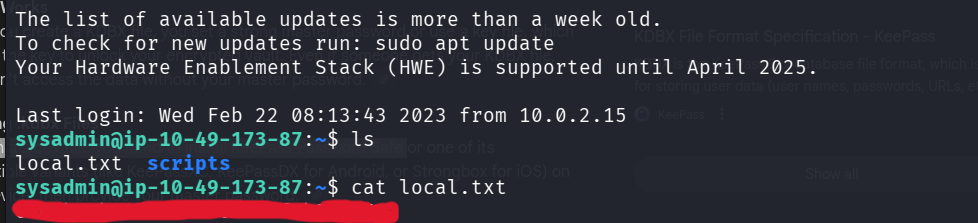

We successfully found the local.txt

Lets escalate our privilage to view the root flag 

we cant able to run sudo as user sysadmin

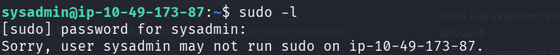

I noticed a folder named script inside it there is a file called script.php

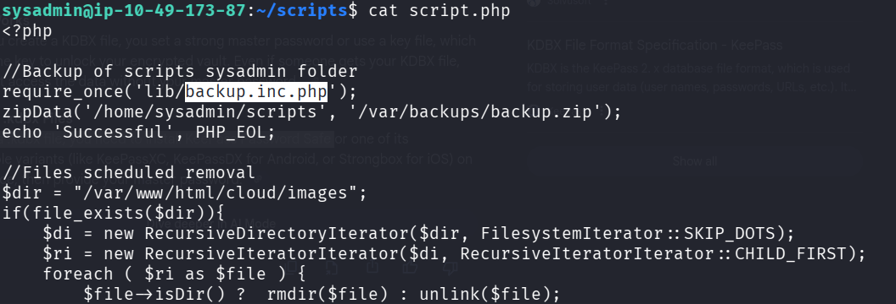

while visitng the folder backups where backup.zip has been run by root every minute , means this script has been executed 

Since we cant able to remove or modify backup.inc.php

We create a file named backup.inc.php in our sysadmin folder and insert a php reverse shell into it and override it 

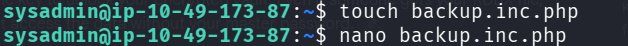

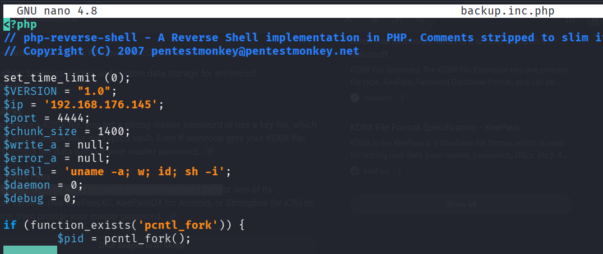

set up a nc listener 

command : mv backup.inc.php ./script/lib/backup.inc.php --> to override the exisiting file with our php reverse shell

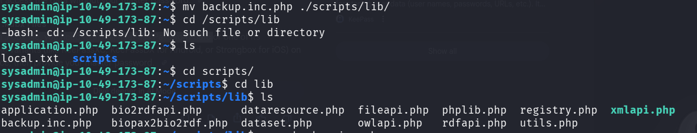

after a minute we get a reverse shell with root privilage

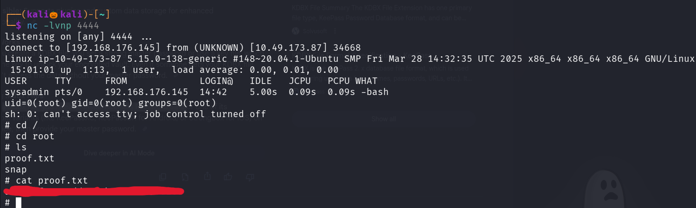

We sucessfully found the proof.txt file  

----------------------------------------------------------THE END---------------------------------------------------------------------

