## Lets Start with an nmap scan 

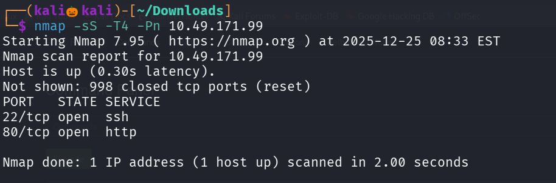

We found are two open ports , lets service version detection and default script scan

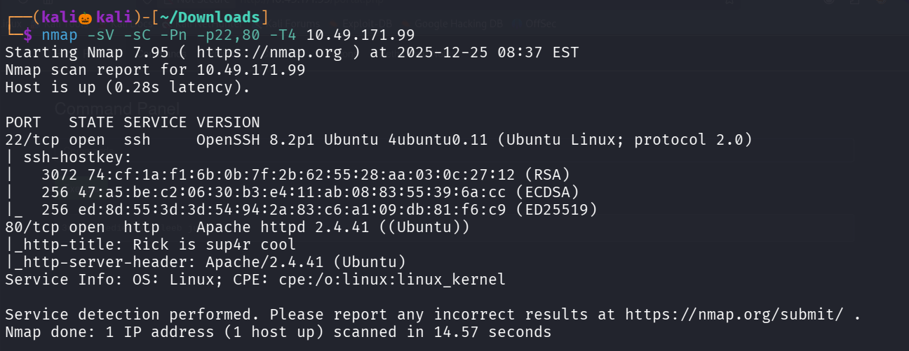

Lets see the site running on port 80

Lets inspect the site 

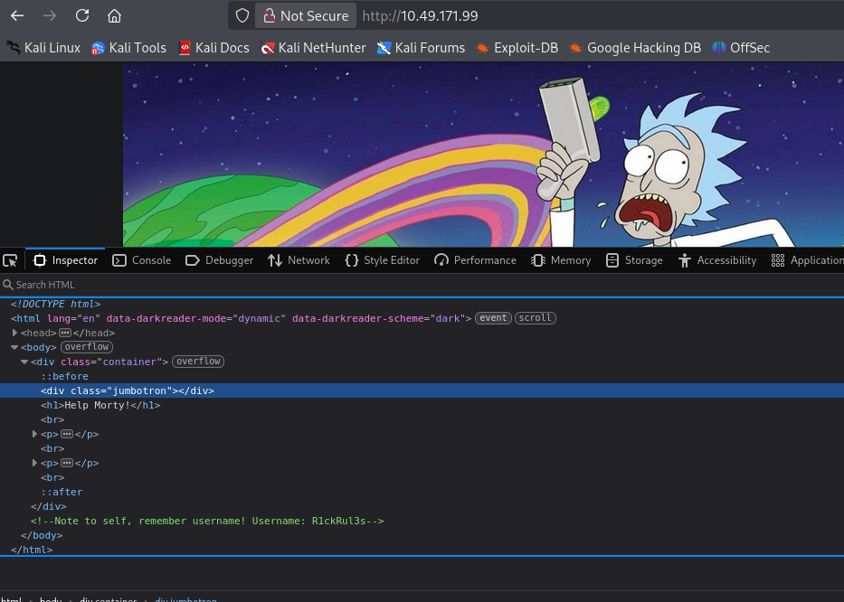

We found a username 

Lets use gobuster to enemurate some web directories

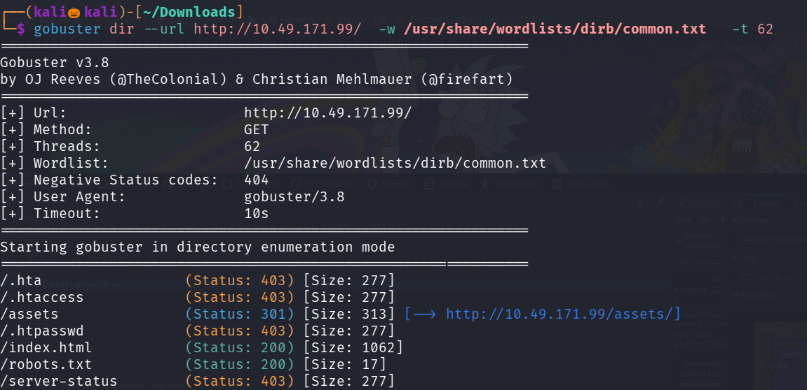

Lets visit robots.txt 

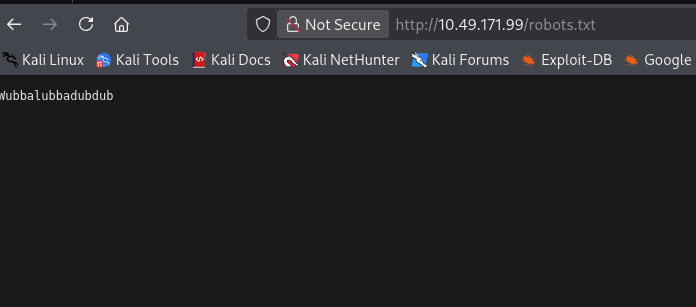

Looks like we found the password

I assests folder i checked for any login in all files but no juicy information is found 

i also tried to login into ssh with username and password but it failed

There should be an login page , since we got username and password , lets try enerumate web directories with an php extension

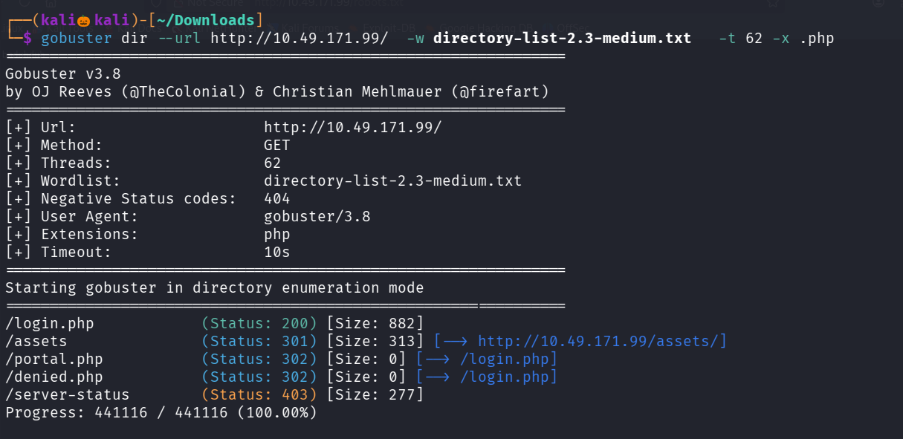

We found an login.php form ,lets login with username and password

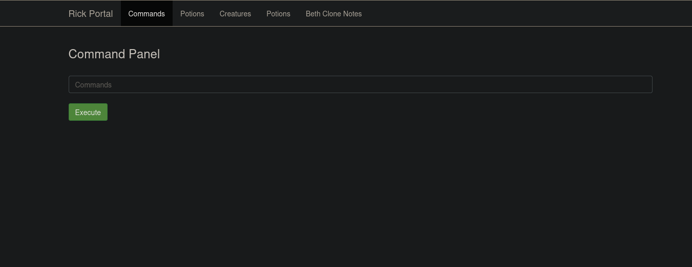

Seems like we can execute commands

Tried to obtain nc reverse shell but it didnt work

Lets use ls to list the files

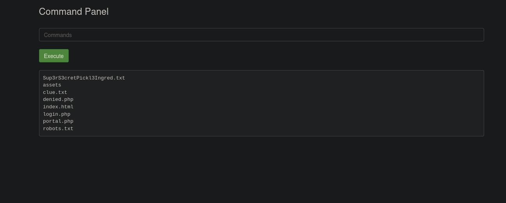

We found the first incredient but we cant able to read it with cat command , so lets try strings 

command : strings Sup3rS3cretPickl3Ingred.txt

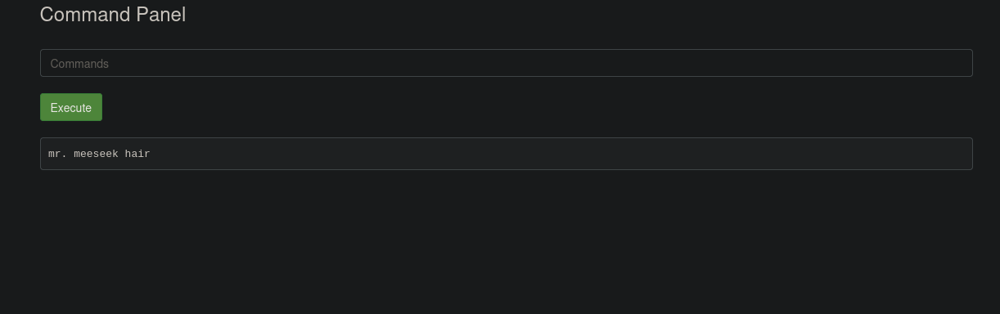

Lets view the home directory 

Command : ls /home

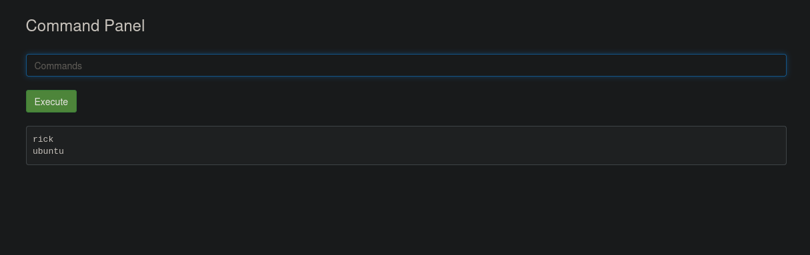

Lets see files inside rick folder

Command : ls /home/rick

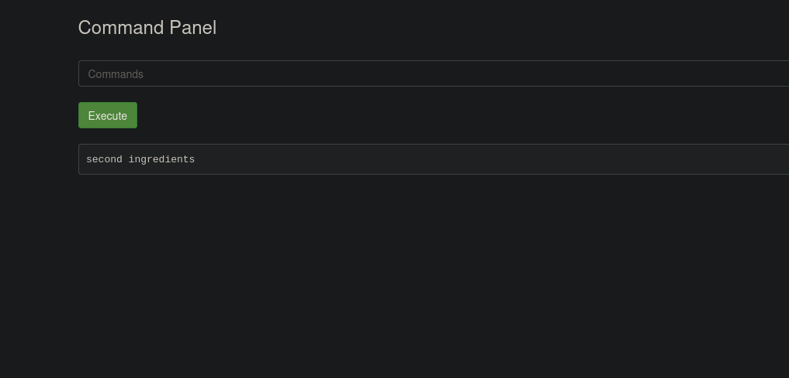

We found the second ingredients 

Lets use Strings command to read the second ingredients

Command : strings /home/rick/second\ ingredients

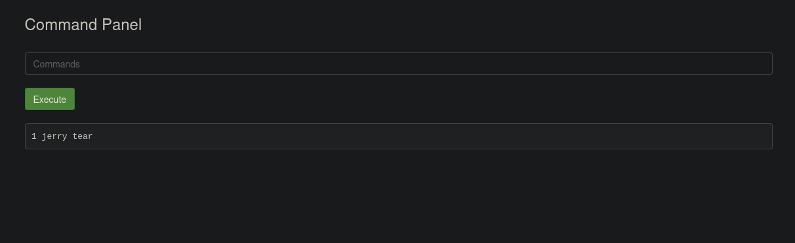

The third ingredients should be in root directory lets see what privilage we has 

Command : sudo -l 

We can run any command with sudo

Command : sudo ls /root

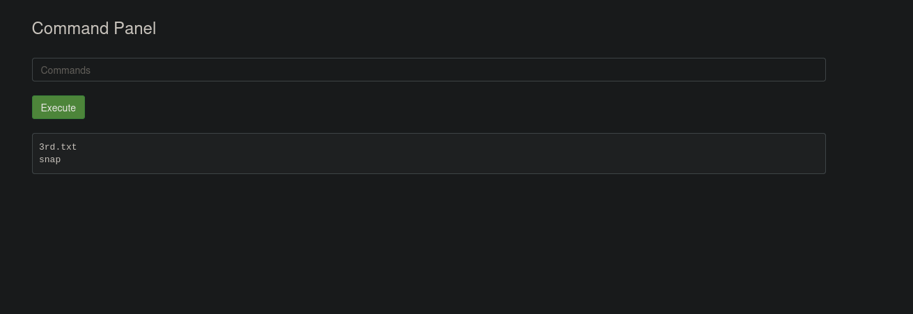

Lets read the third ingredient

Command : sudo strings /root/3rd.txt

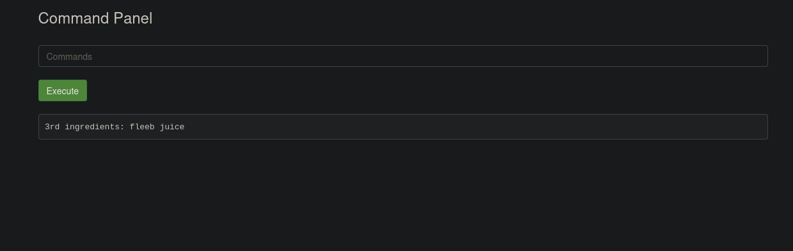

