## Lets start with an nmap scan 

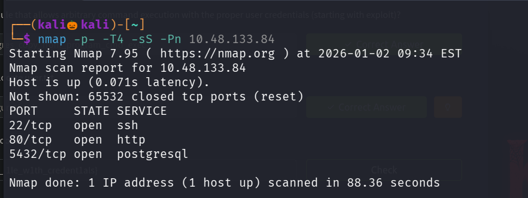

We found there are three open ports , lets perform service version detection scan and default script scan on them

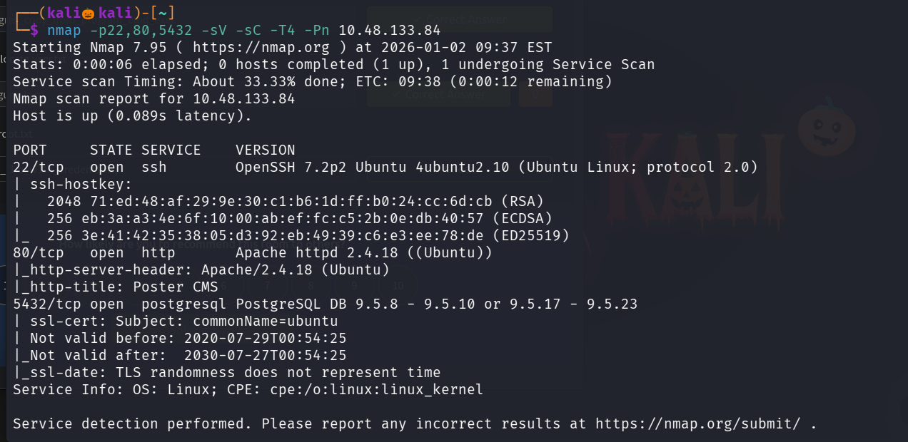

Lets visit the site running on port port 80

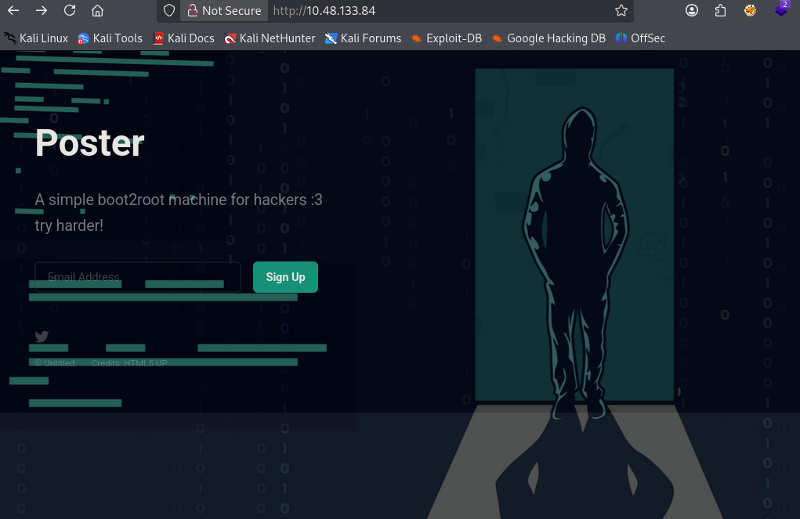

Lets use gobuster to enemurate  web directories

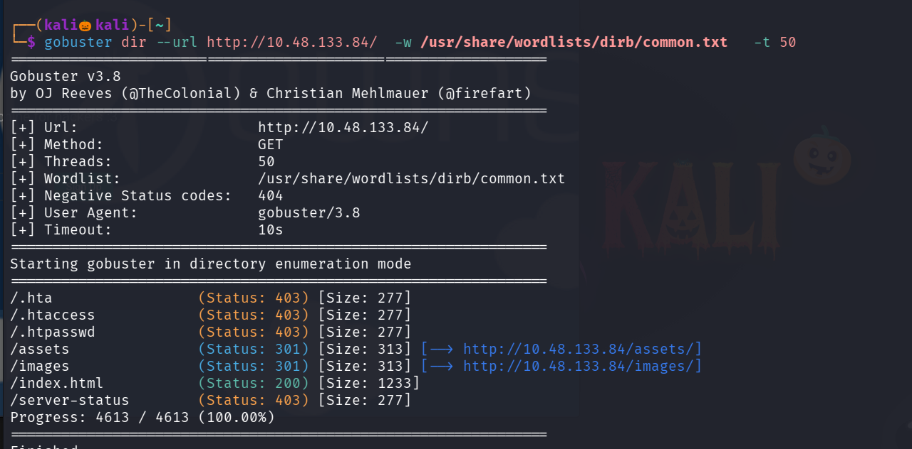

I checked every path and also inspected the page for any information discloure but no juicy information is found 

the postgresql service is running on port 5432 , lets use some metasploit auxiliary modules to enemurate some information

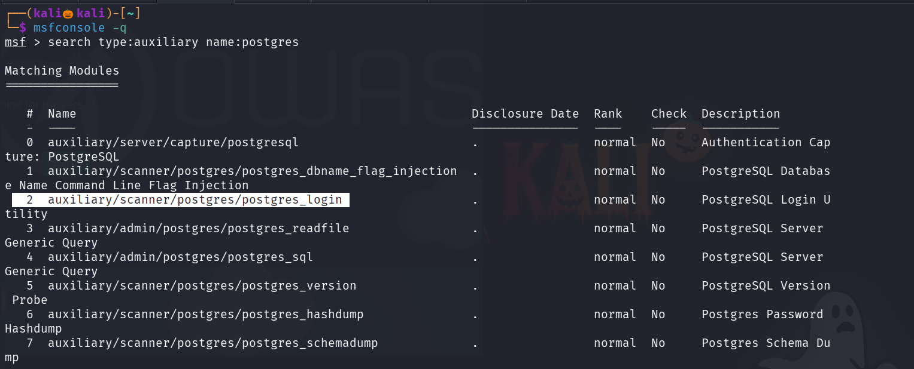

lets use the postgres_login module to brute force for username and password

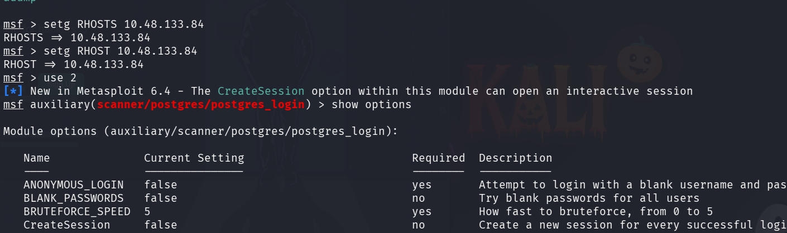

The username file and password file has been set by default , lets run the module 

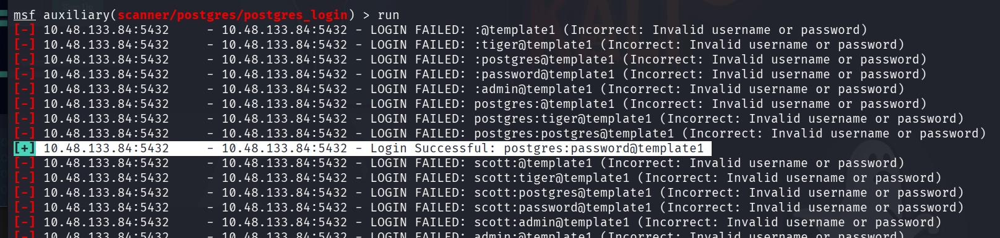

We found the username and password 

i initially thought that the password was password@template1 and tried it on further modules but it did not work

Then i realized that template 1 refers to database name , Metasploit is telling which database the login was successful.

Lets use furture axiliary modules to enemurate more information

/admin/postgres/postgre_sql -- > to check for postgresql version , in nmap service detection scan the version is not accurate and it is given in a range

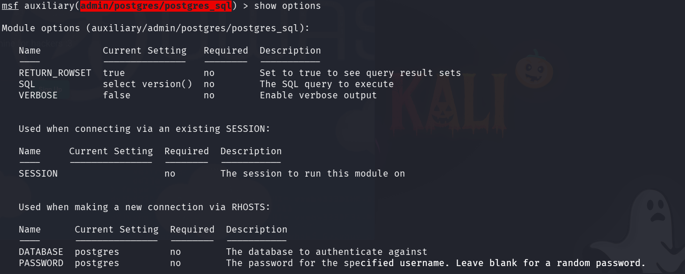

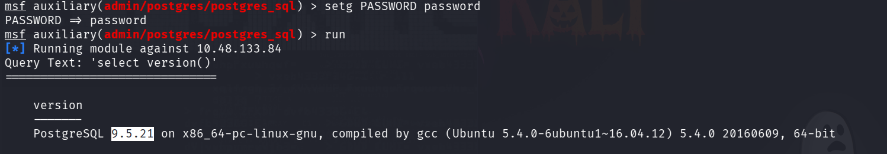

lets use postgres_hashdump --> used to dump the hashes in the server

Lets search for an exploit module 

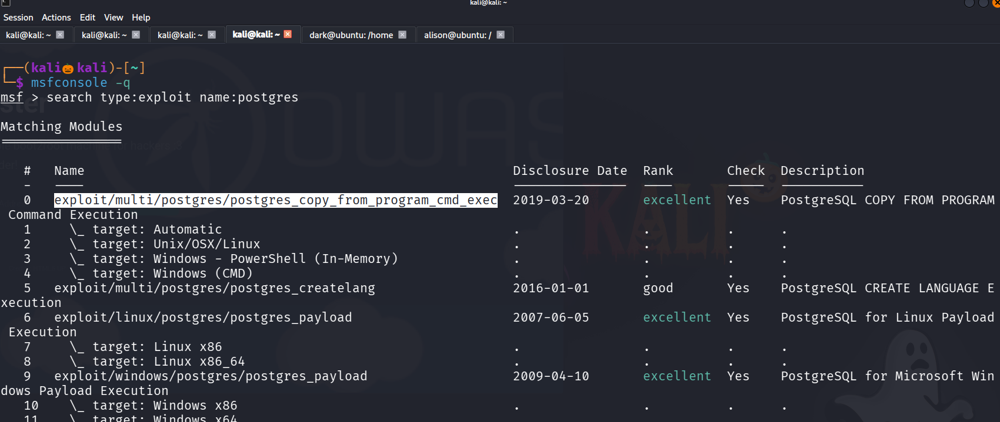

lets use that and check we are getting a shell or not

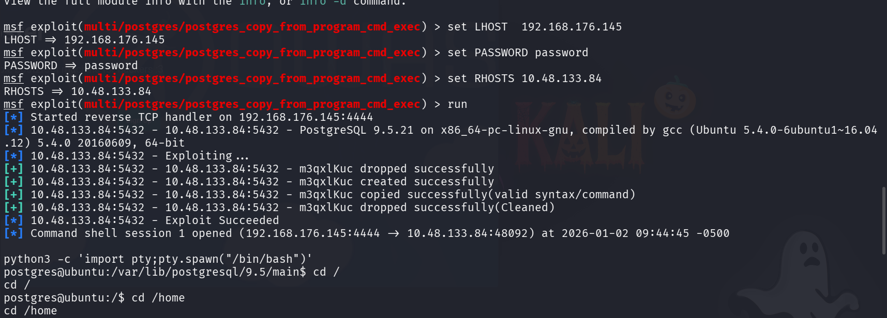

we successfully got the shell , and i found two user alison and dark

but we cannnot able to read the user.txt file 

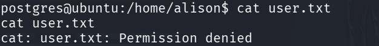

in dark folder there is a file called credentials.txt , lets view that

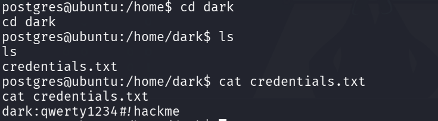

we successfully got the password for user dark , lets login into ssh with the credentials

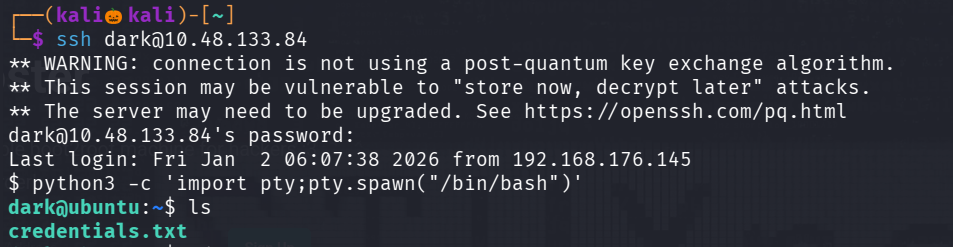

still we dont have permisson to read the user.txt 

i checked for sudo -l for any chances of privilage escalation but dark user cannot run sudo on this system

also checked for suid files but no juicy information is found 

Lets check for alison files 

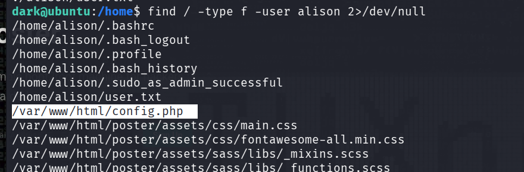

Found an intresting file named config.php , lets view it 

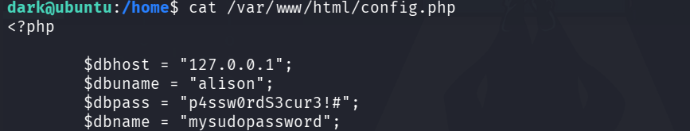

We found the credentials for user alison , lets login into ssh with alison's username and password

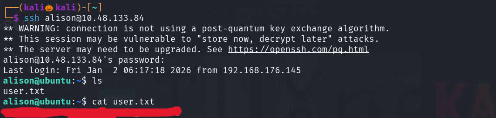

We successfully found the user file , type sudo -l to see what command user alison can run with root privilages 

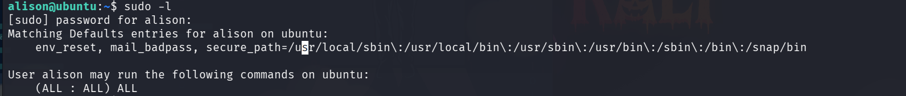

He can run all commands as root

Lets view the root file 

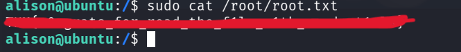

We successfully found the root file

------------------------------------------------------------------------THE END-------------------------------------------------------------------------------

