## REVERSING ELF 

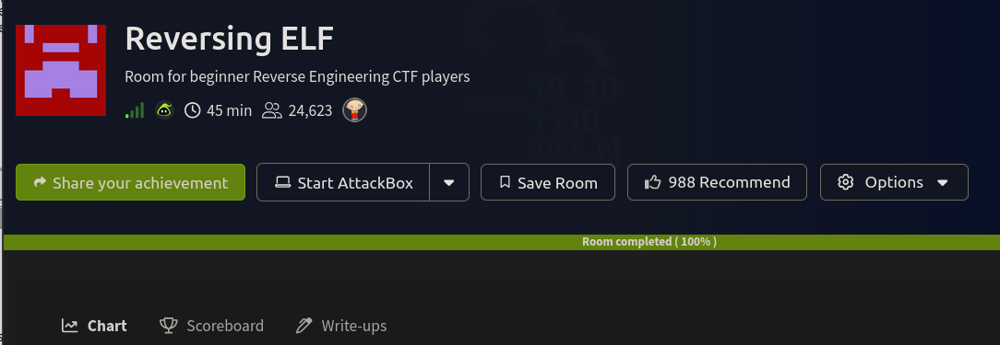

## CRACKME 1

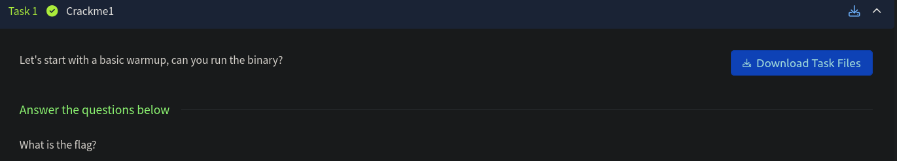

lets download the file and run it 

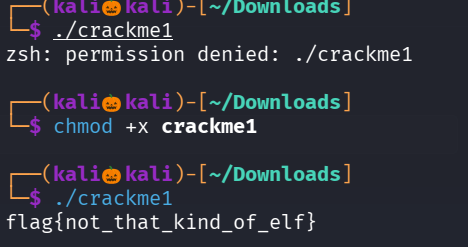 

We successfully got the flag 

## CRACKME 2

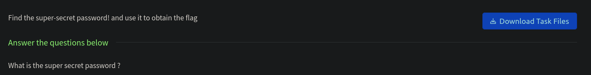

lets download the file and execute it 

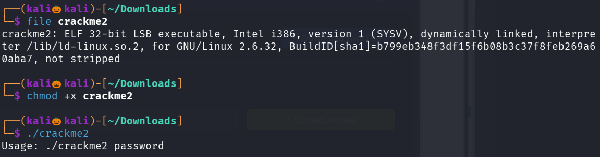

seems like we need the password to furthure proceed 

lets run strings command

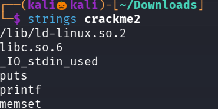
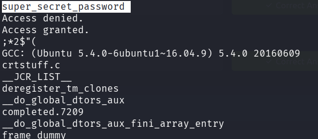

we have found the password ,now lets run the file with the password 

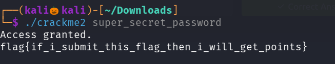

We successfully found the flag 

## CRACKME 3

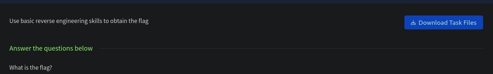

lets download the file and execute it 

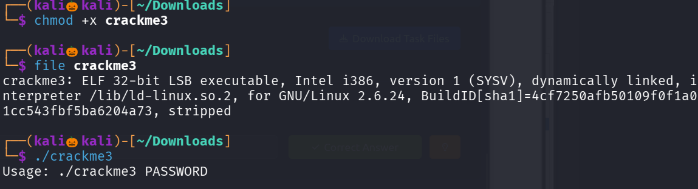

here too we require a password 

lets use strings command 

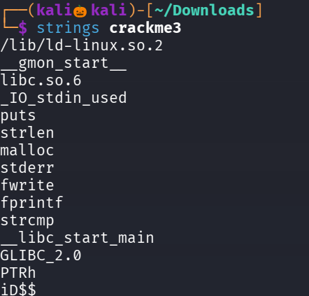
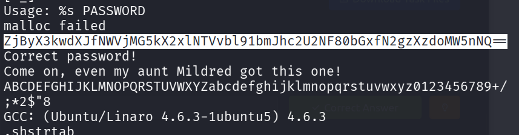

seems like the password has been encoded with base64 , lets decode it 

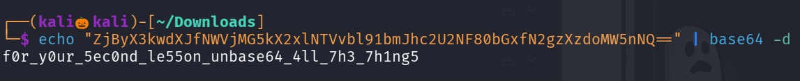

We successfully found the flag 

## CRACKME 4

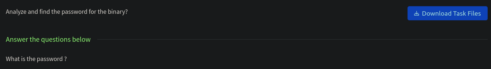

lets download the file and execute it 

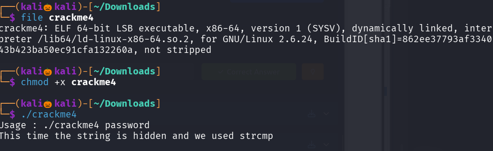

lets run strings command 

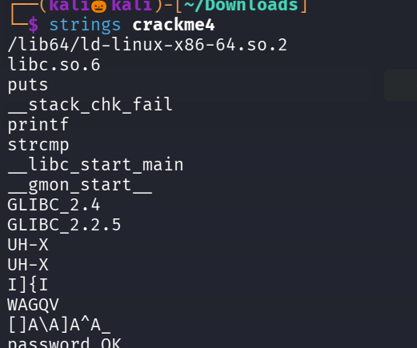
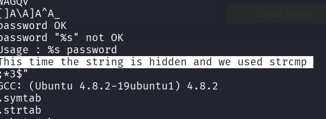

no juicy information is found 

lets analysis the file in ghidra 

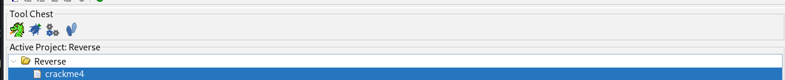

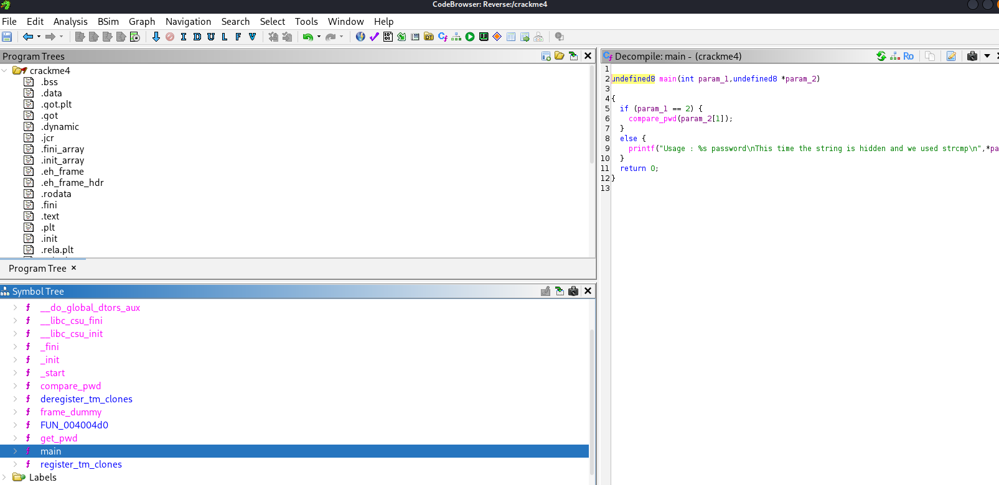

in the main function , a compare_pwd function is called , lets analyze it 

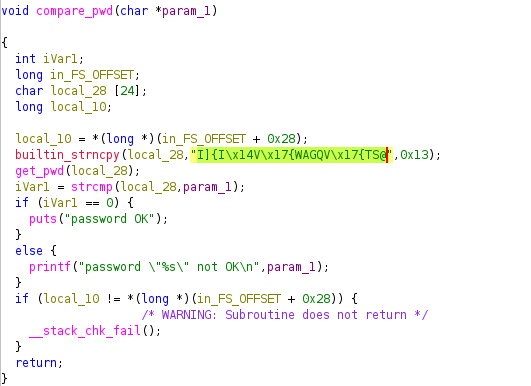

where a string has been stored in a variable named local_28 and it is passed into the function get_pwd 

lets visit get_pwd function

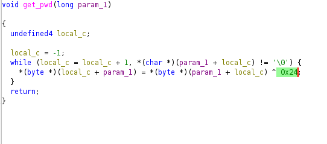

seems like that string has been done xor operation with 0x24 

lets write a python program to perform xor operation 

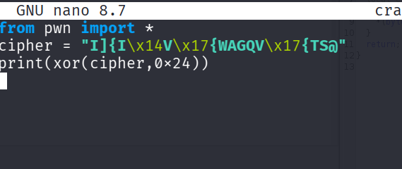

lets run the code 

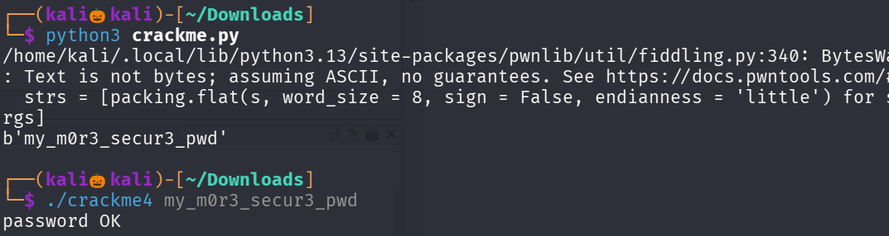

We successfully found the flag 

## CRACKME 5

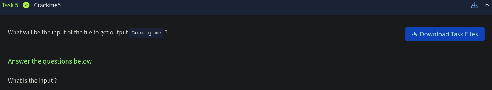

lets download the file and analyze it 

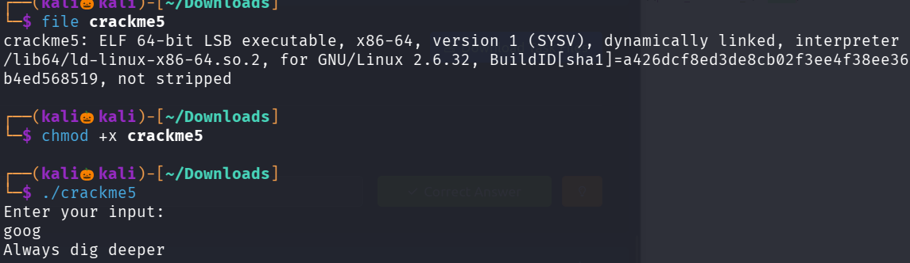

lets use strings command 

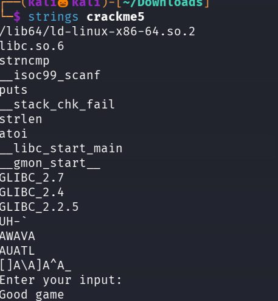

lets use a command : ltrace ./crackme5 

ltrace command is used to trace the function calls , libraies while the program is runnning 

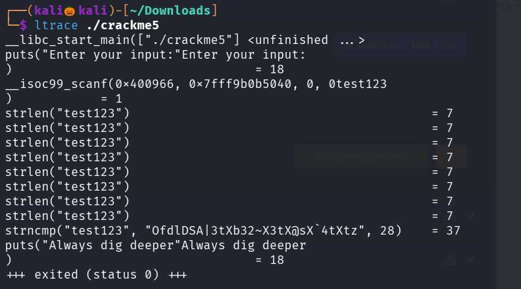

seems like our text input test123 has been compared with an string , lets try it as input 

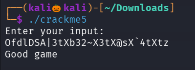

We successfully found the flag 

## CRACKME 6 

lets download the file and analyze it 

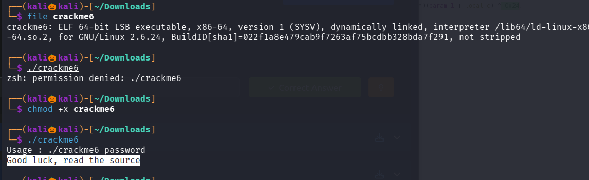

lets use strings command 

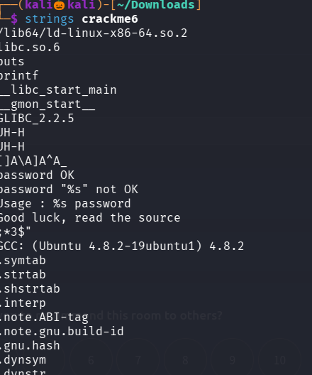

no useful information is found 

lets use ghidra and analyze the file 

in main there is a compare_pwd function has been calling 

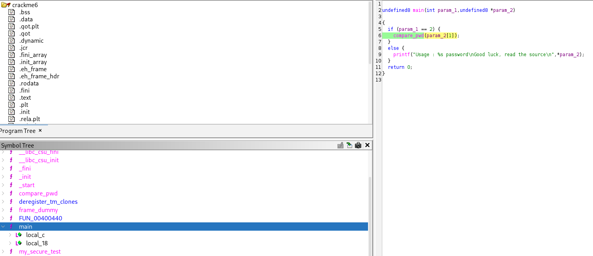

lets analyze the compare_pwd function 

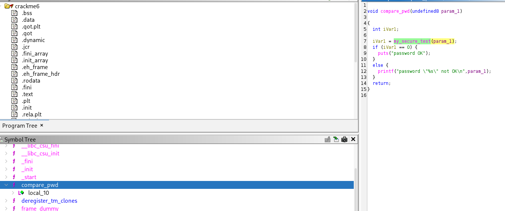

here my_secure_test function has been calling , lets analyze it 

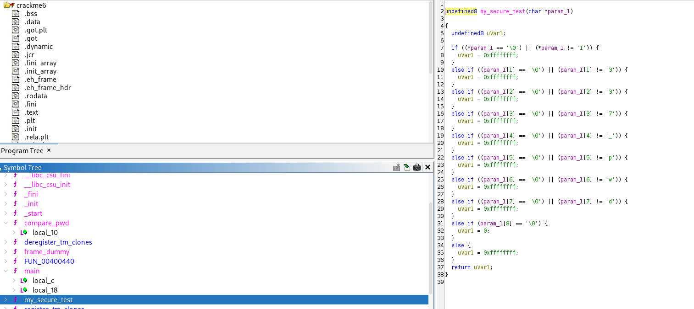

seems like we have found the password as 1337_pwd

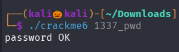

## CRACKME 7

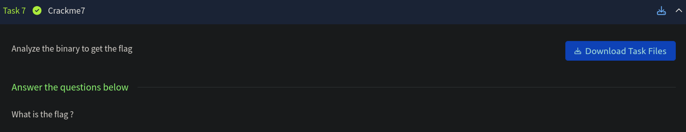

lets download and analyze the file 

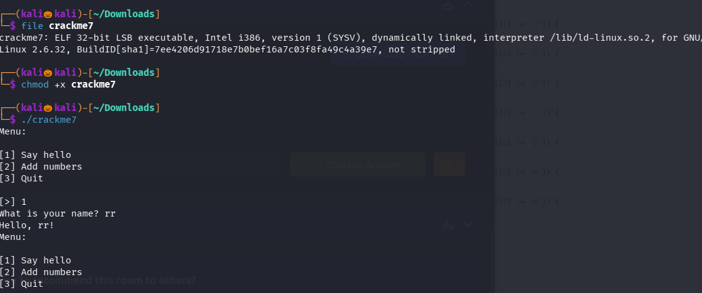

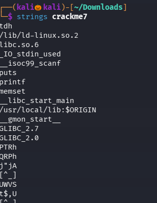

until now no juciy information is found , so lets use ghidra and visit the main function 

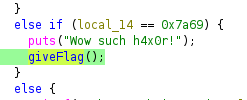

found that if the input value is equal to 0x7a69 a giveFlag() function has been called 

if we click on that hexa value it will automatically show the decimal value , lets enter that 

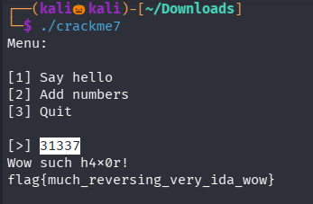

We successfully found the flag 

## CRACKME 8 

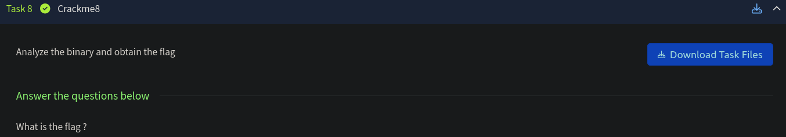

lets lets download and analyze the file 

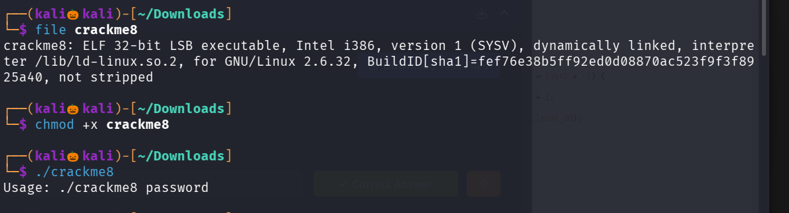

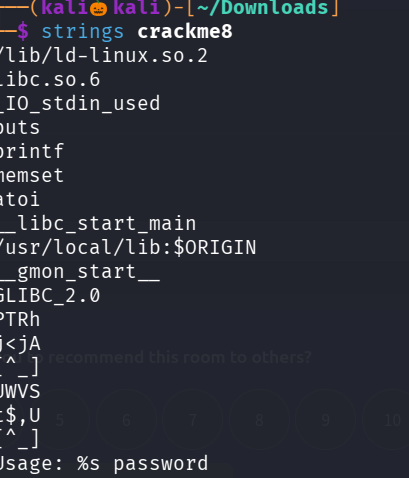

until now no juicy information is found so , lets use ghidra and analyze the main function

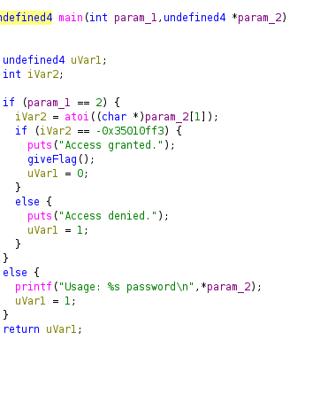

seems like our input has been stored in uVar1 variable and if the entered variable is equal to -0x3...ff3 giveFlag() function has been called 

if you click on the hexa value you will see the decimal value of it , lets try it as the password 

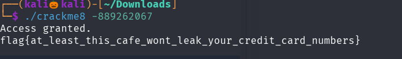

We successfully found the flag 

-------------------------------------------THE END------------------------------------------------------------
