## Lets start with an nmap scan 

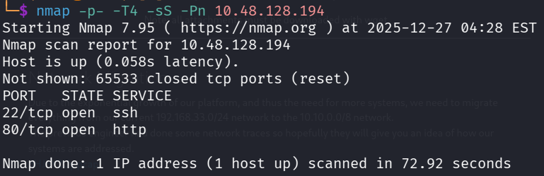

We found that there are two open ports 

Lets perform service version detection and default script scan on them

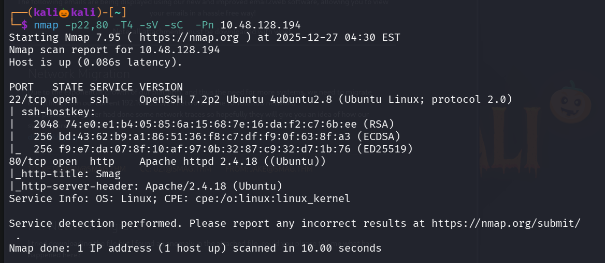

Lets visits the website running on port 80

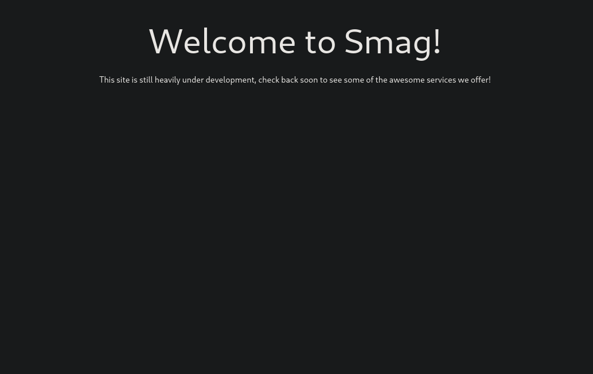

Lets enemurate the web directories using gobuster

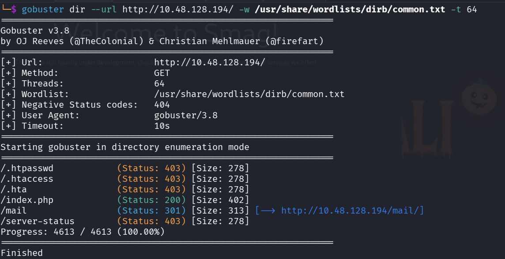

We found a path /mail

Lets visits it , in that we found a pcap file lets download it and view using wireshark

in wireshark right click on any tcp packet and in follow click on tcp stream

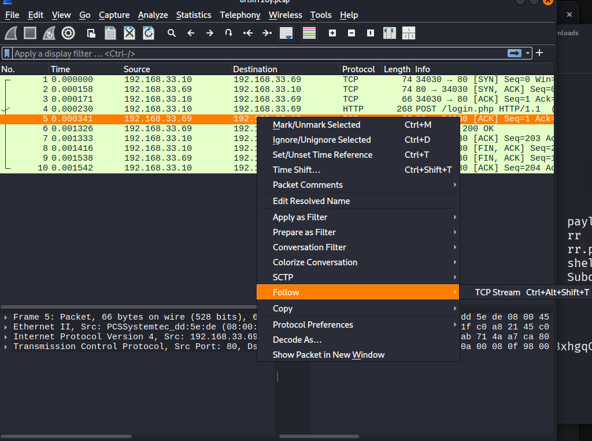

There is only one stream in which we found a host : development.smag.thm , username ,password

Lets add the host to our /etc/hosts file in order to view it 

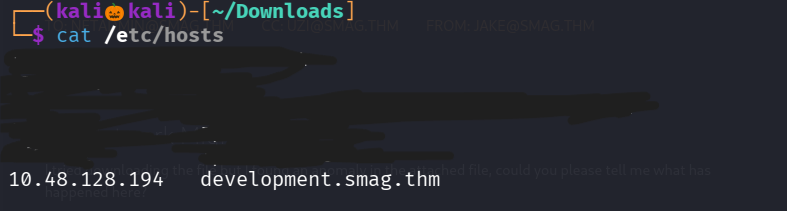

Lets visit the site

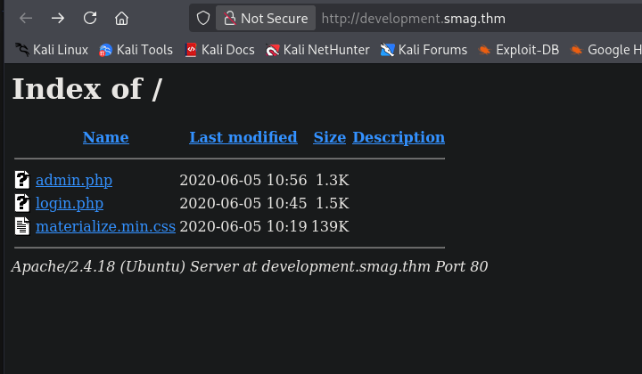

It consits of a login page , lets login with our username and password found earlier

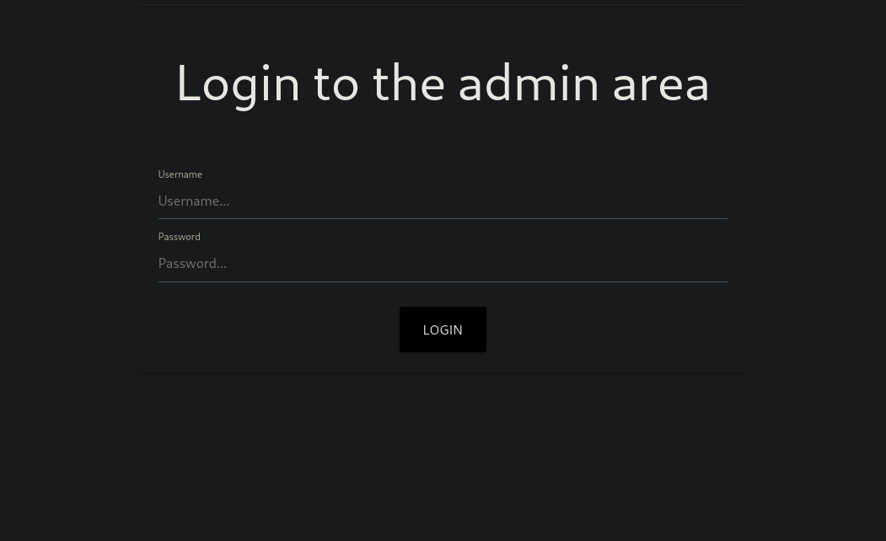

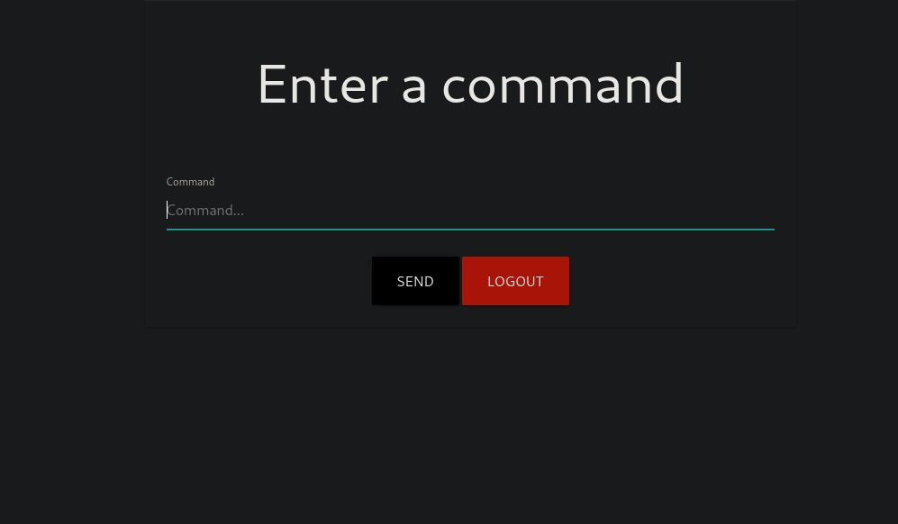

Seems like we can execute commands , so lets create a nc reverse shell and execute it

I used reverse shell generator to create a nc reverse shell 

Create a nc listener 

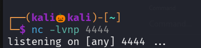

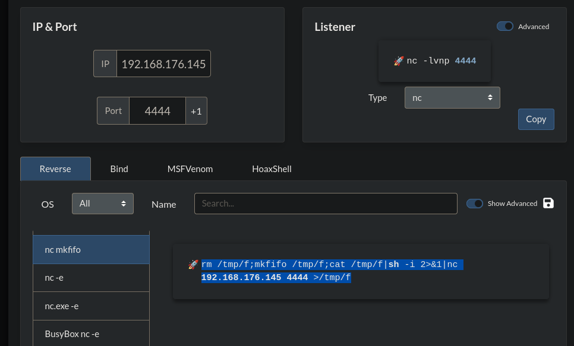

Execute the command 

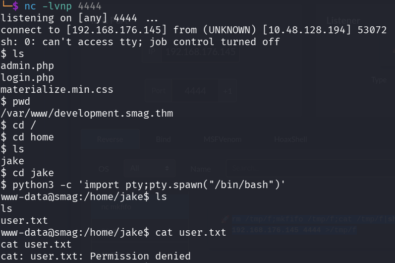

We successfully got a reverse shell

We found a user name jake and we cant able to read the user.txt file , i think we have to escalate our privilage to jake user in order to read the user.txt

I visited all hidden files and folders in jake folder but no juciy information is found , so lets check the crontab 

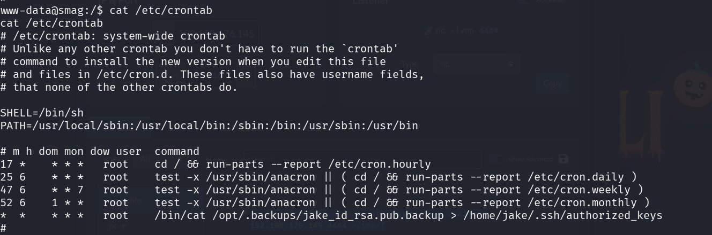

We found that for every minute the contents of jake_id_rsa.pub.backup file has been overwritten to authorized_keys in .ssh folder 

authorized_keys file consits of the ssh public key so anyone with the ssh private key can login into ssh

so if we create our ssh public and private key and insert our ssh public key in jake_id_rsa.pub.backup file it will be written to authorized_keys automatically within a minute , and we can login with our private key as a jake user

Lets create our ssh private and public key

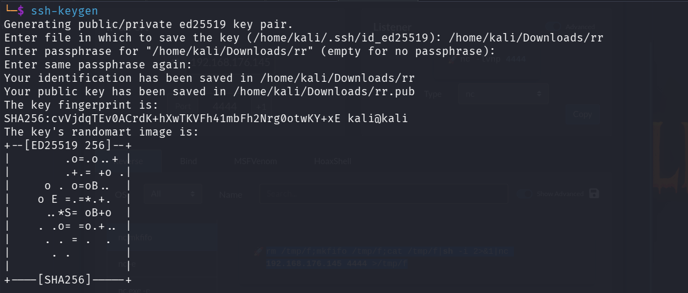

rr --> is the private key
rr.pub --> is the public key

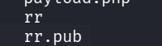

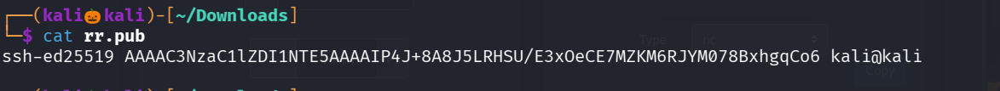

Lets write the contents of rr.pub file into jake_id_rsa.pub.backup file

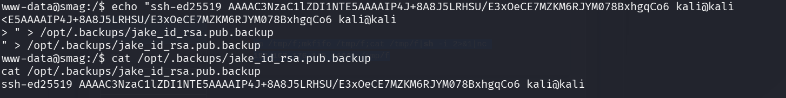

Lets use our private key to login into ssh as jake user

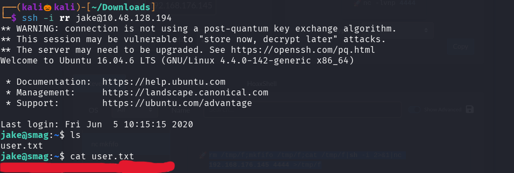

We successfully got our user flag

Lets esclate our privilage to read the root flag

command : sudo -l 

show what normal user can run with root privilage

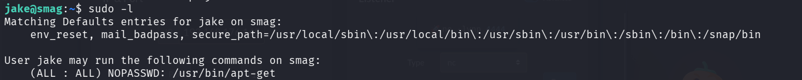

I used gtfo bins to find a escalate our  privilage with apt-get command 

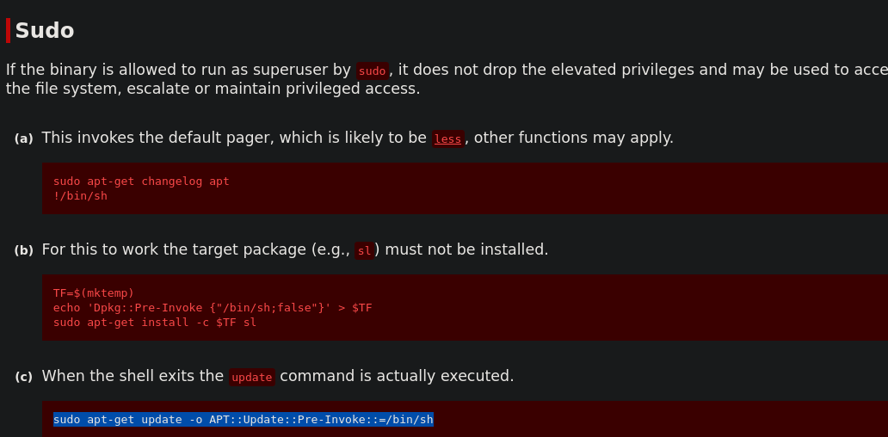

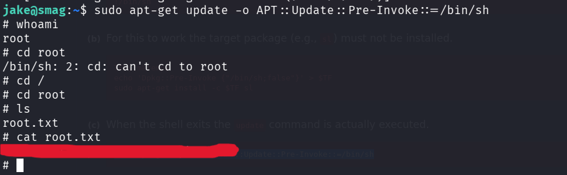

We successfully found our root flag

--------------------------------------------------------------THE END------------------------------------------------------------------

