##Lets Start With an Nmap scan

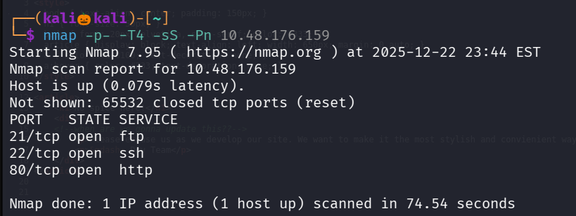

lets perform default script scan and service dection scan on these three open ports

Mean while lets use gobuster to enerumate web directories

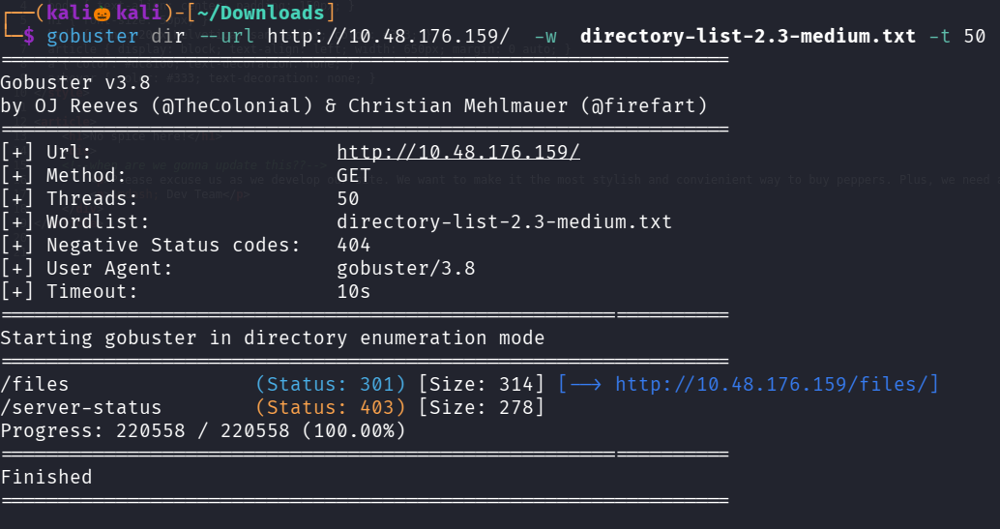

We found a directory files lets navigate to it 

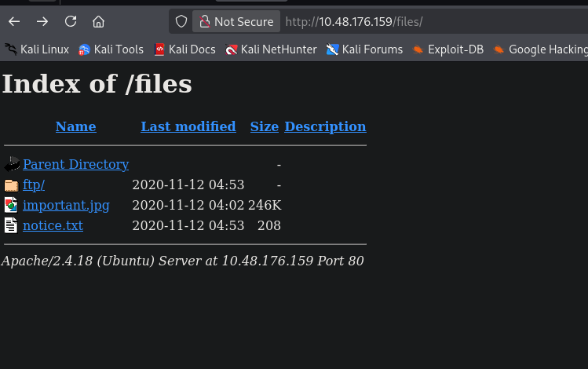

We found one empty folder ftp , one image file and text file , lets view the text file 

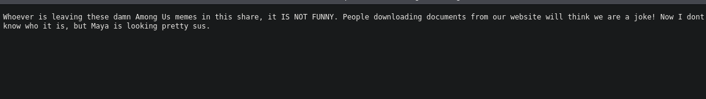

We found a username Maya

Lets see our nmap script scan

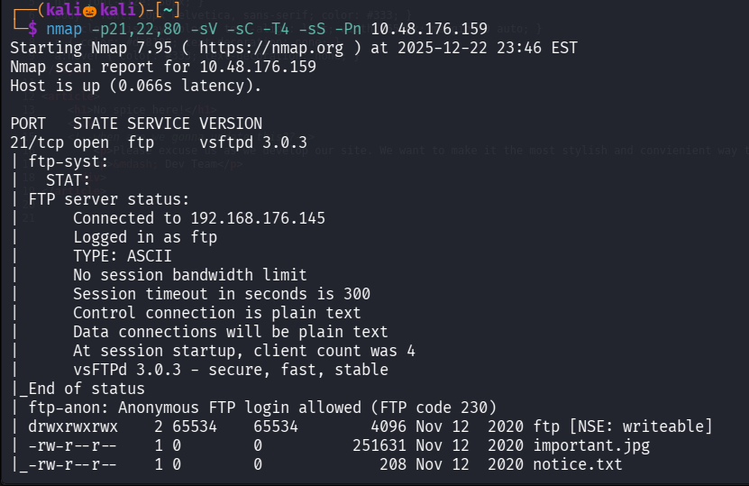
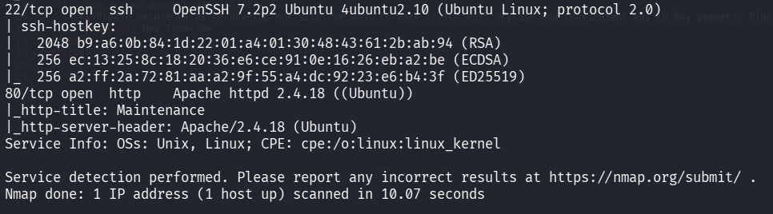

We found that ftp allows Anonymous login

Lets login into ftp , 

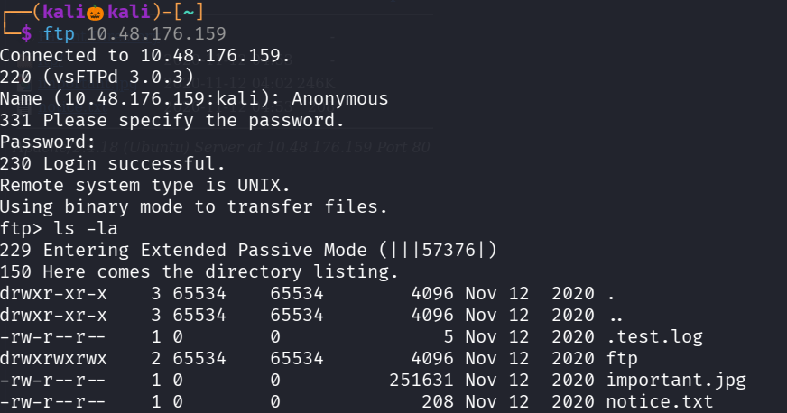

in here also the same things are there that are in the path /files

So i used hydra with username maya over ssh but cant able to find password 

So i tried to upload a reverse shell in ftp directory
Lets use php-reverse_shell i downloaded it from github

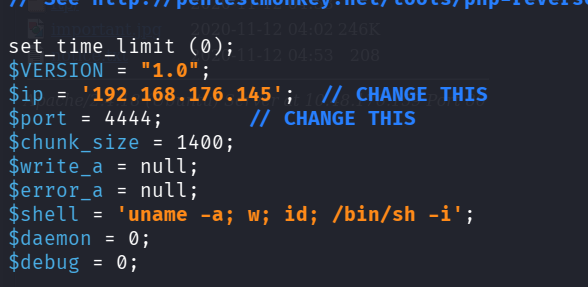

Lets also set up a nc listener

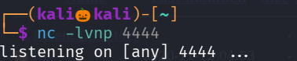

file uploaded successfully lets naviagate to /files/ftp

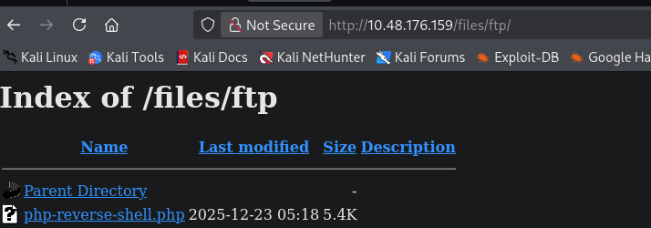

Click on the file and Lets see we obtained a reverse_shell

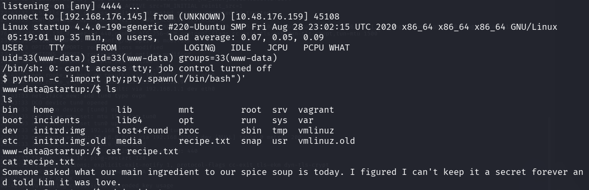

We found a file called recipe.txt 

We successfully found our first answer

i see a one more folders called incidents lets navigate to that 

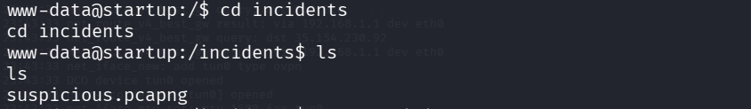

Where we a found a wireshark file  

--> .pcapng represents a file saved in wireshark 

Lets copy that file to ftp folder and download that in our system 

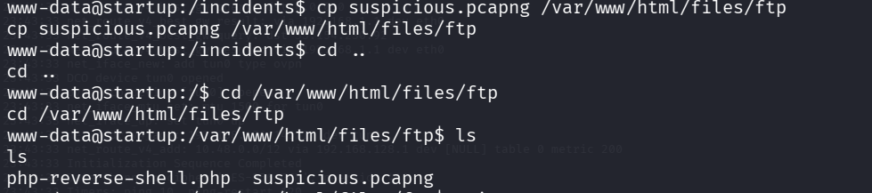

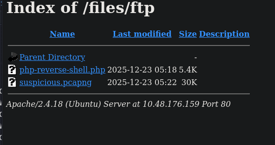

Lets open that file using wireshark 

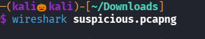

In wireshark right click on any tcp packet and in follow choose tcp stream 

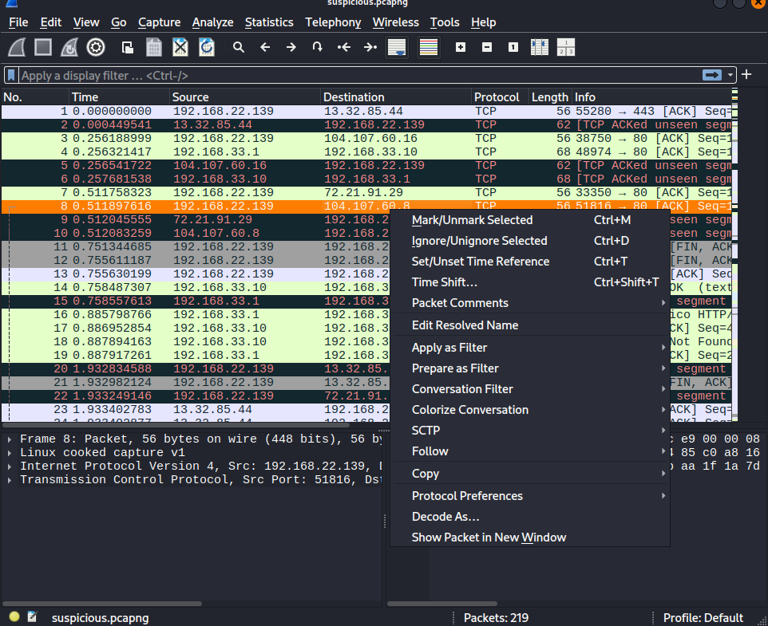

in stream 7 i found some juicy information 

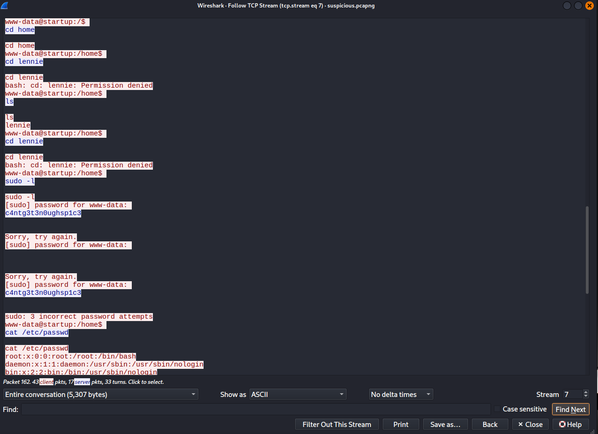

We succesfuuly found the username and password 

Lets try to login into ssh with that credentials

We successfully loged into ssh

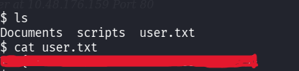

We successfully found the user flag

I tried sudo -l to see what user can execute under root privilage , but lennie user dont have any root permission

Lets naviagte to script file where i found a planner.sh 

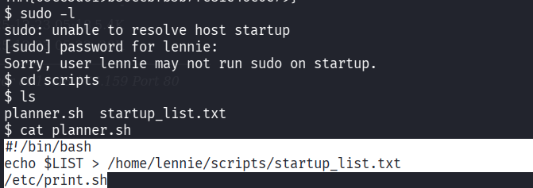

we cant run planner.sh but i found that planner.sh runs a file print.sh and we have permission to modify print.sh

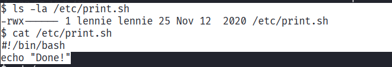

Lets write a reverse_shell to print.sh , therefore when root executes planner.sh , print.sh also executes and we get a root shell

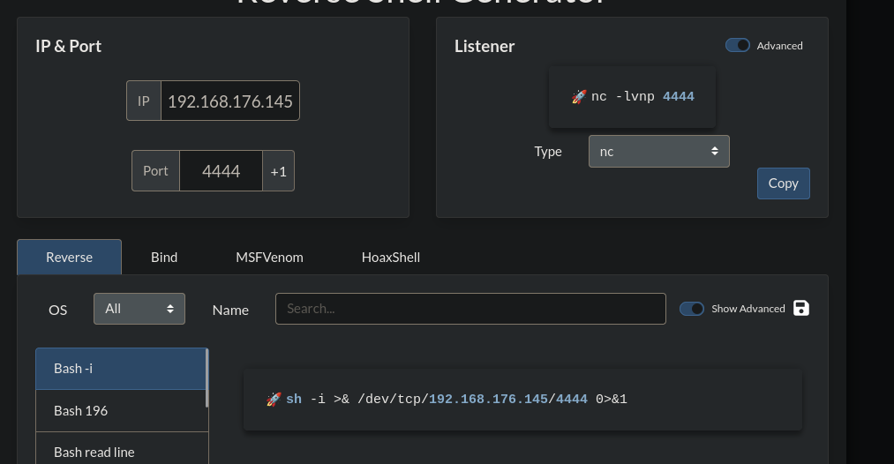

set a nc listener

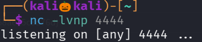

modify print.sh

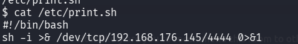

Wait until the root executes planner.sh

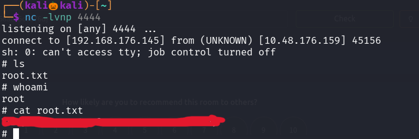

We got an reverse_shell

We successfully found the root flag

----------------------------------------------THE END----------------------------------------------

