## Lets start with an Nmap Scan 

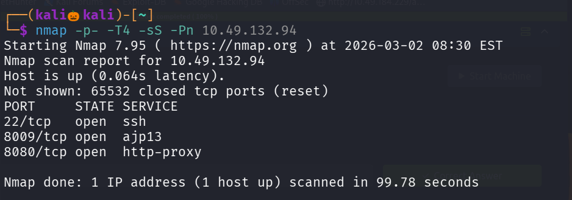

Found three open ports , lets perform service version detection and default script scan on them 

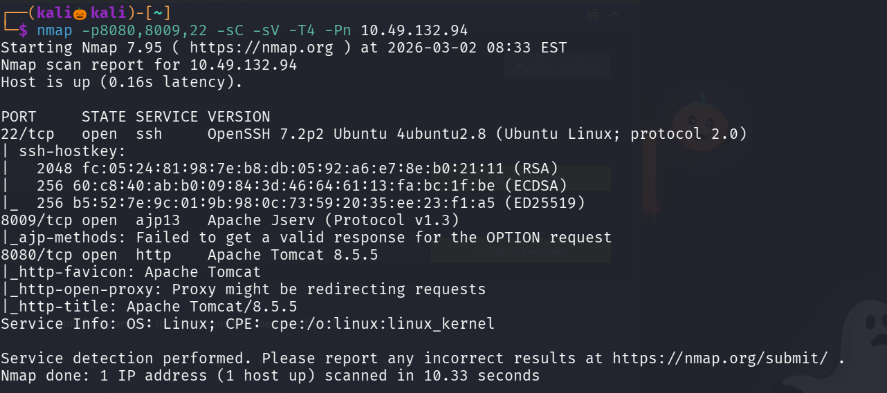

lets visit the site running on port 8080 

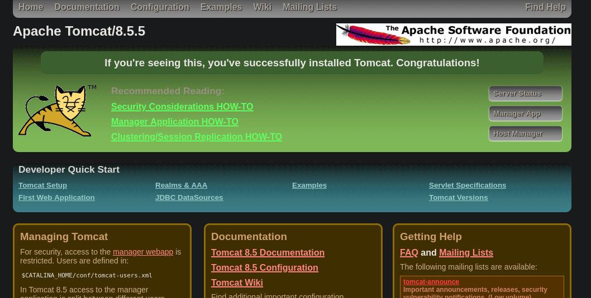

On clicking on Manage App it popup a login page 

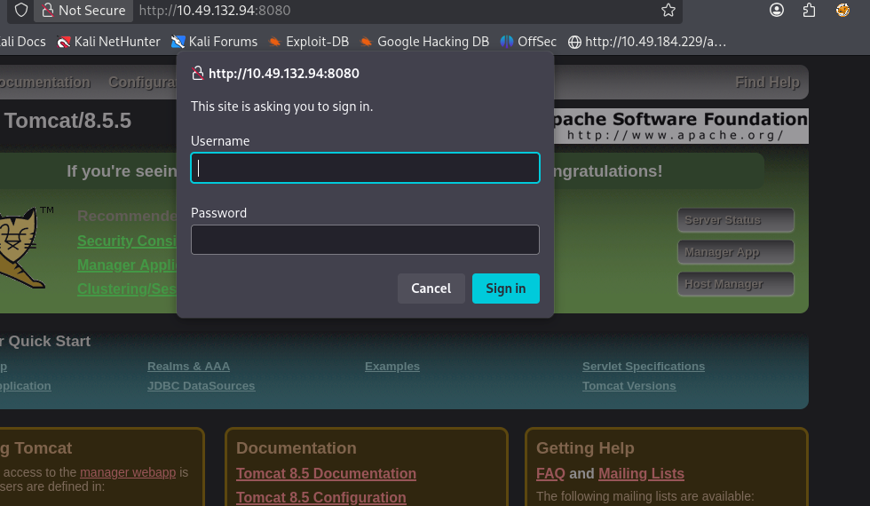

on 401 unauthorized page we found the username and password , lets login with those credentials 

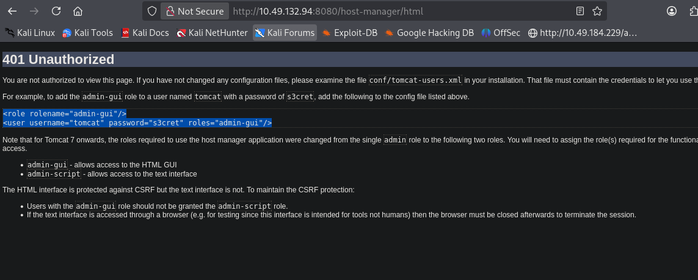

after login found a file upload functionality , seems like we can only upload war files 

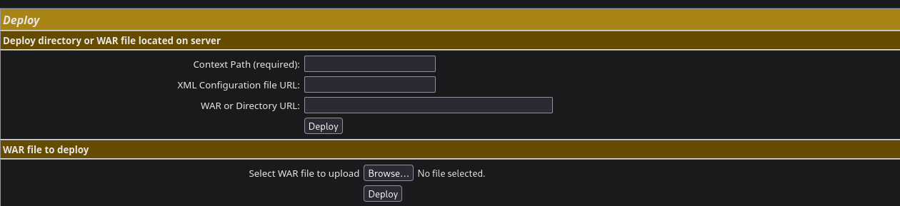

lets creat a java payload with msfvenom with .war extension 

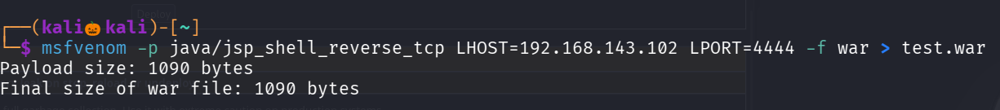

lets set up a multi/handler for receving our connection 

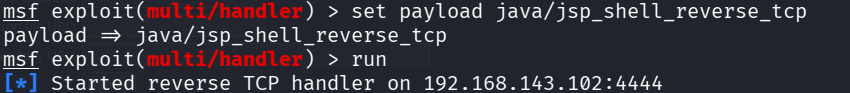

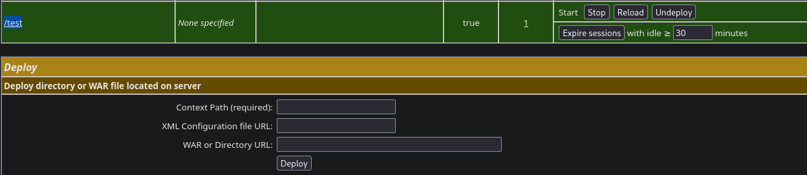

our test.war payload has been uploaded , click on the /test to access it 

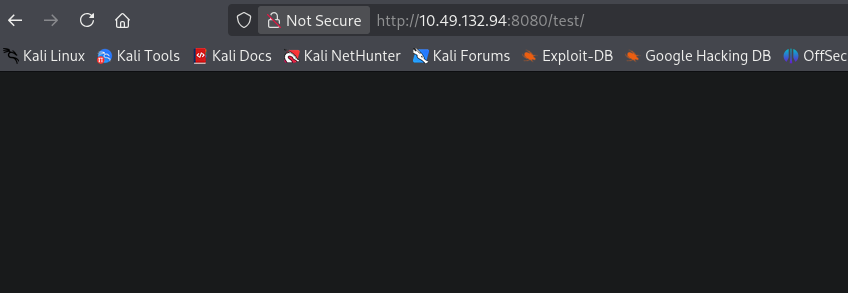

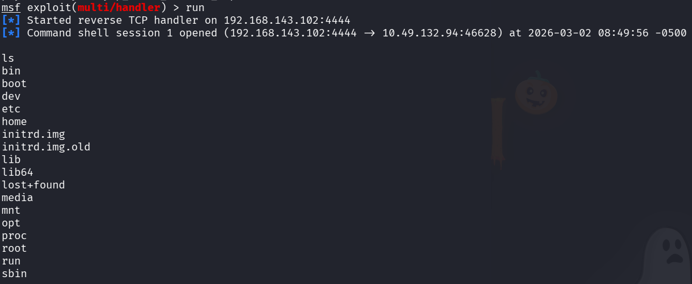

we got our reverse shell , there is post exploit module in metasploit to upgrade our shell to meterpreter , lets try that 

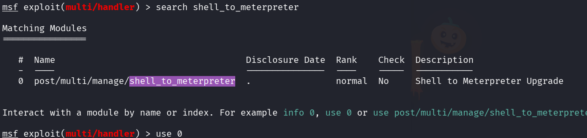

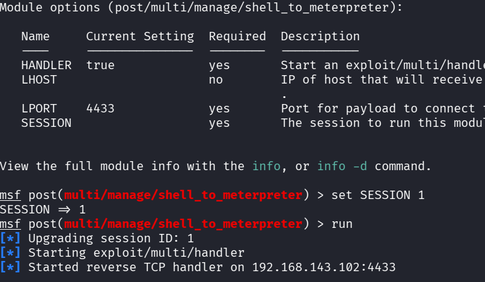

We successfully found got the meterpreter shell , lets visit the /home
/jack folder 

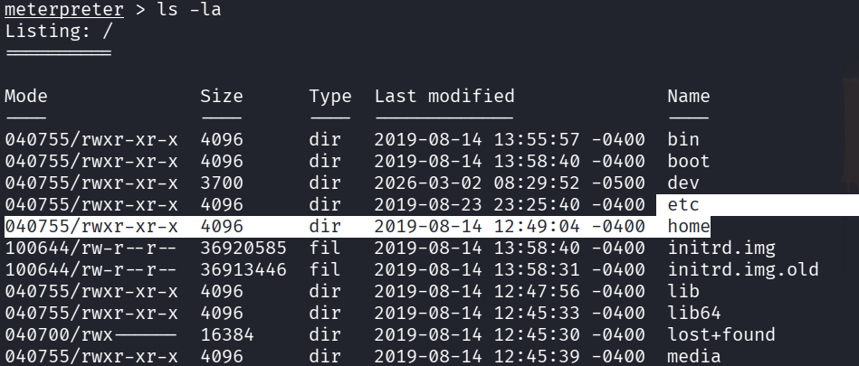

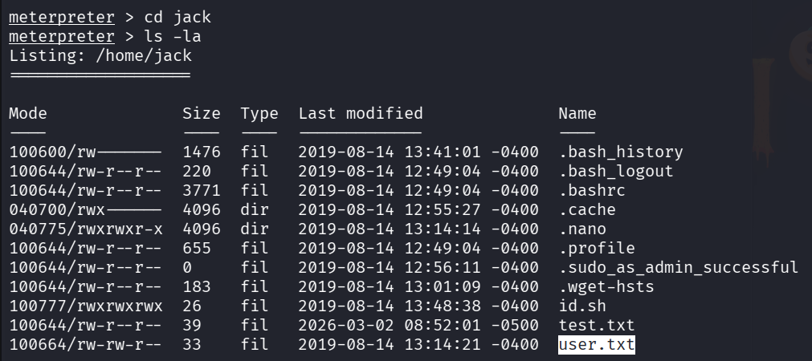

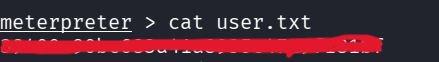

We successfully found our user flag , lets esclate our privilege to find the root flag

tried sudo -l , searched for files with suid permission but no privilege esclation factor has been found , lets visits the crontab 

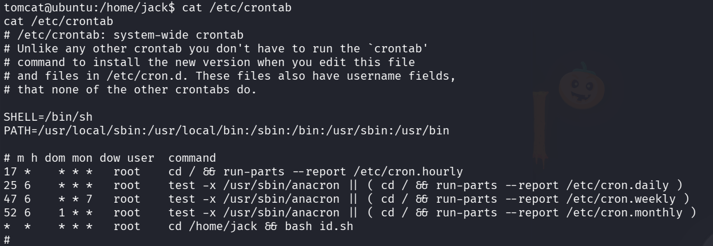

found that root user has been executing  a id.sh script every minute , we have read and write permission to the id.sh script 

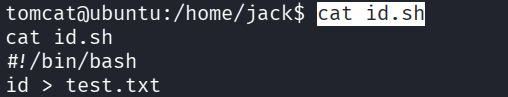

so generate a bash reverse shell and modify the contents of the id.sh file with our reverse shell 

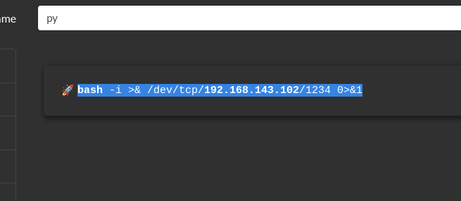

set up a nc listener 

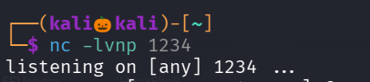

lets modify the contents of id.sh with our reverse shell 

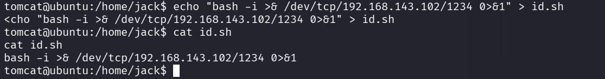

after some seconds we got a reverse shell with root privilege 

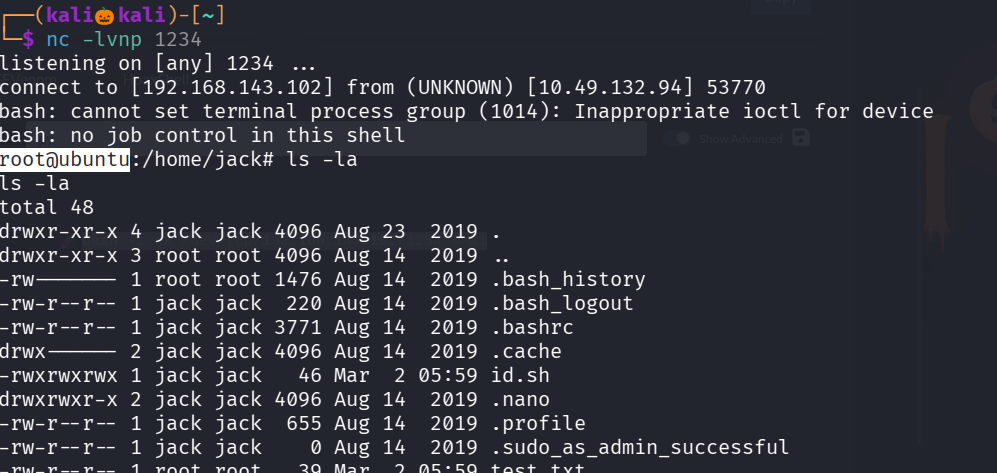

lets navigate to root directory and read the root.txt 

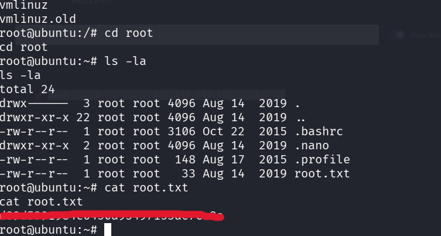

We successfully found the root flag 

----------------------------------------------------THE END---------------------------------------------------------

