## Lets Start With an Namp scan 

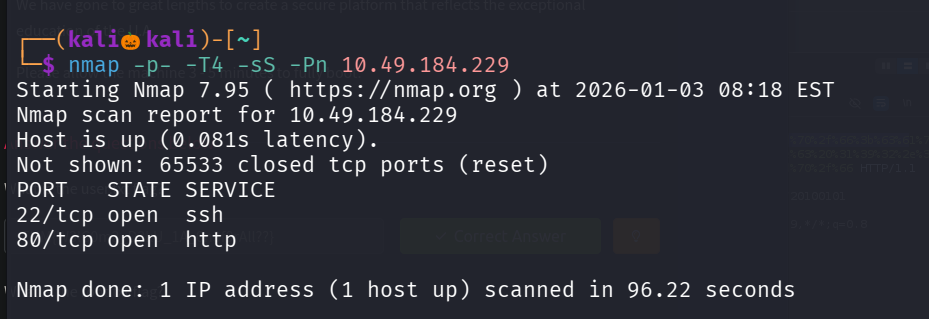

We found that there are two open ports , lets perform default script scan and service version detection on them

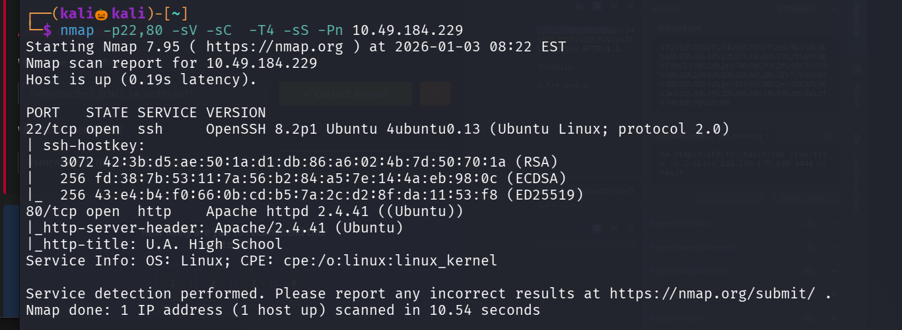

Lets visit the running on port 80

Lets use gobuster to enemurate the web directories

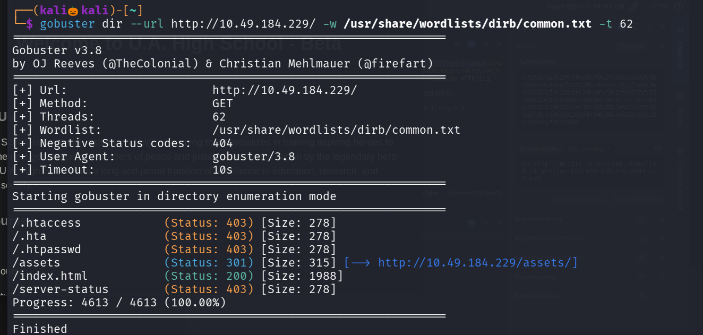

we found a path /assets lets again use gobuster to enemurate the directories under assets 

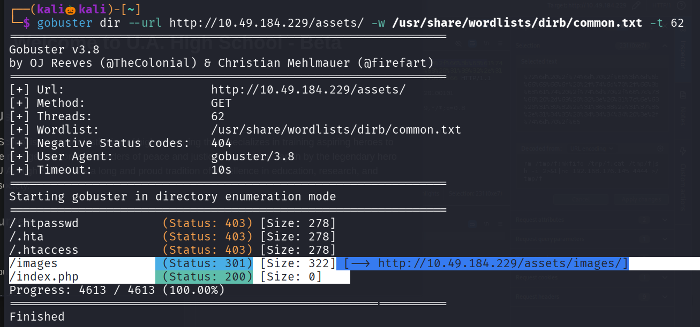

We found that we found a index.php file , when i visit the url it showed a blank page

Lets use burp to see the backend requests 

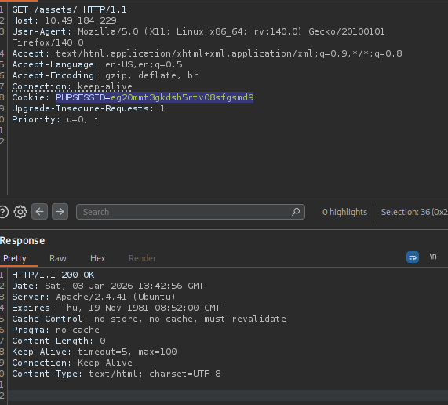

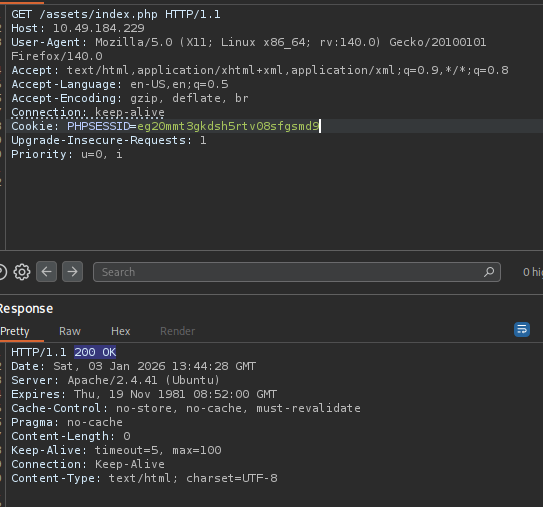

We can see that there is a PHPSESSID is created that means , a PHPSESSID is created when Php code runs on a server 

That blank might due to error might have occured when the index.php code is executed so the program might excepting a parameter 

So lets perform parameter enemuration using gobusters 

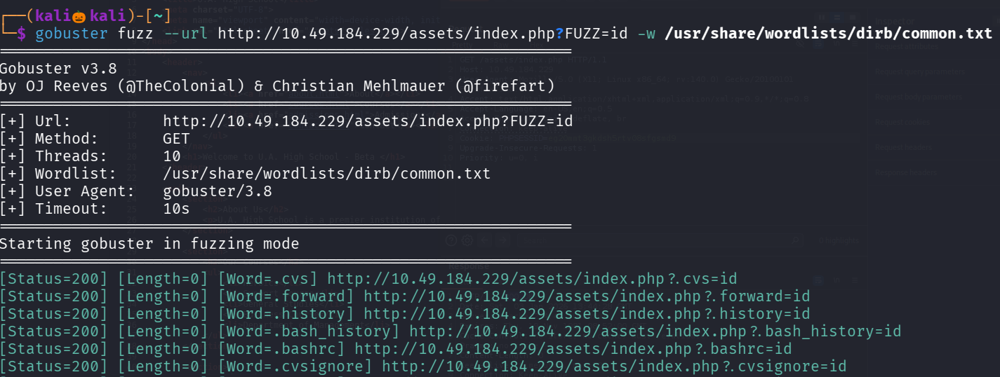

since we get 200 ok for all the parameters so lets exculde the length 0

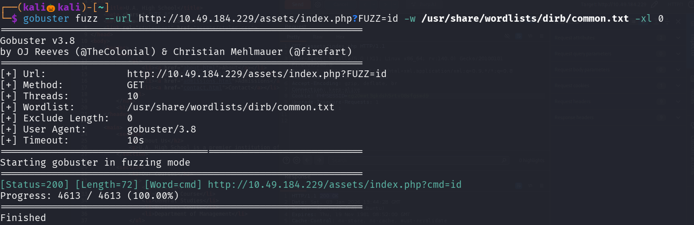

We found the parameter cmd

Lets see the contents 

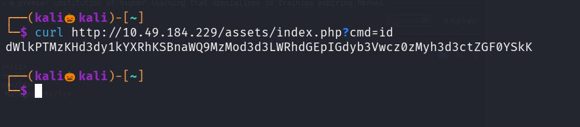

it is in base 64 encrypted format , lets decode it 

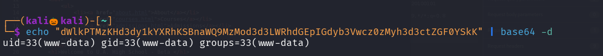

Seems the id command has been executed , so instead of id lets try executing a nc reverse shell 

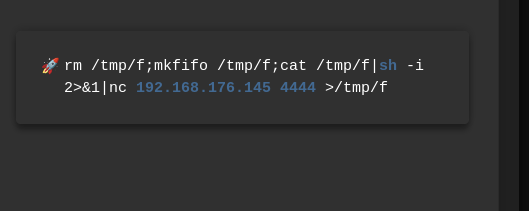

Lets set up a nc listener

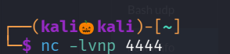

if we paste the payload normally it is not working , so lets perform url encode on it and send it

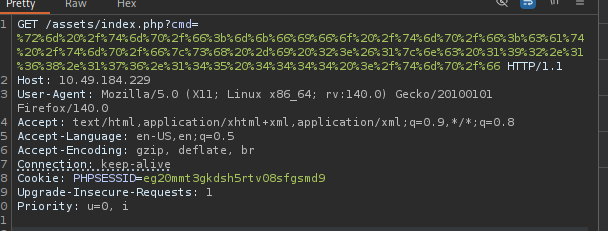

We successfully got a reverse shell

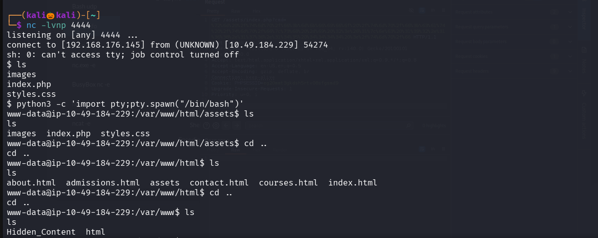

While visting the directories found a folder Hidden_contens

Lets see the files inside it 

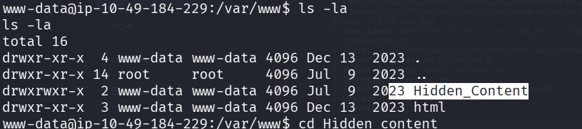

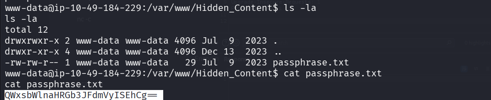

We got a passphrase usually when extracting a hidden information from an image we required an passphrase

The passphrase looks like it is base64 encrypted , lets decrypt it

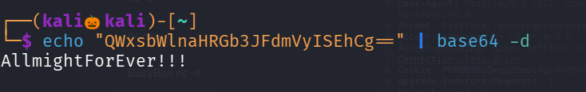

We found that in gobuster in assets directory there is a path /image 

Lets visit it , found two images lets get one of them and check that

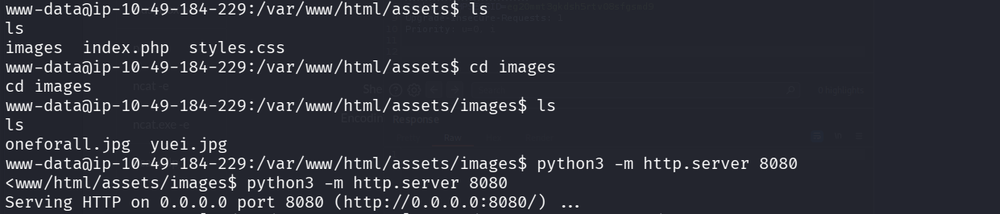

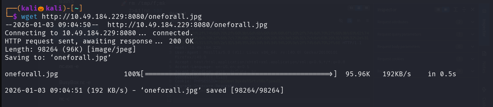

Lets use steghide to exxtract the information with the passphrase

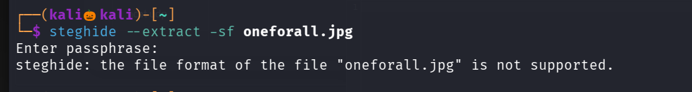

I think the file format is wrong , while checking in hex editor the magic bytes are in png format ,lets change it to jpg

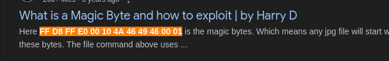

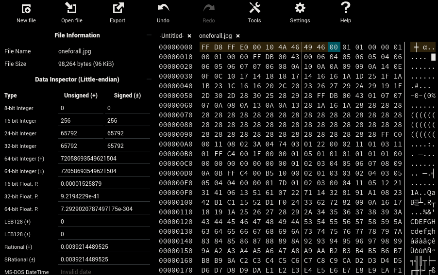

Now lets download the image and check it 

We found a username and password , lets use that to login into ssh 

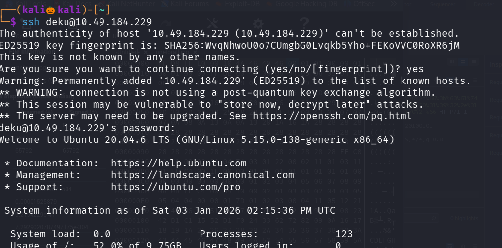

We successfuly login into the ssh

Lets view the user.txt file

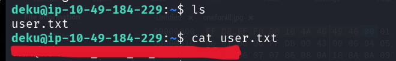

We successfully found the user flag

Lets esclate our privilage to get the root flag 

type command : sudo -l  

to see what the current user can run with root privilage 

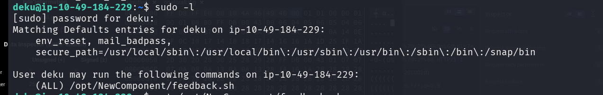

Seems like he can execute an bash file feedback.sh 

We cannot able to edit or  remove the file , so while reading the file 

We can see that it is not filtering ">>" symbol and before it is writing the contens to feedback.txt , it is executing the command using eval 

eval is used to execute commands 

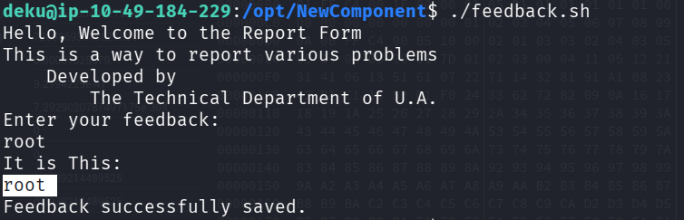

When i gave root , it is using eval "echo "root"" this will print root on the terminal before writing it into feedback.txt

so lets edit the sudoers file and give the user deku NOPASSWD for all commands

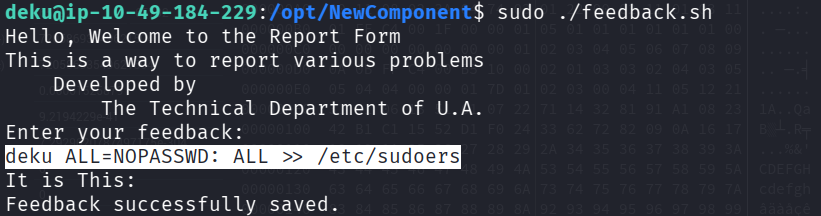

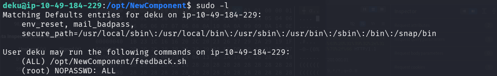

Now we can run any commands with root privilages 

So lets spawn a bash shell and view the root file 

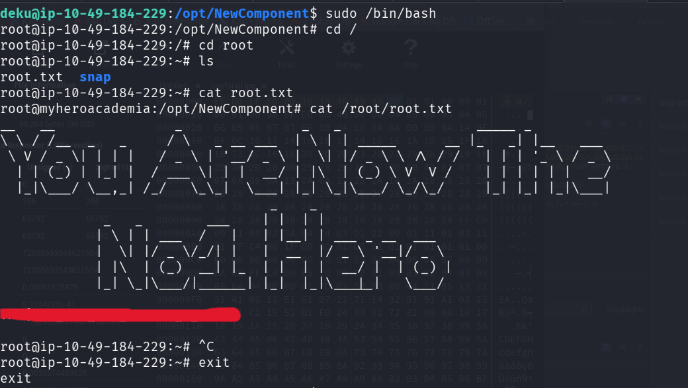

We successfully found the root flag 

----------------------------------------------------------------------------THE END------------------------------------------------------------------------------------------------

