## Lets start with an Nmap Scan 

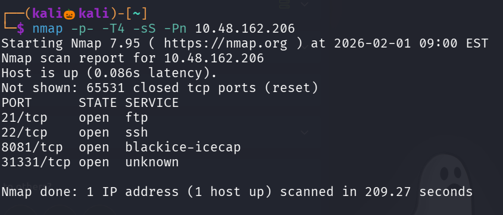

we found four open ports , lets perform service version detection and default script scan on it 

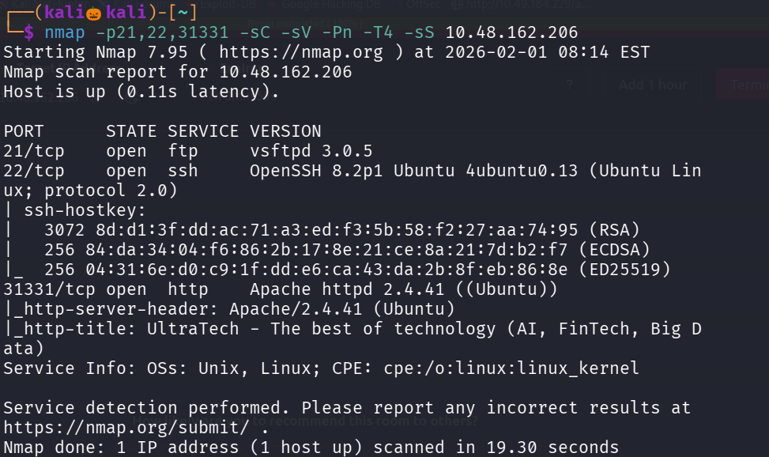

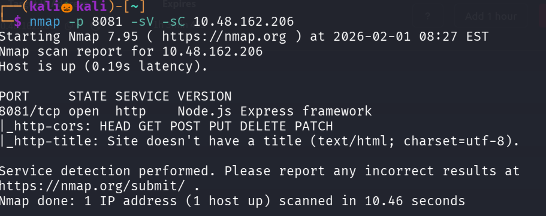

seems like a Apache site has been running on port 31331 , lets use gobuster to enemurate some web directories 

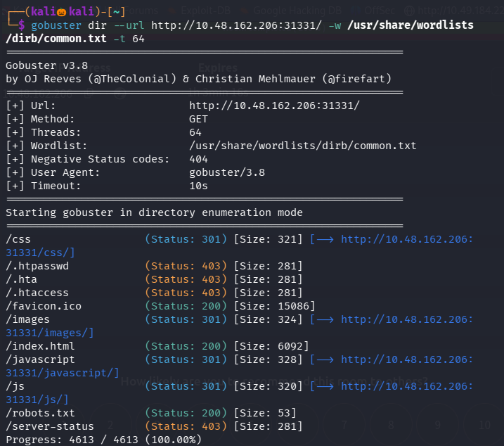

lets visit the contents of robots.txt

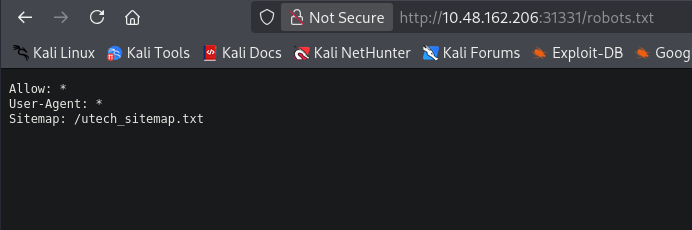

we found a sitemap : /utech_sitemap.txt , lets see the contents of it 

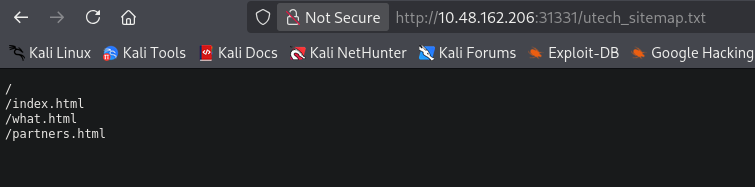

no juicy information is found on /index.html and /what.html 

lets visit /partners.html

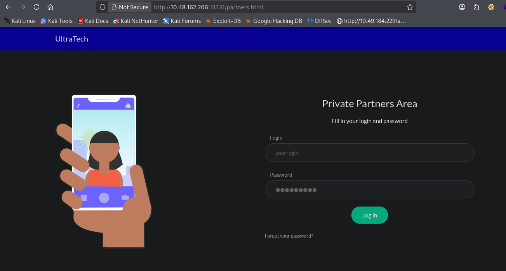

we found a login page , lets check for any information disclosure 

right click and click on view-page source 

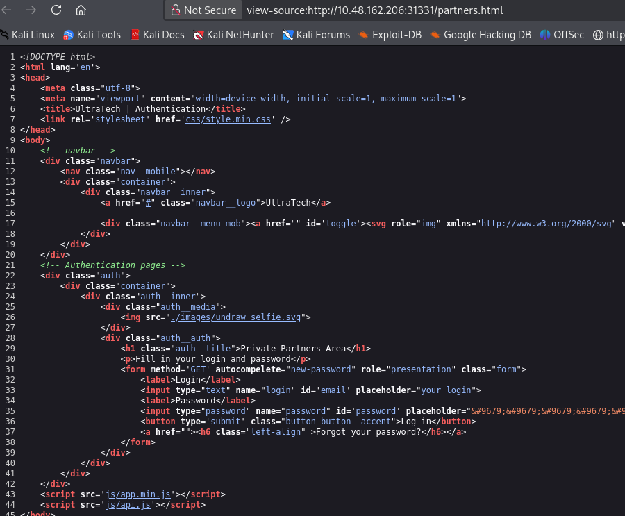

in bottom found two paths 

where js/api.js seems to be intresting , lets see the contents of it 

Lets try command line injection on the particular url 

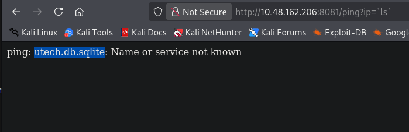

single quotes does not work , so try backslash it worked 

'ls' is just text

Shell treats it literally

No command execution

Shell sees backslash

Executes the command inside them → ls

and we found a database lets see the contents of it 

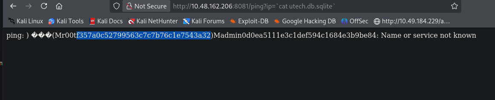

We found a username r00t and the password in a hash format , lets use hashes.com to crack it 

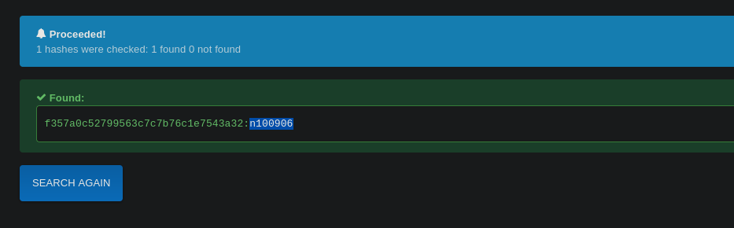

We successfully found the username and password , since ssh port is open , lets try login over ssh with our found credentials

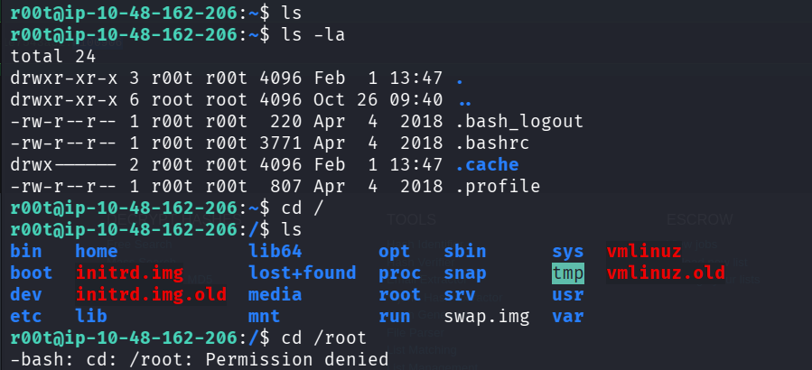

for the final answer we want to visit the first 9 characters of the ssh priviate key of root 

tried : sudo -l , visited crontabs , checked for files with suid permission but no juicy information is found 

so lets try id command 

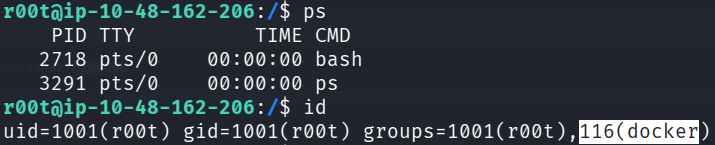

semms like docker has been running on this machine , lets use gtfo bins for privilage esclation with docker

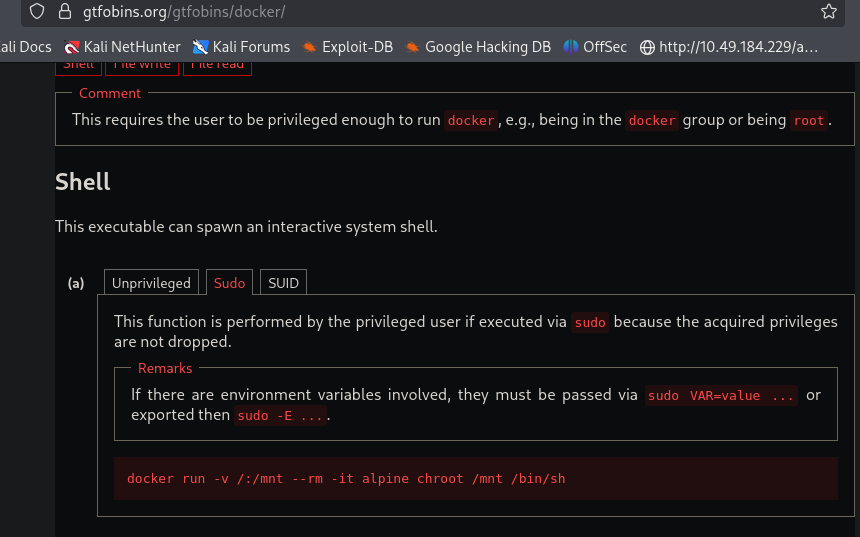

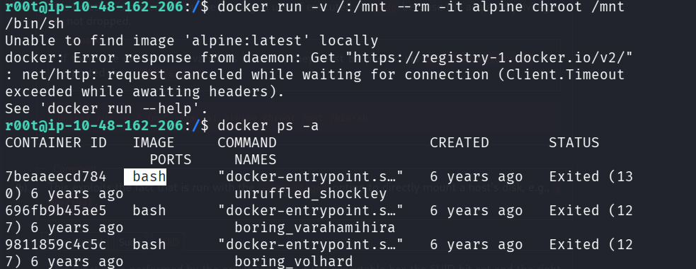

since there is no image like alpine , lets check for images using command : docker ps -a

found a image bash , lets try that in place of alpine 

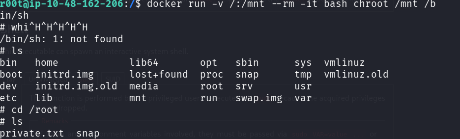

we successfully got the root shell , now lets visit the ssh private key 

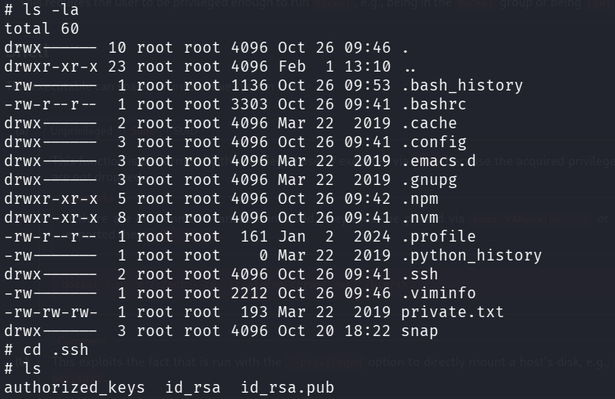

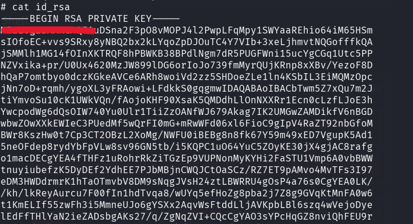

------------------------------------------------THE END-------------------------------------------------

