## Lets start with an Nmap scan 

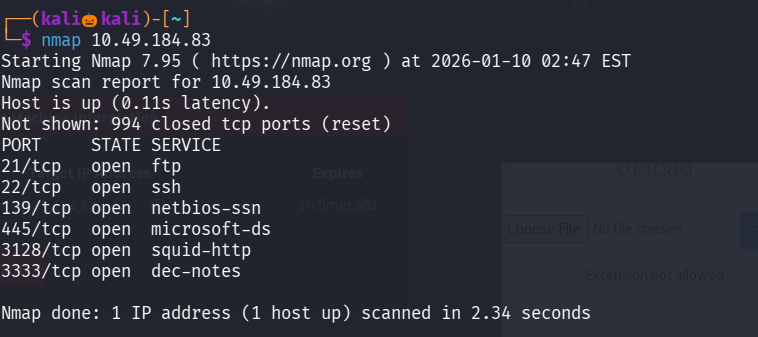

We found six open ports lets perform service version detection and default script scan on them

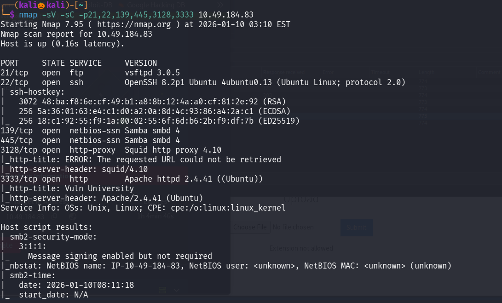

We found that a apache http service is running on port 3333 lets visits it 

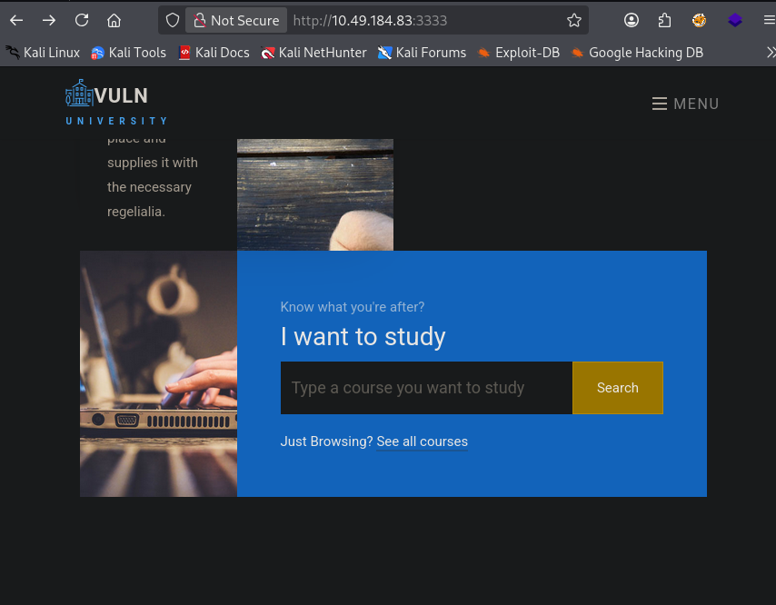

Lets use gobuster to enemurate the web directories

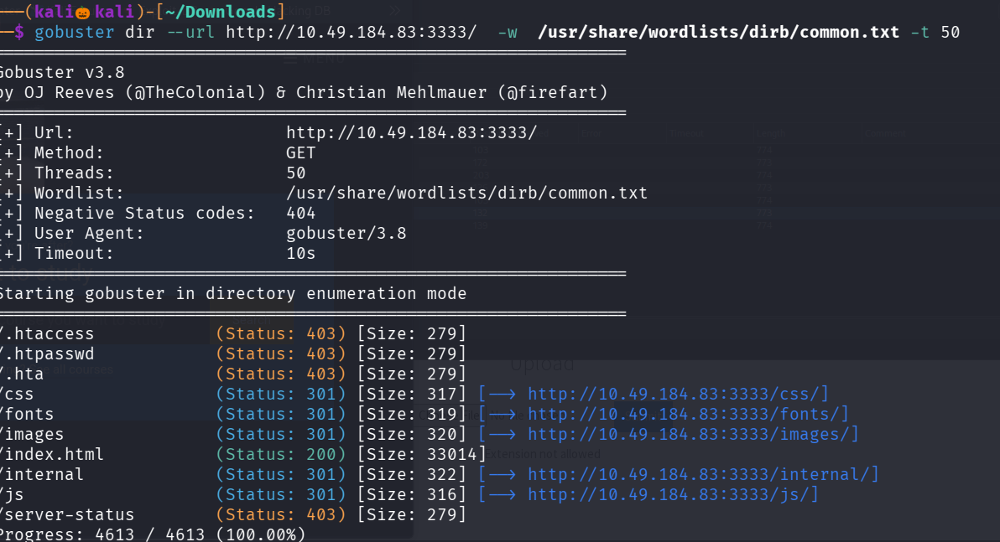

in path /internal we can able to upload files , lets try file upload vulnerablity and obtain a reverse shell

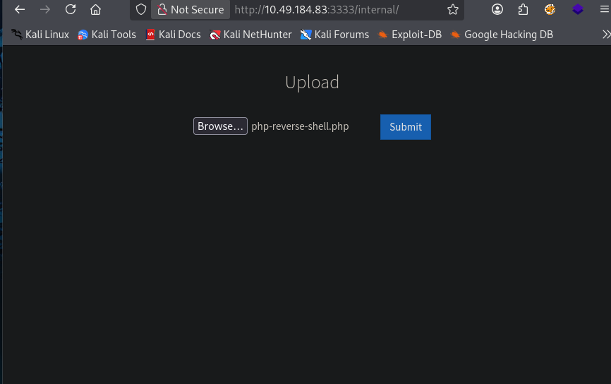

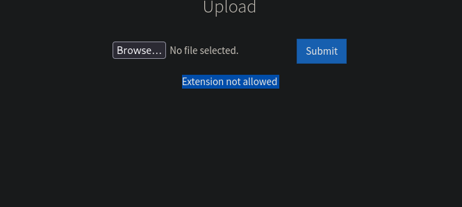

Semms the php extension , so lets different extensions 

after trying many exxtensions .phtml worked 

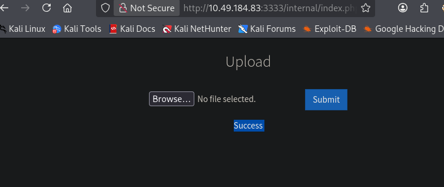

Since we dont know the path where the php shell is uploaded so lets use gobuster to find it

Lets go navigate /uploads path

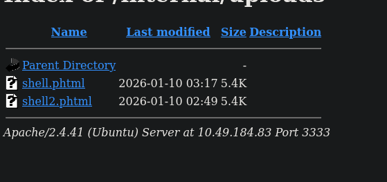

set up a nc listener and click on the reverse shell code we created 

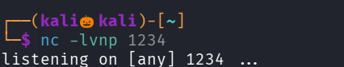

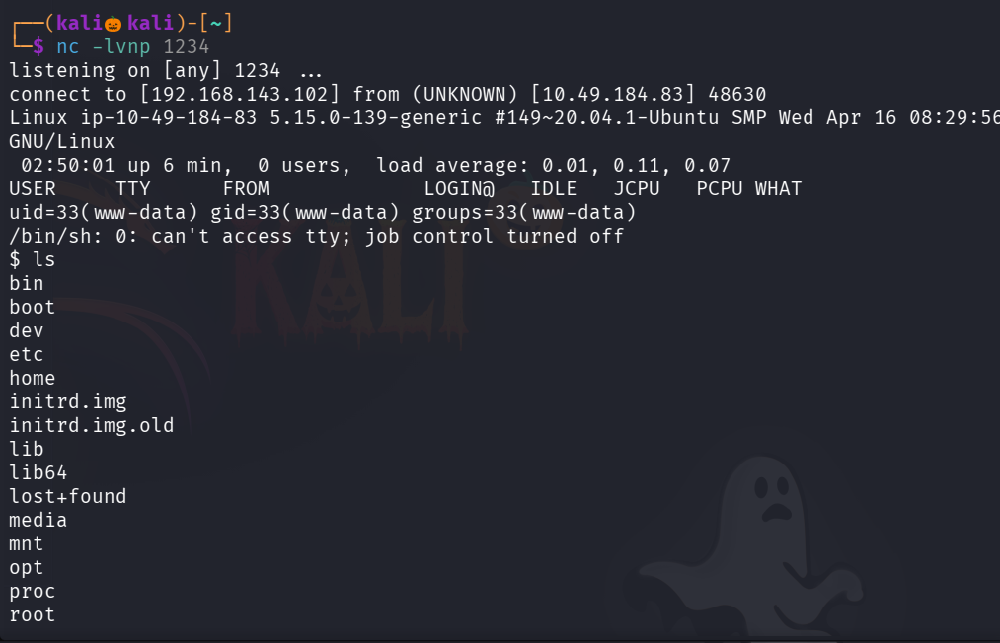

We successfully got the reverse shell 

Lets go to home directory 

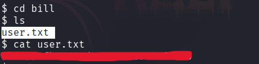

