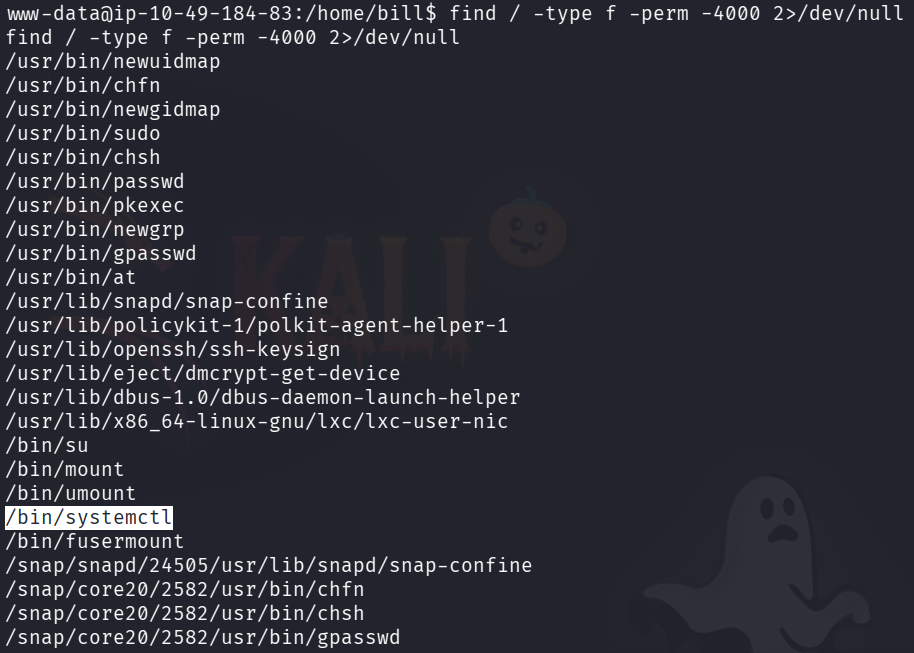
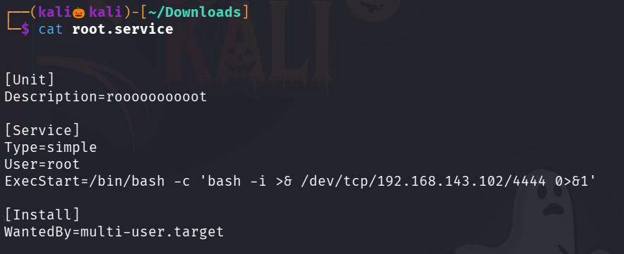
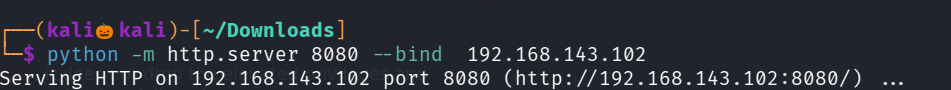
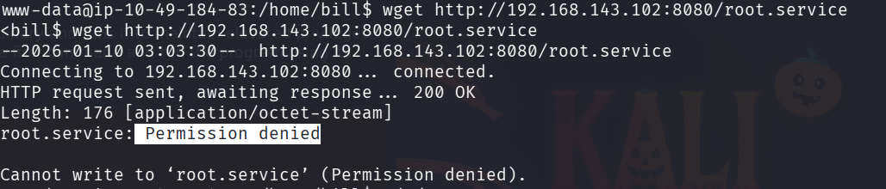
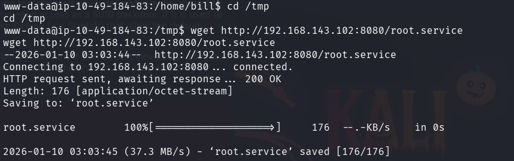
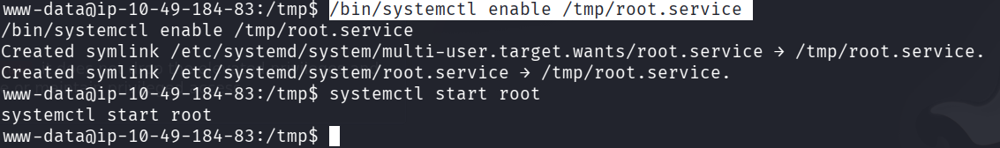
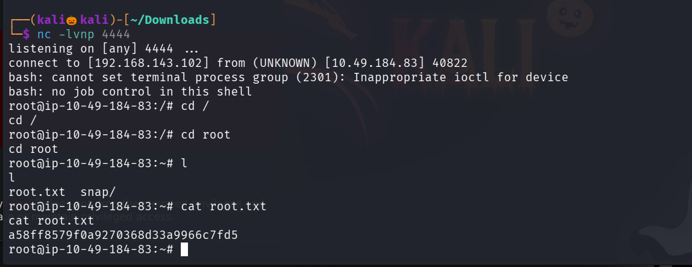

## Lets start with an Nmap scan 

We found six open ports lets perform service version detection and default script scan on them

We found that a apache http service is running on port 3333 lets visits it 

Lets use gobuster to enemurate the web directories

in path /internal we can able to upload files , lets try file upload vulnerablity and obtain a reverse shell

Semms the php extension , so lets different extensions 

after trying many exxtensions .phtml worked 

Since we dont know the path where the php shell is uploaded so lets use gobuster to find it

Lets go navigate /uploads path

set up a nc listener and click on the reverse shell code we created 

We successfully got the reverse shell 

Lets go to home directory 

We successfully found the user file 

lets esclate our privilage to find the root flag 

seems like we cant run sudo as this current user 

so lets find the files with suid permissions

systemctl command is used to enable,start or stop a service like ssh,ftp etc..

so we can create a service named root.service where we can able to spawn a reverse shell

lets start a python server and get the root.service file on the target system

use wget command to get the file

seems like our permission is denied so lets naviagte to tmp directory and try there

set up a nc listener

enable and start the root.service

We successfully got the reverse shell

we successfully found the root flag 

