## Lets Start With an Namp Scan 

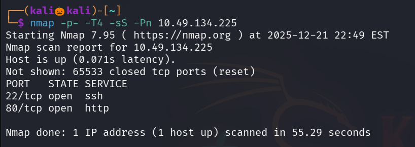

we found only two ports are open , lets perform default script scan and service detection on these two ports

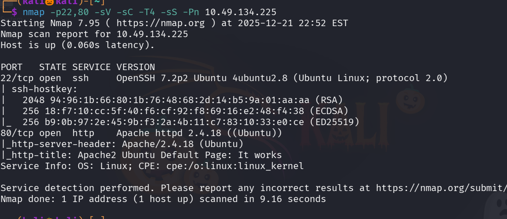

Lets vists the website running on port 80 its a normal apache defualt page lets inspect that , 

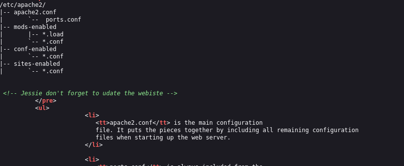

We found a username Jessie 

lets enemurate more , lets find webdirectories using gobuster

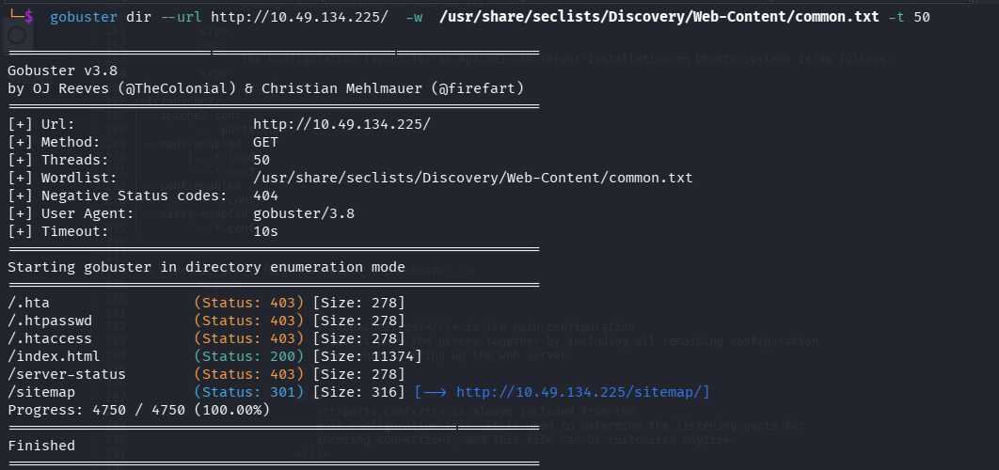

We found a directory /sitemap

Lets vistis that page 

I explored this website like inspecting it and navigating to all sections but no juicy information found

so Lets furture use gobuster to find directories under /sitemap

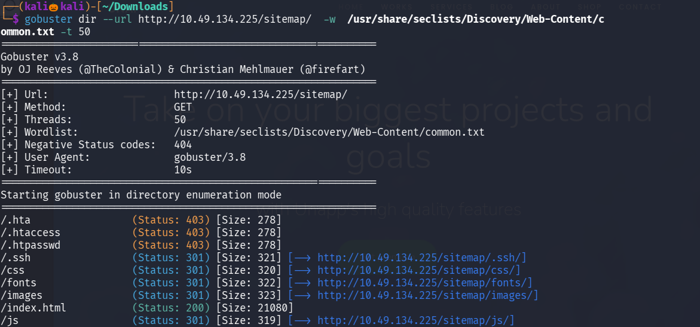

We found a intresting folder .ssh

lets visit it 

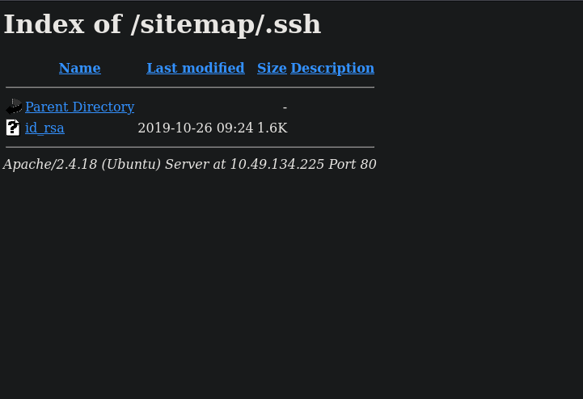

We got the id_rsa file 

We got the rsa private key which is useful for login into ssh and we already have an username we found before 

create a file copy the rsa key into the file change its permission
command : sudo chmod 600 <file_name>

now lets use the rsa key and username to login into ssh

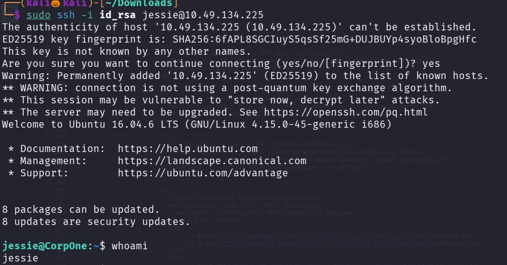

we successfully login into ssh 

i naviagte to few folders to find user flag but cannot manually find it so lets use find command

command : find / -name "user*"

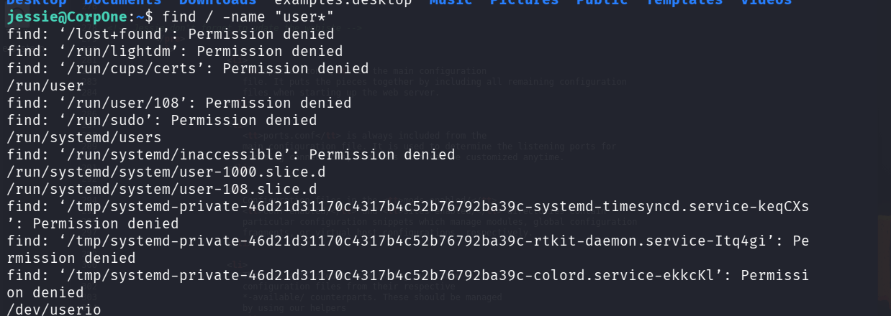

we successfully found the directory contains user flag lets navigate to it 

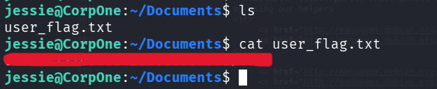

We succesfully found our user flag

Lets escalte our privilage to see the root flag

command : sudo -l --> show what the user can run with the root permission

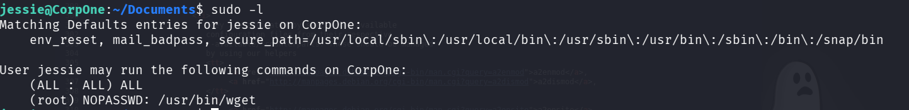

wget which is used to download a file using url in linux , since we have root permission for wget we try to pass the root_flag.txt to our system using wget

so start a netcat listener

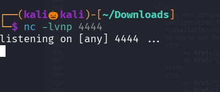

wget -h to see info about the command

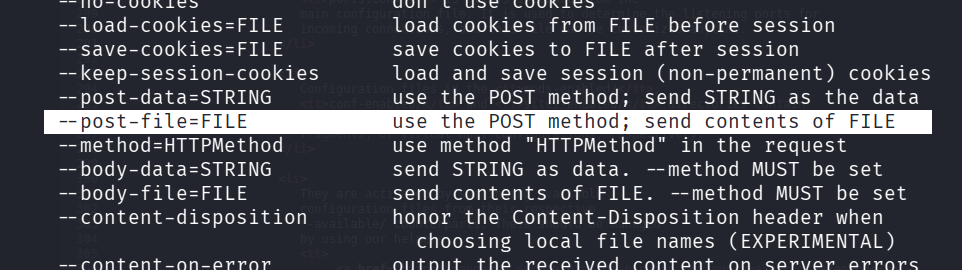

--post-file argument is used the send a file to the target system

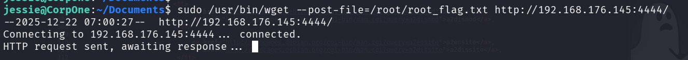

check our nc listener 

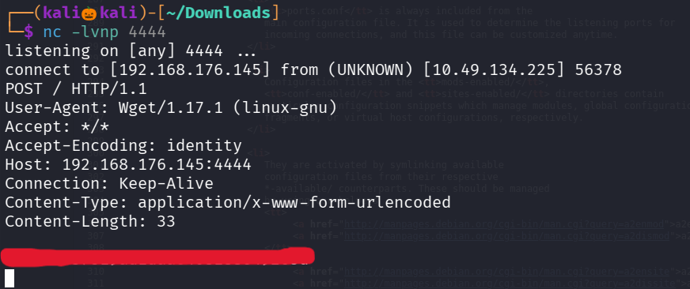

we successfully got our root flag

-----------------------------------------------------THE END---------------------------------------------------------

