## Lets Start With an Nmap Scan 

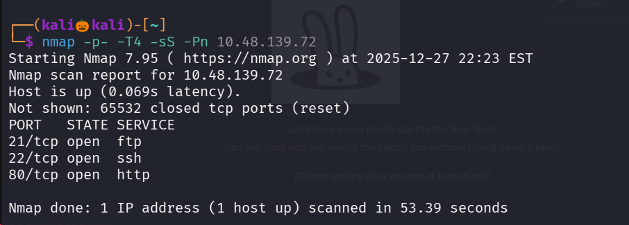

We found that there are three open ports , lets perform service version detection and default script them on these open ports

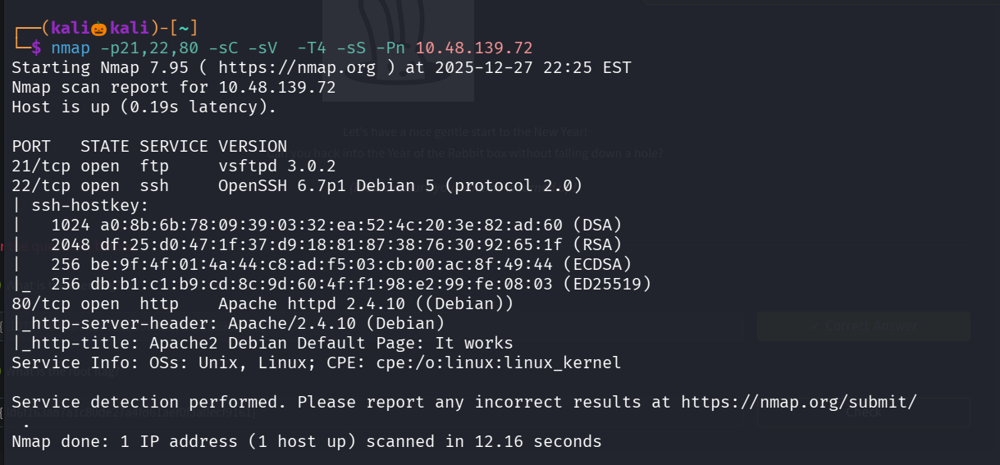

Lets vistis the site runnig on port 80

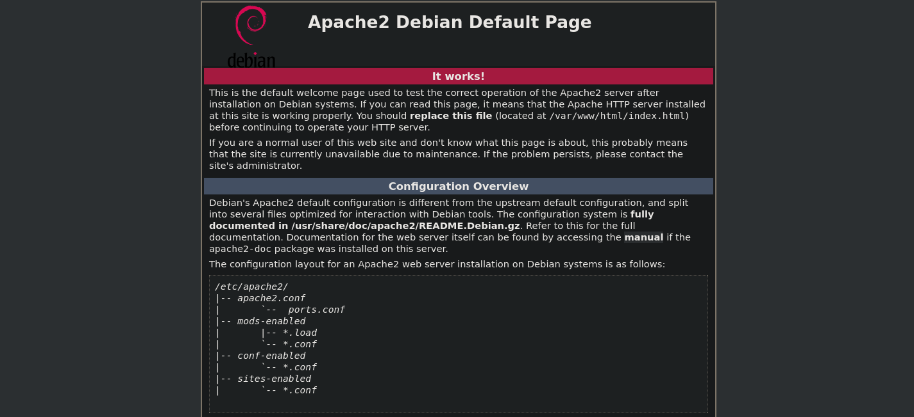

Lets use gobuster to enemurate the web directories 

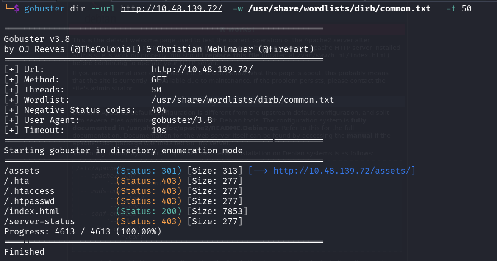

We found a path /assets lets visit it 

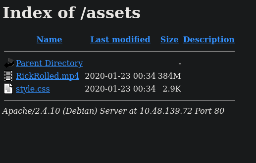

It consits of a mp4 video and a css file , 

i downloaded the video i tried to extract any hidden information in it , but no juicy is found 

So lets visit style.css file

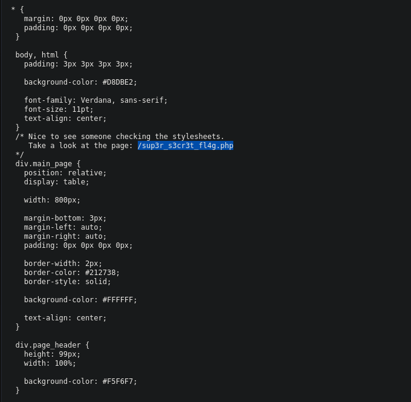

We found a path , when i vistis that it opened the same mp4 video in youtube 

Lets use burp suite to see the request flow while accessing the path

We found a hidden_directory 

Lets vistis it 

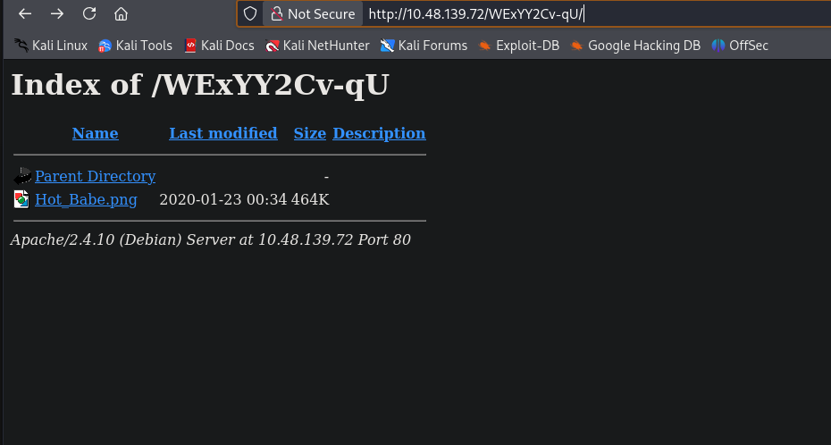

It contains an image , lets download it 

i used stegseek tool and exiftool to see any hidden file is ecrypted inside it , but no information is found 

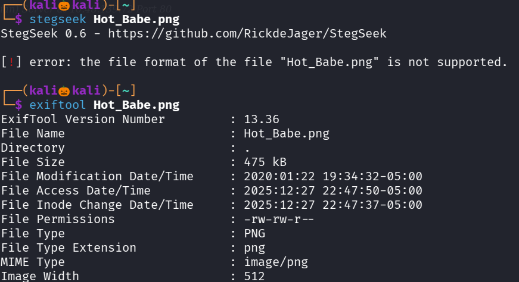

So lets use strings command to see the image binary in human readable format 

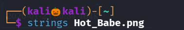

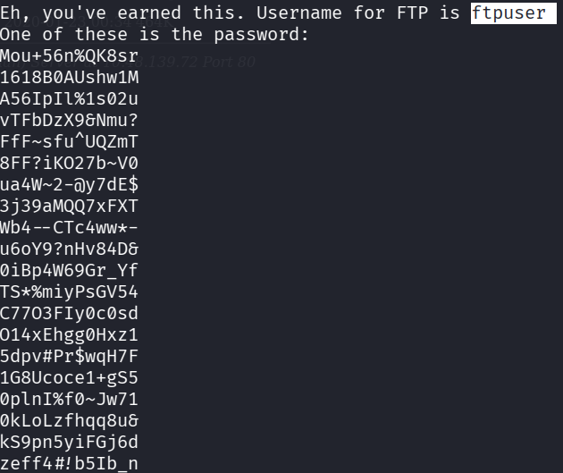

We found a ftp username and a list of password , lets copy that list of password to a file and use hydra to crack it 

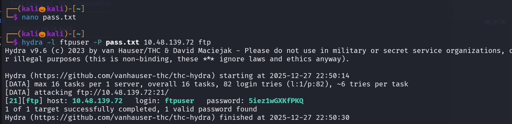

We successfully found the ftp password , lets login into ftp

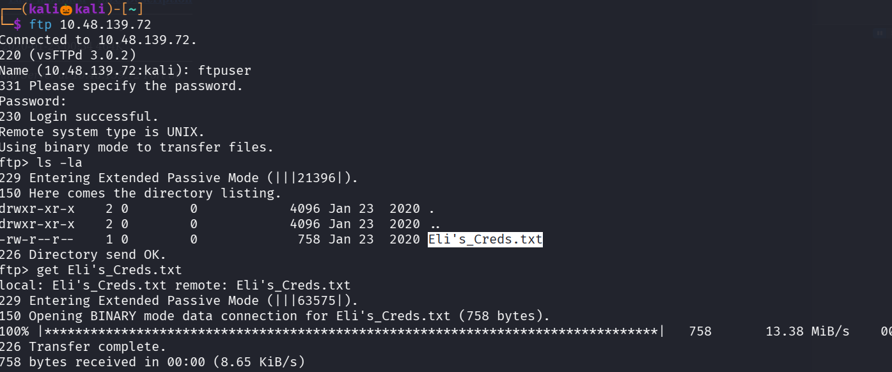

We got a file Eli's_creds.txt , lets get the file to our system and see the contents of it 

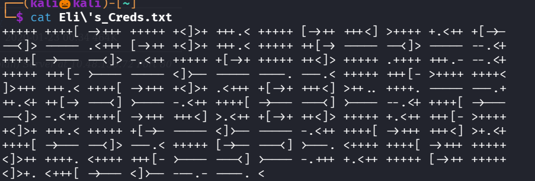

The text is encryted with some ciphers , lets use decode fr to identify the cipher as well as to decode it 

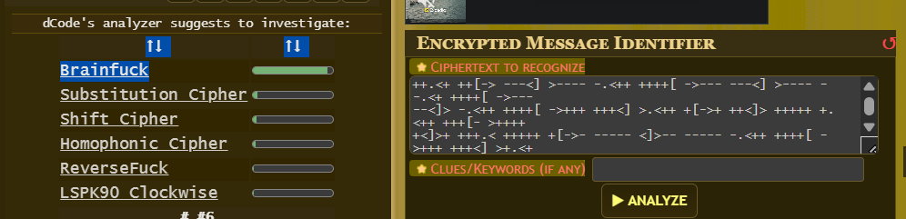

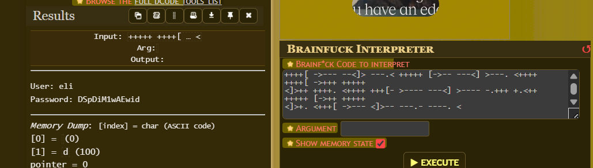

Now we got the username and password , lets use it to login into ssh

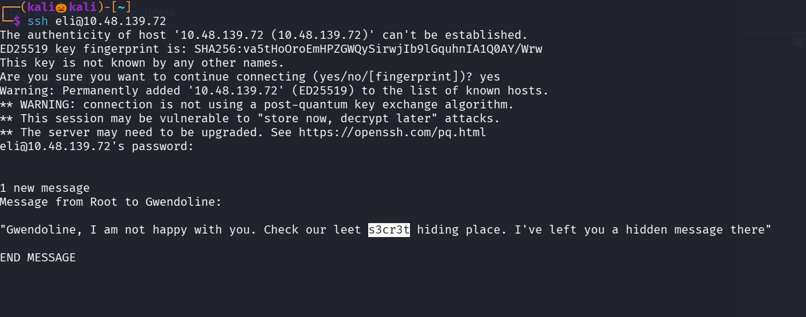

We have got one hint to check the s3cr3t hidden place 

Lets use locate command to find it 

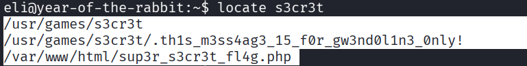

we have a hidden meassage lets see the contents of it

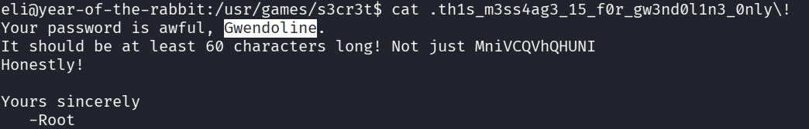

we have the username and password for another user , lets try login into that user

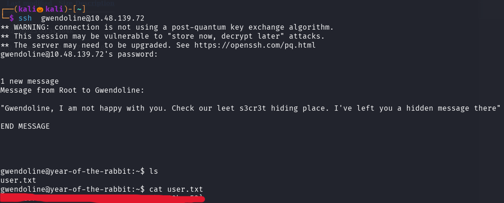

We have successfully found the user flag

Now we have to esclate our privilage to see the root flag 

when i type sudo -l , i didnt notice !root , and i searched for vi sudo privalge esclation in gtfo bins and tired the command and it didnt work

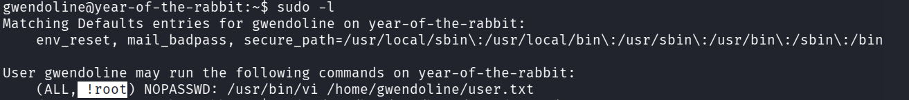

!root means user can run commands as anyone except root 

there is a not root vulnerability : !root vulnerability (CVE-2019-14287)

we can use commands like : sudo -u#-1 <command>

Where -u for uid 

uid for root user : # or 0
uid for normal user : 1000 ,1001 like that

when we give -u#-1 sudo thinks it is not a root , but linux thinks it is a root 

and this vulnerability is aplicable only for odler version of sudo

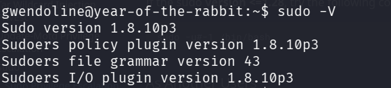

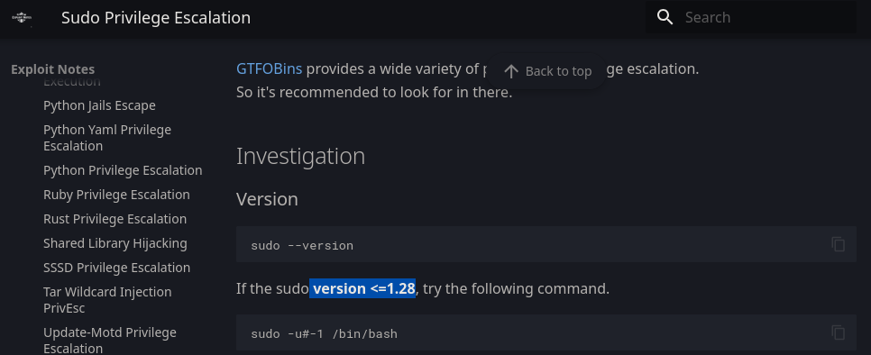

lets try gtfo bins command with this command

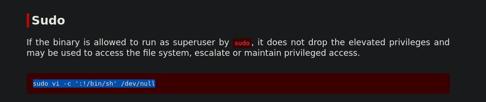

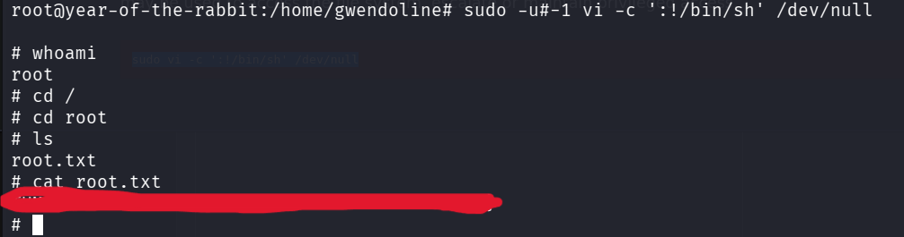

we successfully found the root flag 

----------------------------------------------------------THE END-----------------------------------------------------------

