## Lets start with an nmap scan 

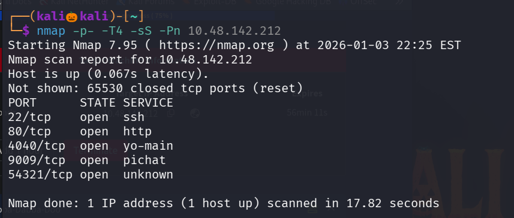

we found 5 open ports , lets perform service version detection scan and default script scan on them 

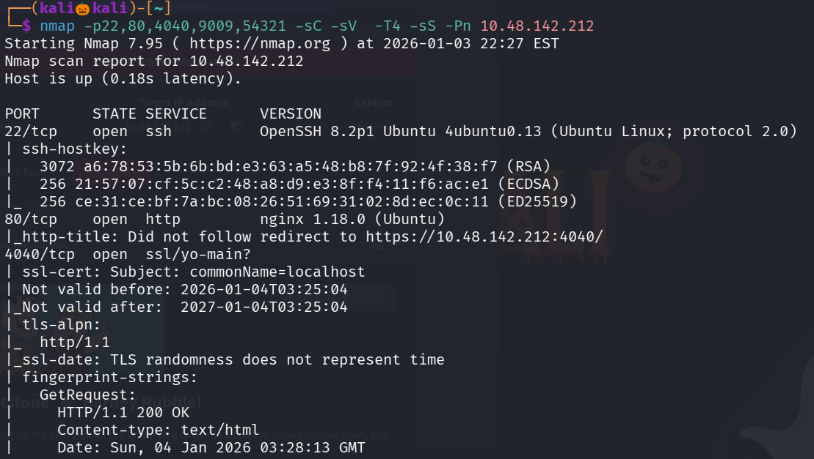

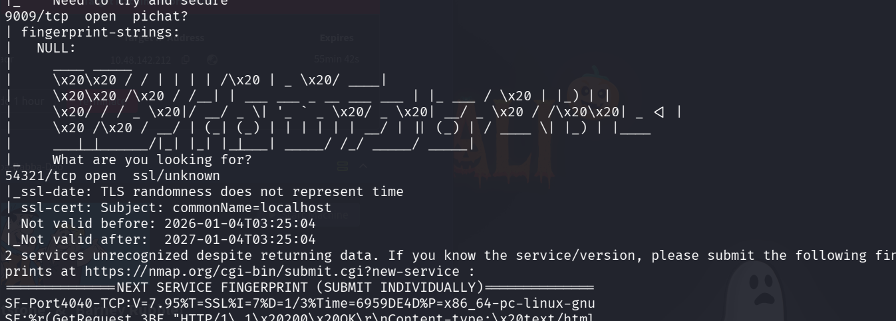

When i try to visit the site running on port 80 it redirects to port 4040

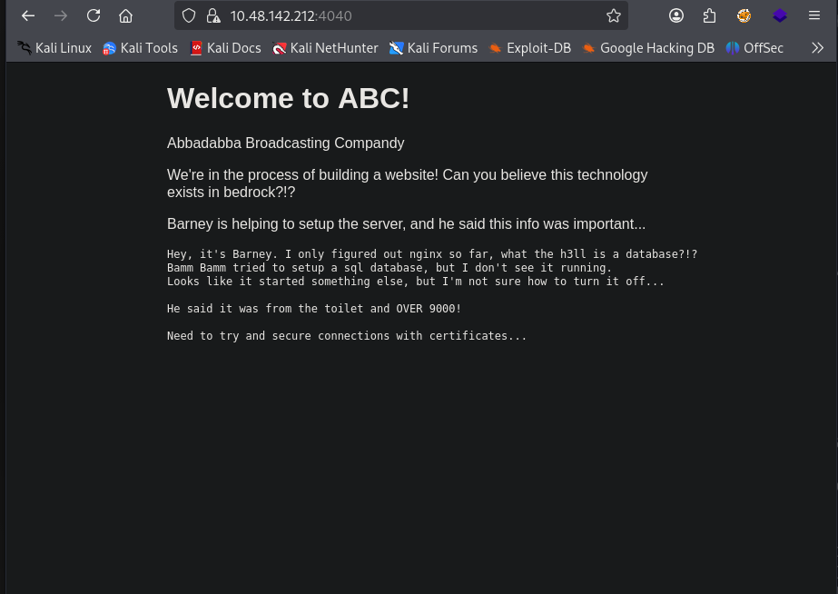

I tired using gobuter to enemurate web directories and also inspected the page for any information disclosure but no information is found

seems like there is a service listening on port 9009 , lets use net cat to connect to it 

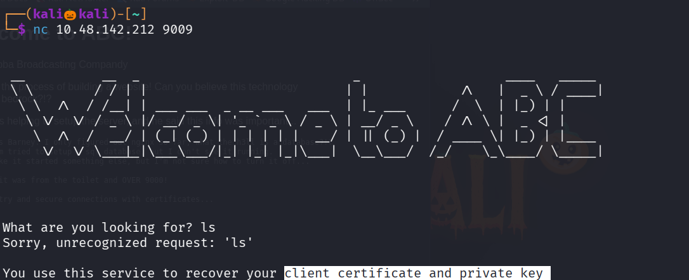

we cant able to excute commands but it seems like we can get the private key and client certificate 

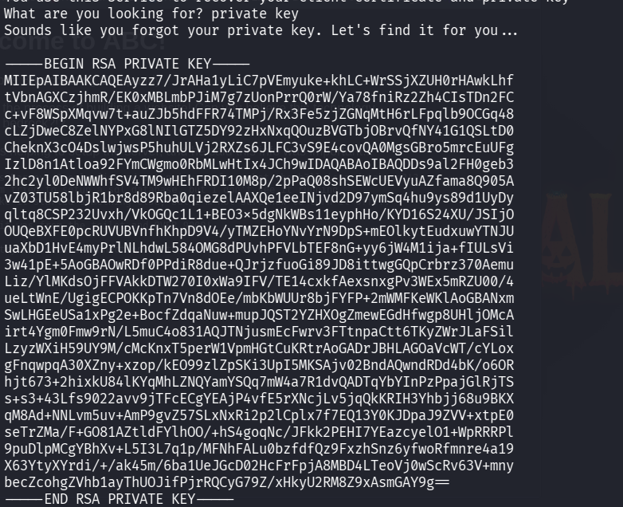

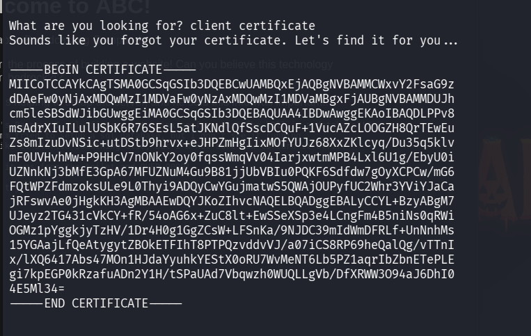

Lets copy them both into a separte file 

in our nmap scan we found ssl service is active on port 54321 , lets use this private key and client certificate to connect to it

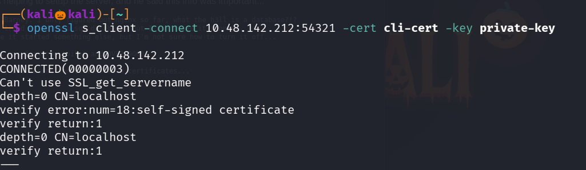

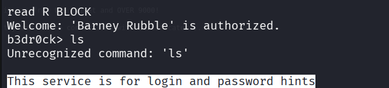

Seems like here also we cant able to execute commands , type password to get the password hints

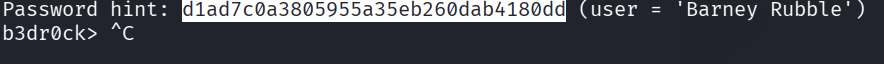

We found a username barney and the password seems to be it is hashed with md5 , but i cant to crack it , so lets try the same password to login into ssh 

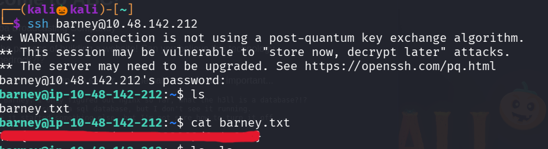

we successfully found the barley.txt file 

i found a user fred and listed his files there is a file called fred.txt but we cant able to visit it as our permission is denied

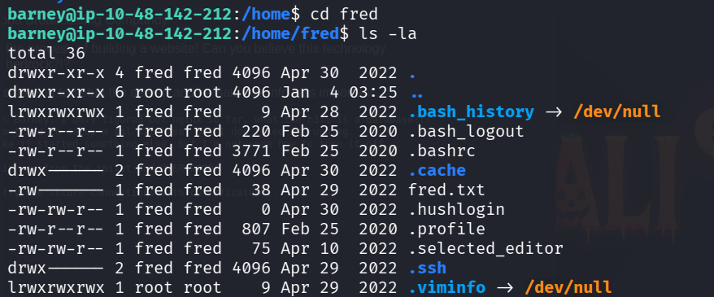

Lets try sudo -l to see what the current user can run with root privilage

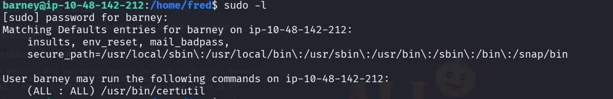

certutil command is used to list the certificates , manage certificates etc .. 

lets use it view the certifictes of fred 

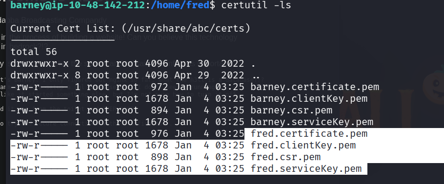

lets view the fred.certificate.pem file 

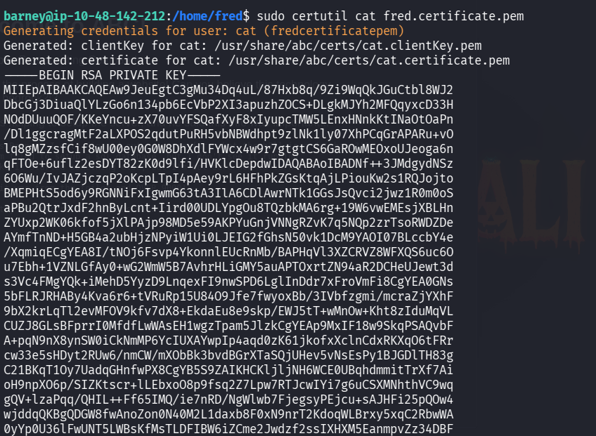
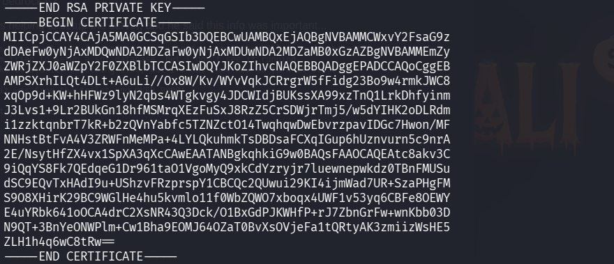

We got the freds private key and certificate 

similary lets connect to ssl serivce and retrive the freds password

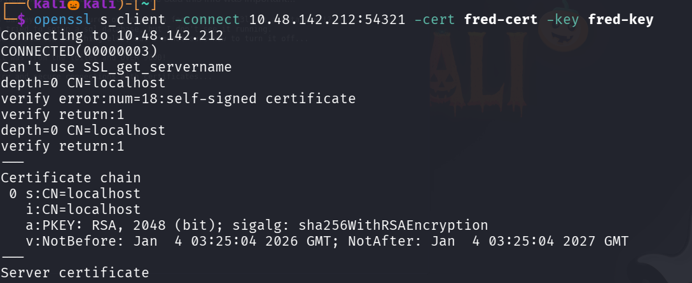

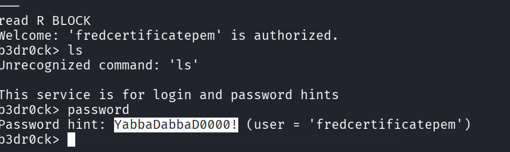

We successfully got the freds password , lets login into ssh with username fred and the password 

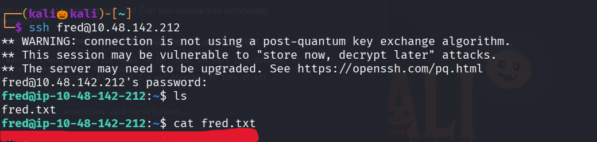

We successfully got the fred.txt file 

type command sudo -l to see what command this current user can run with root privilage 

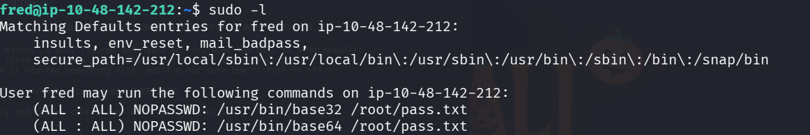

seems like we can encode the root password with base64 

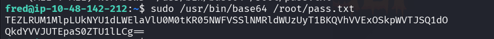

Lets decode it with base64 

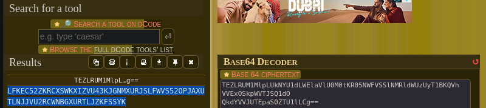

We got an encrytped text , lets try cyber chef which automatically identifies and decrypts the text when we click on the magic icon 

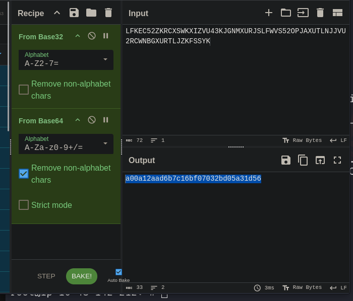

seems like it is an md5 hash , lets use hashes.com to crack it 

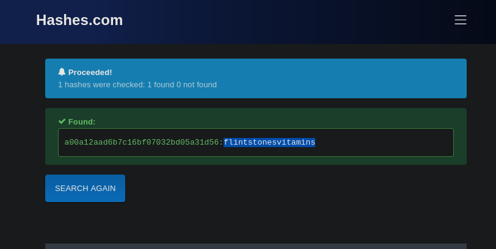

We successfully found the root password , lets escalte to root privilage and view the root flag

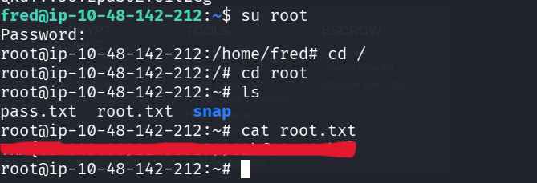

