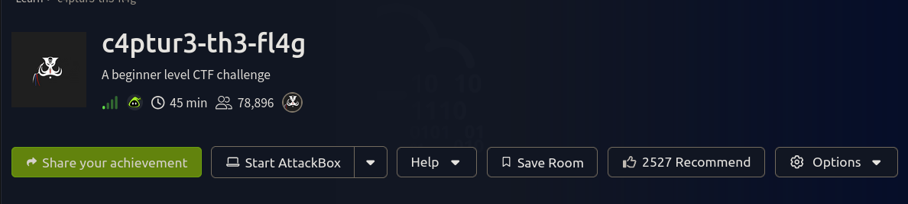

## The first question we want to convert everything to text

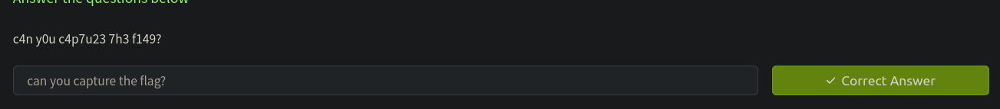

## The second 

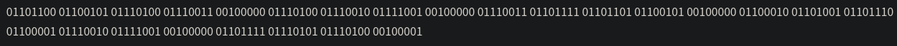

seems like the data are in binary format , lets use cyber chef to convert it into text

## The Third 

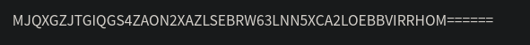

seems like it is base32 encoded , lets decode it 

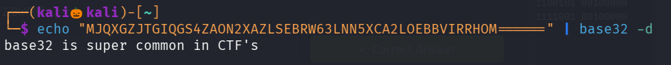
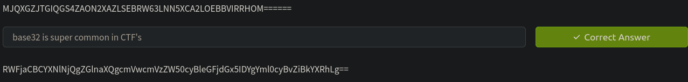

## The Fourth 

seems like the data is in hexa decimal format , lets convert it into text using cyberchef

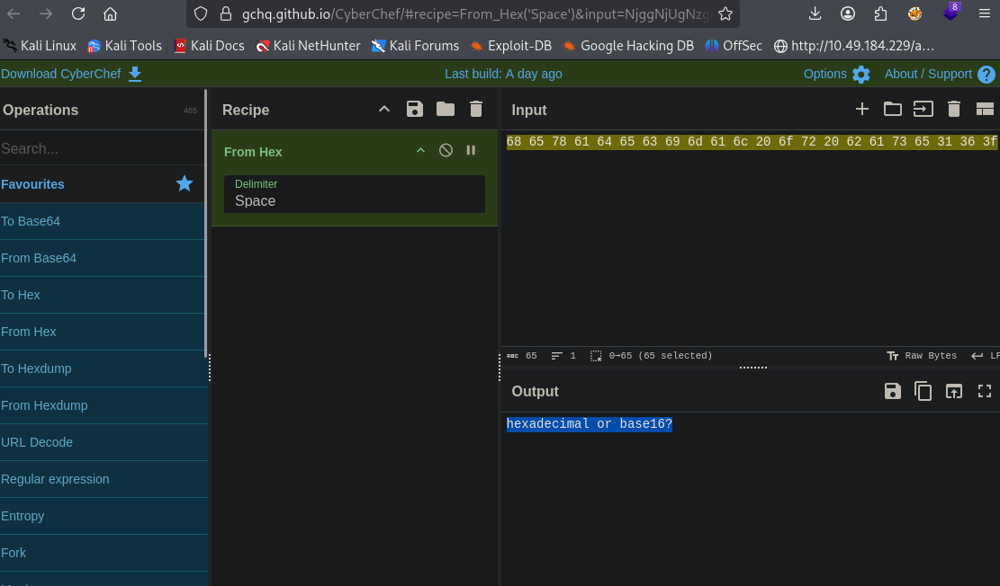

## THE FIFTH 

Seems like the text has been altered usign rot13 , lets try rot13 decoder to decrypt it

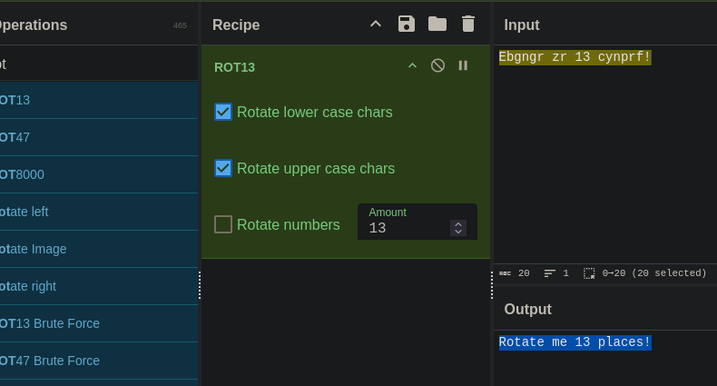

## THE SIXTH 

Seems like it is rot47 encoded , lets decode it 

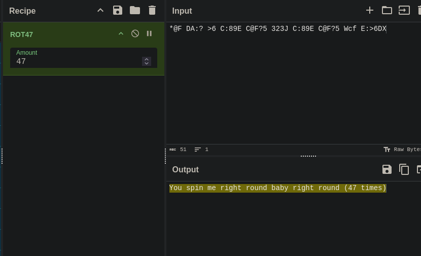

## THE SEVENTH 

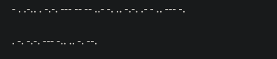

seems like the text has been encoded with Morse code , lets decode it 

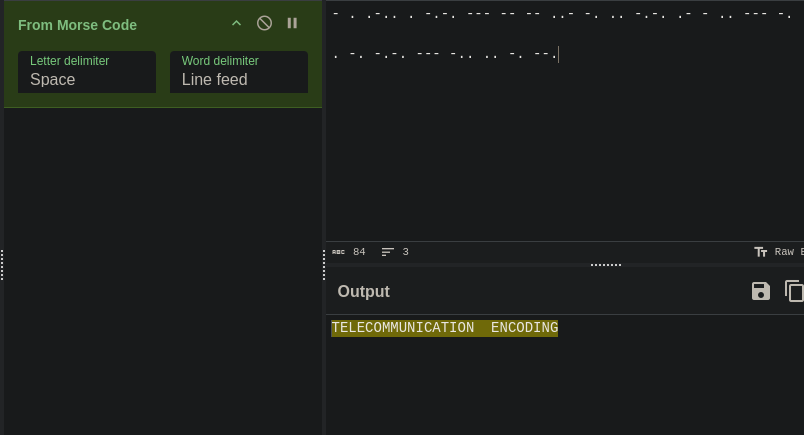

## THE EIGHT

seems like the data has been given in decimal format , lets convert it into text 

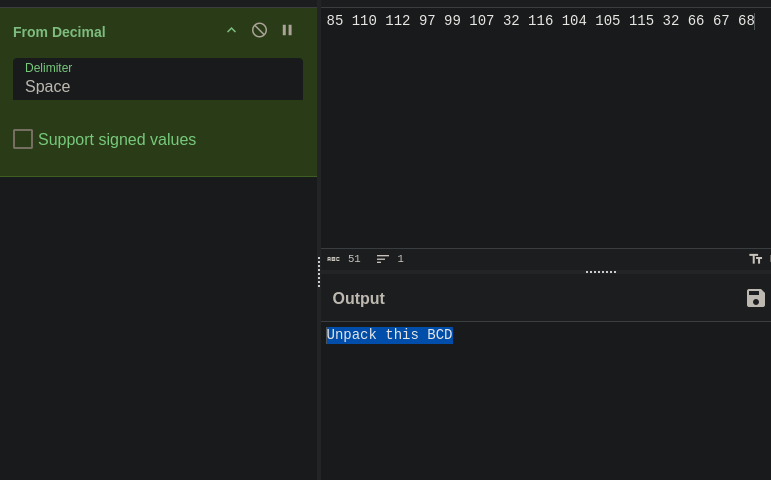

## THE NINE 

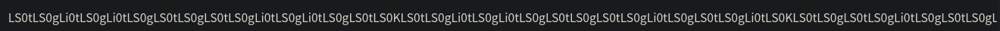

the text has been encrypted with so many layers of techniques , lets decrypt it 

base64 --> morse code --> binary --> ROT47 --> Decimal --> Text 

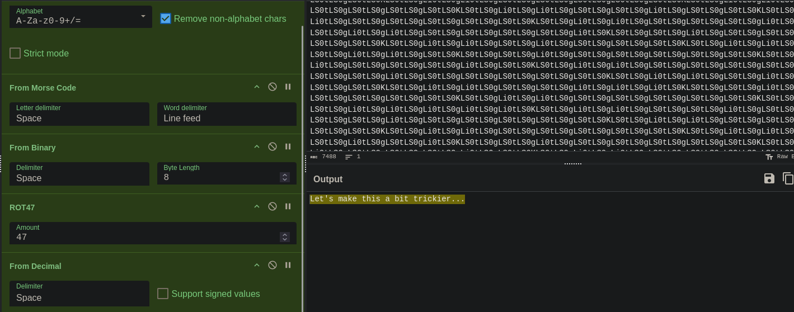

## THE TEN 

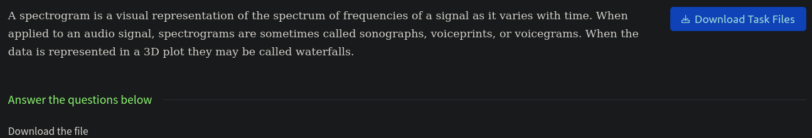

We have been given a audio file , while hearing that it seems like that it is some sort of signals 

lets use sonic visualiser to analyse it 

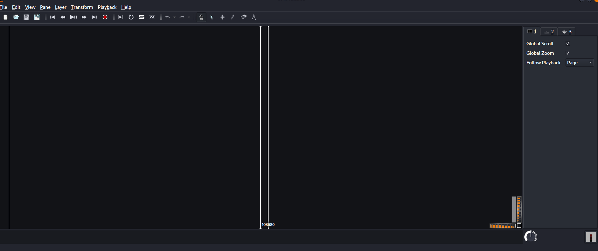

click on file and add the video file we downloaded 

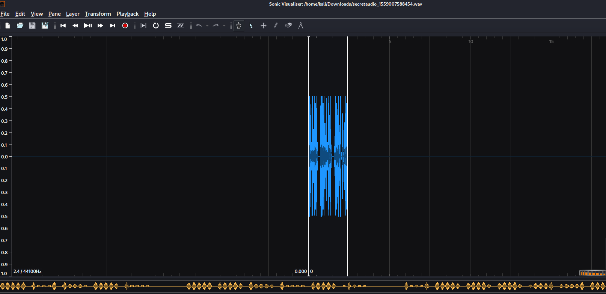

click on layer and click on Add spectogram 

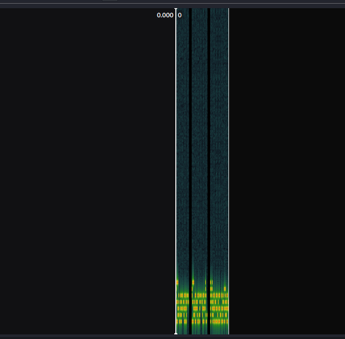

lets expand it 

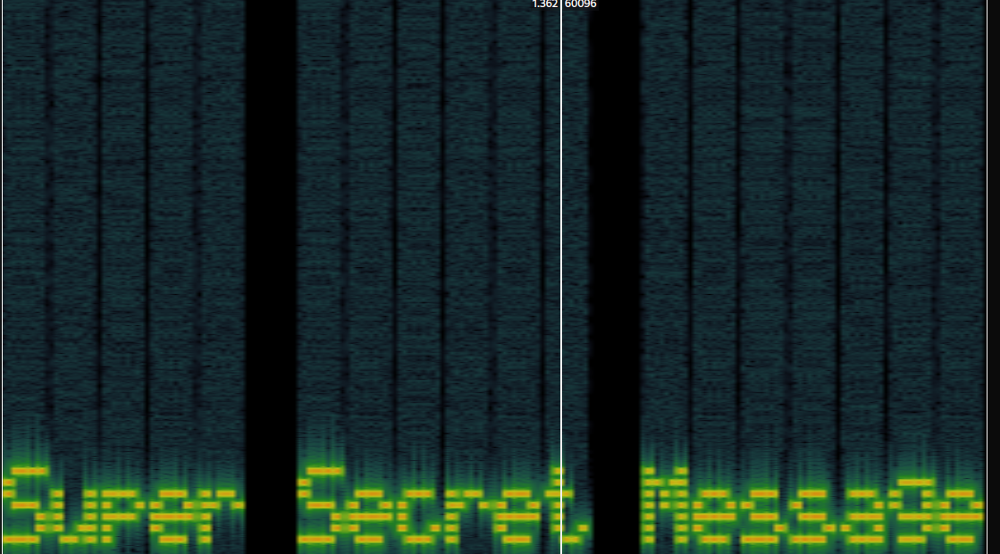

We successfully find the flag 

## THE ELEVEN 

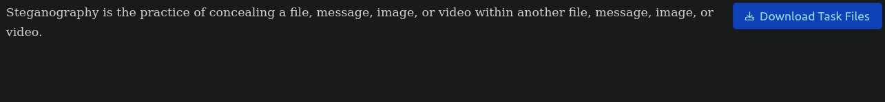

Lets download the task file 

lets use file command to see the property of the file 

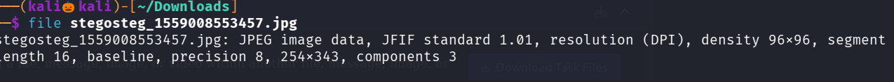

lets use exitfool to see the metadata of the file 

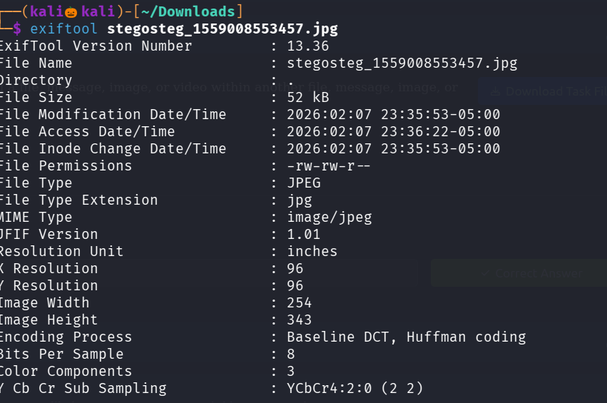

lets use strings command to see the image data into an human readable format 

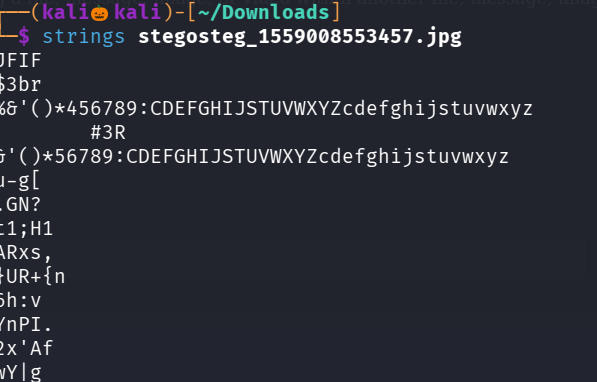

so far no useful information is found , lets use stegseek to see if the file contains any attached file inside it 

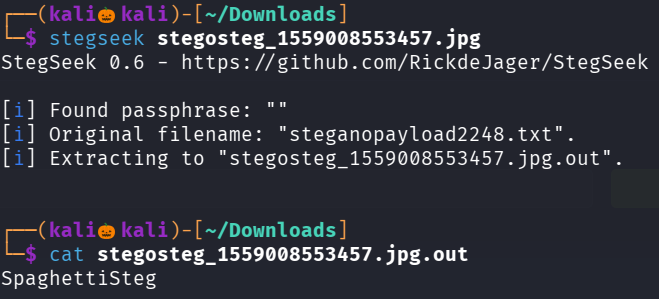

We successfully found the flag 

## THE TWELVE 

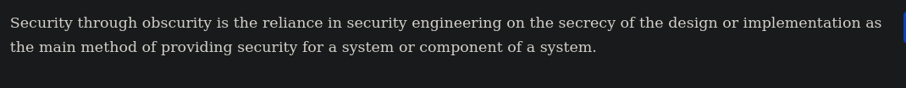

similary using file and exiftool command 

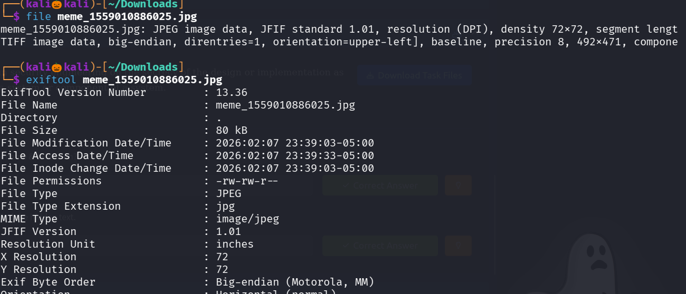

lets use binwalk tool to see the any check any file is compressed with the file 

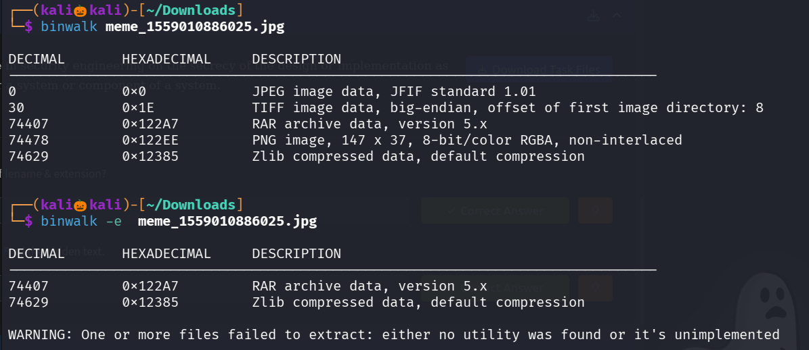

we extracted all the file compressed within it 

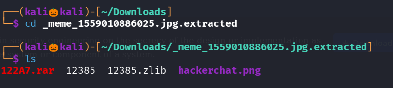

lets use strings command on hackerchat.png 

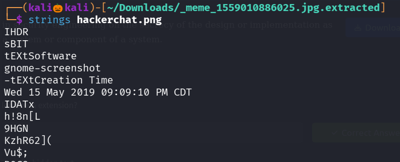
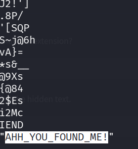

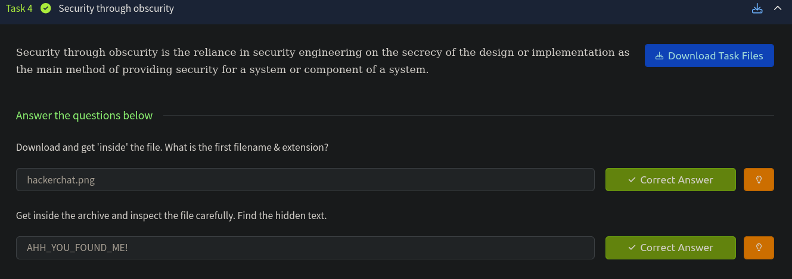

We successfully found the flag 

------------------------------------------THE END------------------------------------------------

