## RECON 

Lets start with our nmap full port scan on the target ip 

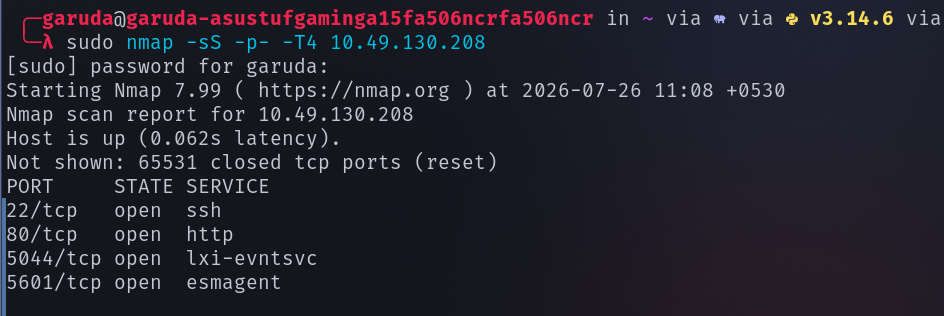

found that there are 4 open ports , lets perform service version detection scan and default scan on them 

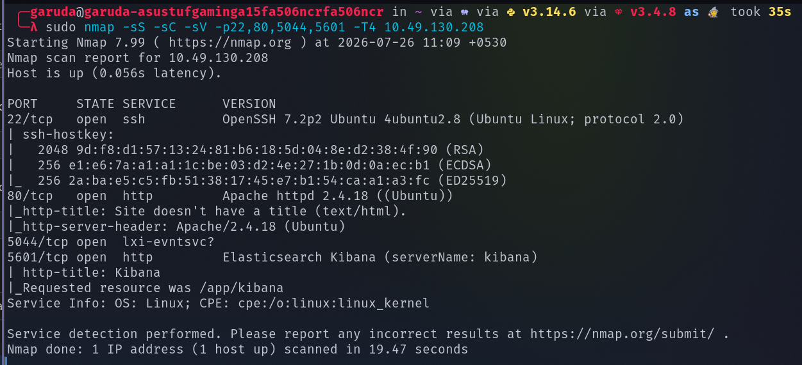

lets visit the service running on port 80 

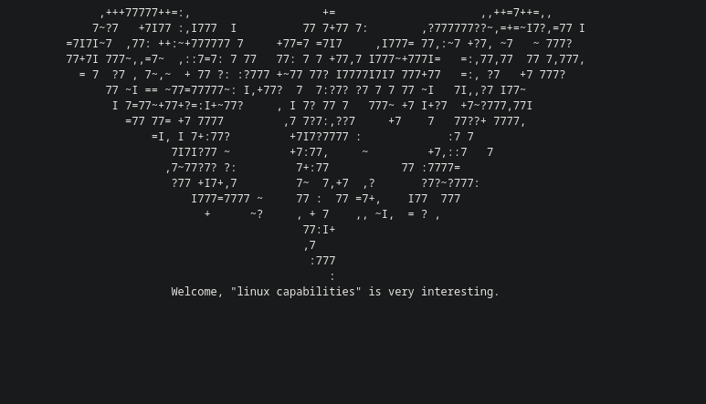

performed directory enemuration , but no juicy information is found , so lets move on to port 5601

while accessing the port 5601 there comes a kibana interface and while exploring functionalities in dev tools modifying the GET requests to GET / and got the version of the kibana 

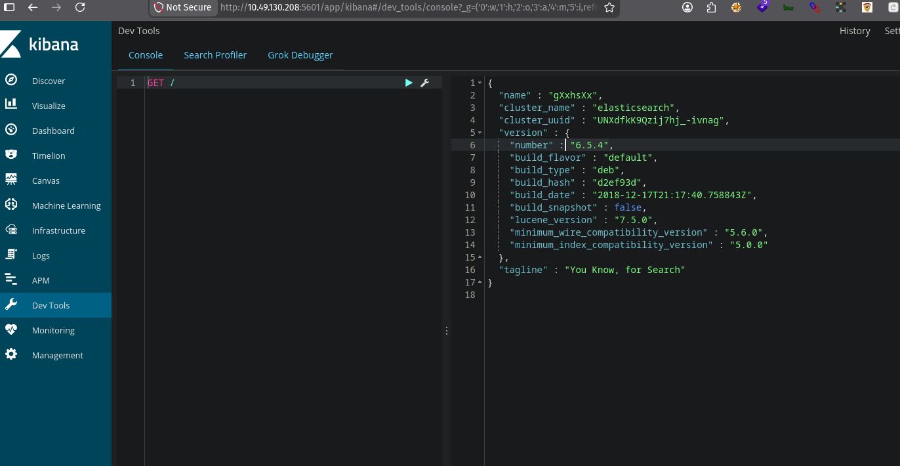

Found that kibana 6.5.4 is vulnerable to rce via cve-2019-7609 

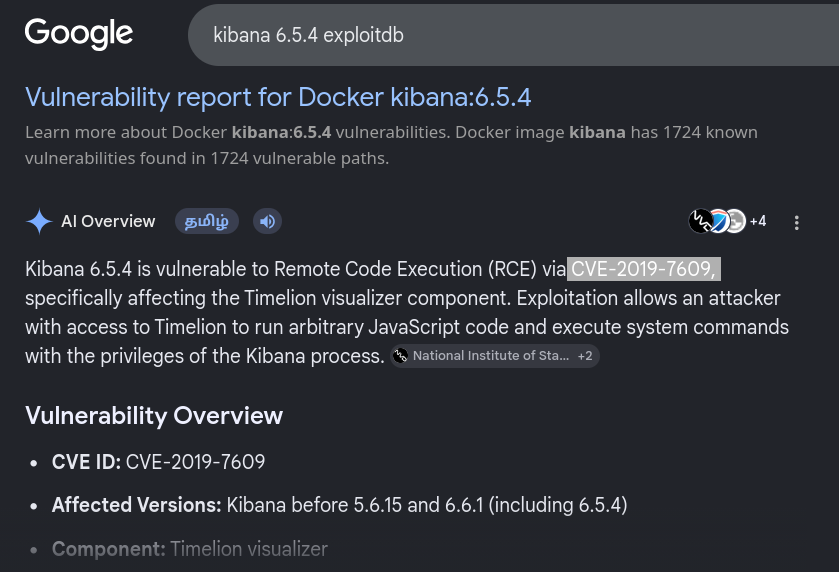

and found the exploit code for cve-2018-7601

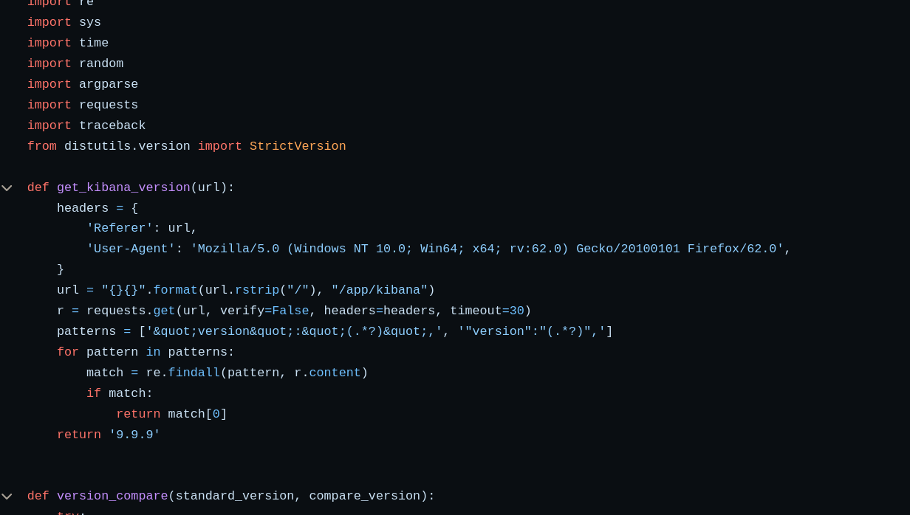

## EXPLOITATION 

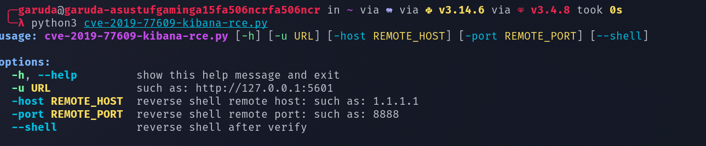

set up  a nc listener and run our python exploit 

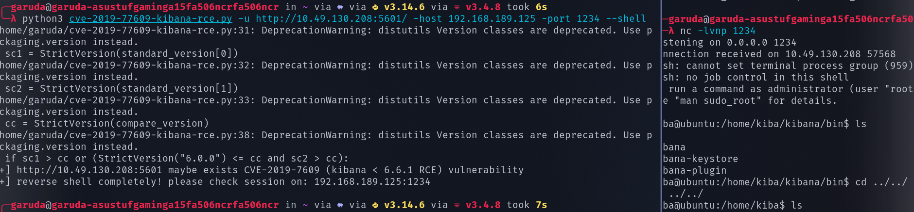

We successuflly got the reverse shell and in /home/kiba found the user.txt file

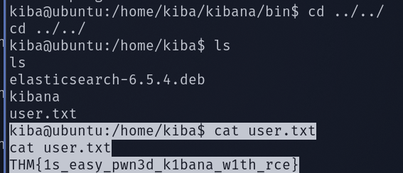

## PRIVILAGE ESCLATION 

We successuflly got the reverse shell and in /home/kiba found the user.txt file
--> command : getcap -r / 2>/dev/null --> to list the files with capabilities 

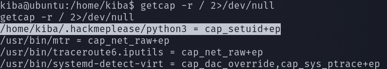

We successuflly got the reverse shell and in /home/kiba found the user.txt file
python3 has been set to cap_setuid that means Change the process's user ID

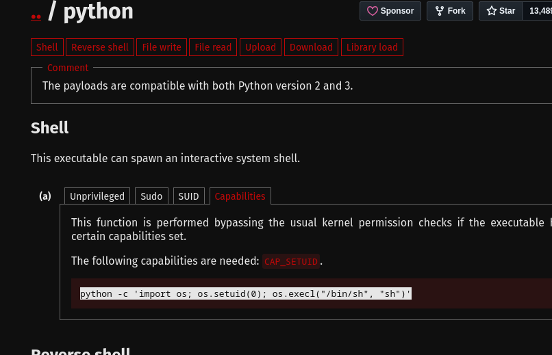

utilizing gtfo bins to exploit the python3 capabilities 

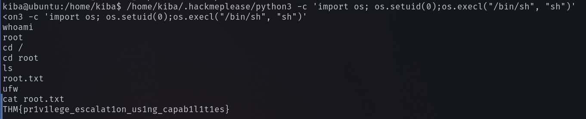

we successflly found the root.txt file 

------------------------------------------------------THE END-----------------------------------------
