## RECON 

Lets start with an Nmap scan

Lets perform a full port scan , found 4 open ports

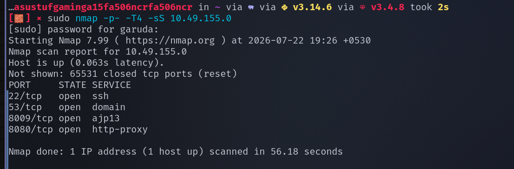

Lets perform lets a service version detection scan and default scan on them 

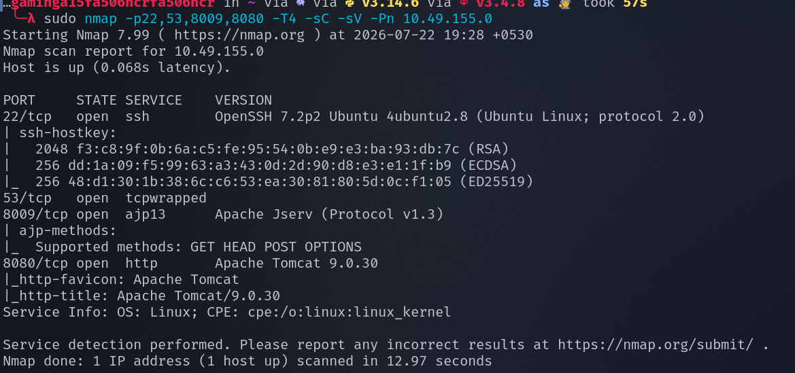

found that on port 8080 default apache web server has been running and on port 8009 Apache jserv(1.3) service has been hosted 

lets access the site on port 8080

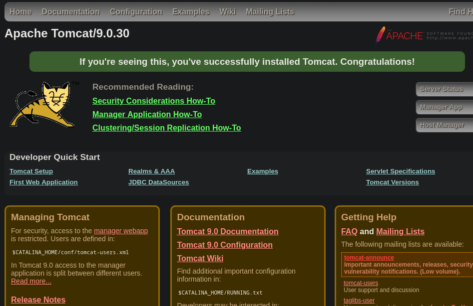

while clicking on server status , it denied our access with an meassage which contains username and password , lets store it for later 

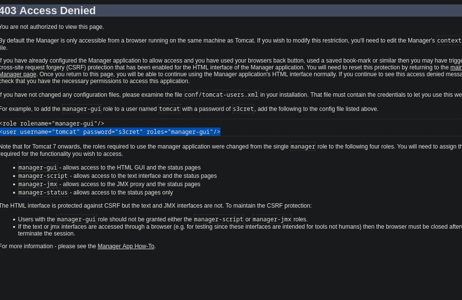

we know that Apache jserv version is 1.3 , lets search if any exploit is available 

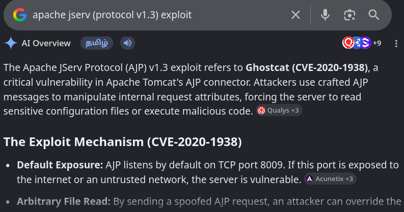

seems like apache jserv 1.3 is vulnerable to an exploit named ghostcat from which we can read sensitive file information 

lets search for this exploit in metasploit 

## EXPLOITATION 

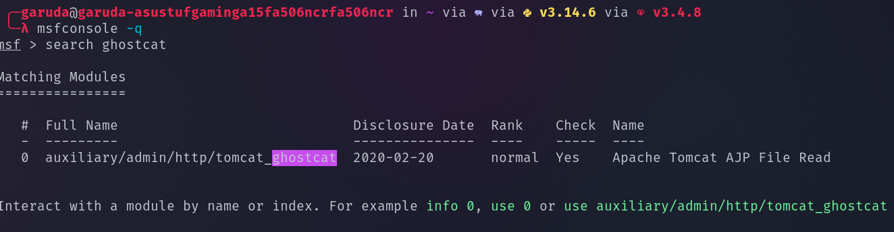

set RHOSTS , RPORT and run the exploit 

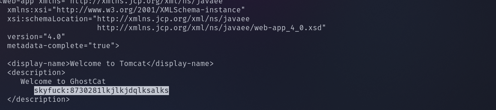

the exploit has been executed successfully and seems like the file contains the username and password 

since ssh port is open lets try login into ssh with the found credentials 

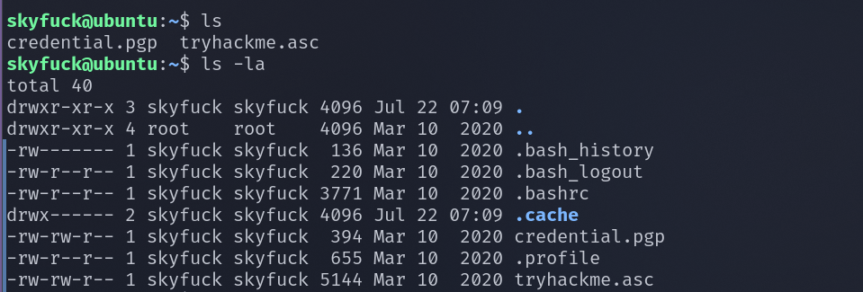

there is .pgp and .asc file , the .pgp is a encrypted file which needs a private  key in order to decrypt and the private key has been found in the asc file 

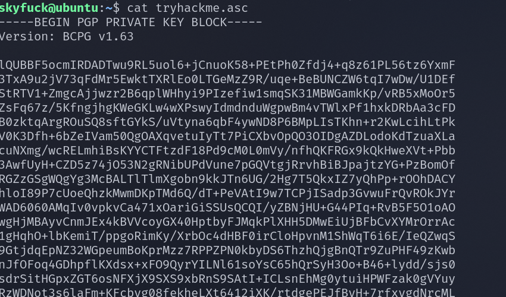

Lets get the .pgp and .asc file to our system , lets start a python service and use curl command to get those two files 

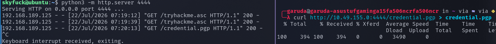

since the key is passphase protected , lets try to break it with john 

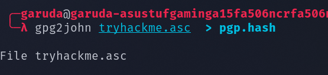

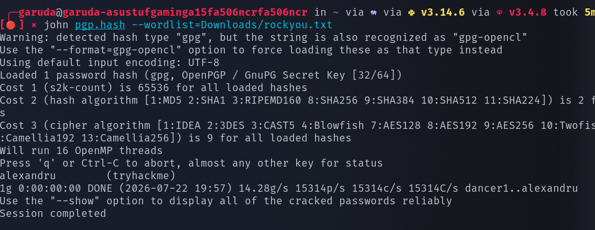

now we found the passphase , now import the key and then decrypt the file with the key 

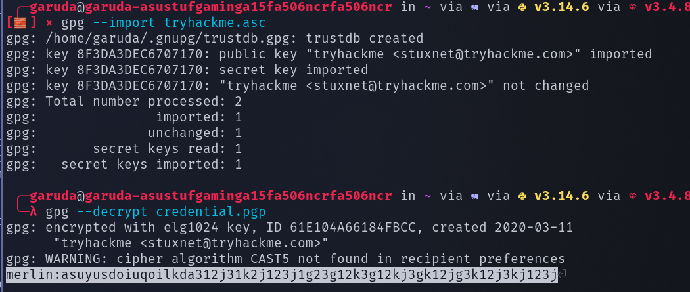

seems like we found the another username and password , lets try to login over ssh with those new credentials 

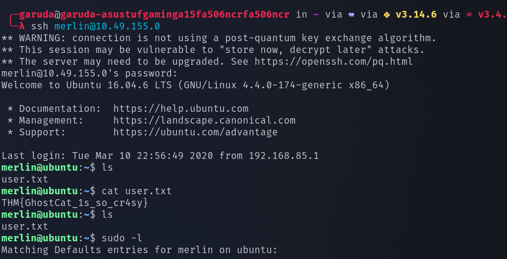

we successfully found the user.txt 

## PRIVILEGE ESCALATION:

sudo -l --> which will shows the command a user can run with sudo or root privilege 

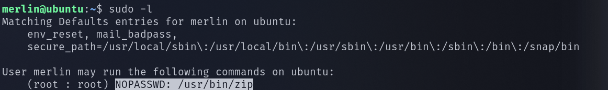

lets utilize gtfobins and search for zip command 

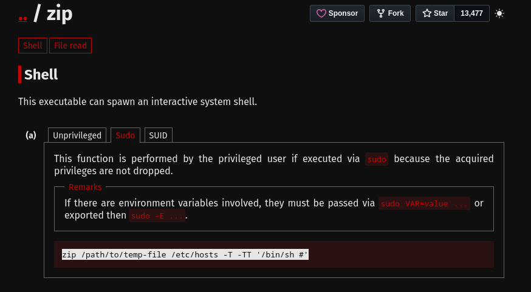

in a tmp directory create a .txt file with some contents in it 

make a zip archive 

run the commad specifying the path to the zip file 

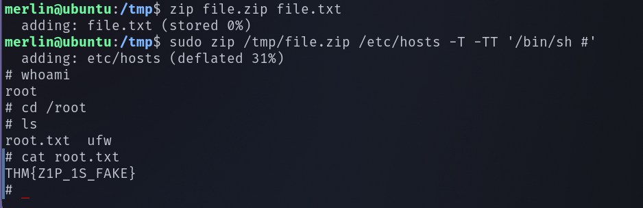

We successfully found the root flag 

----------------------------------------------THE END--------------------------------------------

